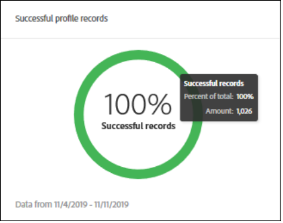

# [!DNL Real-time Customer Data Platform] översikt över mätvärden

Hemsidan för Customer Data Platform (CDP i realtid), som innehåller en mätinstrumentpanel, visas när du loggar in på CDP i realtid.

Hemsidan är bara en av platserna där metriska kort visas. CDP ger dig mätkort i realtid genom hela upplevelsen. Dessa mätvärden ger information om data, profiler och målgrupper i systemet.

Om det inte finns några data i systemet när du loggar in på CDP i realtid visas inte instrumentpanelen på startsidan. I det här fallet innehåller startsidan utbildningsmaterial för en förstagångsupplevelse. När data samlas in - dvs. <!--sources-->datauppsättningar, profiler, segment och mål skapas och dataflöden in i systemet - uppdateras instrumentpanelen automatiskt så att information om dessa data<!-- in metric cards-->visas.

## Instrumentpanelsvy för hemsidan

<!--The dashboard shows information in several areas. Each category of information displays for the time range shown beneath the data.-->

Kontrollpanelen är uppdelad i<!-- two areas.-->:

* **Ledpanelen** visas längst upp på kontrollpanelen. I resultatlistan visas antalet datauppsättningar, profiler, segment och mål i systemet.

   

<!-- * **Metric cards** display beneath the leaderboard. Metric cards show additional information, such as percentages or trends. Metric cards appear as data is collected.
    
Some information is shown in different ways on both the leaderboard and metric cards. -->
* **De senaste objekten** listar de fem senaste datauppsättningarna, källorna, segmenten och destinationerna som lagts till i systemet.

   

Ytterligare mätvärden - till exempel för profiler och segment - finns tillgängliga i andra delar av kunddataplattformen i realtid.

### Datauppsättningar

Räknaren visar antalet datauppsättningar i systemet och mängden data i **[!UICONTROL Datasets]** [!DNL Platform]. Den här räknaren uppdateras när en datauppsättning skapas.

Mer information om datauppsättningar finns i översikten över [datauppsättningar](../catalog/datasets/overview.md).

### Profiler

Antalet **[!UICONTROL Profiles]** visar det totala antalet personer med profiler i [!DNL Real-time Customer Profile]. Det innehåller inte profilfragment. Det här är er totala adresserbara målgrupp.

Det här antalet använder den [sammanfogningsprincip](profile/merge-policies.md) som har angetts som standard i konfigurationen av sammanfogningsprincipen i en enhetlig profil.

Antalet profiler uppdateras en gång var 24:e timme.

Mer information om profiler finns i [En enhetlig bild av kunden i CDP](profile/profile-overview.md)i realtid.

### Segment

**[!UICONTROL Segments]** visar det totala antalet segment som skapats för organisationen. Numret uppdateras när nya segment skapas.

Mer information om segment finns i Översikt över [segmenteringstjänsten](segmentation/segmentation-overview.md).

### Mål 

**[!UICONTROL Destinations]** visar det totala antalet destinationer som skapats för organisationen. Numret uppdateras när nya mål skapas.

Mer information om destinationer finns i Översikt över [destinationer](destinations/overview.md).

<!-- ### Successful profile records

In the leaderboard **[!UICONTROL Successful profile records]** shows the total number of records that have been successfully processed into the profile.

There is also a metric card that shows the percentage of successful records. Click **[!UICONTROL View datasets]** to see more details about the profile records. Hover over the colored area of the graph to see additional details:

The number of successful profile records is updated hourly. 

For more information about profiles, see [A unified view of your customer in Real-time CDP](profile/profile-overview.md).

### Total profile records

The **[!UICONTROL Total profile records]** metric card shows the total number of data records enabled to feed into the profiles, and the percentage that are successful, updated once per day. This does not include all data in the data lake, because some data might not be enabled to feed into the profiles.

 Hover over the colored area of the graph to see additional details about the successful profiles:

Click **[!UICONTROL View profiles]** to see more details about the profile records.

For more information about profiles, see [A unified view of your customer in Real-time CDP](profile/profile-overview.md).

For more information about viewing a specific profile, see [Profile viewer](profile/profile-viewer.md).

### Failed profile records

In the leaderboard, **[!UICONTROL Failed profile records]** counts the number of records that failed to process into the profile.

The **[!UICONTROL Failed profile records]** metric card shows this count, and includes a graphical representation that helps you see how failures have trended during the time shown below the graphic. This chart is updated hourly. Click **[!UICONTROL View datasets]** to see more details about the profile records.

The number of failed profile records is updated hourly. -->

### Senaste datauppsättningar

På **[!UICONTROL Recent datasets]** kortet visas de fem senaste datauppsättningarna som skapats inom organisationen. Listan uppdateras när en ny datauppsättning skapas.

Klicka på en datauppsättning för att visa information om objektet eller **[!UICONTROL View all]** för att visa listan med datauppsättningar. Därifrån kan du klicka på en viss källa för mer information.

Mer information om datauppsättningar finns i översikten över [datauppsättningar](../catalog/datasets/overview.md).

### Senaste källor

Mätkortet visar **[!UICONTROL Recent sources]** de fem senaste källorna som skapats inom organisationen. Listan uppdateras när en ny källa skapas.

Klicka på en källa för att visa information om objektet eller **[!UICONTROL View all]** för att visa en lista med källor. Därifrån kan du klicka på en viss källa för mer information.

Mer information om källor finns i [Källor - översikt](sources/sources-overview.md).

### Senaste segment

På **[!UICONTROL Recent segments]** mätkortet visas de fem senaste segmenten som har skapats inom organisationen. Listan uppdateras när ett nytt segment skapas.

Klicka på ett segment om du vill visa information om objektet eller **[!UICONTROL View all]** om du vill visa information om fler segment.

Mer information om segment finns i Översikt över [segmenteringstjänsten](segmentation/segmentation-overview.md).

### Senaste destinationer

På **[!UICONTROL Recent destinations]** mätkortet visas de fem senaste destinationerna som skapats inom organisationen. Listan uppdateras när ett nytt mål skapas.

Klicka på ett mål om du vill visa information om det objektet eller **[!UICONTROL View all]** om du vill visa information om fler mål.

Mer information om destinationer finns i Översikt över [destinationer](destinations/overview.md).
