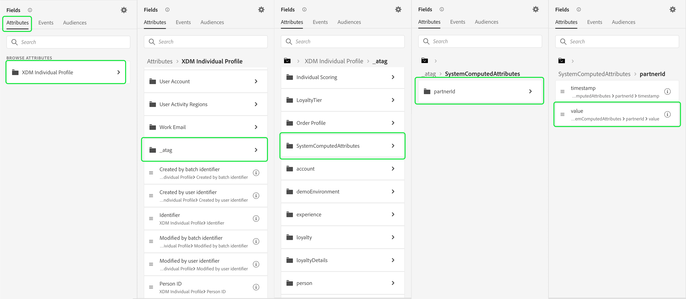

# Återmarknadsföring utomhus av oautentiserade besökare

>[!AVAILABILITY]
>
>Den här funktionen är tillgänglig för kunder som har licens för Real-Time CDP (App Service), Adobe Experience Platform Activation, Real-Time CDP, Real-Time CDP Prime, Real-Time CDP Ultimate. Läs mer om dessa paket i [produktbeskrivningar](https://helpx.adobe.com/legal/product-descriptions.html) och kontakta Adobe för mer information.

Lär dig hur du skapar en publik med oautentiserade besökare och omdirigerar dem med partnertillhandahållna varaktiga ID:n.

## Varför ska man överväga det här användningsexemplet? {#why-use-case}

I och med att cookies från tredje part fasas ut måste digitala marknadsförare omforma sina strategier för att återengagera anonyma besökare. Varumärken som väljer att integrera med identitetsleverantörer för besöksigenkänning i realtid kan också utnyttja partnertillhandahållna varaktiga identifierare för återmarknadsföring via betalmedia utanför webbplatsen.

Trots en hög trafikvolym ser många varumärken en betydande nedgång under konverteringsfasen. Besökarna interagerar med innehåll och produktdemonstrationer, men lämnar dem utan att behöva registrera sig eller göra ett köp.

Ni kan inte bara bygga målgrupper baserat på webbplatsengagemang för att personalisera marknadsföringsmeddelanden, ni kan också använda Adobe support för partner-ID:n för att återengagera besökare över betalmediematerial.

## Förutsättningar och planering {#prerequisites-and-planning}

När du planerar att återannonsera oautentiserade besökare bör du tänka på följande under planeringsprocessen:

- Har jag konfigurerat partner-ID:n med rätt ID-namnutrymmen?

För att implementera användningsexemplet använder du dessutom följande Real-Time CDP-funktioner och gränssnittselement. Se till att du har de nödvändiga attributbaserade behörigheterna för åtkomstkontroll i alla dessa områden eller be systemadministratören att ge dig de behörigheter som krävs.

- [Målgrupper](../../segmentation/home.md)
- [Beräknade attribut](../../profile/computed-attributes/overview.md)
- [Mål ](../../destinations/home.md)
- [Webb-SDK](../../edge/home.md)

## Hämta partnerdata till Real-Time CDP {#get-data-in}

Om ni vill skapa en publik med oautentiserade besökare måste ni först få in era partnerdata i Real-Time CDP.

Läs mer om hur du bäst importerar data till Real-Time CDP med Web SDK i [sektioner för datahantering och insamling av händelsedata](./onsite-personalization.md#data-management) av användningsexemplet för personalisering på plats.

## Förse partnern med ID:n {#bring-partner-ids-forward}

När du har importerat partnertillhandahållna ID:n till en händelsedatamängd måste du hämta dessa data till profilposterna. Du kan göra detta genom att använda beräknade attribut.

Med beräknade attribut kan du snabbt konvertera profilbeteendedata till aggregerade värden på profilnivå. Det innebär att du kan använda dessa uttryck, till exempel&quot;total köptid för livstid&quot; i profilen, så att du enkelt kan använda det beräknade attributet inom dina målgrupper. Mer information om beräknade attribut finns i [översikt över beräknade attribut](../../profile/computed-attributes/overview.md).

Om du vill komma åt beräknade attribut väljer du **[!UICONTROL Profiles]** följt av **[!UICONTROL Computed attributes]** och **[!UICONTROL Create computed attribute]**.

![The [!UICONTROL Create computed attributes] knappen markeras förutom [!UICONTROL Computed attributes] -fliken i [!UICONTROL Profiles] arbetsyta.](../assets/offsite-retargeting/create-ca.png)

The **[!UICONTROL Create computed attribute]** visas. På den här sidan kan du använda komponenterna för att skapa ett beräknat attribut.

>[!NOTE]
>
>Mer information om hur du skapar beräknade attribut finns i [gränssnittshandbok för beräknade attribut](../../profile/computed-attributes/ui.md).

I det här fallet kan du skapa ett beräknat attribut som, om partner-ID:t finns, hämtar det senaste värdet för partner-ID:t inom de senaste 24 timmarna.

Med sökfältet kan du hitta och lägga till händelsen &quot;Partner ID&quot; på den beräknade attributarbetsytan.

![The [!UICONTROL Events] och sökfältet markeras.](../assets/offsite-retargeting/ca-add-partner-id.png)

När du har lagt till händelsen &quot;Partner ID&quot; i definitionen anger du villkoret för händelsefiltrering till **[!UICONTROL Exists]** anger du att händelsefiltreringsvillkoret ska vara **[!UICONTROL Most Recent]** värdet på det partner-ID som lagts till och med en uppslagsperiod på 24 timmar.

Ge det beräknade attributet ett passande namn (t.ex.&quot;Partner-ID&quot;) och en beskrivning, välj sedan **[!UICONTROL Publish]** för att slutföra den beräknade processen för att skapa attribut.

## Skapa en målgrupp med det beräknade attributet {#create-audience}

Nu när du har skapat det beräknade attributet kan du använda det här beräknade attributet för att skapa en målgrupp. I det här exemplet kommer du att skapa en målgrupp bestående av besökare som besökt din webbplats mer än fem gånger den här månaden, men som ännu inte har registrerat sig.

Om du vill skapa en målgrupp väljer du **[!UICONTROL Audiences]**, följt av **[!UICONTROL Create audience]**.

![The [!UICONTROL Create audience] knappen är markerad.](../assets/offsite-retargeting/create-audience.png)

En dialogruta visas där du uppmanas att välja mellan [!UICONTROL Compose audience] och [!UICONTROL Build rule]. Välj **[!UICONTROL Build rule]** följt av **[!UICONTROL Create]**.

![The [!UICONTROL Build rule] knappen är markerad.](../assets/offsite-retargeting/select-build-rule.png)

Sidan Segment Builder visas. På den här sidan kan du använda komponenterna för att skapa en målgrupp.

>[!NOTE]
>
>Mer information om hur du använder Segment Builder finns i [Användargränssnittsguide för segmentbyggare](../../segmentation/ui/segment-builder.md).

För att nå målet att hitta besökarna måste du först lägga till en **[!UICONTROL Page View]** för er målgrupp. Välj **[!UICONTROL Events]** flik under **[!UICONTROL Fields]** och sedan dra och släppa **[!UICONTROL Page View]** och lägga till den i händelseavsnittets arbetsyta.

![The [!UICONTROL Events] i [!UICONTROL Fields] -avsnittet är markerat medan [!UICONTROL Page View]-händelse.](../assets/offsite-retargeting/add-page-view.png)

Markera den nya tillagda filen **[!UICONTROL Page View]** -händelse. Ändra uppslagsperioden från **[!UICONTROL Any time]** till **[!UICONTROL This month]** och ändra händelseregeln till att inkludera **Minst 5**.

![Information om tillagda [!UICONTROL Page View] -händelsen visas.](../assets/offsite-retargeting/edit-event.png)

När du har lagt till händelsen måste du lägga till ett attribut. Eftersom du arbetar med oautentiserade besökare kan du lägga till det beräknade attributet som du nyss skapade. Det nya beräknade attributet gör att du kan länka partner-ID:n till en målgrupp.

Lägga till det beräknade attributet under **[!UICONTROL Attributes]**, markera **[!UICONTROL XDM Individual Profile]**, följt av **[!UICONTROL _atag]**, **[!UICONTROL SystemComputedAttributes]** och **[!UICONTROL PartnerID]**. Lägg till **[!UICONTROL Value]** av det beräknade attributet till attributavsnittet på arbetsytan.

Sök dessutom efter **[!UICONTROL Personal Email]** och lägg till **[!UICONTROL Address]** attribut nedan **[!UICONTROL PartnerID]** till attributdelen av arbetsytan.

![The [!UICONTROL PartnerID] beräknat attribut och [!UICONTROL Personal Email Address] attribut markeras på arbetsytan i Segment Builder.](../assets/offsite-retargeting/added-attributes.png)

Nu när du har lagt till dina attribut måste du ange deras utvärderingskriterier. För **[!UICONTROL PartnerID]**, ange att kriteriet ska vara **[!UICONTROL exists]** och för **[!UICONTROL Address]**, ange att kriteriet ska vara **[!UICONTROL does not exist]**.

Du har nu skapat en målgrupp som letar efter besökare med hög intensitet som har ett partnertillhandahållet ID men som ännu inte har registrerat sig för webbplatsen. Namnge målgruppen&quot;Återannonsera oautentiserade användare&quot; och välj **[!UICONTROL Save]** för att slutföra målgruppsarbetet.

## Aktivera er målgrupp {#activate-audience}

När ni har skapat er målgrupp kan ni nu aktivera målgruppen för efterföljande destinationer. Välj **[!UICONTROL Audiences]** till vänster i navigeringsfältet letar du efter den nya målgruppen, väljer ellipsikonen och väljer **[!UICONTROL Activate to destination]**.

![The [!UICONTROL Activate to destination] knappen är markerad.](../assets/offsite-retargeting/activate-to-destination.png)

>[!NOTE]
>
>Alla måltyper, inklusive filbaserade mål, stöder målgruppsaktivering med partner-ID:n.
>
>Mer information om hur du aktiverar målgrupper till ett mål finns i [aktiveringsöversikt](../../destinations/ui/activation-overview.md).

The **[!UICONTROL Activate destination]** visas. På den här sidan kan du välja vilket mål du vill aktivera målet till. När du har valt önskat mål väljer du **[!UICONTROL Next]**.

The **[!UICONTROL Scheduling]** visas. På den här sidan kan du skapa ett schema som anger hur ofta du vill att målgruppen ska aktiveras. Välj **[!UICONTROL Create schedule]** för att skapa ett schema för målgruppsaktiveringen.

![The [!UICONTROL Create schedule] knappen är markerad.](../assets/offsite-retargeting/select-create-schedule.png)

The [!UICONTROL Scheduling] popover visas. På den här sidan kan du skapa ett schema för målgruppsaktivering. När du har konfigurerat schemat väljer du **[!UICONTROL Create]** för att fortsätta.

När du har bekräftat schemaläggningsinformationen väljer du **[!UICONTROL Next]**.

The **[!UICONTROL Select attributes]** visas. På den här sidan kan du välja vilka attribut du vill exportera tillsammans med den aktiva målgruppen. Du bör åtminstone inkludera partner-ID, eftersom detta gör att du kan identifiera de besökare som du planerar att återannonsera. Välj **[!UICONTROL Add new mapping]** och söka efter det beräknade attributet. När du har lagt till de nödvändiga attributen väljer du **[!UICONTROL Next]**.

![Båda [!UICONTROL Add new mapping] och det beräknade attributet markeras.](../assets/offsite-retargeting/add-new-mapping.png)

The **[!UICONTROL Review]** visas. På den här sidan kan du läsa mer om målgruppsaktiveringen. Om du är nöjd med informationen väljer du **[!UICONTROL Finish]**.

![The [!UICONTROL Review] visas med information om målgruppsaktiveringen.](../assets/offsite-retargeting/review-destination-activation.png)

Du har nu aktiverat en publik av oautentiserade användare till en nedladdad destination för ytterligare återmarknadsföring.

## Andra användningsområden {#other-use-cases}

Du kan utforska fler användningsfall som aktiveras via partnerdatasupport i Real-Time CDP:

- [Engagera och skaffa nya kunder](./prospecting.md) genom att använda partnerdata.
- [Personalisera upplevelser på plats](./offsite-retargeting.md) med partnerstödd besökarigenkänning.
- [Komplettera förstapartsprofiler](./supplement-first-party-profiles.md) med attribut som tillhandahålls av partners.
