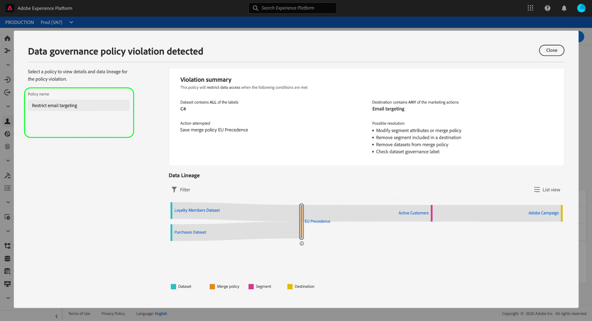

# [!DNL Data Governance] i realtid CDP

[!DNL Real-time Customer Data Platform] (CDP i realtid) sammanför data från olika affärssystem så att marknadsförarna bättre kan identifiera, förstå och engagera sina kunder. Dessa data kan vara föremål för användarbegränsningar som fastställts av din organisation eller av juridiska bestämmelser. Därför är det viktigt att se till att CDP i realtid är kompatibelt med användningsprinciper när data hanteras.

Med Adobe Experience Platform [!DNL Data Governance] kan ni hantera kunddata och säkerställa att ni följer regler, begränsningar och policyer som gäller för dataanvändning. Det spelar en viktig roll inom CDP i realtid, så att ni kan definiera användarprofiler, kategorisera data baserat på dessa policyer och kontrollera om policyer har överträtts när ni utför vissa marknadsföringsåtgärder.

CDP i realtid bygger på Adobe Experience Platform och därför beskrivs merparten av funktionerna i [!DNL Data Governance] [!DNL Experience Platform] dokumentationen. Detta dokument är avsett att komplettera [datastyrningsöversikten](../../data-governance/home.md) för [!DNL Experience Platform]och sammanfattar de styrningsfunktioner som finns i CDP i realtid. Följande ämnen behandlas:

* [Använd användningsetiketter på dina data](#labels)
* [Hantera dataanvändningsprinciper](#policies)
* [Klara regelefterlevnaden](#enforce-data-usage-compliance)

## Använd användningsetiketter på dina data {#labels}

[!DNL Data Governance] gör att du kan använda användningsetiketter på dina data, antingen på datauppsättnings- eller datamängdsfältnivå. Med etiketter för dataanvändning kan du kategorisera data enligt de användarprofiler som gäller för dessa data.

Mer information om hur du arbetar med dataanvändningsetiketter finns i användarhandboken [för](../../data-governance/labels/overview.md) dataanvändningsetiketter för Adobe Experience Platform.

## Konfigurera användningsfall för marknadsföring för destinationer {#destinations}

Du kan ange begränsningar för dataanvändning för ett mål genom att definiera användningsfall för marknadsföring (kallas även marknadsföringsåtgärder) för det målet. Ett användningsfall för marknadsföring för en destination anger avsikten med de data som ska exporteras till den destinationen.

>[!NOTE]
>
>Mer information om marknadsföringsåtgärder och hur de används i dataanvändningspolicyer finns i översikten [över](../../data-governance/policies/overview.md) dataanvändningspolicyer i [!DNL Experience Platform] dokumentationen.

Genom att definiera användningsfall för marknadsföring på destinationer kan ni se till att profiler och segment som skickas till dessa destinationer följer dataanvändningsprinciperna. Ni bör därför lägga till lämpliga användningsfall för marknadsföring till era destinationer baserat på organisationens behov av att tillämpa policybegränsningar för aktivering.

Marknadsföringsfall kan bara väljas när du ställer in ett mål för första gången. Beroende på vilken typ av mål du arbetar med visas möjligheten att konfigurera användningsfall för marknadsföring vid olika tillfällen i konfigurationsarbetsflödet. Anvisningar om hur du konfigurerar ett visst mål finns i [måldokumentationen](../destinations/destinations-overview.md#data-governance) .

## Hantera dataanvändningsprinciper {#policies}

För att dataanvändningsetiketter effektivt ska kunna stödja regelefterlevnad måste dataanvändningsprinciper definieras och aktiveras. Dataanvändningspolicyer är regler som beskriver den typ av marknadsföringsåtgärder som du tillåts eller begränsas från att utföra på data inom CDP i realtid. Mer information finns i avsnittet &quot;Dataanvändningsprinciper&quot; i [!DNL Experience Platform] översikten över  datastyrning.

Adobe Experience Platform har flera principer för vanliga kundupplevelsefall. Du kan visa dessa profiler i användargränssnittet genom att gå till **[!UICONTROL Policies]** arbetsytan och välja **[!UICONTROL Browse]** fliken. I användarhandboken för [profiler](../../data-governance/policies/user-guide.md) i [!DNL Experience Platform] -dokumentationen finns mer detaljerad information om hur du arbetar med profiler i användargränssnittet, inklusive hur du skapar egna anpassade profiler.

## Klara regelefterlevnaden {#enforce-data-usage-compliance}

När data har märkts och användarprofiler har definierats kan ni se till att dataanvändningen följer reglerna. När målgruppssegment aktiveras till mål i realtid-CDP, verkställs användarprofiler automatiskt om något skulle inträffa. [!DNL Data Governance]

I följande diagram visas hur regelefterlevnad integreras i dataflödet för segmentaktivering:

När ett segment aktiveras för första gången utförs en sökning efter policyöverträdelser baserat på följande faktorer: [!DNL Policy Service]

* De dataanvändningsetiketter som används för fält och datauppsättningar i segmentet som ska aktiveras.
* Destinationens marknadsföringssyfte.

>[!NOTE]
>
>Om det finns dataanvändningsetiketter som bara har tillämpats på vissa fält i en datamängd (i stället för hela datamängden), tillämpas dessa fältetiketter endast under följande förhållanden:
>* Fälten används i segmentdefinitionen.
>* Fälten konfigureras som projicerade attribut för målmålet.

### Datalinje {#lineage}

I realtid spelar datalinjer en viktig roll när det gäller hur policyer tillämpas. I allmänhet avser datalinjen ursprunget för en datauppsättning och vad som händer med den (eller där den flyttas) över tiden.

När det gäller [!DNL Data Governance]detta kan dataanvändningsetiketter spridas från datauppsättningar till underordnade tjänster som konsumerar deras data, som kundprofil i realtid och destinationer. Detta gör det möjligt att utvärdera och tillämpa principer vid flera viktiga punkter i dataöverföringen via Platform och ger kontext till datakonsumenterna om varför en policyöverträdelse inträffade.

I CDP i realtid gäller följande:

1. Data hämtas till CDP i realtid och lagras i **datauppsättningar**.
1. Kundprofiler identifieras och konstrueras utifrån dessa datauppsättningar genom att sammanfoga datafragment enligt **sammanfogningsprincipen**.
1. Grupper med profiler delas upp i **segment** baserat på gemensamma attribut.
1. Segmenten aktiveras till **destinationer** längre fram i kedjan.

Varje steg i ovanstående tidslinje representerar en enhet som kan bidra till att en policy överträds, vilket beskrivs i tabellen nedan:

| Datalindelningsfas | Roll vid policytillämpning |
| --- | --- |
| Datauppsättning | Datauppsättningar innehåller dataanvändningsetiketter (som används på datauppsättnings- eller fältnivå) som definierar vilka användningsfall som hela datauppsättningen eller specifika fält kan användas för. Policyöverträdelser inträffar om en datauppsättning eller ett fält som innehåller vissa etiketter används i ett syfte som en princip begränsar. |
| Kopplingsprincip | Sammanslagningsprinciper är de regler som används i Platform för att avgöra hur data ska prioriteras när fragment från flera datauppsättningar sammanfogas. Principöverträdelser inträffar om sammanfogningsprinciperna har konfigurerats så att datauppsättningar med begränsade etiketter aktiveras till ett mål. Mer information finns i guiden om [sammanfogningsprinciper](../../profile/ui/merge-policies.md) . |
| Segment | Segmentregler definierar vilka attribut som ska inkluderas från kundprofiler. Beroende på vilka fält en segmentdefinition innehåller ärver segmentet användningsetiketter som används för dessa fält. Policyöverträdelser inträffar om du aktiverar ett segment vars ärvda etiketter begränsas av måldestinationens tillämpliga policyer, baserat på dess användningsfall för marknadsföring. |
| Destination | När man skapar en destination kan man definiera en marknadsföringsåtgärd (kallas ibland för ett marknadsföringsfall). Det här användningsexemplet korrelerar till en marknadsföringsåtgärd enligt definitionen i en dataanvändningspolicy. Med andra ord avgör vilket marknadsföringsfall du definierar för ett mål vilka dataanvändningsprinciper som gäller för det målet. Policyöverträdelser inträffar om du aktiverar ett segment vars användningsetiketter begränsas av målmålets tillämpliga profiler. |

När policyöverträdelser inträffar ger de resulterande meddelandena som visas i användargränssnittet användbara verktyg för att utforska det datalinje som bidrar till att lösa problemet. Mer information finns i nästa avsnitt.

### Policyfelsmeddelanden {#enforcement}

Om en principöverträdelse inträffar från försök att aktivera ett segment (eller [göra ändringar i ett redan aktiverat segment](#policy-enforcement-for-activated-segments)) förhindras åtgärden och en pover visas som anger att en eller flera profiler har överträtts. När en överträdelse har utlösts är knappen inaktiverad för den enhet som du ändrar tills rätt komponenter har uppdaterats för att följa dataanvändningsprinciper. **[!UICONTROL Save]**

Välj en principöverträdelse i poverarens vänstra kolumn för att visa information om den överträdelsen.

Överträdelsemeddelandet innehåller en sammanfattning av den princip som överträtts, inklusive villkoren som principen är konfigurerad att kontrollera, den specifika åtgärd som utlöste överträdelsen och en lista med möjliga lösningar på problemet.

Ett datalinjediagram visas under sammanfattningen av överträdelser, vilket gör att du kan se vilka datauppsättningar, sammanfogningsprinciper, segment och mål som berördes av överträdelsen. Enheten som du håller på att ändra markeras i diagrammet, vilket anger vilken punkt i flödet som orsakar att överträdelsen inträffar. Du kan välja ett enhetsnamn i diagrammet för att öppna informationssidan för den aktuella entiteten.

Du kan också använda **[!UICONTROL Filter]** ikonen () för att filtrera de visade enheterna efter kategori. Minst två kategorier måste väljas för att data ska kunna visas.

Välj **[!UICONTROL List view]** att visa datalinjen som en lista. Om du vill växla tillbaka till det visuella diagrammet väljer du **[!UICONTROL Path view]**.

### Tillämpning av policyer för aktiverade segment {#policy-enforcement-for-activated-segments}

Regelefterlevnad gäller fortfarande för segment efter att de har aktiverats och begränsar eventuella ändringar av ett segment eller dess mål som skulle leda till en policyöverträdelse. På grund av hur [datalagret](#lineage) fungerar vid policytillämpning kan någon av följande åtgärder utlösa en överträdelse:

* Uppdaterar dataanvändningsetiketter
* Ändra datauppsättningar för ett segment
* Ändra segmentpredikat
* Ändra målkonfigurationer

Om någon av ovanstående åtgärder utlöser en överträdelse förhindras åtgärden från att sparas och ett meddelande om policyöverträdelse visas, vilket säkerställer att de aktiverade segmenten fortsätter att följa dataanvändningsprinciperna när de ändras.

## Nästa steg

Nu när du har introducerats till de viktigaste [!DNL Data Governance] funktionerna i CDP i realtid och hur de [!DNL Experience Platform] aktiveras kan du fortsätta med [dokumentationen för datastyrning i Adobe Experience Platform](../../data-governance/home.md). Dokumentationen innehåller översikter över viktiga [!DNL Data Governance] begrepp samt stegvisa arbetsflöden för att hantera etiketter och policyer för dataanvändning.

I följande video visas en översikt över CDP [!DNL Data Governance] i realtid, inklusive användningen av marknadsföringsfall på destinationer och exempelarbetsflöden för olika scenarier:

>[!VIDEO](https://video.tv.adobe.com/v/33631?quality=12&learn=on)