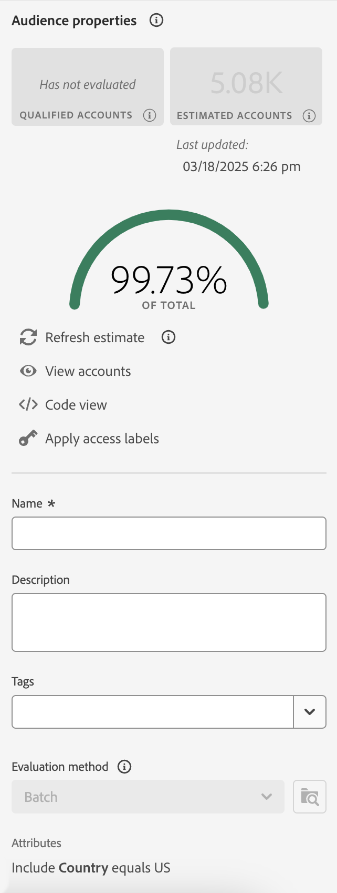
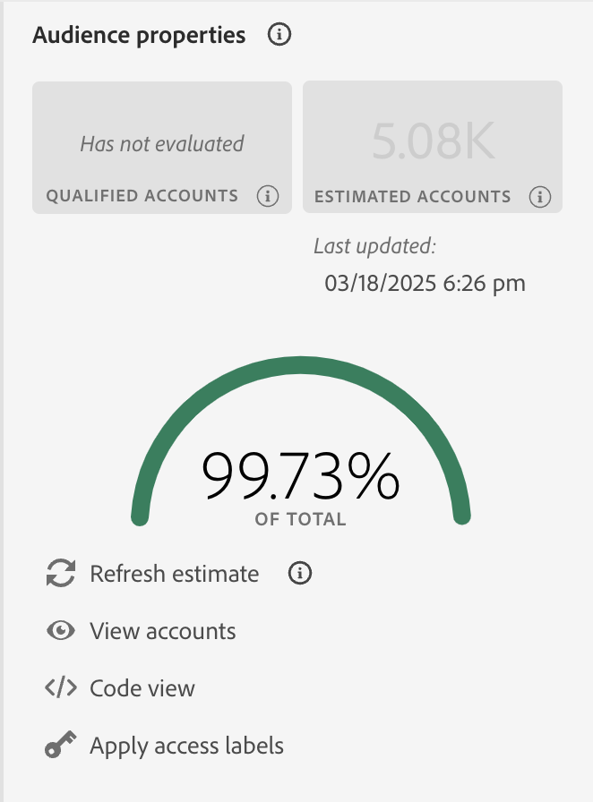

# Audience Builder i Real-Time Customer Data Platform

[!DNL Adobe Real-Time Customer Data Platform] är byggt ovanpå Adobe Experience Platform och kan använda alla Audience Builder-funktioner som ingår i [!DNL Experience Platform]. Arbetsytan innehåller intuitiva kontroller för att skapa och redigera regler, till exempel dra-och-släpp-paneler som används för att representera dataegenskaper.

{zoomable="yes"}

## Fält {#fields}

>[!CONTEXTUALHELP]
>id="platform_b2b_audiencebuilder_showfullxdmschema"
>title="Visa fullständigt XDM-schema"
>abstract="Som standard visas bara fält som innehåller data. Aktivera det här alternativet om du vill visa alla fält i XDM-schemat."

>[!CONTEXTUALHELP]
>id="platform_b2b_audiencebuilder_showrelationselectors"
>title="Visa relationsväljare"
>abstract="Standardrelationerna för din organisation används som standard. Aktivera det här alternativet om du vill visa de relationsväljare som används."

>[!CONTEXTUALHELP]
>id="platform_b2b_audiencebuilder_showconstrainedfields"
>title="Visa begränsade fält"
>abstract="Som standard visas endast fält som inte har några begränsningar. Aktivera det här alternativet om du vill visa fält som är begränsade."

När du använder Audience Builder för konton kan du använda kontoattribut eller befintliga målgrupper som målgruppens fält.

Du kan välja  om du vill justera inställningarna för de fält som visas.

{zoomable="yes"}

>[!NOTE]
>
>Avsnittet **[!UICONTROL Field options]** är för närvarande i betaversion och är endast tillgängligt för vissa kunder. Kontakta Adobe kundtjänst om du vill ha mer information.

Avsnittet [!UICONTROL Settings] visas. I det här avsnittet kan du uppdatera vilka fält som visas samt relationen mellan fälten.

För **[!UICONTROL Field options]** kan du antingen bara visa fält som innehåller data eller det fullständiga XDM-schemat.

För **[!UICONTROL Relationship of fields]** kan du antingen använda standardrelationerna för din organisation eller visa relationsväljarna.

{width="300"}

### Attribut {#attributes}

På fliken [!UICONTROL Attributes] kan du bläddra bland kontoattribut som tillhör klassen XDM Business Account, samt affärsmöjligheter och personbaserade attribut. Varje mapp kan expanderas för att visa ytterligare attribut, där varje attribut är en platta som kan dras till [regelbyggararbetsytan](#rule-builder-canvas) i mitten av arbetsytan.

När du väljer ett attribut kan du se sammanfattningsdata genom att välja [informationsikonen](../../images/icons/info.png). Sammanfattningsdata innehåller information om till exempel de översta värdena, en förklaring av vad fältet är samt procentandelen konton som innehåller värden för det här attributet.

{width="300"}

Om ett attribut är fyllt av mindre än 25 % av kontona visas i stället . Samma sammanfattningsdata kommer att visas för attributet, oavsett.

{width="300"}

>[!NOTE]
>
>Sammanfattningsdata är bara tillgängliga om attributet tillhör schemat Konto, Person eller Möjlighet. Dessutom visas de översta värdena bara om fältet **inte** innehåller för många olika värden och om dessa fälts värden ofta upprepas.
>
>Sammanfattningsdata uppdateras **dagligen**.

En mer detaljerad guide om Audience Builder finns i användarhandboken för [Audience Builder](../../segmentation/ui/segment-builder.md){target="_blank"}.

### Målgrupper {#audiences}

På fliken **[!UICONTROL Audiences]** visas alla personbaserade och kontobaserade målgrupper som är tillgängliga i Experience Platform.

Du kan hovra över  bredvid en målgrupp om du vill visa information om målgruppen inklusive dess ID, beskrivning och mapphierarkin för att hitta målgruppen.

{zoomable="yes"}

## Regelbyggarens arbetsyta {#rule-builder-canvas}

En målgrupp som skapats i Audience Builder är en samling regler som används för att beskriva viktiga egenskaper eller beteenden hos en målgrupp. Dessa regler skapas med regelbyggararbetsytan som finns i mitten av Audience Builder.

Om du vill lägga till en ny regel i segmentdefinitionen drar du en platta från fliken **[!UICONTROL Fields]** och släpper den på regelbyggararbetsytan.

{zoomable="yes"}

Mer information om hur du använder regelbyggararbetsytan finns i [dokumentationen för segmentbyggaren](../../segmentation/ui/segment-builder.md#rule-builder-canvas){target="_blank"}.

### Behållare {#containers}

Målgruppsreglerna utvärderas i den ordning som de listas. Du kan använda behållare för att få bättre kontroll över körningsordningen genom att använda kapslade frågor.

Mer information om behållare finns i [Segment Builder-dokumentationen](../../segmentation/ui/segment-builder.md#containers){target="_blank"}.

## Målgruppsegenskaper {#properties}

Avsnittet **[!UICONTROL Audience properties]** visar information om målgruppen inklusive en uppskattad målgruppsstorlek. Du kan också ange information om målgruppen, inklusive namn, beskrivning och taggar.

{width="300"}

**[!UICONTROL Qualified accounts]** anger det faktiska antalet konton som matchar målgruppens regler. Antalet uppdateras varje dygn efter att segmenteringsjobbet har körts.

**[!UICONTROL Estimated accounts]** anger det ungefärliga antalet konton som baseras på exempeljobbet. Du kan uppdatera det här värdet när du har lagt till nya regler eller villkor och valt **[!UICONTROL Refresh estimate]**.

{width="300"}

Du kan välja **[!UICONTROL View accounts]** om du vill se ett urval av konton som är kvalificerade för målgruppen med de aktuella reglerna.

{width="300"}

**[!UICONTROL Code view]** innehåller en textbaserad kodbeskrivning av målgruppens regler.

Du kan välja **[!UICONTROL Apply access labels]** om du vill använda de relevanta åtkomstetiketterna för målgruppen. Mer information om åtkomstetiketter finns i [hanteringsinstruktionen för etiketter](../../access-control/abac/ui/labels.md){target="_blank"}.

I resten av avsnittet med målgruppsegenskaper kan du redigera detaljer som rör kontomålgruppen, inklusive namn, beskrivning och taggar.

{width="300"}

Du **kan inte** ändra utvärderingsmetoden för kontomålgrupper eftersom alla kontomålgrupper utvärderas med gruppsegmentering.

## Nästa steg {#next-steps}

Audience Builder har ett omfattande arbetsflöde där du kan skapa målgrupper utifrån XDM Business Account-data.

Läs [Översikt över segmenteringstjänsten](../../segmentation/home.md){target="_blank"} om du vill veta mer om segmenteringstjänsten för kundprofildata.
