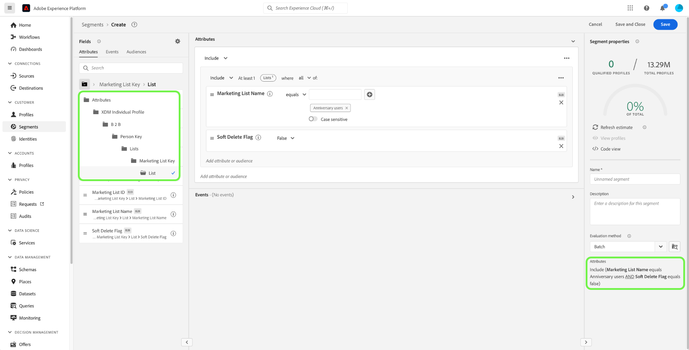

# Exempel på segmenteringsanvändning för Real-time Customer Data Platform B2B Edition

Det här dokumentet innehåller exempel på segmentdefinitioner i Adobe Real-time Customer Data Platform B2B Edition och hur olika typer av attribut kan kombineras för vanliga B2B-användningsområden. Mer information om hur destinationer passar in i ditt B2B-arbetsflöde finns i [den kompletta självstudiekursen](../b2b-tutorial.md#create-a-segment-to-evaluate-your-data).

>[!NOTE]
>
>Attributen som krävs för denna segmenteringsanvändning är endast tillgängliga för Real-time Customer Data Platform B2B Edition-kunder. Om du inte använder Real-time Customer Data Platform B2B Edition läser du [segmenteringsöversikten](./segmentation-overview.md) i stället.

## Förhandskrav {#prerequisites}

Innan du kan använda segmenteringsattributen för B2B-klasser måste du utföra följande steg:

1. Skapa scheman som använder B2B-klasserna. Klasserna för B2B Edition omfattar konto, kampanj, säljprojekt, marknadsföringslista med mera. Mer information om [hur du ställer in scheman för användning med B2B-klasser](../schemas/b2b.md) finns i schemadokumentationen.
2. Skapa relationer mellan era B2B-scheman i Experience Data Model (XDM). Målgrupper som bygger på attribut i B2B Edition kräver relationer mellan klasserna för att fullt ut kunna använda den utökade funktionen för B2B-segmentering. Mer information finns i dokumentationen om [hur du definierar en relation mellan två B2B-scheman](../../xdm/tutorials/relationship-b2b.md).
3. Importera data med datauppsättningar baserade på era B2B-scheman. I källdokumentationen finns [information om hur du importerar data](../../sources/connectors/adobe-applications/marketo/marketo.md).
4. Läs användarhandboken för [Segment Builder](../../segmentation/ui/segment-builder.md) om du vill ha mer information om hur du skapar målgrupper.

När dessa krav är uppfyllda kan du kombinera dessa attribut för vanliga B2B-syften.

## Komma igång {#getting-started}

När föreningsscheman för B2B-klasserna har upprättat relationer och har använts för att importera data, blir deras attribut tillgängliga i den vänstra listen i Segment Builder.

B2B-klasser och deras attribut läggs till med en `B2B`-etikett i arbetsytan Segmentering för att skilja dem från dem som finns som standard i Real-time Customer Data Platform.

För att effektivt kunna skapa målgrupper för B2B-fall är det viktigt att ha en god kunskap om schemat och förstå hur datamodellen ser ut. Det är också praktiskt att vara medveten om den sökväg som data tar från ett dataobjekt till ett annat.

Bilden nedan visar förhållandet mellan de B2B-klasser som finns i Real-Time CDP B2B Edition.

Eftersom din datamodell kan vara komplicerad kan du använda användargränssnittet för plattformen för att visa en mer detaljerad visuell representation av din datamodell för att hitta relevanta attribut för ditt användningsfall. Börja med att gå till användargränssnittet för plattformen och välj Scheman i den vänstra navigeringen.

Välj lämpligt schema från den tillgängliga listan och välj lämplig relation från sidospåret [!UICONTROL Composition]. I exemplet nedan visar valet av &quot;Person&quot;-relation vilket attribut i det aktuella schemat som refererar till det relaterade &quot;Person&quot;-schemat (om det är källschemat i relationen) eller refereras av &quot;Person&quot;-schemat (om det är referensschemat i relationen).

Relationen återspeglas i segmentbyggaren genom att `Key`-mappar används, vilket visas i bilden nedan.

Mer information om tillgängliga B2B-klasser finns i [scheman i dokumentationen för Real-time Customer Data Platform B2B Edition](../schemas/b2b.md).

Användningsexemplen nedan ger information om vilka klasser som används för att upprätta relationer mellan olika scheman för att uppnå dessa resultat. De här exemplen kan användas för att hjälpa er att skapa egna målgrupper.

## Exempel på olika användningsområden för segmentering {#use-cases}

Följande användningsexempel finns för segmentering med B2B Edition. Varje exempel innehåller en beskrivning av vad publiken gör och en beskrivning av de klasser som används för att skapa dem. Bilderna visar filsökvägen i sidospåret [!UICONTROL Attributes] som återspeglar schemats struktur. Avsnittet [!UICONTROL Segment properties] till höger om skärmen innehåller en skriftlig beskrivning av målgruppens attribut.

### Exempel 1: Hitta&quot;beslutsfattare&quot; för B2B-möjligheter {#find-decision-maker}

Hitta alla personer som är &quot;beslutsfattare&quot; för alla möjligheter. Den här målgruppen kräver en länk mellan klassen [!UICONTROL XDM Individual Profile] och klassen [!UICONTROL XDM Business Opportunity Person Relation].

### Exempel 2: Hitta B2B-profiler som tilldelats affärsmöjligheter över ett visst belopp {#find-opportunities-amount}

Hitta alla personer som är direkt tilldelade till alla möjligheter vars affärsmöjlighet är större än det angivna beloppet ($1 miljon). Den här målgruppen kräver en länk mellan klassen [!UICONTROL XDM Individual Profile], klassen [!UICONTROL XDM Business Opportunity Person Relation] och klassen [!UICONTROL XDM Business Opportunity].

### Exempel 3: Hitta B2B-profiler som tilldelats affärsmöjligheter efter plats {#find-opportunities-location}

Hitta alla personer som är direkt tilldelade till affärsmöjligheter där kontot finns på en viss plats (Kanada). Den här målgruppen kräver en länk mellan klassen [!UICONTROL XDM Individual Profile], klassen [!UICONTROL XDM Business Opportunity Person Relation], klassen [!UICONTROL XDM Business Opportunity] och klassen [!UICONTROL XDM Business Account].

### Exempel 4: Hitta&quot;beslutsfattare&quot; för att hitta möjligheter utifrån bransch och webbläsarbeteende {#find-industry-browsing-behavior}

Hitta alla personer som är en&quot;beslutsfattare&quot; för alla möjligheter där kontot finns i&quot;finansbranschen&quot; och som har besökt prissidan de senaste tre dagarna. Den här målgruppen kräver en länk mellan klassen [!UICONTROL XDM Individual Profile], klassen [!UICONTROL XDM Business Opportunity Person Relation], klassen [!UICONTROL XDM Business Opportunity], klassen [!UICONTROL XDM Business Account] och klassen [!UICONTROL XDM ExperienceEvent].

### Exempel 5: Hitta B2B-profiler för affärsmöjligheter efter avdelningens namn och affärsmöjlighetsbelopp {#find-department-opportunity-amount}

Hitta alla personer som arbetar på en HR-avdelning och har ett konto som har minst en öppen möjlighet till ett visst belopp ($1 miljon) eller mer. Den här målgruppen kräver en länk mellan klassen [!UICONTROL XDM Individual Profile], klassen [!UICONTROL XDM Business Account] och klassen [!UICONTROL XDM Business Opportunity].

### Exempel 6: Hitta B2B-profiler efter befattning och årskontonas intäkter {#find-by-job-title-and-revenue}

Hitta alla personer vars befattning är Vice President och som har ett konto med en årsomsättning på ett visst belopp ($100 miljoner) eller mer, och som har besökt prissidan minst tre gånger den senaste månaden. Den här målgruppen kräver en länk mellan klassen [!UICONTROL XDM Individual Profile], klassen [!UICONTROL XDM Business Account] och klassen [!UICONTROL XDM ExperienceEvent].

### Exempel 7: Hitta&quot;beslutsfattare&quot; efter affärsmöjlighet och webbläsarbeteende {#find-by-opportunity-status-and-browsing-behavior}

Hitta alla personer som är en &quot;beslutsfattare&quot; för alla stängda affärsmöjligheter och besökte prissidan förra veckan. Den här målgruppen kräver en länk mellan klassen [!UICONTROL XDM Individual Profile], klassen [!UICONTROL XDM Business Opportunity Person Relation], klassen [!UICONTROL XDM Business Opportunity] och klassen [!UICONTROL XDM ExperienceEvent].

### Exempel 8: Använd relaterade konton för att utöka segmenteringens räckvidd {#related-accounts}

Hitta alla personer som arbetar på en HR-avdelning och som är kopplade till något konto *eller något av kontots relaterade konton* som har minst en öppen möjlighet värd det angivna beloppet ($1 miljoner) eller mer. Den här målgruppen kräver en länk mellan klassen [!UICONTROL XDM Individual Profile], klassen [!UICONTROL XDM Business Account] och klassen [!UICONTROL XDM Business Opportunity].

### Exempel 9: Använd lead scores och/eller account scores för att kvalificera profil {#account-scoring}

Hitta alla profiler med lead score över 80.

### Exempel 10: Sök efter B2B-profiler som är kopplade till konton vars överordnade organisation har intäkter över ett visst dollarbelopp {#find-parent-org-amount}

Hitta alla personer som är kopplade till konton vars överordnade organisation har en intäkt som är större än det angivna beloppet (100 000 000 USD).

### Exempel 11: Sök efter B2B-profiler efter jobbtitel och kontonamn med en aktiv relation {#find-by-job-title-and-account-name}

Hitta alla personer som är &quot;chef&quot; för kontot &quot;Acme&quot;, där kontorelationen är &quot;Aktiv&quot;.

### Exempel 12: Sök efter B2B-profiler som är avsedda för kampanjer där actualCost överskrider budgetedCost {#find-actualcost-exceed-budgetcost}

Hitta alla personer som är målinriktade för kampanjer där actualCost överskred budgetedCost.

### Exempel 13: Sök efter B2B-profiler som tillhör en statisk Marketo-lista och isDeleted=false {#find-marketo-static-list}

Hitta alla personer som tillhör Marketo statiska lista &quot;Förnyelseanvändare&quot; där isDeleted=false.

## Nästa steg {#next-steps}

Efter att ha läst den här översikten har du nu en förståelse för de segmenteringsmöjligheter som är tillgängliga med Real-Time CDP, B2B Edition. Mer information om segmenteringstjänsten finns i [Segmenteringsdokumentationen](../../segmentation/home.md).
