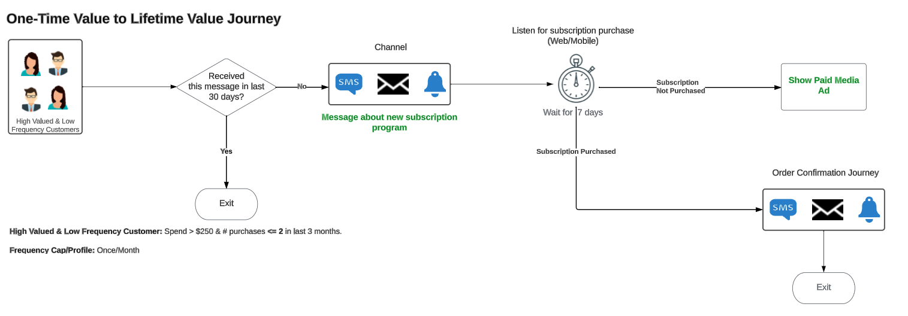

# Utveckla kundvärdet en gång till livstidsvärdet

>[!IMPORTANT]
> 
>* På den här sidan visas ett exempel på hur Real-Time CDP och Adobe Journey Optimizer implementeras för att uppnå det beskrivna användningsfallet. Använd sifferdata, kvalificeringskriterier och andra fält som anges på sidan som en vägledning, inte som prediktiva siffror.
>* Du måste ha licens för Real-Time CDP och Adobe Journey Optimizer för att kunna använda produkten. Läs mer i [villkor och planeringsavsnitt](#prerequisites-and-planning) längre fram.

Implementera engångskundens värde för livstidsanvändning för att öka varumärkesengagemang och varumärkeslojalitet. Bygg en sammanhängande kundupplevelse i flera kanaler eller på en resa med hjälp av Experience Platform, förstärkt av [Real-Time CDP](/help/rtcdp/home.md) och [Journey Optimizer](https://experienceleague.adobe.com/en/docs/journey-optimizer/using/ajo-home).

Personerna som ni riktar in er på är de ovanliga besökarna av era egendomar som har gjort några inköp de senaste tre månaderna.

Överväg de kunder som besöker era lokaler och sporadiskt köper de produkter eller tjänster ni erbjuder. Ni kanske vill skapa personaliserade kampanjer som tilltalar dessa kunder så att ert varumärke kan erbjuda dem långsiktigt värde istället för engångsvärde. Lär dig mer om:

* Samla in och hantera data
* Skapa målgrupper
* Skapa resor för att inrikta er på dessa målgrupper i Adobe Journey Optimizer och aktivera dem i Real-Time CDP.

{zoomable="yes"}

## Förutsättningar och planering {#prerequisites-and-planning}

Med tanke på att ni internt har definierat ett affärsmål och mål att öka varumärkeslojaliteten. Detta kan leda till att man implementerar ett användningsexempel som kan öka kundengagemanget och lojaliteten.

För att uppnå detta består tekniken av de två Experience Platform-apparna [Real-Time CDP](https://experienceleague.adobe.com/docs/experience-platform/rtcdp/overview.html?lang=sv) och [Adobe Journey Optimizer](https://experienceleague.adobe.com/docs/journey-optimizer/using/get-started/get-started.html). Nedan visas olika funktioner och gränssnittselement från de två programmen som du använder när du implementerar användningsexemplet.

>[!TIP]
>
>Se till att du har de nödvändiga [behörigheter för attributbaserad åtkomstkontroll](/help/access-control/abac/end-to-end-guide.md) för alla dessa områden, eller be systemadministratören att ge dig de behörigheter som krävs.

* [[!DNL Adobe Real-Time Customer Data Platform (Real-Time CDP)]](https://experienceleague.adobe.com/docs/platform-learn/tutorials/rtcdp/understanding-the-real-time-customer-data-platform.html): Integrera data mellan datakällor för att ge kampanjens drivkraft. Dessa data används sedan för att skapa kampanjmålgrupper och ta fram personaliserade dataelement som används i e-postmeddelanden och webbkampanjpaneler (till exempel namn eller kontorelaterad information). Slutligen används Real-Time CDP även för att aktivera målgrupper för betalda mediematerial.
   * [Scheman](/help/xdm/home.md)
   * [Profiler](/help/profile/home.md)
   * [Datauppsättningar](/help/catalog/datasets/overview.md)
   * [Målgrupper](/help/segmentation/home.md)
   * [Mål ](/help/destinations/home.md)
* [[!DNL Adobe Journey Optimizer]](https://experienceleague.adobe.com/docs/journey-optimizer/using/orchestrate-journeys/journey.html): Designa resor, konfigurera triggers och skapa rätt budskap för att bemöta era besökare.
   * [Händelse- eller målutlösare](https://experienceleague.adobe.com/docs/journey-optimizer/using/offer-decisioning/collect-event-data/data-collection.html)
   * [Målgrupper och evenemang](https://experienceleague.adobe.com/docs/journey-optimizer/using/audiences-profiles-identities/audiences/about-audiences.html)
   * [Resor](https://experienceleague.adobe.com/docs/journey-optimizer/using/orchestrate-journeys/journey.html)

## Real-Time CDP och Journey Optimizer

Nedan finns en avancerad arkitekturvy över de olika komponenterna i Real-Time CDP och Journey Optimizer. I det här diagrammet visas hur data flödar genom de två Experience Platform-apparna från datainsamling fram till den punkt där de aktiveras via resor eller kampanjer till destinationer för att uppnå det användningsfall som beskrivs på den här sidan.

{zoomable="yes"}

## Så här uppnår du användningsfallet: översikt på hög nivå {#achieve-the-use-case-high-level}

Nedan finns en översikt över arbetsflödet, en kombination av ett arbetsflöde för resan och ett aktiveringsarbetsflöde.

I det exempelarbetsflöde som visas nedan söker du efter kunder som uppfyller vissa villkor och vill locka dem att återvända till din webbplats eller app. Du vill placera dem på en resa där de återkommer mer återkommande i stället för med begränsad aktivitet på din egendom. Du försöker få tillbaka dem till din egendom och när de väl är tillbaka får du dem att gå in på resan för att göra återkommande köp på din webbplats. Kampanjen som läggs upp här är begränsad till ett kundengagemang per månad.

Börja med att skicka ett budskap till er målgrupp med högvärderade och lågfrekventa kunder. Du kontrollerar sedan om de fått det här meddelandet inom de senaste trettio dagarna. Om de inte har det kan du registrera dem på en resa om t.ex. ett nytt prenumerationsprogram. Du kan sedan vänta i några dagar (sju dagar i det här exemplet). Om de inte har köpt den prenumeration som du har skickat meddelanden till dem kan du sedan leverera betalmediereklam via destinationer. Om de har köpt prenumerationen kan du låta dem ange en orderbekräftelseresa och därmed slutföra användningsärendet.

>[!IMPORTANT]
>
>Som beskrivs nedan på denna sida, genom att [dedikerad fältgrupp för samtycke i ditt schema](#customer-attributes-schema) och [genomföra godkännandepolicyer](#privacy-consent), implementeras alla åtgärder och arbetsflöden på ett sätt som innebär sekretess och samtycke först.

>[!BEGINSHADEBOX]

{zoomable="yes"}

1. Du skapar scheman och datauppsättningar och markerar dem sedan för [!UICONTROL Profile].
2. Data samlas in och integreras i Experience Platform via Web SDK, Mobile Edge SDK eller API. Analytics Data Connector kan också användas, men kan resultera i fördröjning för resan.
3. Ni läser in profiler i Real-Time CDP och bygger styrningspolicyer för att säkerställa ansvarsfull användning.
4. Ni bygger fokuserade målgrupper från listan med profiler för att hitta kunder med högt värde och låg frekvens.
5. Du skapar två resor i [!DNL Adobe Journey Optimizer], en för att informera användarna om ett nytt prenumerationsprogram och en annan för att meddela dem att de vill bekräfta köpet senare.
6. Om du vill kan du aktivera kunder som inte har köpt din prenumeration till önskade betalmediematerial.

>[!ENDSHADEBOX]

## Hur man uppnår användningsfallet {#achieve-use-case-instruction}

Om du vill slutföra varje steg i översikten ovan läser du igenom avsnitten nedan som innehåller länkar till mer information och mer detaljerade anvisningar.

### Gränssnittsfunktioner och -element som du använder {#ui-functionality-and-elements}

När du är klar med implementeringen av användningsexemplet använder du de Real-Time CDP-, Adobe Journey Optimizer- och gränssnittselement som listas i början av det här dokumentet. Se till att du har de nödvändiga attributbaserade behörigheterna för åtkomstkontroll i alla dessa områden, eller be systemadministratören att ge dig de behörigheter som krävs.

### Skapa en schemadesign och ange fältgrupper {#schema-design}

Experience Data Model-resurser (XDM) hanteras i [!UICONTROL Schemas] arbetsyta i [!DNL Adobe Experience Platform]. Du kan se och utforska de viktigaste resurserna i [!DNL Adobe] (till exempel [!UICONTROL field groups]) och skapa anpassade resurser och scheman för er organisation.

Mer information om hur du skapar [scheman](https://experienceleague.adobe.com/docs/experience-platform/xdm/home.html?lang=sv), läsa [skapa schemakurs.](/help/xdm/tutorials/create-schema-ui.md)

Det finns flera schemadesigner som du kan använda i den här exempelimplementeringen för användningsfallet för att ändra ett enstaka värde till ett livstidsvärde. Varje schema innehåller specifika obligatoriska fält som ska ställas in och vissa fält som föreslås.

Utifrån exempelimplementeringar föreslår Adobe att du skapar följande tre scheman för att uppnå det här användningsfallet:

* [Kundattributschema](#customer-attributes-schema) (ett profilschema)
* [Kundens digitala transaktionsschema](#customer-digital-transactions-schema) (ett händelseschema för upplevelser)
* [Schema för offlinetransaktioner för kund](#customer-offline-transactions-schema) (ett händelseschema för upplevelser)

#### Kundattributschema {#customer-attributes-schema}

Använd det här schemat för att strukturera och referera till profildata som utgör kundinformationen. Dessa data är vanligtvis insamlade i [!DNL Adobe Experience Platform] via ditt CRM-system eller liknande system och är nödvändigt för att referera till kundinformation som används för personalisering, marknadsföringsmedgivande och förbättrade segmenteringsfunktioner.

Kundattributschemat representeras av en [!UICONTROL XDM Individual Profile] -klass, som innehåller följande fältgrupper:

+++Demografisk information (fältgrupp)

[Demografiska detaljer](/help/xdm/field-groups/profile/demographic-details.md) är en standardschemafältgrupp för klassen XDM Individual Profile. Fältgruppen innehåller ett personobjekt på rotnivå, vars underfält beskriver information om en enskild person.

+++

+++Personlig kontaktinformation (fältgrupp)

[Kontaktinformation, privat](/help/xdm/field-groups/profile/personal-contact-details.md) är en standardschemafältgrupp för klassen XDM Individual Profile, som beskriver kontaktinformationen för en enskild person.

+++

+++Extern källsystemsgranskningsinformation (fältgrupp)

[Granskningsattribut för externt källsystem](/help/xdm/data-types/external-source-system-audit-attributes.md) är en XDM-datatyp (Standard Experience Data Model) som samlar in granskningsinformation om ett externt källsystem.

+++

+++Grupper för samtycke och inställningsfält (fältgrupp)

[Innehåll och inställningar](/help/xdm/field-groups/profile/consents.md) fältgruppen innehåller ett enda fält av objekttyp, samtycke, för att hämta information om samtycke och inställningar.

+++

#### Kundens digitala transaktionsschema {#customer-digital-transactions-schema}

Det här schemat används för att strukturera och referera till händelsedata som utgör kundaktiviteten på din webbplats eller på andra associerade digitala plattformar. Dessa data är vanligtvis insamlade i [!DNL Adobe Experience Platform] via [Web SDK](/help/web-sdk/home.md) och är nödvändigt för att kunna hänvisa till olika bläddrings- och konverteringshändelser som används för att utlösa resor, detaljerad kundanalys online och förbättrade segmenteringsfunktioner.

Kundens digitala transaktionsschema representeras av en [!UICONTROL XDM ExperienceEvent] -klass, som innehåller följande fältgrupper:

+++Adobe Experience Platform Web SDK ExperienceEvent (fältgrupp)

| Fält | Krav |
| --- | --- |
| `device.model` | Föreslagen |
| `environment.browserDetails.userAgent` | Föreslagen |

+++

+++Webbinformation (fältgrupp)

[Webbinformation](/help/xdm/field-groups/event/web-details.md) är en standardgrupp för schemafält för klassen XDM ExperienceEvent, som används för att beskriva information om webbinformationshändelser som interaktion, sidinformation och referent.

+++

+++Consumer Experience Event (Field Group)

Den här fältgruppen innehåller olika typer av information om åtgärder, till exempel köp- och surfningshändelser, som användarna utför på din webbegenskap.

| Fält | Krav |
| --- | --- |
| `commerce.cart.cartID` | Föreslagen |
| `commerce.cart.cartSource` | Föreslagen |
| `commerce.cartAbandons.id` | Föreslagen |
| `commerce.cartAbandons.value` | Föreslagen |
| `commerce.order.orderType` | Föreslagen |
| `commerce.order.payments.paymentAmount` | Föreslagen |
| `commerce.order.payments.paymentType` | Föreslagen |
| `commerce.order.payments.transactionID` | Föreslagen |
| `commerce.order.priceTotal` | Föreslagen |
| `commerce.order.purchaseID` | Föreslagen |
| `commerce.productListAdds.id` | Föreslagen |
| `commerce.productListAdds.value` | Föreslagen |
| `commerce.productListOpens.id` | Föreslagen |
| `commerce.productListOpens.value` | Föreslagen |
| `commerce.productListRemoval.id` | Föreslagen |
| `commerce.productListRemoval.value` | Föreslagen |
| `commerce.productListViews.id` | Föreslagen |
| `commerce.productListViews.value` | Föreslagen |
| `commerce.productViews.id` | Föreslagen |
| `commerce.productViews.value` | Föreslagen |
| `commerce.purchases.id` | Föreslagen |
| `commerce.purchases.value` | Föreslagen |
| `marketing.campaignGroup` | Föreslagen |
| `marketing.campaignName` | Föreslagen |
| `marketing.trackingCode` | Föreslagen |
| `productListItems.name` | Föreslagen |
| `productListItems.priceTotal` | Föreslagen |
| `productListItems.product` | Föreslagen |
| `productListItems.quantity` | Föreslagen |

+++

+++Slutanvändar-ID-information (fältgrupp)

The [Information om slutanvändar-ID](/help/xdm/field-groups/event/enduserids.md) fältgruppen innehåller olika uppgifter om dina användare, t.ex. om de är autentiserade på din webbplats vid besök, och information om deras identitet.

+++

+++Extern källsystemsgranskningsinformation (fältgrupp)

Granskningsattribut för externt källsystem är en XDM-datatyp (Experience Data Model) som samlar in granskningsinformation om ett externt källsystem.

+++

#### Schema för offlinetransaktioner för kund {#customer-offline-transactions-schema}

Det här schemat används för att strukturera och referera till händelsedata som utgör kundaktiviteten på plattformar utanför webbplatsen. Dessa data är vanligtvis insamlade i [!DNL Adobe Experience Platform] från en POS (eller liknande system) och som oftast strömmas till plattformen via en API-anslutning. Läs om [batchintag](/help/ingestion/batch-ingestion/getting-started.md). Syftet är att hänvisa till olika offlinekonverteringshändelser som används för att utlösa resor, djupgående kundanalyser online och offline samt förbättrade segmenteringsfunktioner.

Kundens offlinetransaktionsschema representeras av en [!UICONTROL XDM ExperienceEvent] -klass, som innehåller följande fältgrupper:

+++Commerce Details (Field Group)

[Information om Commerce](/help/xdm/field-groups/event/commerce-details.md) är en standardgrupp för schemafält för [!DNL XDM ExperienceEvent] klass, som används för att beskriva handelsdata, t.ex. produktinformation (SKU, namn, kvantitet) och standardkundvagnsåtgärder (order, utcheckning, överge).

+++

+++Personlig kontaktinformation (fältgrupp)

[[!UICONTROL Personal Contact Details]](/help/xdm/field-groups/profile/personal-contact-details.md) är en standardgrupp för schemafält för [!DNL XDM Individual Profile] som beskriver kontaktinformationen för en enskild person.

+++

+++Extern källsystemsgranskningsinformation (fältgrupp)

Granskningsattribut för externt källsystem är en XDM-datatyp (Experience Data Model) som samlar in granskningsinformation om ett externt källsystem.

+++

#### Adobe webbanslutningsschema {#adobe-web-connector-schema}

>[!NOTE]
>
>Detta är en valfri implementering om du använder [!DNL Adobe Analytics Data Connector].

Det här schemat används för att strukturera och referera till händelsedata som utgör kundaktiviteten på din webbplats eller på andra associerade digitala plattformar. Det här schemat liknar kundens schema för digitala transaktioner, men skiljer sig åt på så sätt när Web SDK inte är ett alternativ för datainsamling. Därför kan du använda det här schemat när du använder [!DNL Adobe Analytics Data Connector] för att skicka onlinedata till [!DNL Adobe Experience Platform] antingen som primär eller sekundär datastream.

The [!DNL Adobe] webbanslutningsschemat representeras av en [!UICONTROL XDM ExperienceEvent] -klass, som innehåller följande fältgrupper:

+++Adobe Analytics ExperienceEvent-mall (fältgrupp)

[[!UICONTROL Adobe Analytics ExperienceEvent Full Extension]](/help/xdm/field-groups/event/analytics-full-extension.md) är en standardgrupp för schemafält, som samlar in vanliga mätvärden som samlas in av Adobe Analytics.

+++

### Skapa en datauppsättning från ett schema {#dataset-from-schema}

En datauppsättning är en lagrings- och hanteringsstruktur för en grupp med data. Varje schema som används för att slutföra den här exempelimplementeringen har en enda datamängd.

Mer information om hur du skapar en [datauppsättning](/help/catalog/datasets/overview.md) från ett schema, läs [Användargränssnittshandbok för datauppsättningar](/help/catalog/datasets/user-guide.md).

>[!NOTE]
>
>På samma sätt som när du skapar ett schema måste du aktivera datauppsättningen som ska inkluderas i kundprofilen i realtid. Mer information om hur du aktiverar datauppsättningen för användning i kundprofilen i realtid finns i [skapa schemakurs.](/help/xdm/tutorials/create-schema-ui.md#profile).

### Integritet, samtycke och datahantering {#privacy-consent}

#### Samtyckesprinciper

>[!IMPORTANT]
>
>Ett juridiskt krav är att ge kunderna möjlighet att säga upp prenumerationen på information från ett varumärke och att se till att detta val respekteras. Läs mer om gällande lagstiftning i [Översikt över sekretessbestämmelser](https://experienceleague.adobe.com/docs/experience-platform/privacy/regulations/overview.html).

Överväg att implementera följande [medgivandeprinciper](https://experienceleague.adobe.com/docs/platform-learn/data-collection/web-sdk/consent/overview.html) och be besökarna om samtycke innan ni kontaktar dem:

* If `consents.marketing.email.val = "Y"` kan e-posta
* If `consents.marketing.sms.val = "Y"` kan SMS
* If `consents.marketing.push.val = "Y"` sedan Can Push
* If `consents.share.val = "Y"` så kan annonsera

#### Etikett och verkställighet för datastyrning

Överväg att lägga till och verkställa följande [etiketter för datastyrning](/help/data-governance/labels/overview.md):

* Personliga e-postadresser används som direkt identifierbara data som används för att identifiera eller komma i kontakt med en viss individ i stället för en enhet.
   * `personalEmail.address = I1`

#### Marknadspolicyer

Det finns inga [marknadsföringspolicyer](/help/data-governance/policies/overview.md) krävs för de resor som du skapar som en del av detta användningsfall. Du kan dock överväga följande profiler:

* Begränsa känsliga data
* Begränsa annonsering på plats
* Begränsa e-postmålning
* Begränsa målgruppsanpassning mellan webbplatser
* Begränsa kombinationen av direkt identifierbara data med anonyma data

### Skapa målgrupper {#create-audiences}

Det här användningsexemplet kräver att du skapar två målgrupper för att definiera specifika attribut eller beteenden som delas av en deluppsättning profiler från din profilbutik för att särskilja en marknadsföringsbar grupp av människor. Målgrupper kan skapas på flera sätt i Adobe Experience Platform:

* Mer information om hur du skapar en målgrupp finns i [Användargränssnittsguide för målgruppstjänst](https://experienceleague.adobe.com/docs/experience-platform/segmentation/ui/overview.html#create-audience).
* Mer information om disposition [målgrupper](/help/segmentation/home.md), läsa [Användargränssnittsguide för målgruppskomposition](/help/segmentation/ui/audience-composition.md).
* Mer information om hur du bygger målgrupper med hjälp av plattformsbaserade segmentdefinitioner finns i [Användargränssnittshandbok för Audience Builder](/help/segmentation/ui/segment-builder.md).

Du måste skapa och använda två målgrupper i olika steg av användningsfallet, vilket visas i bilden nedan.

{zoomable="yes"}

>[!BEGINTABS]

>[!TAB Adobe Journey Optimizer Qualifying Audience]

Den här värdefulla och lågfrekventa publiken innehåller de profiler som du vill nå ut till via en resa för att informera dem om ett nytt prenumerationsprogram. Publiken finns nedan:

* Beskrivning: Profiler som har spenderat mer än $250 totalt de senaste tre månaderna
* Fält och villkor som behövs i målgruppen:
   * Händelse: `commerce.order.payments.paymentamount`
* Sammanställd summa: >= $250
   * EventType: `commerce.purchases`
* Tidsstämpel: mindre än 3 månader tidigare

>[!TAB Betalande mediepublik]

Den här målgruppen har skapats för att inkludera profiler som har spenderat mer än 250 USD totalt de senaste tre månaderna och som inte har köpt något under de senaste 7 dagarna. Publiken finns nedan:

* Beskrivning: profiler som har spenderat mer än 250 USD totalt de senaste tre månaderna och som inte har köpt något under de senaste sju dagarna.
* Fält och villkor som krävs:
   * EventType: `journey.feedback`
      * Operand: = true
   * Händelse: `experience.journeyOrchestration.stepEvents.nodeName`
      * Operand: = JourneyStepEventTracker - prenumerationen har inte köpts
      * Tidsstämpel: under de senaste 7 dagarna
   * EventType är inte: `commerce.purchases`
      * Tidsstämpel: &lt;= 7 dagar före nu
   * Händelse: SKU
      * Värde: = `subscription`

>[!ENDTABS]

### Resekonfiguration i Adobe Journey Optimizer {#journey-setup}

>[!NOTE]
>
>[!DNL Adobe Journey Optimizer] omfattar inte allt som visas i diagrammen. Alla [annonser för betalda medier](/help/destinations/catalog/social/overview.md) skapas i [!UICONTROL destinations] [arbetsyta](/help/destinations/ui/destinations-workspace.md).

[[!DNL Adobe Journey Optimizer]](https://experienceleague.adobe.com/docs/journey-optimizer/using/orchestrate-journeys/journey.html) hjälper er att leverera sammankopplade, kontextuella och personaliserade upplevelser till era kunder. Kundresan är hela processen för en kunds interaktioner med varumärket. Varje användningsfallsresa kräver specifik information.

För att uppnå detta måste du skapa två separata resor:

* Livslängdsresan, som innehåller det budskap du skickar till dina värdefulla lågfrekventa kunder
* Beställningsbekräftelseresan för användare som svarar på ditt samtal och köper en prenumeration.

{zoomable="yes"}

Nedan finns de exakta data som behövs för varje resegren.

>[!BEGINTABS]

>[!TAB Livstidsresa]

Livslängden riktar sig till kunder med högt värde och låg frekvens som inte var målinriktade de senaste 30 dagarna. Ett meddelande visas för dessa kunder och om de fortfarande inte köper något efter 7 dagar kan ni inkludera de icke-köpare i en publik som ni kan visa betalda mediereklam för. Om de faktiskt köper kan du ställa in köparna på en orderbekräftelseresa, som anges på den separata fliken.

{zoomable="yes"}

+++Detaljerad reselogik

Den resa som visas ovan följer följande logik.

1. Läsare: Använd en [läsningsaktivitet](https://experienceleague.adobe.com/docs/journey-optimizer/using/orchestrate-journeys/about-journey-building/read-audience.html?lang=en) för den första målgrupp som skapats i målgruppsavsnittet ovan.

2. Villkor - Önskad kanal: Använd en [villkorsaktivitet](https://experienceleague.adobe.com/docs/journey-optimizer/using/orchestrate-journeys/about-journey-building/condition-activity.html) för att avgöra hur ni ska nå ut till kunderna, via e-post, SMS eller push-meddelanden. Använd tre åtgärdsaktiviteter för att skapa de tre grenarna.

3. Vänta: använd en [vänteaktivitet](https://experienceleague.adobe.com/docs/journey-optimizer/using/orchestrate-journeys/about-journey-building/read-audience.html) att vänta tills du lyssnar efter köp.

4. Villkor - Inköpt prenumeration under de senaste 7 dagarna?: Använd en villkorsaktivitet för att lyssna efter produktköp under de senaste sju dagarna.

5. JourneyStepEventTracker - Prenumerationen har inte köpts: Använd en [anpassad åtgärd](https://experienceleague.adobe.com/docs/journey-optimizer/using/orchestrate-journeys/about-journey-building/using-custom-actions.html) för besökare som ännu inte har köpt din prenumeration, trots att de fått ditt meddelande. Som en del av det anpassade villkoret i slutet av resan skapar du en `journey.feedback` -händelsen och lägga till den i en datauppsättning baserat på [!UICONTROL Journey Step Event] schema. Du kommer att använda den här händelsen för att segmentera den målgrupp som inte har köpt prenumerationen och som du kan rikta in dig på via betalda mediereklam.

+++

>[!TAB Orderbekräftelse - Resa]

Beställningsbekräftelseresan fokuserar på om ett köp gjordes via webbplatsen eller mobilappen. När en kund har slutfört köpet av t.ex. en prenumeration hos ditt företag, kan du ställa in dem på en orderbekräftelseresa.

{zoomable="yes"}

+++Reselogik

Använd de föreslagna händelserna, fälten och åtgärderna nedan i bekräftelseresan:

* Resan utlöses av en online-köphändelse
   * Schema: Digitala kundtransaktioner
   * Fält:
      * `EventType`
   * Villkor:
      * `EventType = commerce.purchases`
      * Fält:
         * `Commerce.purchases.id`
         * `Commerce.purchases.value`
         * `eventType`
         * `identityMap.authenticatedState`
         * `identityMap.id`
         * `identityMap.primary`
         * `productListItems.SKU`
         * `productListItems.currencyCode`
         * `productListItems.name`
         * `productListItems.priceTotal`
         * `productListItems.product`
         * `productListItems.productImageUrl`
         * `productListItems.quantity`
         * `timestamp`
         * `endUserIDs._experience.emailid.authenticatedState`
         * `endUserIDs._experience.emailid.id`
         * `endUserIDs._experience.emailid.namespace.code`
         * `_id`

+++

+++Key Journey logic

* Inmatningslogik för resebidrag
   * Orderhändelse

* Villkor
   * Välj Målkanal (du kan markera en eller flera kanaler för större räckvidd).
      * Orderbekräftelsen anses vara till sin natur, så det är oftast inte nödvändigt att kontrollera samtycke.
      * E-post
      * Push
      * SMS

   * Kanalinnehållspersonalisering
      * Visa information om orderdetaljer och kan visa en lista med produkter i ett tabellformat.

+++

>[!ENDTABS]

Mer information om hur du skapar resor i [!DNL Adobe Journey Optimizer], läsa [komma igång med resor](https://experienceleague.adobe.com/docs/journey-optimizer/using/orchestrate-journeys/journey.html) guide.

### Ställ in ett mål för att visa annonser för betalda media {#paid-media-ads}

Vissa användare kanske inte har köpt din prenumeration ens efter att du har meddelat dem om det nya programmet. Efter att ha väntat i ett antal dagar (sju i det här exemplet) kan du bestämma dig för att visa betalda mediaannonser för dessa användare, för att uppmuntra dem att köpa din prenumeration.

Använd målgruppsramverket i Real-Time CDP för annonser i betalda medier. Välj ett av många tillgängliga reklamdestinationer för att visa betalda mediaannonser för dina kunder och aktivera den betalda mediepubliken som du använder [skapades tidigare](#create-audiences) till ett valfritt mål. Se en översikt över tillgängliga [reklam](/help/destinations/catalog/advertising/overview.md) och [social](/help/destinations/catalog/social/overview.md) destinationer.

Lär dig hur du aktiverar data till mål (till exempel [The Trade Desk](/help/destinations/catalog/advertising/tradedesk.md) eller [Google kundmatchning](/help/destinations/catalog/advertising/google-customer-match.md)), se dokumentationen nedan:

* [Skapa en ny målanslutning](/help/destinations/ui/connect-destination.md)
* [Aktivera målgruppsdata för direktuppspelad målgruppsexport](/help/destinations/ui/activate-segment-streaming-destinations.md)

## Nästa steg {#next-steps}

Genom att ställa in era lågfrekventa och värdefulla användare på en resa och visa betalda mediereklam för en delmängd av dem har ni förhoppningsvis vänt några av dem från engångsavgift till livstidsvärdefulla kunder, vilket förbättrar er varumärkeslojalitet och kundinteraktionsstatistik.

Därefter kan du utforska andra användningsområden som stöds av Real-Time CDP, till exempel [intelligent återengagerande kunder](/help/rtcdp/use-case-guides/intelligent-re-engagement/intelligent-re-engagement.md) eller [visa personaliserat innehåll för oautentiserade användare](/help/rtcdp/partner-data/onsite-personalization.md) på dina webbsidor.
