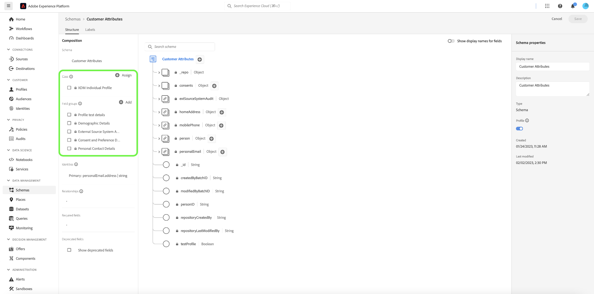
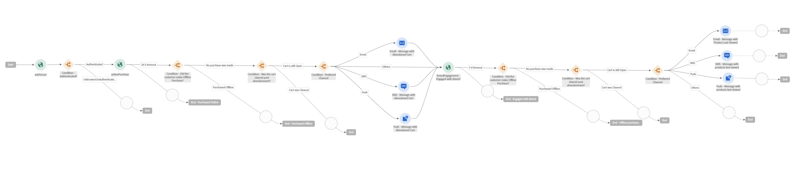

# Engagera kunderna på nytt på ett intelligent sätt för att få dem tillbaka

Intelligent återinteraktion gör det möjligt att skapa en skräddarsydd, kanalövergripande droppkampanj som kan övertala kunderna att utföra en viss åtgärd. Den spännande kampanjen är avsedd att fungera under en begränsad tid, vilket innefattar att skicka kunder som visade avsiktliga e-postmeddelanden, sms och servar betalda annonser. När kunden har vidtagit rätt åtgärd avslutas puffkampanjen direkt.

## Förutsättningar och planering {#prerequisites-and-planning}

När du är klar med implementeringen av användningsexemplet kommer du att använda följande Real-Time CDP-funktioner och gränssnittselement (listade i den ordning som du ska använda dem). Se till att du har de nödvändiga attributbaserade behörigheterna för åtkomstkontroll i alla dessa områden eller be systemadministratören att ge dig de behörigheter som krävs.

* [Adobe Real-time Customer Data Platform (Real-Time CDP)](https://experienceleague.adobe.com/docs/platform-learn/tutorials/rtcdp/understanding-the-real-time-customer-data-platform.html) - Sammanställer data från olika datakällor för att driva kampanjen framåt. Dessa data används sedan för att skapa kampanjmålgrupper och ta fram personaliserade dataelement som används i e-postmeddelanden och webbkampanjpaneler (till exempel namn eller kontorelaterad information). CDP används också för att aktivera målgrupperna via e-post och webben (via Adobe Target).
   * [Scheman](/help/xdm/home.md)
   * [Profiler](/help/profile/home.md)
   * [Målgrupper](/help/segmentation/home.md)
   * [Adobe Journey Optimizer](https://experienceleague.adobe.com/docs/journey-optimizer/using/orchestrate-journeys/journey.html)
   * [Händelse- eller målutlösare](https://experienceleague.adobe.com/docs/journey-optimizer/using/offer-decisioning/collect-event-data/data-collection.html)
   * [Målgrupper/evenemang](https://experienceleague.adobe.com/docs/journey-optimizer/using/audiences-profiles-identities/audiences/about-audiences.html)
   * [Reseåtgärder](https://experienceleague.adobe.com/docs/journey-optimizer/using/orchestrate-journeys/journey.html)

### Så här uppnår du användningsfallet: översikt på hög nivå {#achieve-the-use-case-high-level}

Det finns tre återanställningsresor som har skapats.

>[!BEGINTABS]

>[!TAB Engagement Journey på nytt]

Resan för återengagemang är inriktad på övergiven produktbläddring på både webbplatsen och appen. Den här resan utlöses när en produkt har visats utan någon produkt som köpts eller lagts till i kundvagnen. Varumärkesinteraktionen utlöses efter tre dagar om det inte finns några listtillägg under de senaste 24 timmarna.

1. Data samlas in i Web SDK/Mobile SDK/Edge Network API-förtäring via Edge Network (föredragen metod).
2. Som en **kund** skapar du datauppsättningar som är markerade för [!UICONTROL Profile].
3. Som en **kund** laddar ni in profiler i Real-Time CDP och bygger styrningspolicyer för att säkerställa ansvarsfull användning.
4. Som en **kund** bygger ni fokuserade målgrupper från listan med profiler för att kontrollera om en **användare** har gjort ett varumärkesengagemang de senaste tre dagarna.
5. Som en **kund** skapar ni en återengagemangsresa i Adobe Journey Optimizer.
6. Arbeta med **datapartner** för aktivering av målgrupper till önskade betalmediematerial.
7. Adobe Journey Optimizer söker efter samtycke och skickar ut de olika konfigurerade åtgärderna.

>[!TAB Övergiven Cart Journey]

Den övergivna kundvagnsresan avser produkter som har placerats i vagnen men inte köpts på både webbplatsen och appen. Används för att starta och stoppa betald media-kampanjer

1. Data samlas in i Web SDK/Mobile SDK/Edge Network API-förtäring via Edge Network (föredragen metod).
2. Som en **kund** skapar du datauppsättningar som är markerade för [!UICONTROL Profile].
3. Som en **kund** laddar ni in profiler i Real-Time CDP och bygger styrningspolicyer för att säkerställa ansvarsfull användning.
4. Som en **kund** bygger ni fokuserade målgrupper från listan med profiler för att kontrollera om en **användare** har placerat en artikel i kundvagnen men inte slutfört köpet. The **[!UICONTROL Add to cart]** event startar en timer som väntar i 30 minuter och sedan söker efter köp. Om inget köp har gjorts **användare** läggs till i **[!UICONTROL Abandon Cart]** målgrupper.
5. Som en **kund** skapar du en övergiven kundvagnsresa i Adobe Journey Optimizer
6. Arbeta med **datapartner** för aktivering av målgrupper till önskade betalmediematerial.
7. Adobe Journey Optimizer söker efter samtycke och skickar ut de olika konfigurerade åtgärderna.

>[!TAB Orderbekräftelse - Resa]

Den här orderbekräftelseresan avser produktinköp både på webbplatsen och i appen.

1. Data samlas in i Web SDK/Mobile SDK/Edge Network API-förtäring via Edge Network (föredragen metod).
2. Som en **kund** skapar du datauppsättningar som är markerade för [!UICONTROL Profile].
3. Som en **kund** laddar ni in profiler i Real-Time CDP och bygger styrningspolicyer för att säkerställa ansvarsfull användning.
4. Som en **kund** bygger ni fokuserade målgrupper från listan med profiler för att kontrollera om en **användare** har köpt något.
5. Som en **kund** skapar du en bekräftelseresa i Adobe Journey Optimizer.
6. Adobe Journey Optimizer skickar ut ett orderbekräftelsemeddelande via valfri kanal.

>[!ENDTABS]

## Så här uppnår du användningsfallet: stegvisa instruktioner {#step-by-step-instructions}

Läs igenom avsnitten nedan, som innehåller länkar till ytterligare dokumentation, för att slutföra varje steg i översikterna på hög nivå ovan.

### Gränssnittsfunktioner och -element som du använder {#ui-functionality-and-elements}

När du är klar med implementeringen av användningsexemplet kommer du att använda följande Real-Time CDP-funktioner och gränssnittselement (listade i den ordning som du ska använda dem). Se till att du har de nödvändiga attributbaserade behörigheterna för åtkomstkontroll i alla dessa områden eller be systemadministratören att ge dig de behörigheter som krävs.

* [Scheman](/help/xdm/home.md)
* [Profiler](/help/profile/home.md)
* [Datauppsättningar](/help/catalog/datasets/overview.md)
* [Målgrupper](/help/segmentation/home.md)
* [Adobe Journey Optimizer](https://experienceleague.adobe.com/docs/journey-optimizer/using/orchestrate-journeys/journey.html)
* [Mål ](/help/destinations/home.md)

### Skapa en schemadesign och ange fältgrupper

Experience Data Model-resurser (XDM) hanteras i [!UICONTROL Schemas] i Adobe Experience Platform. Du kan visa och utforska kärnresurser från Adobe och skapa anpassade resurser och scheman för din organisation.

Om du vill skapa ett schema följer du stegen nedan:

1. Navigera till **[!UICONTROL Data Management]** > **[!UICONTROL Schemas]** och markera **[!UICONTROL Create schema]**.
2. Välj **[!UICONTROL XDM Individual Profile]/[!UICONTROL XDM ExperienceEvent]**.
3. Navigera till **[!UICONTROL Field groups]** och markera **[!UICONTROL Add]**.
4. Använd sökrutan för att söka efter och markera fältgruppen och markera sedan **[!UICONTROL Add field groups]**.
5. Ge schemat ett namn och eventuellt en beskrivning.
6. Välj **[!UICONTROL Save]**.

Mer information om att skapa scheman finns i [skapa schemakurs.](/help/xdm/tutorials/create-schema-ui.md)

Det finns fyra schemadesigner som används för återengagemangsresan. Varje schema kräver att specifika fält ställs in, samt vissa fält som är starkt rekommenderade.

#### Fältgruppskrav för kundattributschemat

Kundattributschemat är ett [!UICONTROL XDM Individual Profile] schema, som innehåller följande fältgrupper:

+++Personlig kontaktinformation (fältgrupp)

[Kontaktinformation, privat](/help/xdm/field-groups/profile/personal-contact-details.md) är en standardschemafältgrupp för klassen XDM Individual Profile som beskriver kontaktinformationen för en enskild person.

| Fält | Krav | Beskrivning |
| --- | --- | --- |
| mobilePhone.number | Obligatoriskt | Personens mobiltelefonnummer, som kommer att användas för SMS. |
| personalEmail.address | Obligatoriskt | Personens e-postadress. |

+++

+++Demografisk information (fältgrupp)

[Demografiska detaljer](/help/xdm/field-groups/profile/demographic-details.md) är en standardschemafältgrupp för klassen XDM Individual Profile. Fältgruppen innehåller ett personobjekt på rotnivå, vars underfält beskriver information om en enskild person.

| Fält | Krav |
| --- | --- |
| person.name.firstName | Föreslagen |
| person.name.lastName | Föreslagen |

+++

+++Extern källsystemsgranskningsinformation (fältgrupp)

[Granskningsattribut för externt källsystem](/help/xdm/data-types/external-source-system-audit-attributes.md) är en XDM-datatyp (Standard Experience Data Model) som samlar in granskningsinformation om ett externt källsystem.

+++

+++Grupper för samtycke och inställningsfält (fältgrupp)

[Innehåll och inställningar](/help/xdm/field-groups//profile/consents.md) fältgruppen innehåller ett enda fält av objekttyp, samtycke, för att hämta information om samtycke och inställningar.

| Fält | Krav |
| --- | --- |
| consents.marketing.email.val | Obligatoriskt |
| consents.marketing.preferred | Obligatoriskt |
| consents.marketing.push.val | Obligatoriskt |
| consents.marketing.sms.val | Obligatoriskt |
| consents.personalize.content.val | Obligatoriskt |
| consents.share.val | Obligatoriskt |

+++

+++Profiltestinformation (fältgrupp)

Den här fältgruppen används för bästa praxis.

+++

#### Fältgruppskrav för kundens digitala transaktionsschema

Kundens digitala transaktionsschema är en [!UICONTROL XDM ExperienceEvent] schema, som innehåller följande fältgrupper:

+++Adobe Experience Platform Web SDK ExperienceEvent (fältgrupp)

| Fält | Krav |
| --- | --- |
| device.model | Föreslagen |
| environment.browserDetails.userAgent | Föreslagen |

+++

+++Webbinformation (fältgrupp)

Webbinformation är en standardschemafältgrupp för klassen XDM ExperienceEvent, som används för att beskriva information om webbinformationshändelser som interaktion, sidinformation och referent.

| Fält | Krav | Beskrivning |
| --- | --- | --- |
| web.webInteraction.linkClicks.id | Föreslagen | ID för webblänken eller URL-adressen som motsvarar interaktionen. |
| web.webInteraction.linkClicks.value | Föreslagen | Antalet klick för webblänken eller URL-adressen som motsvarar interaktionen. |
| web.webInteraction.name | Föreslagen | Webbsidans namn. |
| web.webInteraction.URL | Föreslagen | Webbsidans URL. |
| web.webPageDetails.name | Föreslagen | Namnet på webbsidan där webbinteraktionen inträffade. |
| web.webPageDetails.URL | Föreslagen | Webbsidans URL där webbinteraktionen inträffade. |
| web.webReferrer.URL | Föreslagen | Beskriver referenten till en webbinteraktion, vilket är den URL som en besökare kom från omedelbart innan den aktuella webbinteraktionen spelades in. |

+++

+++Consumer Experience Event (Field Group)

| Fält | Krav |
| --- | --- |
| commerce.cart.cartID | Föreslagen |
| commerce.cart.cartSource | Föreslagen |
| commerce.cartAbandons.id | Föreslagen |
| commerce.cartAbandons.value | Föreslagen |
| commerce.order.orderType | Föreslagen |
| commerce.order.payments.paymentAmount | Föreslagen |
| commerce.order.payments.paymentType | Föreslagen |
| commerce.order.payments.transactionID | Föreslagen |
| commerce.order.priceTotal | Föreslagen |
| commerce.order.purchaseID | Föreslagen |
| commerce.productListAdds.id | Föreslagen |
| commerce.productListAdds.value | Föreslagen |
| commerce.productListOpens.id | Föreslagen |
| commerce.productListOpens.value | Föreslagen |
| commerce.productListRemoval.id | Föreslagen |
| commerce.productListRemoval.value | Föreslagen |
| commerce.productListViews.id | Föreslagen |
| commerce.productListViews.value | Föreslagen |
| commerce.productViews.id | Föreslagen |
| commerce.productViews.value | Föreslagen |
| commerce.purchases.id | Föreslagen |
| commerce.purchases.value | Föreslagen |
| marketing.campaignGroup | Föreslagen |
| marketing.campaignName | Föreslagen |
| marketing.trackingCode | Föreslagen |
| productListItems.name | Föreslagen |
| productListItems.priceTotal | Föreslagen |
| productListItems.product | Föreslagen |
| productListItems.quantity | Föreslagen |

+++

+++Slutanvändar-ID-information (fältgrupp)

| Fält | Krav | Beskrivning |
| --- | --- | --- |
| endUserID:n._experience.emailid.authenticatedState | Obligatoriskt | Slutanvändarens e-postadress-ID har autentiserats. |
| endUserID:n._experience.emailid.id | Obligatoriskt | Slutanvändarens e-postadress-ID. |
| endUserID:n._experience.emailid.namespace.code | Obligatoriskt | ID-namnområdeskod för slutanvändarens e-postadress. |
| endUserID:n._experience.mcid.authenticatedState | Obligatoriskt | Autentiserat tillstånd för Adobe Marketing Cloud ID (MCID). MCID kallas nu Experience Cloud-ID (ECID). |
| endUserID:n._experience.mcid.id | Obligatoriskt | Adobe Marketing Cloud ID (MCID). MCID kallas nu Experience Cloud-ID (ECID). |
| endUserID:n._experience.mcid.namespace.code | Obligatoriskt | Adobe Marketing Cloud ID-namnområdeskod (MCID). |

+++

+++klassvärde (fältgrupp)

| Fält | Krav |
| --- | --- |
| eventType | Obligatoriskt |
| tidsstämpel | Obligatoriskt |

+++

+++Extern källsystemsgranskningsinformation (fältgrupp)

Granskningsattribut för externt källsystem är en XDM-datatyp (Experience Data Model) som samlar in granskningsinformation om ett externt källsystem.

+++

#### Fältgruppskrav för kundens offlinetransaktionsschema

Kundens offlinetransaktionsschema är en [!UICONTROL XDM ExperienceEvent] schema, som innehåller följande fältgrupper:

+++Commerce Details (fältgrupp)

| Fält | Krav | Beskrivning |
| --- | --- | --- |
| commerce.cart.cartID | Obligatoriskt | Ett ID för kundvagnen. |
| commerce.order.orderType | Obligatoriskt | Ett objekt som beskriver produktordertypen. |
| commerce.order.payments.paymentAmount | Obligatoriskt | Ett objekt som beskriver betalningsbeloppet för produktorder. |
| commerce.order.payments.paymentType | Obligatoriskt | Ett objekt som beskriver betalningstypen för produktorder. |
| commerce.order.payments.transactionID | Obligatoriskt | Ett transaktions-ID för objektproduktorder. |
| commerce.order.purchaseID | Obligatoriskt | Ett objektproduktorderns inköps-ID. |
| productListItems.name | Obligatoriskt | En lista med artikelnamn som representerar de produkter som en kund har valt. |
| productListItems.priceTotal | Obligatoriskt | Det totala priset på en lista med artiklar som representerar de produkter som kunden har valt. |
| productListItems.product | Obligatoriskt | Produkten/produkterna som valts. |
| productListItems.quantity | Obligatoriskt | Kvantiteten i en lista över artiklar som representerar de produkter som kunden har valt. |

+++

+++Personlig kontaktinformation (fältgrupp)

| Fält | Krav | Beskrivning |
| --- | --- | --- |
| mobilePhone.number | Obligatoriskt | Personens mobiltelefonnummer, som kommer att användas för SMS. |
| personalEmail.address | Obligatoriskt | Personens e-postadress. |

+++

+++klassvärde (fältgrupp)

| Fält | Krav |
| --- | --- |
| eventType | Obligatoriskt |
| tidsstämpel | Obligatoriskt |

+++

+++Extern källsystemsgranskningsinformation (fältgrupp)

Granskningsattribut för externt källsystem är en XDM-datatyp (Experience Data Model) som samlar in granskningsinformation om ett externt källsystem.

+++

#### Fältgruppskrav för Adobe webbanslutningsschema

Adobe webbanslutningsschema är en [!UICONTROL XDM ExperienceEvent] schema, som innehåller följande fältgrupper:

+++Adobe Analytics ExperienceEvent-mall (fältgrupp)

| Fält | Krav | Beskrivning |
| --- | --- | --- |
| web.webInteraction.linkClicks.id | Föreslagen | ID för webblänken eller URL-adressen som motsvarar interaktionen. |
| web.webInteraction.linkClicks.value | Föreslagen | Antalet klick för webblänken eller URL-adressen som motsvarar interaktionen. |
| web.webInteraction.name | Föreslagen | Webbsidans namn. |
| web.webInteraction.URL | Föreslagen | Webbsidans URL. |
| web.webPageDetails.name | Föreslagen | Namnet på webbsidan där webbinteraktionen inträffade. |
| web.webPageDetails.URL | Föreslagen | Webbsidans URL där webbinteraktionen inträffade. |
| web.webReferrer.URL | Föreslagen | Beskriver referenten till en webbinteraktion, vilket är den URL som en besökare kom från omedelbart innan den aktuella webbinteraktionen spelades in. |
| commerce.cart.cartID | Föreslagen | |
| commerce.cart.cartSource | Föreslagen | |
| commerce.cartAbandons.id | Föreslagen | |
| commerce.cartAbandons.value | Föreslagen | |
| commerce.order.orderType | Föreslagen | |
| commerce.order.payments.paymentAmount | Föreslagen | |
| commerce.order.payments.paymentType | Föreslagen | |
| commerce.order.payments.transactionID | Föreslagen | |
| commerce.order.priceTotal | Föreslagen | |
| commerce.order.purchaseID | Föreslagen | |
| commerce.productListAdds.id | Föreslagen | |
| commerce.productListAdds.value | Föreslagen | |
| commerce.productListOpens.id | Föreslagen | |
| commerce.productListOpens.value | Föreslagen | |
| commerce.productListRemoval.id | Föreslagen | |
| commerce.productListRemoval.value | Föreslagen | |
| commerce.productListViews.id | Föreslagen | |
| commerce.productListViews.value | Föreslagen | |
| commerce.productViews.id | Föreslagen | |
| commerce.productViews.value | Föreslagen | |
| commerce.purchases.id | Föreslagen | |
| commerce.purchases.value | Föreslagen | |
| marketing.campaignGroup | Föreslagen | |
| marketing.campaignName | Föreslagen | |
| marketing.trackingCode | Föreslagen | |
| productListItems.name | Föreslagen | |
| productListItems.priceTotal | Föreslagen | |
| productListItems.product | Föreslagen | |
| productListItems.quantity | Föreslagen | |
| endUserID:n._experience.emailid.authenticatedState | Obligatoriskt | Slutanvändarens e-postadress-ID har autentiserats. |
| endUserID:n._experience.emailid.id | Obligatoriskt | Slutanvändarens e-postadress-ID. |
| endUserID:n._experience.emailid.namespace.code | Obligatoriskt | ID-namnområdeskod för slutanvändarens e-postadress. |
| endUserID:n._experience.mcid.authenticatedState | Obligatoriskt | Autentiserat tillstånd för Adobe Marketing Cloud ID (MCID). MCID kallas nu Experience Cloud-ID (ECID). |
| endUserID:n._experience.mcid.id | Obligatoriskt | Adobe Marketing Cloud ID (MCID). MCID kallas nu Experience Cloud-ID (ECID). |
| endUserID:n._experience.mcid.namespace.code | Obligatoriskt | Adobe Marketing Cloud ID-namnområdeskod (MCID). |

+++

+++klassvärde (fältgrupp)

| Fält | Krav |
| --- | --- |
| eventType | Obligatoriskt |
| tidsstämpel | Obligatoriskt |

+++

+++Extern källsystemsgranskningsinformation (fältgrupp)

Granskningsattribut för externt källsystem är en XDM-datatyp (Experience Data Model) som samlar in granskningsinformation om ett externt källsystem.

+++

### Skapa en datauppsättning från ett schema

En datauppsättning är en lagrings- och hanteringskonstruktion för en datamängd, vanligtvis en tabell, som innehåller ett schema (kolumner) och fält (rader). För intelligenta återengagemangsresor kommer varje schema att ha en datauppsättning.

Om du vill skapa en datauppsättning från ett schema följer du stegen nedan:

1. Navigera till **[!UICONTROL Data Management]** > **[!UICONTROL Datasets]** och markera **[!UICONTROL Create dataset]**.
2. Välj **[!UICONTROL Create dataset from schema]**.
3. Välj det relevanta schemat för återengagemang som du skapade.
4. Ge datauppsättningen ett namn och eventuellt en beskrivning.
5. Välj **[!UICONTROL Finish]**.

Observera att du, precis som när du skapar ett schema, måste aktivera datauppsättningen som ska ingå i kundprofilen i realtid. Mer information om hur du aktiverar datauppsättningen för användning i kundprofilen i realtid finns i [skapa schemakurs.](/help/xdm/tutorials/create-schema-ui.md#profile)

### Integritet, samtycke och datahantering

#### Samtyckesprinciper

>[!IMPORTANT]
>
>Att ge kunderna möjlighet att säga upp prenumerationen på information från ett varumärke är ett juridiskt krav, liksom att se till att detta val respekteras. Läs mer om gällande lagstiftning i [Experience Platform dokumentation](https://experienceleague.adobe.com/docs/experience-platform/privacy/regulations/overview.html).

Följande policyer för samtycke måste beaktas och användas när en återengagemangsresa upprättas:

* Om consets.marketing.email.val = &quot;Y&quot; kan e-post
* Om consets.marketing.sms.val = &quot;Y&quot; så kan SMS
* Om consate.marketing.push.val = &quot;Y&quot; kan push
* Om consents.share.val = &quot;Y&quot; kan annonsera
* Behovet definierat av kundimplementeringen

#### DULE-etikett och tvång

Den personliga e-postadressen används som direkt identifierbara data som kan användas för att identifiera eller kontakta en viss person, i stället för en enhet.

* personalEmail.address = I1

#### Marknadspolicyer

Det finns inga ytterligare marknadsföringspolicyer för resorna med återengagemang, men följande bör beaktas som det är önskvärt:

* Fundera efter behov
* Begränsa känsliga data
* Begränsa annonsering på plats
* Begränsa e-postmålning
* Begränsa mål för flera webbplatser
* Begränsa kombinationen av direkt identifierbara data med anonyma data

### Skapa en målgrupp

Om du vill skapa en målgrupp följer du stegen nedan:

1. Navigera till **[!UICONTROL Customer]** > **[!UICONTROL Audiences]** och markera **[!UICONTROL Create audience]**.
2. Välj **[!UICONTROL Build rule]** och markera **[!UICONTROL Create]**.
3. Navigera till **[!UICONTROL Field]** och markera **[!UICONTROL Events]** -fliken.
4. Navigera till eller använd sökrutan för att hitta händelsetypen och dra den sedan till verktyget. Lägg slutligen till händelseregler genom att dra händelsetyper.
5. Ge schemat ett namn och eventuellt en beskrivning.
6. Välj **[!UICONTROL Save]**.

Mer information om hur du bygger målgrupper finns i [Användargränssnittshandbok för Audience Builder](/help/segmentation/ui/segment-builder.md).

#### Målgruppsskapande för varumärkesåterengagemangsresor

Målgrupper för varje ny engagemangsresa måste skapas med specifika händelser för att kunna kvalificera segment. Dessa uppgifter finns nedan på motsvarande flikar för varje resa.

>[!BEGINTABS]

>[!TAB Engagement Journey på nytt]

Följande händelser används för återengagemangsresan där användarna tittade på produkter online och inte lade till i kundvagnen under de kommande 24 timmarna, följt av inget varumärkesengagemang under de kommande 3 dagarna.

Inkludera målgrupper som har minst 1 EventType = ProductViews-händelse. Sedan har den minst 1 Any-händelse där (EventType inte är lika med commerce.productListAdds) och inträffar under de senaste 24 timmarna, så har efter 3 dagar ingen händelse där (EventType = application.launch eller web.webpagedetails.pageViews eller commerce.purchase) och inträffar under de senaste två dagarna.

>[!TAB Övergiven Cart Journey]

Följande händelser används för profiler som har lagt till en produkt i kundvagnen, men som inte slutfört köpet eller rensat kundvagnen de senaste 24 timmarna.

include EventType = commerce.productListAdds mellan 30 min och 1 440 minuter före nu.
exclude EventType = commerce.purchase 30 minuter före nu ELLER EventType = commerce.productListRemovals AND Cart ID equals Product List Adds1 Cart ID (inkluderingshändelsen).

>[!ENDTABS]

Mer information om hur du skapar målgrupper finns i [Användargränssnittshandbok för Audience Builder](/help/segmentation/ui/segment-builder.md).

### Resekonfiguration i Adobe Journey Optimizer

>[!NOTE]
>
>Adobe Journey Optimizer omfattar inte allt som visas i diagrammen högst upp på den här sidan. Alla annonser för betalda medier skapas i [!UICONTROL Destinations].

Specifik information krävs för de flera resor som varje användningsfall kan ha. De specifika data som krävs för varje resegren finns nedan på motsvarande flikar.

>[!BEGINTABS]

>[!TAB Engagement Journey på nytt]

+++Händelser

* Produktvisningar
   * Schema: Digitala kundtransaktioner
   * Fält:
      * EventType
   * Villkor:
      * EventType = commerce.productViews
      * Fält:
         * Commerce.productViews.id
         * Commerce.productViews.value
         * eventType
         * identityMap.authenticatedState
         * identityMap.id
         * identityMap.primary
         * productListItems.SKU
         * productListItems.currencyCode
         * productListItems.name
         * productListItems.priceTotal
         * productListItems.product
         * productListItems.productImageUrl
         * productListItems.quantity
         * tidsstämpel
         * endUserID:n._experience.emailid.authenticatedState
         * endUserID:n._experience.emailid.id
         * endUserID:n._experience.emailid.namespace.code
         * _id

* Lägg i kundvagnen
   * Schema: Digitala kundtransaktioner
   * Fält:
      * Händelsetyp
   * Villkor:
      * Händelsetyp = commerce.productListAdds
      * Fält:
         * Commerce.productListAdds.id
         * Commerce.productListAdds.value
         * eventType
         * identityMap.authenticatedState
         * identityMap.id
         * identityMap.primary
         * productListItems.SKU
         * productListItems.currencyCode
         * productListItems.name
         * productListItems.priceTotal
         * productListItems.product
         * productListItems.productImageUrl
         * productListItems.quantity
         * tidsstämpel
         * commerce.cart.cartID
         * endUserID:n._experience.emailid.authenticatedState
         * endUserID:n._experience.emailid.id
         * endUserID:n._experience.emailid.namespace.code
         * _id

* Varumärkesengagemang
   * Schema: Digitala kundtransaktioner
   * Fält:
      * EventType
   * Villkor:
      * EventType i application.launch, commerce.purchase, web.webpagedetails.pageViews
      * Fält:
         * eventType
         * identityMap.authenticatedState
         * identityMap.id
         * identityMap.primary
         * productListItems.SKU
         * productListItems.currencyCode
         * productListItems.name
         * productListItems.priceTotal
         * productListItems.product
         * productListItems.productImageUrl
         * productListItems.quantity
         * tidsstämpel
         * web.webpagedetails.URL
         * web.webpagedetails.isHomePage
         * web.webpagedetails.name
         * endUserID:n._experience.emailid.authenticatedState
         * endUserID:n._experience.emailid.id
         * endUserID:n._experience.emailid.namespace.code
         * _id
         * Commerce.purchases.id
         * Commerce.purchases.value
         * shipping.address.city
         * shipping.address.countryCode
         * shipping.address.postalCode
         * shipping.address.state
         * shipping.address.street1
         * shipping.address.street2
         * shipping.shipDate
         * shipping.trackingNumber
         * shipping.trackingURL

+++

+++Key Journey logic

* Inmatningslogik för resebidrag
   * Produktvyhändelse

* Villkor
   * Kontrollera om det finns minst en köphändelse online eller offline sedan produkten senast visades.
      * Schema: Digitala kundtransaktioner
      * eventType = commerce.purchase
      * tidsstämpel > tidsstämpel för den senast visade produkten

   * Sök efter minst ett offlineköp sedan produkten senast visades:
      * Schema: Kundoffline-transaktioner v.1
      * eventType = commerce.purchase
      * tidsstämpel > tidsstämpel för den senast visade produkten

   * Villkor - Välj målkanal
      * E-post
         * consents.marketing.email.val = y
      * Push
         * consents.marketing.push.val=y
      * SMS
         * consents.marketing.sms.val = y

   * Kanalanpassning
      * Personaliserat kanalinnehåll baserat på produktvy.

+++

>[!TAB Övergiven Cart Journey]

+++Händelser

* Lägg i kundvagnen
   * Schema: Digitala kundtransaktioner
   * Fält:
      * Händelsetyp
   * Villkor:
      * Händelsetyp = commerce.productListAdds
      * Fält:
         * Commerce.productListAdds.id
         * Commerce.productListAdds.value
         * eventType
         * identityMap.authenticatedState
         * identityMap.id
         * identityMap.primary
         * productListItems.SKU
         * productListItems.currencyCode
         * productListItems.name
         * productListItems.priceTotal
         * productListItems.product
         * productListItems.productImageUrl
         * productListItems.quantity
         * tidsstämpel
         * commerce.cart.cartID
         * endUserID:n._experience.emailid.authenticatedState
         * endUserID:n._experience.emailid.id
         * endUserID:n._experience.emailid.namespace.code
         * _id

* Onlineköp
   * Schema: Digitala kundtransaktioner
   * Fält:
      * Händelsetyp
   * Villkor:
      * Händelsetyp = commerce.purchase
      * Fält:
         * Commerce.purchases.id
         * Commerce.purchases.value
         * eventType
         * identityMap.authenticatedState
         * identityMap.id
         * identityMap.primary
         * productListItems.SKU
         * productListItems.currencyCode
         * productListItems.name
         * productListItems.priceTotal
         * productListItems.product
         * productListItems.productImageUrl
         * productListItems.quantity
         * tidsstämpel
         * endUserID:n._experience.emailid.authenticatedState
         * endUserID:n._experience.emailid.id
         * endUserID:n._experience.emailid.namespace.code
         * _id

* Varumärkesengagemang
   * Schema: Digitala kundtransaktioner
   * Fält:
      * EventType
   * Villkor:
      * EventType i application.launch, commerce.purchase, web.webpagedetails.pageViews
      * Fält:
         * eventType
         * identityMap.authenticatedState
         * identityMap.id
         * identityMap.primary
         * productListItems.SKU
         * productListItems.currencyCode
         * productListItems.name
         * productListItems.priceTotal
         * productListItems.product
         * productListItems.productImageUrl
         * productListItems.quantity
         * tidsstämpel
         * web.webpagedetails.URL
         * web.webpagedetails.isHomePage
         * web.webpagedetails.name
         * endUserID:n._experience.emailid.authenticatedState
         * endUserID:n._experience.emailid.id
         * endUserID:n._experience.emailid.namespace.code
         * _id
         * Commerce.purchases.id
         * Commerce.purchases.value
         * shipping.address.city
         * shipping.address.countryCode
         * shipping.address.postalCode
         * shipping.address.state
         * shipping.address.street1
         * shipping.address.street2
         * shipping.shipDate
         * shipping.trackingNumber
         * shipping.trackingURL

+++

+++Key Journey Logic

* Inmatningslogik för resebidrag
   * AddToCart-händelse

* AuthenticatedState in authenticated

* Villkor: Offlineköp sedan vagnen senast övergavs:
   * Schema: Kundoffline-transaktioner v.1
   * eventType = commerce.purchase
   * tidsstämpel > tidsstämpel för vagn övergavs senast

* Villkor: vagnen har rensats sedan vagnen senast övergavs:
   * Schema: Customer Digital Transactions v.1
   * eventType = commerce.cartCleared
   * cartID (ID för kundvagnen)
   * tidsstämpel > tidsstämpel för vagn övergavs senast

* Välj målkanal (markera en eller flera kanaler för bredare räckvidd)
   * E-post
      * consents.marketing.email.val = y
   * Push
      * consents.marketing.push.val = y
   * SMS
      * consents.marketing.sms.val = y
   * Kanalanpassning
      * Visa kundvagnsinformation och kan visa flera produkter i ett tabellformat.

+++

>[!TAB Orderbekräftelse - Resa]

+++Händelser

* Onlineköp
   * Schema: Digitala kundtransaktioner
   * Fält:
      * EventType
   * Villkor:
      * Händelsetyp = commerce.purchase
      * Fält:
         * Commerce.purchases.id
         * Commerce.purchases.value
         * eventType
         * identityMap.authenticatedState
         * identityMap.id
         * identityMap.primary
         * productListItems.SKU
         * productListItems.currencyCode
         * productListItems.name
         * productListItems.priceTotal
         * productListItems.product
         * productListItems.productImageUrl
         * productListItems.quantity
         * tidsstämpel
         * endUserID:n._experience.emailid.authenticatedState
         * endUserID:n._experience.emailid.id
         * endUserID:n._experience.emailid.namespace.code
         * _id

+++

+++Key Journey logic

* Inmatningslogik för resebidrag
   * Orderhändelse

* Villkor
   * Välj Målkanal (markera en eller flera kanaler för större räckvidd).
      * Orderbekräftelsen anses vara till sin natur, så det är oftast inte nödvändigt att kontrollera samtycke.
      * E-post
      * Push
      * SMS

   * Kanalinnehållspersonalisering
      * Visa information om orderdetaljer och kan visa en lista med produkter i ett tabellformat.

+++

>[!ENDTABS]

Mer information om hur du skapar resor i [Adobe Journey Optimizer], läsa [Kom igång med reseguiden](https://experienceleague.adobe.com/docs/journey-optimizer/using/orchestrate-journeys/journey.html).

### Konfigurera annonser för betalda medier i destinationer

Målramverket används för annonser i betalda medier. När samtycke har kontrollerats skickas det ut till de olika konfigurerade destinationerna. Till exempel direktreklam, e-post och så vidare.

#### Data som krävs för destinationer

Målplatser för direktuppspelad segmentexport (som Facebook, Google Customer Match, Google DV360) stöder olika identiteter från kunddata:

* `personalEmail.address`
* `ECID`
* `mobilePhone.number`

Övergivningsvagnssegmentet är direktuppspelning och kan därför användas av målramverket för det här användningsfallet.

* Strömma/utlöst
   * [Reklam](/help/destinations/catalog/advertising/overview.md)/[Betalda medier och sociala medier](/help/destinations/catalog/social/overview.md)
   * [Mobil](/help/destinations/catalog/mobile-engagement/overview.md)
   * [Direktuppspelningsmål](/help/destinations/catalog/streaming/http-destination.md)
   * [Anpassad Destination SDK](/help/destinations/destination-sdk/overview.md)

* Fil/schemalagd var tredje timme
   * [E-postmarknadsföring](/help/destinations/catalog/email-marketing/overview.md)
