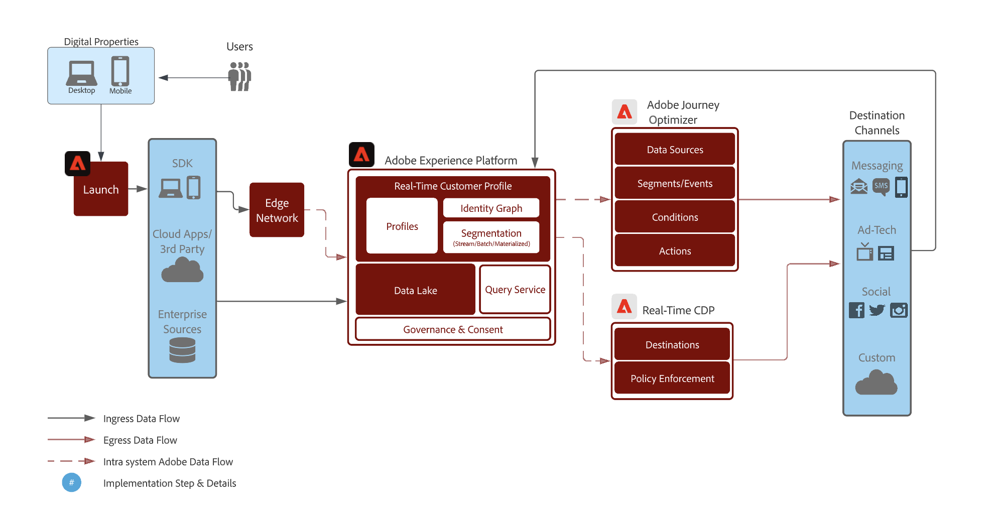
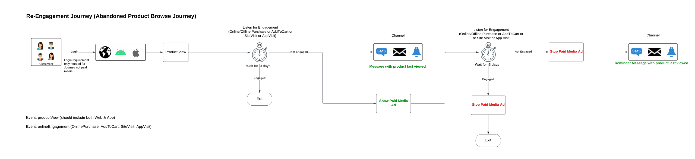
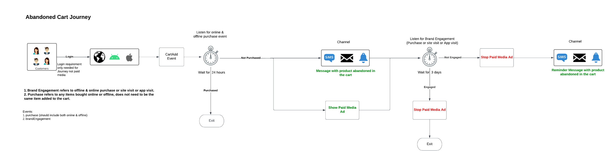
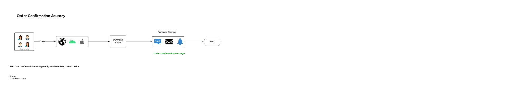

# Engagera kunderna på nytt på ett intelligent sätt för att få dem tillbaka

>[!NOTE]
>
>Detta är ett exempel på implementering, och exempel på den här sidan, som segmentsyntax, är bara exempel. Du bör använda exemplen som vägledning, eftersom implementeringen kan skilja sig åt.

Engagera kunderna på nytt som har övergett konverteringsgraden på ett intelligent och ansvarsfullt sätt. Engagera kunderna med upplevelser för att öka konverteringsgraden och öka kundens livstidsvärde.

Ta hänsyn till kundernas alla egenskaper och beteenden i realtid, ta hänsyn till dem och erbjud snabb omkvalificering baserat på både online- och offlinehändelser.

Nedan finns en avancerad arkitekturvy över de olika komponenterna i Real-Time CDP och Journey Optimizer. I det här diagrammet visas hur data flödar genom de två Experience Platform-apparna från datainsamling till den punkt där de aktiveras via resor eller kampanjer till destinationer, för att uppnå det användningsfall som beskrivs på den här sidan.

## Använd ärendeöversikt {#overview}

Ni kommer att skapa scheman, datauppsättningar och målgrupper när ni arbetar med exempel på återengagemangsscenarier. Du kommer också att upptäcka de funktioner som behövs för att konfigurera exempelresor i [!DNL Adobe Journey Optimizer] och de som behövs för att skapa betalmediereklam i mål. I den här guiden används exempel på hur man återengagerar kunder i de användningsfall som beskrivs nedan:

* **Avbruten produktbläddring** - Rikta in dig på kunder som har avbrutit produktsurfning på både webbplatsen och i mobilappen.
* **Avbrutet kundvagnsscenario** - Rikta kunder som har placerat produkter i kundvagnen men ännu inte köpt dem på både webbplatsen och mobilappen.
* **Orderbekräftelsescenario** - Fokusera på produktköp via webbplatsen och mobilappen.

## Förutsättningar och planering {#prerequisites-and-planning}

När du är klar med implementeringen av användningsexemplet kommer du att använda följande Real-Time CDP- och Adobe Journey Optimizer-funktioner (listade i den ordning som du ska använda dem). Kontrollera att du har de [attributbaserade åtkomstkontrollsbehörigheterna](/help/access-control/home.md) som krävs för alla dessa områden, eller be systemadministratören att ge dig de behörigheter som krävs.

* [[!DNL Adobe Real-Time Customer Data Platform (Real-Time CDP)]](https://experienceleague.adobe.com/docs/platform-learn/tutorials/rtcdp/understanding-the-real-time-customer-data-platform.html?lang=sv-SE) - Integrerar data mellan datakällor för att driva kampanjen. Dessa data används sedan för att skapa kampanjmålgrupper och ta fram personaliserade dataelement som används i e-postmeddelanden och webbkampanjpaneler (till exempel namn eller kontorelaterad information). CDP används också för att aktivera målgrupper via e-post och webben (via [!DNL Adobe Target]).
   * [Scheman](/help/xdm/home.md)
   * [Profiler](/help/profile/home.md)
   * [Datauppsättningar](/help/catalog/datasets/overview.md)
   * [Målgrupper](/help/segmentation/home.md)
   * [[!DNL Adobe Journey Optimizer]](https://experienceleague.adobe.com/docs/journey-optimizer/using/orchestrate-journeys/journey.html?lang=sv-SE)
   * [Mål](/help/destinations/home.md)

* [[!DNL Adobe Journey Optimizer]](https://experienceleague.adobe.com/docs/journey-optimizer-learn/tutorials/introduction-to-journey-optimizer/introduction.html?lang=sv-SE) - Hjälper dig att leverera sammankopplade, kontextuella och personaliserade upplevelser till dina kunder.
   * [Händelse- eller målutlösare](https://experienceleague.adobe.com/docs/journey-optimizer/using/offer-decisioning/collect-event-data/data-collection.html?lang=sv-SE)
   * [Publiker/händelser](https://experienceleague.adobe.com/docs/journey-optimizer/using/audiences-profiles-identities/audiences/about-audiences.html?lang=sv-SE)
   * [Reseåtgärder](https://experienceleague.adobe.com/docs/journey-optimizer/using/orchestrate-journeys/journey.html?lang=sv-SE)

## Hur man uppnår användningsfallet {#achieve-use-case-instruction}

Nedan visas en översikt över de tre exemplen på återengagemang.

>[!BEGINTABS]

>[!TAB Scenario för övergiven produktbläddring]

Det övergivna produktbläddringsscenariot avser övergiven produktbläddring på både webbplatsen och i mobilappen. Detta scenario utlöses när en produkt har visats men inte köpts eller lagts till i kundvagnen. I det här exemplet aktiveras varumärkesengagemanget efter tre dagar om det inte finns några listtillägg under de senaste 24 timmarna.
{width="1920" zoomable="yes"}

1. Du skapar scheman och datauppsättningar och aktiverar sedan för [!UICONTROL Profile].
2. Du kan importera data till Experience Platform via Web SDK, Mobile SDK eller API. Analyser av Source Connector kan också användas, men kan resultera i fördröjning för resan.
3. Du importerar ytterligare profilaktiverade data, som kan länkas till den autentiserade besökaren på webben och i mobilappar via identitetsdiagram.
4. Du bygger fokuserade målgrupper från listan med profiler för att kontrollera om en **kund** har gjort ett engagemang de senaste tre dagarna.
5. Du skapar en övergiven produktbläddringsresa i [!DNL Adobe Journey Optimizer].
6. Om det behövs kan du samarbeta med **datapartnern** för att aktivera målgrupper till önskade betalmediemål.
7. [!DNL Adobe Journey Optimizer] söker efter samtycke och skickar ut de olika konfigurerade åtgärderna.

>[!TAB Avbrutet kundvagnsscenario]

Det övergivna kundvagnsscenariot gäller när produkter har placerats i kundvagnen men ännu inte köpts på både webbplatsen och mobilappen. Betalda mediekampanjer startas och stoppas med den här metoden.
{width="1920" zoomable="yes"}

1. Du skapar scheman och datauppsättningar, aktivera för [!UICONTROL Profile].
2. Du kan importera data till Experience Platform via Web SDK, Mobile SDK eller API. Analyser av Source Connector kan också användas, men kan resultera i fördröjning för resan.
3. Du importerar ytterligare profilaktiverade data, som kan länkas till den autentiserade besökaren på webben och i mobilappar via identitetsdiagram.
4. Du bygger fokuserade målgrupper från listan med profiler för att kontrollera om en **kund** har placerat ett objekt i kundvagnen men inte har slutfört köpet. Händelsen **[!UICONTROL Add to cart]** startar en timer som väntar i 30 minuter och sedan kontrollerar om den finns att köpa. Om inget köp har gjorts läggs **customer** till i **[!UICONTROL Abandon Cart]**-målgrupperna.
5. Du skapar en övergiven kundvagnsresa i [!DNL Adobe Journey Optimizer].
6. Om det behövs kan du samarbeta med **datapartnern** för att aktivera målgrupper till önskade betalmediemål.
7. [!DNL Adobe Journey Optimizer] söker efter samtycke och skickar ut de olika konfigurerade åtgärderna.

>[!TAB Scenario för orderbekräftelse]

Orderbekräftelsescenariot fokuserar på produktinköp som görs via webbplatsen och mobilappen.
{width="1920" zoomable="yes"}

1. Du skapar scheman och datauppsättningar och aktiverar sedan för [!UICONTROL Profile].
2. Du kan importera data till Experience Platform via Web SDK, Mobile SDK eller API. Analyser av Source Connector kan också användas, men kan resultera i fördröjning för resan.
3. Du importerar ytterligare profilaktiverade data, som kan länkas till den autentiserade besökaren på webben och i mobilappar via identitetsdiagram.
4. Du skapar en bekräftelseresa i [!DNL Adobe Journey Optimizer].
5. [!DNL Adobe Journey Optimizer] skickar ett orderbekräftelsemeddelande via den önskade kanalen.

>[!ENDTABS]

Om du vill slutföra varje steg i översikterna ovan kan du läsa igenom avsnitten nedan som innehåller länkar till mer information och mer detaljerade anvisningar.

### Skapa scheman och ange fältgrupper {#schema-design}

Experience Data Model-resurser (XDM) hanteras på arbetsytan [!UICONTROL Schemas] i [!DNL Adobe Experience Platform]. Du kan visa och utforska kärnresurser som tillhandahålls av [!DNL Adobe] (till exempel fältgrupper) och skapa anpassade resurser och scheman för din organisation.

Mer information om hur du skapar [scheman](/help/xdm/home.md) finns i självstudiekursen [Skapa schema.](/help/xdm/tutorials/create-schema-ui.md) och [Modellera dina kundupplevelsedata med XDM](https://experienceleague.adobe.com/docs/courses/using/experienceplatform-d-1-2021-1-xdm.html?lang=sv-SE).

Det finns fyra schemadesigner som används för återanvändning. Varje schema kräver att specifika fält ställs in. Du måste aktivera schemat som ska inkluderas i kundprofilen i realtid. Mer information om hur du aktiverar schemat för användning i kundprofilen i realtid finns i [aktivera ett schema för kundprofil i realtid](/help/xdm/ui/resources/schemas.md#enable-a-schema-for-real-time-customer-profile).

#### Kundattributschema

Det här schemat används för att strukturera och referera till profildata som utgör kundinformationen. Dessa data hämtas vanligtvis till [!DNL Adobe Experience Platform] via ditt CRM-system eller liknande system och är nödvändiga för att referera till kundinformation som används för personalisering, marknadsföringssamtycke och förbättrade målgruppsfunktioner.

Kundattributschemat representeras av en [[!UICONTROL XDM Individual Profile]](/help/xdm/classes/individual-profile.md)-klass, som innehåller följande fältgrupper:

+++Personlig kontaktinformation (fältgrupp)

[Information om personlig kontakt](/help/xdm/field-groups/profile/personal-contact-details.md) är en standardschemafältgrupp för klassen XDM Individual Profile som beskriver kontaktinformationen för en enskild person.

| Fält | Beskrivning |
| --- | --- |
| `mobilePhone.number` | Personens mobiltelefonnummer, som kommer att användas för SMS. |
| `personalEmail.address` | Personens e-postadress. |

+++

+++Extern systemgranskningsinformation för Source (fältgrupp)

[Externa granskningsattribut för Source-system](/help/xdm/data-types/external-source-system-audit-attributes.md) är en XDM-datatyp (Standard Experience Data Model) som samlar in granskningsinformation om ett externt källsystem.

+++

+++Fältgrupper för samtycke och inställning (fältgrupp)

Fältgruppen [Consents and Preferences](/help/xdm/field-groups//profile/consents.md) innehåller ett enda objekttypsfält, samtycke, för att hämta information om samtycke och inställningar.

| Fält | Krav |
| --- | --- |
| `consents.marketing.email.val` | Obligatoriskt |
| `consents.marketing.preferred` | Obligatoriskt |
| `consents.marketing.push.val` | Obligatoriskt |
| `consents.marketing.sms.val` | Obligatoriskt |
| `consents.personalize.content.val` | Obligatoriskt |
| `consents.share.val` | Obligatoriskt |

+++

+++Profiltestinformation (fältgrupp)

Med den här fältgruppen kan du testa din resa innan den publiceras med testprofiler. Mer information om hur du skapar testprofiler finns i självstudiekursen [Skapa testprofiler](https://experienceleague.adobe.com/docs/journeys/using/building-journeys/about-journey-building/creating-test-profiles.html?lang=sv-SE) och [testa självstudiekursen &#x200B;](https://experienceleague.adobe.com/docs/journeys/using/building-journeys/testing-the-journey.html?lang=sv-SE).

+++

#### Kundens digitala transaktionsschema

Det här schemat används för att strukturera och referera till händelsedata som utgör kundaktiviteten på din webbplats eller tillhörande digitala plattformar. Dessa data hämtas vanligtvis in till [!DNL Adobe Experience Platform] via [Web SDK](/help/collection/js/js-overview.md) och är nödvändiga för att referera till olika bläddrings- och konverteringshändelser som används för att utlösa resor, detaljerad kundanalys online, förbättrade målgruppsfunktioner och personaliserade meddelanden.

Kundens digitala transaktionsschema representeras av en [[!UICONTROL XDM ExperienceEvent]](/help/xdm/classes/experienceevent.md)-klass.

+++XDM ExperienceEvent (klass)

Klassen [[!UICONTROL XDM ExperienceEvent]](/help/xdm/classes/experienceevent.md) innehåller följande fältgrupper:

| Fält | Beskrivning |
| --- | --- |
| `_id` | Identifierar unika händelser som är inkapslade i [!DNL Adobe Experience Platform]. |
| `timestamp` | En ISO 8601-tidsstämpel för när händelsen inträffade, formaterad enligt RFC 3339, avsnitt 5.6. Den här tidsstämpeln måste finnas i det förflutna. |
| `eventType` | En sträng som anger händelsens kategorityp. |

+++

+++Information om slutanvändar-ID (fältgrupp)

Fältgruppen [Information om slutanvändar-ID](/help/xdm/field-groups/event/enduserids.md) används för att beskriva en persons identitetsinformation i flera Adobe-program.

| Fält | Beskrivning |
| --- | --- |
| `endUserIDs._experience.emailid.authenticatedState` | Slutanvändarens e-postadress-ID har autentiserats. |
| `endUserIDs._experience.emailid.id` | Slutanvändarens e-postadress-ID. |
| `endUserIDs._experience.emailid.namespace.code` | ID-namnområdeskod för slutanvändarens e-postadress. |
| `endUserIDs._experience.mcid.authenticatedState` | [!DNL Adobe] Marketing Cloud ID (MCID) autentiserad. MCID kallas nu för Experience Cloud ID (ECID). |
| `endUserIDs._experience.mcid.id` | [!DNL Adobe] Marketing Cloud ID (MCID). MCID kallas nu för Experience Cloud ID (ECID). |
| `endUserIDs._experience.mcid.namespace.code` | [!DNL Adobe] Marketing Cloud ID-namnområdeskod (MCID). |

+++

+++Commerce Details (Field Group)

Fältgruppen [Commerce Details](/help/xdm/field-groups/event/commerce-details.md) används för att beskriva handelsdata, t.ex. produktinformation (SKU, namn, kvantitet) och standardkundvagnsåtgärder (beställning, utcheckning, överlåtelse).

| Fält | Beskrivning |
| --- | --- |
| `commerce.cart.cartID` | Ett ID för kundvagnen. |
| `commerce.order.orderType` | Ett objekt som beskriver produktordertypen. |
| `commerce.order.payments.paymentAmount` | Ett objekt som beskriver betalningsbeloppet för produktorder. |
| `commerce.order.payments.paymentType` | Ett objekt som beskriver betalningstypen för produktorder. |
| `commerce.order.payments.transactionID` | Ett transaktions-ID för objektproduktorder. |
| `commerce.order.purchaseID` | Ett objektproduktorderns inköps-ID. |
| `productListItems.name` | En lista med artikelnamn som representerar de produkter som en kund har valt. |
| `productListItems.priceTotal` | Det totala priset på en lista med artiklar som representerar de produkter som kunden har valt. |
| `productListItems.product` | Produkten/produkterna som valts. |
| `productListItems.quantity` | Kvantiteten i en lista över artiklar som representerar de produkter som kunden har valt. |

+++

+++Extern systemgranskningsinformation för Source (fältgrupp)

Externa granskningsattribut för Source-system är en XDM-datatyp (Experience Data Model) som samlar in granskningsinformation om ett externt källsystem.

+++

#### Schema för offlinetransaktioner för kund

Det här schemat används för att strukturera och referera till händelsedata som utgör kundaktiviteten på plattformar utanför webbplatsen. Dessa data importeras vanligtvis till [!DNL Adobe Experience Platform] från en POS (eller liknande system) och direktuppspelas oftast till Experience Platform via en API-anslutning. Syftet är att hänvisa till olika offlinekonverteringshändelser som används för att utlösa resor, djupgående kundanalyser online och offline, förbättrade målgruppsfunktioner och personaliserade meddelanden.

Kundens offlinetransaktionsschema representeras av en [[!UICONTROL XDM ExperienceEvent]](/help/xdm/classes/experienceevent.md)-klass.

+++XDM ExperienceEvent (klass)

Klassen [[!UICONTROL XDM ExperienceEvent]](/help/xdm/classes/experienceevent.md) innehåller följande fältgrupper:

| Fält | Beskrivning |
| --- | --- |
| `_id` | Identifierar unika händelser som är inkapslade i [!DNL Adobe Experience Platform]. |
| `timestamp` | En ISO 8601-tidsstämpel för när händelsen inträffade, formaterad enligt RFC 3339, avsnitt 5.6. Den här tidsstämpeln måste finnas i det förflutna. |
| `eventType` | En sträng som anger händelsens kategorityp. |

+++

+++Commerce Details (Field Group)

Fältgruppen [Commerce Details](/help/xdm/field-groups/event/commerce-details.md) används för att beskriva handelsdata, t.ex. produktinformation (SKU, namn, kvantitet) och standardkundvagnsåtgärder (beställning, utcheckning, överlåtelse).

| Fält | Beskrivning |
| --- | --- |
| `commerce.cart.cartID` | Ett ID för kundvagnen. |
| `commerce.order.orderType` | Ett objekt som beskriver produktordertypen. |
| `commerce.order.payments.paymentAmount` | Ett objekt som beskriver betalningsbeloppet för produktorder. |
| `commerce.order.payments.paymentType` | Ett objekt som beskriver betalningstypen för produktorder. |
| `commerce.order.payments.transactionID` | Ett transaktions-ID för objektproduktorder. |
| `commerce.order.purchaseID` | Ett objektproduktorderns inköps-ID. |
| `productListItems.name` | En lista med artikelnamn som representerar de produkter som en kund har valt. |
| `productListItems.priceTotal` | Det totala priset på en lista med artiklar som representerar de produkter som kunden har valt. |
| `productListItems.product` | Produkten/produkterna som valts. |
| `productListItems.quantity` | Kvantiteten i en lista över artiklar som representerar de produkter som kunden har valt. |

+++

+++Personlig kontaktinformation (fältgrupp)

[Information om personlig kontakt](/help/xdm/field-groups/profile/personal-contact-details.md) är en standardschemafältgrupp för klassen XDM Individual Profile som beskriver kontaktinformationen för en enskild person.

| Fält | Beskrivning |
| --- | --- |
| `mobilePhone.number` | Personens mobiltelefonnummer, som kommer att användas för SMS. |
| `personalEmail.address` | Personens e-postadress. |

+++

+++Extern systemgranskningsinformation för Source (fältgrupp) 

Externa granskningsattribut för Source-system är en XDM-datatyp (Experience Data Model) som samlar in granskningsinformation om ett externt källsystem.

+++

#### Adobe webbanslutningsschema

>[!NOTE]
>
>Detta är en valfri implementering om du använder [[!DNL Adobe Analytics Source Connector]](/help/sources/connectors/adobe-applications/analytics.md).

Det här schemat används för att strukturera och referera till händelsedata som utgör kundaktiviteten på din webbplats eller tillhörande digitala plattformar. Det här schemat liknar kundens schema för digitala transaktioner, men skiljer sig åt på så sätt att det är avsett att användas när [Web SDK](/help/collection/js/js-overview.md) inte är ett alternativ för datainsamling. Det här schemat behövs därför när du använder [!DNL Adobe Analytics Source Connector] för att skicka dina onlinedata till [!DNL Adobe Experience Platform] antingen som ett primärt eller sekundärt datastam.

Webbanslutningsschemat [!DNL Adobe] representeras av en [[!UICONTROL XDM ExperienceEvent]](/help/xdm/classes/experienceevent.md)-klass.

+++XDM ExperienceEvent (klass)

Klassen [[!UICONTROL XDM ExperienceEvent]](/help/xdm/classes/experienceevent.md) innehåller följande fältgrupper:

| Fält | Beskrivning |
| --- | --- |
| `_id` | Identifierar unika händelser som är inkapslade i [!DNL Adobe Experience Platform]. |
| `timestamp` | En ISO 8601-tidsstämpel för när händelsen inträffade, formaterad enligt RFC 3339, avsnitt 5.6. Den här tidsstämpeln måste finnas i det förflutna. |
| `eventType` | En sträng som anger händelsens kategorityp. |

+++

+++Adobe Analytics ExperienceEvent-mall (fältgrupp)

Fältgruppen [Adobe Analytics ExperienceEvent](/help/xdm/field-groups/event/analytics-full-extension.md) samlar in vanliga mätvärden som samlas in av Adobe Analytics.

| Fält | Beskrivning |
| --- | --- |
| `endUserIDs._experience.emailid.authenticatedState` | Slutanvändarens e-postadress-ID har autentiserats. |
| `endUserIDs._experience.emailid.id` | Slutanvändarens e-postadress-ID. |
| `endUserIDs._experience.emailid.namespace.code` | ID-namnområdeskod för slutanvändarens e-postadress. |
| `endUserIDs._experience.mcid.authenticatedState` | [!DNL Adobe] Marketing Cloud ID (MCID) autentiserad. MCID kallas nu för Experience Cloud ID (ECID). |
| `endUserIDs._experience.mcid.id` | [!DNL Adobe] Marketing Cloud ID (MCID). MCID kallas nu för Experience Cloud ID (ECID). |
| `endUserIDs._experience.mcid.namespace.code` | [!DNL Adobe] Marketing Cloud ID-namnområdeskod (MCID). |

+++

+++Extern systemgranskningsinformation för Source (fältgrupp)

Externa granskningsattribut för Source-system är en XDM-datatyp (Experience Data Model) som samlar in granskningsinformation om ett externt källsystem.

+++

### Skapa en datauppsättning från ett schema {#create-datasets}

En datauppsättning är en lagrings- och hanteringsstruktur för en grupp med data. Varje schema för intelligenta scenarier för återengagemang bör ha en egen datauppsättning.

Mer information om hur du skapar en [datauppsättning](/help/catalog/datasets/overview.md) från ett schema finns i [gränssnittshandboken för datauppsättningar](/help/catalog/datasets/user-guide.md).

>[!NOTE]
>
>På samma sätt som när du skapar ett schema måste du aktivera datauppsättningen som ska inkluderas i kundprofilen i realtid. Mer information om hur du aktiverar datauppsättningen för användning i kundprofilen i realtid finns i självstudiekursen om [att föra in data i kundprofilen i realtid](https://experienceleague.adobe.com/docs/platform-learn/tutorials/profiles/bring-data-into-the-real-time-customer-profile.html?lang=sv-SE).

### Samtycke- och datahantering {#privacy-consent}

>[!IMPORTANT]
>
>Ett juridiskt krav är att ge kunderna möjlighet att säga upp prenumerationen på information från ett varumärke och att se till att detta val respekteras. Läs mer om gällande lagstiftning i [Översikt över sekretesslagstiftning](https://experienceleague.adobe.com/docs/experience-platform/privacy/regulations/overview.html?lang=sv-SE).

#### Samtyckesprinciper

När du skapar en sökväg för återengagemang bör du överväga att lägga till följande [medgivandeprinciper](https://experienceleague.adobe.com/docs/platform-learn/data-collection/web-sdk/consent/overview.html?lang=sv-SE):

* Om `consents.marketing.email.val = "Y"` kan du skicka e-post
* Om `consents.marketing.sms.val = "Y"` så kan SMS
* Om `consents.marketing.push.val = "Y"` kan du trycka
* Om `consents.share.val = "Y"` kan annonsera

#### Märken och verkställighet av datastyrning

När du skapar en sökväg för återengagemang bör du överväga att lägga till följande [etiketter för datastyrning](/help/data-governance/labels/overview.md):

* Personliga e-postadresser används som direkt identifierbara data som används för att identifiera eller komma i kontakt med en viss individ i stället för en enhet.
   * `personalEmail.address = I1`

#### Dataanvändningspolicyer

Det finns inga [dataanvändningsprinciper](/help/data-governance/policies/overview.md) som krävs för det övergivna produktbläddringsscenariot. Du bör dock tänka på följande:

* Begränsa känsliga data
* Begränsa Advertising på plats
* Begränsa e-postmålning
* Begränsa mål för flera webbplatser
* Begränsa kombinationen av direkt identifierbara data med anonyma data

### Skapa målgrupper {#create-audience}

Omengagemangsscenarierna använder målgrupper för att definiera specifika attribut eller beteenden som delas av en deluppsättning profiler från din profilbutik för att skilja en marknadsföringsbar grupp av människor från er kundbas. Publiker kan skapas på flera sätt i [!DNL Adobe Experience Platform].

Mer information om hur du skapar en målgrupp finns i [användargränssnittsguiden för målgruppstjänsten](https://experienceleague.adobe.com/docs/experience-platform/segmentation/ui/overview.html?lang=sv-SE#create-audience).

Mer information om hur du komponerar [publiker](/help/segmentation/home.md) direkt finns i [Användargränssnittsguiden för målgruppskomposition](/help/segmentation/ui/audience-composition.md).

Mer information om hur du bygger målgrupper med hjälp av Experience Platform-härledda målgruppsdefinitioner finns i [användargränssnittshandboken för Audience Builder](/help/segmentation/ui/segment-builder.md).

>[!BEGINTABS]

>[!TAB Scenario för övergiven produktbläddring]

Den här målgruppen har skapats som en förbättring av det klassiska&quot;Cart Abandonment&quot;-scenariot. Medan kundvagnsuppsägning vanligtvis fokuserar på ett kundvagnstillägg utan att man behöver göra ett senare inköp under en viss tidsperiod, letar denna målgrupp efter ett tidigare engagemang, särskilt de som har bläddrat efter en viss produkt men inte lagt till den i kundvagnen och inte haft någon uppföljningsaktivitet på er webbplats inom en viss tidsperiod. Den här målgruppen ser till att ert varumärke&quot;ligger överst&quot; för kunder som uppfyller detta inkluderingskriterier och kan även utnyttjas för kunder vars digitala egenskaper kan skilja sig från en traditionell e-handelsmodell.

+++Övergiven produktvy utan engagemang de senaste tre dagarna

Följande händelse används för det övergivna produktbläddringsscenariot där användarna visade produkter online och inte deltog (webbplatsbesök, appbesök, onlineköp, offlineköp och tillägg i kundvagnshändelser) under de tre följande dagarna.

Följande fält och villkor krävs när du konfigurerar den här målgruppen:

* `eventType: commerce.productViews`
* Och `THEN` (sekventiell händelse) exkluderar `eventType: commerce.productListAdds` AND `application.launch` AND `web.webpagedetails.pageViews` AND `commerce.purchases` (detta inkluderar både online och offline)
   * `Timestamp: > 3 days after productView`
* `Timestamp: > 4 days`

+++

+++Produktvy med engagemang de senaste tre dagarna

Följande händelse används för det övergivna produktbläddringsscenariot, där användarna visade produkter online, och engagerade sig (webbplatsbesök, appbesök, onlineköp, offlineköp och tillägg i kundvagnshändelser) under de tre följande dagarna.

Följande fält och villkor krävs när du konfigurerar den här målgruppen:

* `eventType: commerce.productViews`
* Och `THEN` (sekventiell händelse) innehåller `eventType: commerce.productListAdds` OR `application.launch` ELLER `web.webpagedetails.pageViews` OR `commerce.purchases` (detta omfattar både online och offline)
   * `Timestamp: > 3 days after productView`
* `Timestamp: > 4 days`
+++

+++Engagemangsströmning den senaste dagen

Följande händelse används för det övergivna produktbläddringsscenariot där användarna har varit engagerade (webbplatsbesök, appbesök, onlineköp, offlineköp och tillägg i kundvagnshändelser) under den senaste dagen.

Följande fält och villkor krävs när du konfigurerar den här målgruppen:

* `eventType: commerce.productListAdds OR application.launch OR web.webpagedetails.pageViews OR commerce.purchases`
   * `Timestamp: in last 1 day` (direktuppspelning)

+++

+++Engagemangsgrupp de senaste tre dagarna

Följande händelse används för det övergivna produktbläddringsscenariot där användarna har varit engagerade (webbplatsbesök, appbesök, onlineköp, offlineköp och tillägg i kundvagnshändelser) de senaste tre dagarna.

Följande fält och villkor krävs när du konfigurerar den här målgruppen:

* `EventType: commerce.productListAdds OR application.launch OR web.webpagedetails.pageViews OR commerce.purchases`
   * `Timestamp: in last 3 days` (Gruppera)

+++

>[!TAB Avbrutet kundvagnsscenario]

Den här målgruppen har skapats för att stödja det klassiska&quot;Cart Abandonment&quot;-scenariot. Syftet är att hitta kunder som har lagt till en produkt i kundvagnen men i slutändan inte har lyckats med ett köp. Den här målgruppen hjälper er att inte bara hålla ert varumärke&quot;högst i sinnet&quot; för era kunder, utan även de produkter de lämnade utan ett efterföljande köp.

Följande händelser används för det övergivna kundvagnsscenariot där användarna lade till en produkt i kundvagnen för 1-4 dagar sedan, men inte slutförde köpet eller rensade kundvagnen.

Följande fält och villkor krävs när du konfigurerar den här målgruppen:

* `eventType: commerce.productListAdds`
   * `Timestamp: >= 1 days before now AND <= 4 days before now`
* `eventType: commerce.purchases`
   * `Timestamp: <= 4 days before now`
* `eventType: commerce.productListRemovals`
   * `Timestamp: <= 4 days before now`

Beskrivningen för det övergivna kundvagnsscenariot visas som:

`Include eventType = commerce.productListAdds between 30 min and 1440 minutes before now. exclude eventType = commerce.purchases 30 minutes before now OR eventType = commerce.productListRemovals AND Cart ID equals Product List Adds1 Cart ID (the inclusion event).`

>[!TAB Scenario för orderbekräftelse]

Den här resan kräver inte att någon målgrupp skapas.

>[!ENDTABS]

### Resekonfiguration i Adobe Journey Optimizer {#journey-setup}

>[!NOTE]
>
>[!DNL Adobe Journey Optimizer] omfattar inte allt som visas i diagrammen. Alla [betalda mediaannonser](/help/destinations/catalog/social/overview.md) skapas i [!UICONTROL Destinations].

[[!DNL Adobe Journey Optimizer]](https://experienceleague.adobe.com/docs/journey-optimizer/using/orchestrate-journeys/journey.html?lang=sv-SE) hjälper dig att leverera sammankopplade, kontextuella och personaliserade upplevelser till dina kunder. Kundresan är hela processen för en kunds interaktioner med varumärket. Varje användningsfallsresa kräver specifik information. Nedan finns de exakta data som behövs för varje resa.

>[!BEGINTABS]

>[!TAB Scenario för övergiven produktbläddring]

Det övergivna produktbläddringsscenariot avser övergiven produktbläddring på både webbplatsen och i mobilappen.
{width="1920" zoomable="yes"}

+++Händelser

Med händelser kan ni utlösa era resor helt och hållet för att skicka meddelanden i realtid till den person som flyger in på resan. Mer information om händelser finns i [guiden för allmänna händelser](https://experienceleague.adobe.com/docs/journey-optimizer/using/orchestrate-journeys/about-journey-building/general-events.html?lang=sv-SE).

* Händelse 1: Produktvyer
   * Schema: Digitala kundtransaktioner
   * Fält:
      * `eventType`
   * Villkor:
      * `eventType = commerce.productViews`
      * Fält:
         * `eventType`
         * `productListItems.name`
         * `productListItems.priceTotal`
         * `productListItems.product`
         * `productListItems.productImageUrl`
         * `productListItems.quantity`
         * `timestamp`
         * `endUserIDs._experience.emailid.authenticatedState`
         * `endUserIDs._experience.emailid.id`
         * `endUserIDs._experience.emailid.namespace.code`
         * `_id`

* Händelse 2: Lägg i kundvagnen
   * Schema: Digitala kundtransaktioner
   * Fält:
      * `eventType`
   * Villkor:
      * `eventType = commerce.productListAdds`
      * Fält:
         * `commerce.productListAdds.id`
         * `commerce.productListAdds.value`
         * `eventType`
         * `identityMap.authenticatedState`
         * `identityMap.id`
         * `identityMap.primary`
         * `productListItems.SKU`
         * `productListItems.currencyCode`
         * `productListItems.name`
         * `productListItems.priceTotal`
         * `productListItems.product`
         * `productListItems.productImageUrl`
         * `productListItems.quantity`
         * `timestamp`
         * `commerce.cart.cartID`
         * `endUserIDs._experience.emailid.authenticatedState`
         * `endUserIDs._experience.emailid.id`
         * `endUserIDs._experience.emailid.namespace.code`
         * `_id`

* Händelse 3: Varumärkesengagemang
   * Schema: Digitala kundtransaktioner
   * Fält:
      * `eventType`
   * Villkor:
      * `eventType in application.launch, commerce.purchases, web.webpagedetails.pageViews`
      * Fält:
         * `eventType`
         * `identityMap.authenticatedState`
         * `identityMap.id`
         * `identityMap.primary`
         * `productListItems.SKU`
         * `productListItems.currencyCode`
         * `productListItems.name`
         * `productListItems.priceTotal`
         * `productListItems.product`
         * `productListItems.productImageUrl`
         * `productListItems.quantity`
         * `timestamp`
         * `web.webpagedetails.URL`
         * `web.webpagedetails.isHomePage`
         * `web.webpagedetails.name`
         * `endUserIDs._experience.emailid.authenticatedState`
         * `endUserIDs._experience.emailid.id`
         * `endUserIDs._experience.emailid.namespace.code`
         * `_id`
         * `commerce.purchases.id`
         * `commerce.purchases.value`
         * `shipping.address.city`
         * `shipping.address.countryCode`
         * `shipping.address.postalCode`
         * `shipping.address.state`
         * `shipping.address.street1`
         * `shipping.address.street2`
         * `shipping.shipDate`
         * `shipping.trackingNumber`
         * `shipping.trackingURL`

+++

+++Nyckellogik för arbetsytan på resan

Nyckellogiken för arbetsytan på resan kräver att du identifierar specifika händelser och konfigurerar åtgärder som ska utföras efter att händelsen har inträffat.

* Inmatningslogik för resebidrag
   * Produktvyhändelse

* Villkor
   * Kontrollera om det finns minst en köphändelse online eller offline sedan produkten senast visades.
      * Schema: Digitala kundtransaktioner
      * `eventType = commerce.purchases`
      * `timestamp > timestamp of product last viewed`

   * Sök efter minst ett offlineköp sedan produkten senast visades:
      * Schema: Kundoffline-transaktioner
      * `eventType = commerce.purchases`
      * `timestamp > timestamp of product last viewed`

   * Villkor - Välj målkanal
      * E-post
         * `consents.marketing.email.val = y`
      * Push
         * `consents.marketing.push.val=y`
      * SMS
         * `consents.marketing.sms.val = y`

   * Channel Personalization
      * Personaliserat kanalinnehåll baserat på produktvy.

+++

>[!TAB Avbrutet kundvagnsscenario]

Det övergivna kundvagnsscenariot avser produkter som har placerats i kundvagnen men ännu inte köpts på både webbplatsen och mobilappen.
{width="1920" zoomable="yes"}

+++Händelser

Med händelser kan ni utlösa era resor helt och hållet för att skicka meddelanden i realtid till den person som flyger in på resan. Mer information om händelser finns i [guiden för allmänna händelser](https://experienceleague.adobe.com/docs/journey-optimizer/using/orchestrate-journeys/about-journey-building/general-events.html?lang=sv-SE).

* Händelse 2: Lägg i kundvagnen
   * Schema: Digitala kundtransaktioner
   * Fält:
      * `eventType`
   * Villkor:
      * `eventType = commerce.productListAdds`
      * Fält:
         * `commerce.productListAdds.id`
         * `commerce.productListAdds.value`
         * `eventType`
         * `identityMap.authenticatedState`
         * `identityMap.id`
         * `identityMap.primary`
         * `productListItems.SKU`
         * `productListItems.currencyCode`
         * `productListItems.name`
         * `productListItems.priceTotal`
         * `productListItems.product`
         * `productListItems.productImageUrl`
         * `productListItems.quantity`
         * `timestamp`
         * `commerce.cart.cartID`
         * `endUserIDs._experience.emailid.authenticatedState`
         * `endUserIDs._experience.emailid.id`
         * `endUserIDs._experience.emailid.namespace.code`
         * `_id`

* Evenemang 4: Onlineköp
   * Schema: Digitala kundtransaktioner
   * Fält:
      * `eventType`
   * Villkor:
      * `eventType = commerce.purchases`
      * Fält:
         * `commerce.purchases.id`
         * `commerce.purchases.value`
         * `eventType`
         * `identityMap.authenticatedState`
         * `identityMap.id`
         * `identityMap.primary`
         * `productListItems.SKU`
         * `productListItems.currencyCode`
         * `productListItems.name`
         * `productListItems.priceTotal`
         * `productListItems.product`
         * `productListItems.productImageUrl`
         * `productListItems.quantity`
         * `timestamp`
         * `endUserIDs._experience.emailid.authenticatedState`
         * `endUserIDs._experience.emailid.id`
         * `endUserIDs._experience.emailid.namespace.code`
         * `_id`

* Händelse 3: Varumärkesengagemang
   * Schema: Digitala kundtransaktioner
   * Fält:
      * `eventType`
   * Villkor:
      * `eventType in application.launch, commerce.purchases, web.webpagedetails.pageViews`
      * Fält:
         * `eventType`
         * `identityMap.authenticatedState`
         * `identityMap.id`
         * `identityMap.primary`
         * `productListItems.SKU`
         * `productListItems.currencyCode`
         * `productListItems.name`
         * `productListItems.priceTotal`
         * `productListItems.product`
         * `productListItems.productImageUrl`
         * `productListItems.quantity`
         * `timestamp`
         * `web.webpagedetails.URL`
         * `web.webpagedetails.isHomePage`
         * `web.webpagedetails.name`
         * `endUserIDs._experience.emailid.authenticatedState`
         * `endUserIDs._experience.emailid.id`
         * `endUserIDs._experience.emailid.namespace.code`
         * `_id`
         * `commerce.purchases.id`
         * `commerce.purchases.value`
         * `shipping.address.city`
         * `shipping.address.countryCode`
         * `shipping.address.postalCode`
         * `shipping.address.state`
         * `shipping.address.street1`
         * `shipping.address.street2`
         * `shipping.shipDate`
         * `shipping.trackingNumber`
         * `shipping.trackingURL`

+++

+++Nyckellogik för arbetsytan på resan

Nyckellogiken för arbetsytan på resan kräver att du identifierar specifika händelser och konfigurerar åtgärder som ska utföras efter att händelsen har inträffat.

* Inmatningslogik för resebidrag
   * Händelsen `AddToCart`

* AuthenticatedState in authenticated

* Villkor: Offlineköp sedan vagnen senast övergavs:
   * Schema: Kundoffline-transaktioner
   * `eventType = commerce.purchases`
   * `timestamp > timestamp of cart was last abandoned`

* Villkor: vagnen har rensats sedan vagnen senast övergavs:
   * Schema: Digitala kundtransaktioner
   * `eventType = commerce.cartCleared`
   * `cartID` (ID för vagnen)
   * `timestamp > timestamp of cart was last abandoned`

* Välj målkanal (markera en eller flera kanaler för bredare räckvidd)
   * E-post
      * `consents.marketing.email.val = y`
   * Push
      * `consents.marketing.push.val = y`
   * SMS
      * `consents.marketing.sms.val = y`
   * Channel Personalization
      * Visa kundvagnsinformation och kan visa flera produkter i ett tabellformat.

+++

>[!TAB Scenario för orderbekräftelse]

Orderbekräftelsescenariot fokuserar på produktinköp som görs via webbplatsen och mobilappen.
{width="1920" zoomable="yes"}

+++Händelser

Med händelser kan ni utlösa era resor helt och hållet för att skicka meddelanden i realtid till den person som flyger in på resan. Mer information om händelser finns i [guiden för allmänna händelser](https://experienceleague.adobe.com/docs/journey-optimizer/using/orchestrate-journeys/about-journey-building/general-events.html?lang=sv-SE).

* Evenemang 4: Onlineköp
   * Schema: Digitala kundtransaktioner
   * Fält:
      * `eventType`
   * Villkor:
      * `eventType = commerce.purchases`
      * Fält:
         * `commerce.purchases.id`
         * `commerce.purchases.value`
         * `eventType`
         * `identityMap.authenticatedState`
         * `identityMap.id`
         * `identityMap.primary`
         * `productListItems.SKU`
         * `productListItems.currencyCode`
         * `productListItems.name`
         * `productListItems.priceTotal`
         * `productListItems.product`
         * `productListItems.productImageUrl`
         * `productListItems.quantity`
         * `timestamp`
         * `endUserIDs._experience.emailid.authenticatedState`
         * `endUserIDs._experience.emailid.id`
         * `endUserIDs._experience.emailid.namespace.code`
         * `_id`

+++

+++Nyckellogik för arbetsytan på resan

Nyckellogiken för arbetsytan på resan kräver att du identifierar specifika händelser och konfigurerar åtgärder som ska utföras efter att händelsen har inträffat.

* Inmatningslogik för resebidrag
   * Orderhändelse

* Villkor
   * Välj Målkanal (markera en eller flera kanaler för större räckvidd).
      * Orderbekräftelsen anses vara till sin natur, så det är oftast inte nödvändigt att kontrollera samtycke.
      * E-post
      * Push
      * SMS

   * Channel Content Personalization
      * Visa information om orderdetaljer och kan visa en lista med produkter i ett tabellformat.

+++

>[!ENDTABS]

Mer information om hur du skapar resor i [!DNL Adobe Journey Optimizer] finns i guiden [Kom igång med resor](https://experienceleague.adobe.com/docs/journey-optimizer/using/orchestrate-journeys/journey.html?lang=sv-SE).

### Konfigurera annonser för betalda medier i destinationer {#paid-media-ads}

Målramverket används för annonser i betalda medier. När samtycke har checkats ut skickas det till de olika konfigurerade destinationerna. Mer information om mål finns i dokumentet [Destinationsöversikt](/help/destinations/home.md).

#### Data som krävs för destinationer

Direktuppspelande målgruppsexportdestinationer (som Facebook, Google Customer Match, Google DV360) stöder olika identiteter från kunddata:

* `personalEmail.address`
* `ECID`
* `mobilePhone.number`

Du kan aktivera övergiven produktbläddring och överge kundvagnsmålgrupper till betalda mediereklam.

* Strömma/utlöst
   * [Advertising](/help/destinations/catalog/advertising/overview.md)/[Betalda media och sociala medier](/help/destinations/catalog/social/overview.md)
   * [Mobil](/help/destinations/catalog/mobile-engagement/overview.md)
   * [Direktuppspelningsmål](/help/destinations/catalog/streaming/http-destination.md)
   * [Anpassat mål som skapats med Destination SDK.](/help/destinations/destination-sdk/overview.md). Om du använder Real-Time CDP Ultimate kan du även skapa ett privat [anpassat mål med Destination SDK](/help/destinations/destination-sdk/overview.md#productized-and-custom-integrations)

## Nästa steg {#next-steps}

Genom att återengagera de kunder som övergett en konvertering på ett intelligent och ansvarsfullt sätt har ni förhoppningsvis ökat konverteringsgraden och ökat kundens livstidsvärde.

Därefter kan du utforska andra användningsfall som stöds av Real-Time CDP, till exempel [visa anpassat innehåll för oautentiserade användare](/help/rtcdp/partner-data/onsite-personalization.md) i dina webbegenskaper.
