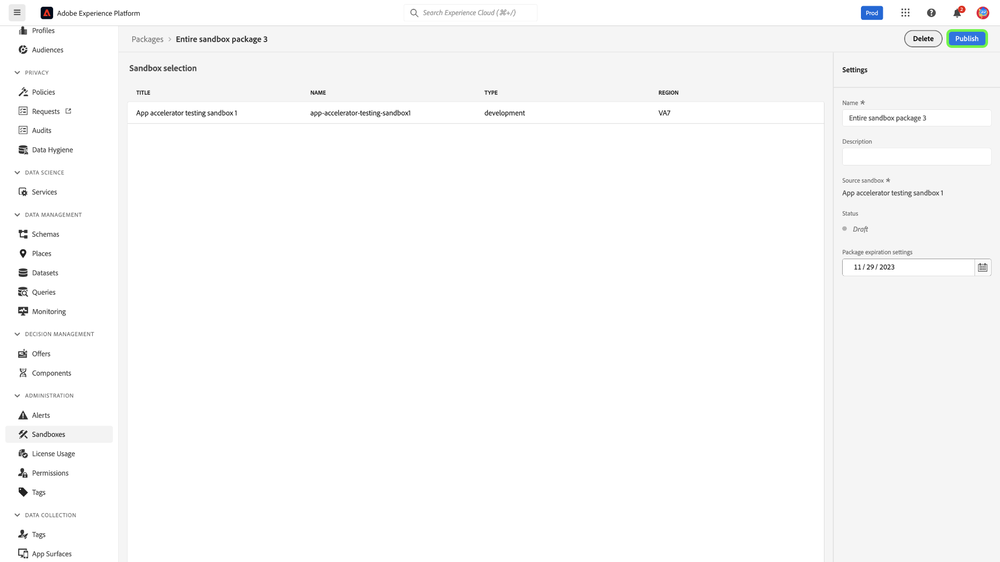

# Verktyg i sandlådan

>[!NOTE]
>
>Verktyg i sandlådan är en grundläggande funktion som har stöd för båda [!DNL Real-Time Customer Data Platform] och [!DNL Journey Optimizer] för att förbättra utvecklingscykelns effektivitet och konfigurationsnoggrannheten.  Du måste ha följande två rollbaserade behörigheter för åtkomstkontroll för att kunna använda sandlådeverktygen: - `manage-sandbox` eller `view-sandbox` - `manage-package`

Förbättra konfigurationsnoggrannheten över sandlådor och exportera och importera smidigt sandlådekonfigurationer mellan sandlådor med sandlådeverktygen. Använd sandlådeverktyg för att minska tidsåtgången för implementeringsprocessen och flytta framgångsrika konfigurationer mellan sandlådor.

Du kan använda sandlådeverktygen för att markera olika objekt och exportera dem till ett paket. Ett paket kan bestå av ett eller flera objekt. <!--or an entire sandbox.-->Alla objekt som ingår i ett paket måste komma från samma sandlåda.

## Objekt som stöds för sandlådeverktyg {#supported-objects}

Verktygsfunktionen i sandlådan ger dig möjlighet att exportera [!DNL Adobe Real-Time Customer Data Platform] och [!DNL Adobe Journey Optimizer] till ett paket.

### Real-time Customer Data Platform-objekt {#real-time-cdp-objects}

Tabellen nedan listar [!DNL Adobe Real-Time Customer Data Platform] objekt som för närvarande stöds för sandlådeverktyg:

| Plattform | Objekt | Information |
| --- | --- | --- |
| Kunddataplattform | Källor | Källkontots autentiseringsuppgifter replikeras inte i målsandlådan av säkerhetsskäl och måste uppdateras manuellt. Källdataflödet kopieras som standard i utkaststatus. |
| Kunddataplattform | Målgrupper | Endast **[!UICONTROL Customer Audience]** type **[!UICONTROL Segmentation service]** stöds. Befintliga etiketter för samtycke och styrning kopieras över i samma importjobb. Systemet väljer automatiskt standardsammanslagningsprincip i målsandlådan med samma XDM-klass när kopplingsprincipberoenden kontrolleras. |
| Kunddataplattform | Identiteter | Systemet deduplicerar Adobe standardnamnutrymmen för identiteter automatiskt när det skapas i målsandlådan. Publiker kan bara kopieras när alla attribut i målgruppsreglerna är aktiverade i unionsschemat. De scheman som behövs måste först flyttas och aktiveras för en enhetlig profil. |
| Kunddataplattform | Scheman | Befintliga etiketter för samtycke och styrning kopieras över i samma importjobb. Användaren kan importera scheman utan att alternativet för enhetlig profil är aktiverat. Kantfallet för schemarelationer inkluderas inte i paketet. |
| Kunddataplattform | Datauppsättningar | Datauppsättningar kopieras med den enhetliga profilinställningen inaktiverad som standard. |
| Kunddataplattform | Samtycke- och styrningsprinciper | Lägg till anpassade profiler som skapats av en användare i ett paket och flytta dem mellan sandlådor. |

Följande objekt importeras men har statusen Utkast eller Inaktiverat:

| Funktion | Objekt | Status |
| --- | --- | --- |
| Importstatus | Källdataflöde | Utkast |
| Importstatus | Resa | Utkast |
| Enhetlig profil | Datauppsättning | Enhetlig profil inaktiverad |
| Policyer | Datastyrningspolicyer | Handikappade |

### Adobe Journey Optimizer-objekt {#abobe-journey-optimizer-objects}

Tabellen nedan listar [!DNL Adobe Journey Optimizer] objekt som för närvarande stöds för sandlådeverktyg och begränsningar:

| Plattform | Objekt | Information |
| --- | --- | --- |
| [!DNL Adobe Journey Optimizer] | Målgrupp | En målgrupp kan kopieras som ett beroende objekt i reseobjektet. Du kan välja att skapa en ny målgrupp eller återanvända en befintlig i målsandlådan. |
| [!DNL Adobe Journey Optimizer] | Schema | Scheman som används under resan kan kopieras som beroende objekt. Du kan välja att skapa ett nytt schema eller återanvända ett befintligt i målsandlådan. |
| [!DNL Adobe Journey Optimizer] | Kopplingsprincip | Sammanfogningsprinciperna som används under resan kan kopieras som beroende objekt. I målsandlådan **inte** Om du skapar en ny sammanfogningsprincip kan du bara använda en befintlig. |
| [!DNL Adobe Journey Optimizer] | Resa - arbetsytedetaljer | Återgivningen av resan på arbetsytan omfattar objekten på resan, till exempel villkor, åtgärder, händelser, läsning av målgrupper osv., som kopieras. Hoppaktiviteten tas inte med i kopian. |
| [!DNL Adobe Journey Optimizer] | Händelse | Händelser och händelseinformation som används under resan kopieras. Den skapar alltid en ny version i målsandlådan. |
| [!DNL Adobe Journey Optimizer] | Åtgärd | E-post och push-meddelanden som används under resan kan kopieras som beroende objekt. Kanalåtgärdsaktiviteterna som används i resefälten, som används för personalisering i meddelandet, kontrolleras inte för fullständighet. Innehållsblock kopieras inte.  Den åtgärd för att uppdatera profil som används under resan kan kopieras. Anpassade åtgärder och åtgärdsinformation som används under resan kopieras också. Den skapar alltid en ny version i målsandlådan. |

Ytor (till exempel förinställningar) kopieras inte över. Systemet väljer automatiskt den närmsta möjliga matchningen i målsandlådan baserat på meddelandetyp och ytnamn. Om det inte finns några ytor i målsandlådan, kommer ytkopian att misslyckas, vilket gör att meddelandekopian misslyckas eftersom ett meddelande kräver att en yta är tillgänglig för konfiguration. I det här fallet måste minst en yta skapas för den högra kanalen i meddelandet för att kopian ska fungera.

Anpassade identitetstyper stöds inte som beroende objekt när en resa exporteras.

## Exportera objekt till ett paket {#export-objects}

>[!NOTE]
>
>Alla exportåtgärder registreras i granskningsloggarna.

>[!CONTEXTUALHELP]
>id="platform_sandbox_tooling_remove_object"
>title="Ta bort ett objekt"
>abstract="Om du vill ta bort ett objekt från paketet markerar du den rad som ska tas bort och använder sedan alternativet Ta bort, som är tillgängligt när du väljer alternativet. Observera att du inte kan ta bort objekt från publicerade paket."

>[!CONTEXTUALHELP]
>id="platform_sandbox_package_expiry"
>title="Förfallotid för paket"
>abstract="Paket förfaller efter en tids inaktivitet i utkaststatus. Standarddatumet är 90 dagar från idag. Datumet ändras inte förrän paketet publiceras. Om du besöker paketet med statusen Utkast i morgon flyttas datumet med +1 dag, såvida du inte ställer in detta manuellt."

>[!CONTEXTUALHELP]
>id="platform_sandbox_tooling_package_status"
>title="Paketstatus"
>abstract="Som standard är statusen Utkast. När paketet har publicerats ändras statusen till publicerad. Inga ändringar kan göras efter att paketet har publicerats."

>[!NOTE]
>
>Du kan bara importera ett paket om du har behörighet att komma åt objekten.

I det här exemplet dokumenteras processen att exportera ett schema och lägga till det i ett paket. Du kan använda samma process för att exportera andra objekt, till exempel datauppsättningar, resor och många andra.

### Lägga till objekt i ett nytt paket {#add-object-to-new-package}

Välj **[!UICONTROL Schemas]** från vänster navigering och sedan väljer du **[!UICONTROL Browse]** som listar tillgängliga scheman. Välj sedan ellipsen (`...`) bredvid det valda schemat och en listruta visar kontroller. Välj **[!UICONTROL Add to package]** i listrutan.

![Lista med scheman som visar listrutemenyn med markering av [!UICONTROL Add to package] kontroll.](../images/ui/sandbox-tooling/add-to-package.png)

Från **[!UICONTROL Add to package]** väljer du **[!UICONTROL Create new package]** alternativ. Ange en [!UICONTROL Name] för ditt paket och [!UICONTROL Description]väljer **[!UICONTROL Add]**.

![The [!UICONTROL Add to package] dialogruta med [!UICONTROL Create new package] markerat och markerat [!UICONTROL Add].](../images/ui/sandbox-tooling/create-new-package.png)

Du kommer tillbaka till **[!UICONTROL Schemas]** miljö. Nu kan du lägga till fler objekt i det paket du skapade genom att följa stegen nedan.

### Lägga till ett objekt i ett befintligt paket och publicera {#add-object-to-existing-package}

Om du vill visa en lista med tillgängliga scheman väljer du **[!UICONTROL Schemas]** från vänster navigering och sedan väljer du **[!UICONTROL Browse]** -fliken. Välj sedan ellipsen (`...`) bredvid det valda schemat för att visa kontrollalternativ i en listruta. Välj **[!UICONTROL Add to package]** i listrutan.

![Lista med scheman som visar listrutemenyn med markering av [!UICONTROL Add to package] kontroll.](../images/ui/sandbox-tooling/add-to-package.png)

The **[!UICONTROL Add to package]** visas. Välj **[!UICONTROL Existing package]** väljer du **[!UICONTROL Package name]** och välj det paket som behövs. Äntligen väljer du **[!UICONTROL Add]** för att bekräfta dina val.

![[!UICONTROL Add to package] visas ett valt paket i listrutan.](../images/ui/sandbox-tooling/add-to-existing-package.png)

Listan med objekt som läggs till i paketet visas. Om du vill publicera paketet och göra det tillgängligt för import till sandlådor väljer du **[!UICONTROL Publish]**.

![En lista med objekt i paketet som markerar [!UICONTROL Publish] alternativ.](../images/ui/sandbox-tooling/publish-package.png)

Välj **[!UICONTROL Publish]** för att bekräfta att paketet ska offentliggöras.

![Bekräftelsedialogrutan för publiceringspaket, markera [!UICONTROL Publish] alternativ.](../images/ui/sandbox-tooling/publish-package-confirmation.png)

>[!NOTE]
>
>När det har publicerats kan paketets innehåll inte ändras. För att undvika kompatibilitetsproblem måste du se till att alla nödvändiga resurser har valts. Om ändringar måste göras måste du skapa ett nytt paket.

Du kommer tillbaka till **[!UICONTROL Packages]** i [!UICONTROL Sandboxes] -miljö, där du kan se det nya publicerade paketet.

## Importera ett paket till en målsandlåda {#import-package-to-target-sandbox}

>[!NOTE]
>
>Alla importåtgärder registreras i granskningsloggarna.

Om du vill importera paketet till en målsandlåda går du till sandlådorna **[!UICONTROL Browse]** och välj plustecknet (+) bredvid namnet på sandlådan.

![Sandlådorna **[!UICONTROL Browse]** som markerar valet av importpaket.](../images/ui/sandbox-tooling/browse-sandboxes.png)

Välj menyn **[!UICONTROL Package name]** du vill importera till målsandlådan. Lägg till en **[!UICONTROL Job name]**, som kommer att användas för framtida övervakning. Som standard inaktiveras den enhetliga profilen när paketets scheman importeras. Växla **Aktivera scheman för profil** för att aktivera detta väljer du **[!UICONTROL Next]**.

![Sidan med importinformation som visar [!UICONTROL Package name] listrutemarkering](../images/ui/sandbox-tooling/import-package-to-sandbox.png)

The [!UICONTROL Package object and dependencies] sidan innehåller en lista med alla resurser som ingår i det här paketet. Systemet identifierar automatiskt beroende objekt som krävs för att importera markerade överordnade objekt. Eventuella attribut som saknas visas högst upp på sidan. Välj **[!UICONTROL View details]** för en mer detaljerad uppdelning.

![The [!UICONTROL Package object and dependencies] sidan visar saknade attribut.](../images/ui/sandbox-tooling/missing-attributes.png)

>[!NOTE]
>
>Beroende objekt kan ersättas med befintliga objekt i målsandlådan, vilket gör att du kan återanvända befintliga objekt i stället för att skapa en ny version. Om du till exempel importerar ett paket som innehåller scheman kan du återanvända befintliga anpassade fältgrupper och identitetsnamnutrymmen i målsandlådan. När du importerar ett paket som innehåller Journeys kan du också återanvända befintliga segment i målsandlådan.

Om du vill använda ett befintligt objekt väljer du pennikonen bredvid det beroende objektet.

![The [!UICONTROL Package object and dependencies] visas en lista med resurser som ingår i paketet.](../images/ui/sandbox-tooling/package-objects-and-dependencies.png)

Alternativen för att skapa nya eller använda befintliga visas. Välj **[!UICONTROL Use existing]**.

![The [!UICONTROL Package object and dependencies] sida med alternativ för beroende objekt [!UICONTROL Create new] och [!UICONTROL Use existing].](../images/ui/sandbox-tooling/use-existing-object.png)

The **[!UICONTROL Field group]** visas en lista med fältgrupper som är tillgängliga för objektet. Markera de fältgrupper som krävs och välj sedan **[!UICONTROL Save]**.

![En lista med fält som visas på [!UICONTROL Field group] dialogruta, markera [!UICONTROL Save] markering. ](../images/ui/sandbox-tooling/field-group-list.png)

Du kommer tillbaka till [!UICONTROL Package object and dependencies] sida. Välj **[!UICONTROL Finish]** för att slutföra paketimporten.

![The [!UICONTROL Package object and dependencies] sidan visar en lista med resurser som ingår i paketet, med markering [!UICONTROL Finish].](../images/ui/sandbox-tooling/finish-object-dependencies.png)

## Exportera och importera en hel sandlåda

>[!NOTE]
>
>För närvarande stöds bara Real-time Customer Data Platform-objekt när du exporterar eller importerar en hel sandlåda. Adobe Journey Optimizer-objekt som resor stöds inte just nu.

Du kan exportera alla objekttyper som stöds till ett fullständigt sandlådepaket och sedan importera paketet mellan olika sandlådor för att replikera objektkonfigurationer. Med den här funktionen kan du till exempel:

- Importera om en sandlåda för att återskapa alla objektets konfigurationer om du behöver återställa sandlådan
- Importera paketet till andra sandlådor och använd det som en blå sandlåda för att snabba upp utvecklingsprocessen.

### Exportera en hel sandlåda {#export-entire-sandbox}

Om du vill exportera en hel sandlåda går du till [!UICONTROL Sandboxes] **[!UICONTROL Packages]** och markera **[!UICONTROL Create package]**.

![The [!UICONTROL Sandboxes] **[!UICONTROL Packages]** tabbmarkering [!UICONTROL Create package].](../images/ui/sandbox-tooling/create-sandbox-package.png)

Välj **[!UICONTROL Entire sandbox]** för [!UICONTROL Type of package] i [!UICONTROL Create package] -dialogrutan. Ange en [!UICONTROL Package name] för ditt nya paket och väljer **[!UICONTROL Sandbox]** i listrutan. Äntligen väljer du **[!UICONTROL Create]** för att bekräfta tävlingsbidragen.

![The [!UICONTROL Create package] dialogruta med ifyllda fält och markering [!UICONTROL Create].](../images/ui/sandbox-tooling/create-package-dialog.png)

Paketet har skapats. Välj **[!UICONTROL Publish]** för att publicera paketet.

Du kommer tillbaka till **[!UICONTROL Packages]** i [!UICONTROL Sandboxes] -miljö, där du kan se det nya publicerade paketet.

### Importera hela sandlådepaketet {#import-entire-sandbox-package}

>[!NOTE]
>
>Alla objekt importeras till målsandlådan som nya objekt. Det är bäst att importera ett fullständigt sandlådepaket till en tom sandlåda.

Om du vill importera paketet till en målsandlåda går du till [!UICONTROL Sandboxes] **[!UICONTROL Browse]** och välj plustecknet (+) bredvid namnet på sandlådan.

![Sandlådorna **[!UICONTROL Browse]** som markerar valet av importpaket.](../images/ui/sandbox-tooling/browse-entire-package-sandboxes.png)

Använd listrutemenyn och markera den fullständiga sandlådan med **[!UICONTROL Package name]** nedrullningsbar meny. Lägg till en **[!UICONTROL Job name]**, som kommer att användas för framtida övervakning och ett valfritt **[!UICONTROL Job description]** väljer **[!UICONTROL Next]**.

![Sidan med importinformation som visar [!UICONTROL Package name] listrutemarkering](../images/ui/sandbox-tooling/import-full-sandbox-package.png)

>[!NOTE]
>
>Du måste ha fullständig behörighet till alla objekt som ingår i paketet. Om du inte har behörighet kommer importen att misslyckas och felmeddelanden visas.

Du kommer till [!UICONTROL Package object and dependencies] sida där du kan se antalet objekt och beroenden som är importerade och exkluderade objekt. Välj **[!UICONTROL Import]** för att slutföra paketimporten.

![The [!UICONTROL Package object and dependencies] sidan visar det textbundna meddelandet om objekttyper som inte stöds, markering [!UICONTROL Import].](../images/ui/sandbox-tooling/finish-dependencies-entire-sandbox.png)

Tillåt en tid för importen att slutföras. Tiden det tar att slutföra kan variera beroende på antalet objekt i paketet. Du kan övervaka importjobbet från [!UICONTROL Sandboxes] **[!UICONTROL Jobs]** -fliken.

## Importinformation för bildskärm {#view-import-details}

Om du vill visa importerad information går du till [!UICONTROL Sandboxes] **[!UICONTROL Jobs]** och väljer paketet i listan. Du kan också använda sökfältet för att söka efter paketet.

![Sandlådorna [!UICONTROL Jobs] -fliken markerar valet av importpaket.](../images/ui/sandbox-tooling/imports-tab.png)

<!--### View imported objects {#view-imported-objects}

On the **[!UICONTROL Jobs]** tab in the [!UICONTROL Sandboxes] environment, select **[!UICONTROL View imported objects]** from the right details pane.

Select **[!UICONTROL View imported objects]** from the right details pane on the **[!UICONTROL Jobs]** tab in the [!UICONTROL Sandboxes] environment.

![The sandboxes [!UICONTROL Imports] tab highlights the [!UICONTROL View imported objects] selection in the right pane.](../images/ui/sandbox-tooling/view-imported-objects.png)

Use the arrows to expand objects to view the full list of fields that have been imported into the package.

![The sandboxes [!UICONTROL Imported objects] showing a list of objects imported into the package.](../images/ui/sandbox-tooling/expand-imported-objects.png)-->

Välj **[!UICONTROL View import summary]** från den högra informationsrutan i **[!UICONTROL Jobs]** i sandlådemiljön.

![Sandlådorna [!UICONTROL Imports] tabbmarkeringar i [!UICONTROL View import details] i den högra rutan.](../images/ui/sandbox-tooling/view-import-details.png)

The **[!UICONTROL Import summary]** visas en fördelning av importen med förlopp i procent.

>[!NOTE]
>
>Du kan visa en lista med objekt genom att navigera till specifika lagersidor.

![The [!UICONTROL Import details] en detaljerad beskrivning av importen.](../images/ui/sandbox-tooling/import-details.png)

När importen är klar visas ett meddelande i användargränssnittet för plattformen. Du kommer åt dessa meddelanden via varningsikonen. Du kan navigera till felsökning härifrån om ett jobb misslyckas.

## Videosjälvstudiekurs

Följande video är avsedd att ge stöd för din förståelse av sandlådeverktyg och visar hur du skapar ett nytt paket, publicerar ett paket och importerar ett paket.

>[!VIDEO](https://video.tv.adobe.com/v/3424763/?learn=on)

## Nästa steg

Det här dokumentet visar hur du använder sandlådeverktygen i användargränssnittet i Experience Platform. Mer information om sandlådor finns i [användarhandbok för sandlåda](../ui/user-guide.md).

Anvisningar om hur du utför olika åtgärder med sandbox-API:t finns i [utvecklarguide för sandlådor](../api/getting-started.md). En översikt över sandlådor i Experience Platform på hög nivå finns i [översiktlig dokumentation](../home.md).
