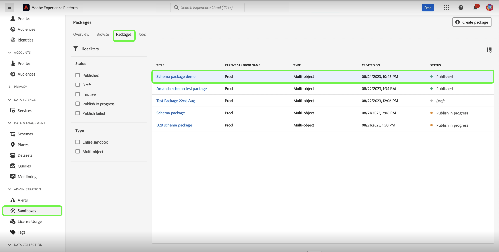

# Verktyg i sandlådan

>[!NOTE]
>
>Sandlådeverktyg är en grundläggande funktion som har stöd för både [!DNL Real-Time Customer Data Platform] och [!DNL Journey Optimizer] för att förbättra utvecklingscykelns effektivitet och konfigurationsnoggrannheten.  Du måste ha följande två rollbaserade åtkomstkontrollsbehörigheter för att kunna använda sandlådeverktygsfunktionen: - `manage-sandbox` eller `view-sandbox` - `manage-package`

Förbättra konfigurationsnoggrannheten över sandlådor och exportera och importera smidigt sandlådekonfigurationer mellan sandlådor med sandlådeverktygen. Använd sandlådeverktyg för att minska tidsåtgången för implementeringsprocessen och flytta framgångsrika konfigurationer mellan sandlådor.

Du kan använda sandlådeverktygen för att markera olika objekt och exportera dem till ett paket. Ett paket kan bestå av ett eller flera objekt. <!--or an entire sandbox.-->Alla objekt som ingår i ett paket måste komma från samma sandlåda.

## Objekt som stöds för sandlådeverktyg {#supported-objects}

Verktygsfunktionen i sandlådan ger dig möjlighet att exportera [!DNL Adobe Real-Time Customer Data Platform]- och [!DNL Adobe Journey Optimizer]-objekt till ett paket.

### Objekt för kunddataplattform i realtid {#real-time-cdp-objects}

Tabellen nedan visar [!DNL Adobe Real-Time Customer Data Platform] objekt som för närvarande stöds för sandlådeverktyg:

| Plattform | Objekt | Information |
| --- | --- | --- |
| Kunddataplattform | Källor | Källkontots autentiseringsuppgifter replikeras inte i målsandlådan av säkerhetsskäl och måste uppdateras manuellt. Källdataflödet kopieras som standard i utkaststatus. |
| Kunddataplattform | Målgrupper | Endast typen **[!UICONTROL Customer Audience]** **[!UICONTROL Segmentation service]** stöds. Befintliga etiketter för samtycke och styrning kopieras över i samma importjobb. Systemet väljer automatiskt standardsammanslagningsprincip i målsandlådan med samma XDM-klass när kopplingsprincipberoenden kontrolleras. |
| Kunddataplattform | Identiteter | Systemet deduplicerar Adobe standardnamnutrymmen för identiteter automatiskt när det skapas i målsandlådan. Publiker kan bara kopieras när alla attribut i målgruppsreglerna är aktiverade i unionsschemat. De scheman som behövs måste först flyttas och aktiveras för en enhetlig profil. |
| Kunddataplattform | Scheman | Befintliga etiketter för samtycke och styrning kopieras över i samma importjobb. Användaren kan importera scheman utan att alternativet för enhetlig profil är aktiverat. Kantfallet för schemarelationer inkluderas inte i paketet. |
| Kunddataplattform | Datauppsättningar | Datauppsättningar kopieras med den enhetliga profilinställningen inaktiverad som standard. |
| Kunddataplattform | Samtycke- och styrningsprinciper | Lägg till anpassade profiler som skapats av en användare i ett paket och flytta dem mellan sandlådor. |

Följande objekt importeras men har statusen Utkast eller Inaktiverat:

| Funktion | Objekt | Status |
| --- | --- | --- |
| Importstatus | Source dataflöde | Utkast |
| Importstatus | Resa | Utkast |
| Enhetlig profil | Datauppsättning | Enhetlig profil inaktiverad |
| Policyer | Datastyrningspolicyer | Handikappade |

### Adobe Journey Optimizer-objekt {#abobe-journey-optimizer-objects}

Tabellen nedan visar [!DNL Adobe Journey Optimizer] objekt som för närvarande stöds för sandlådeverktyg och begränsningar:

| Plattform | Objekt | Beroende objekt som stöds | Information |
| --- | --- | --- | --- |
| [!DNL Adobe Journey Optimizer] | Målgrupp | | En målgrupp kan kopieras som ett beroende objekt i reseobjektet. Du kan välja att skapa en ny målgrupp eller återanvända en befintlig i målsandlådan. |
| [!DNL Adobe Journey Optimizer] | Schema | | Scheman som används under resan kan kopieras som beroende objekt. Du kan välja att skapa ett nytt schema eller återanvända ett befintligt i målsandlådan. |
| [!DNL Adobe Journey Optimizer] | Kopplingsprincip | | Sammanfogningsprinciperna som används under resan kan kopieras som beroende objekt. I målsandlådan **kan du inte** skapa en ny sammanfogningsprincip. Du kan bara använda en befintlig. |
| [!DNL Adobe Journey Optimizer] | Resa | Följande objekt som används under resan kopieras som beroende objekt. Under importarbetsflödet kan du välja **[!UICONTROL Create new]** eller **[!UICONTROL Use existing]** för varje: <ul><li>Målgrupper</li><li>Scheman</li><li>Anpassade åtgärder</li><li>Händelser</li><li>Fragment</li><li>Innehållsmallar</li><li>Arbetsytedetaljer</li></ul> | <ul><li>**[!UICONTROL Custom actions]**: När du väljer **[!UICONTROL Use existing]** under importprocessen när du kopierar en resa till en annan sandlåda, måste de befintliga anpassade åtgärderna du väljer **vara** samma som den anpassade källåtgärden. Om de inte är samma kommer den nya resan att innehålla fel som inte går att lösa.</li><li>Händelser och händelseinformation som används under resan kopieras. Den skapar alltid en ny version i målsandlådan.</li></ul> |
| [!DNL Adobe Journey Optimizer] | Åtgärd | | E-post och push-meddelanden som används under resan kan kopieras som beroende objekt. Kanalåtgärdsaktiviteterna som används i resefälten, som används för personalisering i meddelandet, kontrolleras inte för fullständighet. Innehållsblock kopieras inte.  Åtgärden för att uppdatera profil som används under resan kan kopieras. Anpassade åtgärder kan läggas till i ett paket oberoende av varandra. Åtgärdsinformation som används under resan kopieras också. Den skapar alltid en ny version i målsandlådan. |
| [!DNL Adobe Journey Optimizer] | Anpassade åtgärder |  | Anpassade åtgärder kan läggas till i ett paket oberoende av varandra. När en anpassad åtgärd har tilldelats en resa kan den inte längre redigeras. Om du vill uppdatera anpassade åtgärder bör du: <ul><li>flytta anpassade åtgärder innan en resa migreras</li><li>uppdateringskonfigurationer (till exempel begärandehuvuden, frågeparametrar och autentisering) för anpassade åtgärder efter migrering</li><li>migrera reseobjekt med de anpassade åtgärder du lade till under det första steget</li></ul> |
| [!DNL Adobe Journey Optimizer] | Innehållsmall | | En innehållsmall kan kopieras som ett beroende objekt för reseobjektet. Med fristående mallar kan ni enkelt återanvända anpassat innehåll i Journey Optimizer kampanjer och resor. |
| [!DNL Adobe Journey Optimizer] | Fragment | Alla kapslade fragment. | Ett fragment kan kopieras som ett beroende objekt för reseobjektet. Fragment är återanvändbara komponenter som kan refereras i ett eller flera e-postmeddelanden mellan Journey Optimizer kampanjer och resor. |
| [!DNL Adobe Journey Optimizer] | Kampanjer | Följande objekt som används i kampanjen kopieras som beroende objekt: <ul><li>Kampanjer</li><li>Målgrupper</li><li>Scheman</li><li>Innehållsmallar</li><li>Fragment</li><li>Meddelande/innehåll</li><li>Kanalkonfiguration</li><li>Enhetliga beslutsobjekt</li><li>Experimentera med inställningar/varianter</li></ul> | <ul><li>Kampanjer kan kopieras tillsammans med alla objekt som hör till profilen, målgruppen, schemat, textbundna meddelanden och beroende objekt. Vissa objekt kopieras inte, t.ex. dataanvändningsetiketter och språkinställningar. En fullständig lista över objekt som inte kan kopieras finns i guiden [Exportera objekt till en annan sandlåda](https://experienceleague.adobe.com/sv/docs/journey-optimizer/using/configuration/copy-objects-to-sandbox).</li><li>Systemet identifierar och återanvänder automatiskt ett befintligt kanalkonfigurationsobjekt i målsandlådan om det finns en identisk konfiguration. Om ingen matchande konfiguration hittas hoppas kanalkonfigurationen över under importen, och användare måste uppdatera kanalinställningarna manuellt i målsandlådan för den här resan.</li><li>Användare kan återanvända befintliga experiment och målgrupper i målsandlådan som beroende objekt för valda kampanjer.</li></ul> |

Ytor (till exempel förinställningar) kopieras inte över. Systemet väljer automatiskt den närmsta möjliga matchningen i målsandlådan baserat på meddelandetyp och ytnamn. Om det inte finns några ytor i målsandlådan, kommer ytkopian att misslyckas, vilket gör att meddelandekopian misslyckas eftersom ett meddelande kräver att en yta är tillgänglig för konfiguration. I det här fallet måste minst en yta skapas för den högra kanalen i meddelandet för att kopian ska fungera.

Anpassade identitetstyper stöds inte som beroende objekt när en resa exporteras.

## Exportera objekt till ett paket {#export-objects}

>[!NOTE]
>
>Alla exportåtgärder registreras i granskningsloggarna.

>[!CONTEXTUALHELP]
>id="platform_sandbox_tooling_remove_object"
>title="Ta bort ett objekt"
>abstract="Om du vill ta bort ett objekt från paketet markerar du den rad som ska tas bort och använder sedan alternativet Ta bort, som är tillgängligt när du väljer alternativet. Observera att du inte kan ta bort objekt från publicerade paket."

>[!CONTEXTUALHELP]
>id="platform_sandbox_package_expiry"
>title="Förfallotid för paket"
>abstract="Paket förfaller efter en tids inaktivitet i utkaststatus. Standarddatumet är 90 dagar från idag. Datumet ändras inte förrän paketet publiceras. Om du besöker paketet med statusen Utkast i morgon flyttas datumet med +1 dag, såvida du inte ställer in detta manuellt."

>[!CONTEXTUALHELP]
>id="platform_sandbox_tooling_package_status"
>title="Paketstatus"
>abstract="Som standard är statusen Utkast. När paketet har publicerats ändras statusen till publicerad. Inga ändringar kan göras efter att paketet har publicerats."

>[!NOTE]
>
>Du kan bara importera ett paket om du har behörighet att komma åt objekten.

I det här exemplet dokumenteras processen att exportera ett schema och lägga till det i ett paket. Du kan använda samma process för att exportera andra objekt, till exempel datauppsättningar, resor och många andra.

### Lägga till objekt i ett nytt paket {#add-object-to-new-package}

Välj **[!UICONTROL Schemas]** i den vänstra navigeringen och välj sedan fliken **[!UICONTROL Browse]** som listar tillgängliga scheman. Markera sedan ellipsen (`...`) bredvid det valda schemat och en listruta visar kontroller. Välj **[!UICONTROL Add to package]** i listrutan.

![Lista med scheman som visar listrutan med markering av kontrollen [!UICONTROL Add to package].](../images/ui/sandbox-tooling/add-to-package.png)

Välj alternativet **[!UICONTROL Create new package]** i dialogrutan **[!UICONTROL Add to package]**. Ange en [!UICONTROL Name] för ditt paket och en valfri [!UICONTROL Description] och välj sedan **[!UICONTROL Add]**.

![Dialogrutan [!UICONTROL Add to package] med [!UICONTROL Create new package] markerad och markerad [!UICONTROL Add].](../images/ui/sandbox-tooling/create-new-package.png)

Du återgår till miljön **[!UICONTROL Schemas]**. Nu kan du lägga till fler objekt i det paket du skapade genom att följa stegen nedan.

### Lägga till ett objekt i ett befintligt paket och publicera {#add-object-to-existing-package}

Om du vill visa en lista över tillgängliga scheman väljer du **[!UICONTROL Schemas]** i den vänstra navigeringen och väljer sedan fliken **[!UICONTROL Browse]**. Markera sedan ellipsen (`...`) bredvid det valda schemat för att visa kontrollalternativen i en listruta. Välj **[!UICONTROL Add to package]** i listrutan.

![Lista med scheman som visar listrutan med markering av kontrollen [!UICONTROL Add to package].](../images/ui/sandbox-tooling/add-to-package.png)

Dialogrutan **[!UICONTROL Add to package]** visas. Välj alternativet **[!UICONTROL Existing package]**, markera sedan listrutan **[!UICONTROL Package name]** och välj det paket som krävs. Slutligen väljer du **[!UICONTROL Add]** för att bekräfta dina val.

![[!UICONTROL Add to package]-dialogrutan, visar ett valt paket i listrutan.](../images/ui/sandbox-tooling/add-to-existing-package.png)

Listan med objekt som läggs till i paketet visas. Om du vill publicera paketet och göra det tillgängligt för import till sandlådor väljer du **[!UICONTROL Publish]**.

![En lista med objekt i paketet. [!UICONTROL Publish]-alternativet markeras.](../images/ui/sandbox-tooling/publish-package.png)

Välj **[!UICONTROL Publish]** för att bekräfta publiceringen av paketet.

![Bekräftelsedialogrutan för publiceringspaket, där alternativet [!UICONTROL Publish] markeras.](../images/ui/sandbox-tooling/publish-package-confirmation.png)

>[!NOTE]
>
>När det har publicerats kan paketets innehåll inte ändras. För att undvika kompatibilitetsproblem måste du se till att alla nödvändiga resurser har valts. Om ändringar måste göras måste du skapa ett nytt paket.

Du återgår till fliken **[!UICONTROL Packages]** i miljön [!UICONTROL Sandboxes] där du kan se det nya publicerade paketet.

## Importera ett paket till en målsandlåda {#import-package-to-target-sandbox}

>[!NOTE]
>
>Alla importåtgärder registreras i granskningsloggarna.

Om du vill importera paketet till en mållandlåda går du till fliken Sandlådor **[!UICONTROL Browse]** och väljer plustecknet (+) bredvid namnet på sandlådan.

![Fliken för sandlådor **[!UICONTROL Browse]** markerar valet av importpaket.](../images/ui/sandbox-tooling/browse-sandboxes.png)

Välj den **[!UICONTROL Package name]** som du vill importera till målsandlådan med hjälp av listrutan. Lägg till en **[!UICONTROL Job name]** som kommer att användas för framtida övervakning. Som standard inaktiveras den enhetliga profilen när paketets scheman importeras. Aktivera det här genom att växla **Aktivera scheman för profilen** och sedan välja **[!UICONTROL Next]**.

![Sidan med importinformation som visar [!UICONTROL Package name] listrutemarkeringen ](../images/ui/sandbox-tooling/import-package-to-sandbox.png)

Sidan [!UICONTROL Package object and dependencies] innehåller en lista med alla resurser som ingår i det här paketet. Systemet identifierar automatiskt beroende objekt som krävs för att importera markerade överordnade objekt. Eventuella attribut som saknas visas högst upp på sidan. Välj **[!UICONTROL View details]** om du vill ha en mer detaljerad beskrivning.

![Sidan [!UICONTROL Package object and dependencies] visar saknade attribut.](../images/ui/sandbox-tooling/missing-attributes.png)

>[!NOTE]
>
>Beroende objekt kan ersättas med befintliga objekt i målsandlådan, vilket gör att du kan återanvända befintliga objekt i stället för att skapa en ny version. Om du till exempel importerar ett paket som innehåller scheman kan du återanvända befintliga anpassade fältgrupper och identitetsnamnutrymmen i målsandlådan. När du importerar ett paket som innehåller Journeys kan du också återanvända befintliga segment i målsandlådan.
>
>Sandlådeverktyg har för närvarande inte stöd för uppdatering eller överskrivning av befintliga objekt. Du kan välja att skapa ett nytt objekt eller fortsätta att använda det befintliga objektet utan ändringar.

Om du vill använda ett befintligt objekt väljer du pennikonen bredvid det beroende objektet.

![Sidan [!UICONTROL Package object and dependencies] visar en lista med resurser som ingår i paketet.](../images/ui/sandbox-tooling/package-objects-and-dependencies.png)

Alternativen för att skapa nya eller använda befintliga visas. Välj **[!UICONTROL Use existing]**.

![Sidan [!UICONTROL Package object and dependencies] med alternativ för beroende objekt [!UICONTROL Create new] och [!UICONTROL Use existing].](../images/ui/sandbox-tooling/use-existing-object.png)

Dialogrutan **[!UICONTROL Field group]** visar en lista med fältgrupper som är tillgängliga för objektet. Markera de fältgrupper som krävs och välj sedan **[!UICONTROL Save]**.

![En lista med fält som visas i dialogrutan [!UICONTROL Field group] där markeringen [!UICONTROL Save] markeras. ](../images/ui/sandbox-tooling/field-group-list.png)

Du återgår till sidan [!UICONTROL Package object and dependencies]. Här väljer du **[!UICONTROL Finish]** för att slutföra paketimporten.

![På sidan [!UICONTROL Package object and dependencies] visas en lista med resurser som ingår i paketet. [!UICONTROL Finish] markeras.](../images/ui/sandbox-tooling/finish-object-dependencies.png)

## Exportera och importera en hel sandlåda

>[!NOTE]
>
>För närvarande stöds endast kunddataplattformsobjekt i realtid vid export eller import av en hel sandlåda. Adobe Journey Optimizer-objekt som resor stöds inte just nu.

Du kan exportera alla objekttyper som stöds till ett fullständigt sandlådepaket och sedan importera paketet mellan olika sandlådor för att replikera objektkonfigurationer. Med den här funktionen kan du till exempel:

- Importera om en sandlåda för att återskapa alla objektets konfigurationer om du behöver återställa sandlådan
- Importera paketet till andra sandlådor och använd det som en blå sandlåda för att snabba upp utvecklingsprocessen.

### Exportera en hel sandlåda {#export-entire-sandbox}

Om du vill exportera en hel sandlåda går du till fliken [!UICONTROL Sandboxes] **[!UICONTROL Packages]** och väljer **[!UICONTROL Create package]**.

![Flikmarkeringen [!UICONTROL Sandboxes] **[!UICONTROL Packages]** [!UICONTROL Create package].](../images/ui/sandbox-tooling/create-sandbox-package.png)

Välj **[!UICONTROL Entire sandbox]** för [!UICONTROL Type of package] i dialogrutan [!UICONTROL Create package]. Ange en [!UICONTROL Package name] för ditt nya paket och välj **[!UICONTROL Sandbox]** i listrutan. Slutligen väljer du **[!UICONTROL Create]** för att bekräfta dina inlägg.

![Dialogrutan [!UICONTROL Create package] med slutförda fält och markering [!UICONTROL Create].](../images/ui/sandbox-tooling/create-package-dialog.png)

Paketet har skapats. Välj **[!UICONTROL Publish]** om du vill publicera paketet.

Du återgår till fliken **[!UICONTROL Packages]** i miljön [!UICONTROL Sandboxes] där du kan se det nya publicerade paketet.

### Importera hela sandlådepaketet {#import-entire-sandbox-package}

>[!NOTE]
>
>Alla objekt importeras till målsandlådan som nya objekt. Det är bäst att importera ett fullständigt sandlådepaket till en tom sandlåda.

Om du vill importera paketet till en målsandlåda går du till fliken [!UICONTROL Sandboxes] **[!UICONTROL Browse]** och väljer plustecknet (+) bredvid namnet på sandlådan.

![Fliken för sandlådor **[!UICONTROL Browse]** markerar valet av importpaket.](../images/ui/sandbox-tooling/browse-entire-package-sandboxes.png)

Använd listrutan och markera den fullständiga sandlådan med listrutan **[!UICONTROL Package name]**. Lägg till en **[!UICONTROL Job name]** som kommer att användas för framtida övervakning och en valfri **[!UICONTROL Job description]** och välj sedan **[!UICONTROL Next]**.

![Sidan med importinformation som visar [!UICONTROL Package name] listrutemarkeringen ](../images/ui/sandbox-tooling/import-full-sandbox-package.png)

>[!NOTE]
>
>Du måste ha fullständig behörighet till alla objekt som ingår i paketet. Om du inte har behörighet kommer importen att misslyckas och felmeddelanden visas.

Du dirigeras till sidan [!UICONTROL Package object and dependencies] där du kan se antalet objekt och beroenden som är importerade och exkluderade objekt. Här väljer du **[!UICONTROL Import]** för att slutföra paketimporten.

![På sidan [!UICONTROL Package object and dependencies] visas det infogade meddelandet för objekttyper som inte stöds. [!UICONTROL Import] markeras.](../images/ui/sandbox-tooling/finish-dependencies-entire-sandbox.png)

Tillåt en tid för importen att slutföras. Tiden det tar att slutföra kan variera beroende på antalet objekt i paketet. Du kan övervaka importjobbet på fliken [!UICONTROL Sandboxes] **[!UICONTROL Jobs]**.

## Importinformation för bildskärm {#view-import-details}

Om du vill visa importerad information går du till fliken [!UICONTROL Sandboxes] **[!UICONTROL Jobs]** och väljer paketet i listan. Du kan också använda sökfältet för att söka efter paketet.

![På fliken [!UICONTROL Jobs] markeras valet av importpaket.](../images/ui/sandbox-tooling/imports-tab.png)

<!--### View imported objects {#view-imported-objects}

On the **[!UICONTROL Jobs]** tab in the [!UICONTROL Sandboxes] environment, select **[!UICONTROL View imported objects]** from the right details pane.

Select **[!UICONTROL View imported objects]** from the right details pane on the **[!UICONTROL Jobs]** tab in the [!UICONTROL Sandboxes] environment.

![The sandboxes [!UICONTROL Imports] tab highlights the [!UICONTROL View imported objects] selection in the right pane.](../images/ui/sandbox-tooling/view-imported-objects.png)

Use the arrows to expand objects to view the full list of fields that have been imported into the package.

![The sandboxes [!UICONTROL Imported objects] showing a list of objects imported into the package.](../images/ui/sandbox-tooling/expand-imported-objects.png)-->

Välj **[!UICONTROL View import summary]** i den högra informationsrutan på fliken **[!UICONTROL Jobs]** i sandlådemiljön.

![På fliken [!UICONTROL Imports] i sandlådan markeras markeringen [!UICONTROL View import details] i den högra rutan.](../images/ui/sandbox-tooling/view-import-details.png)

Dialogrutan **[!UICONTROL Import summary]** visar en fördelning av importen med förlopp i procent.

>[!NOTE]
>
>Du kan visa en lista med objekt genom att navigera till specifika lagersidor.

![Dialogrutan [!UICONTROL Import details] med en detaljerad beskrivning av importen.](../images/ui/sandbox-tooling/import-details.png)

När importen är klar visas ett meddelande i Experience Platform-gränssnittet. Du kommer åt dessa meddelanden via varningsikonen. Du kan navigera till felsökning härifrån om ett jobb misslyckas.

## Videosjälvstudiekurs

Följande video är avsedd att ge stöd för din förståelse av sandlådeverktyg och visar hur du skapar ett nytt paket, publicerar ett paket och importerar ett paket.

>[!VIDEO](https://video.tv.adobe.com/v/3424763/?learn=on)

## Nästa steg

Det här dokumentet visar hur du använder sandlådeverktygen i Experience Platform-gränssnittet. Mer information om sandlådor finns i användarhandboken för [sandlådan](../ui/user-guide.md).

Anvisningar om hur du utför olika åtgärder med sandbox-API:t finns i [utvecklarhandboken för sandlådan](../api/getting-started.md). En översikt över sandlådor i Experience Platform på hög nivå finns i [översiktsdokumentationen](../home.md).
