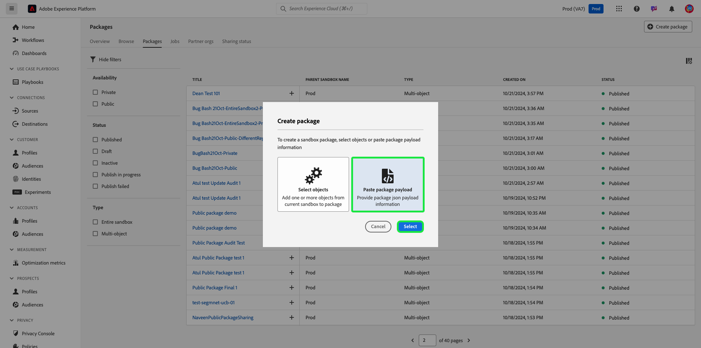

# Dela paket mellan organisationer med hjälp av sandlådeverktyg

Förbättra konfigurationsnoggrannheten i olika sandlådor och exportera och importera smidigt sandlådekonfigurationer mellan sandlådor i olika organisationer med sandlådeverktygen. Det här dokumentet beskriver hur du använder sandlådeverktyg i Adobe Experience Platform för att dela paket mellan olika organisationer. Det finns två typer av delade paket:

- **Privat paket**

[Privata paket](#private-packages) kan bara delas med organisationer som har godkänt delningsbegäran från källorganisationen.

- **Offentligt paket**

[Offentliga paket](#public-packages) är tillgängliga för import utan ytterligare godkännande. Dessa paket kan delas på en partners webbplats, blogg eller plattform. Paketets nyttolast tillåter att paket kopieras och klistras in från dessa kanaler till målorganisationen.

## Privata paket {#private-packages}

>[!NOTE]
>
>Om du vill initiera och godkänna en delningsbegäran och dela paket mellan organisationer måste du ha rollbaserad behörighet för **package-share**.

Använd sandlådeverktygen för att skapa partnerskap, spåra status för partnerförfrågningar, hantera befintliga partnerskap och dela paket med partnerorganisationer.

### Skapa en förfrågan om organisationskoppling

Navigera till fliken **[!UICONTROL Sandboxes]** **[!UICONTROL Partner orgs]** om du vill skapa en förfrågan om organisationskoppling. Välj sedan **[!UICONTROL Manage partner orgs]**.

I dialogrutan [!UICONTROL Package partner management] anger du organisations-ID i **[!UICONTROL Enter Org ID]** och trycker på Enter (Windows) eller Retur (Mac). Organisations-ID:t visas i avsnittet **[!UICONTROL Selected Org IDs]** nedan. När du har lagt till ID:n väljer du **[!UICONTROL Confirm]**.

>[!TIP]
>
>Du kan ange flera organisations-ID:n samtidigt med kommaseparerade listor eller genom att ange varje organisations-ID följt av enter.

Delningsbegäran har skickats till partnerorganisationen och du återgår till fliken [!UICONTROL Sandboxes] **[!UICONTROL Partner orgs]** som visar **[!UICONTROL Outgoing request]**.

### Auktorisera en partnerbegäran {#authorize-request}

Navigera till fliken [!UICONTROL Sandboxes] **[!UICONTROL Partner orgs]** om du vill godkänna en förfrågan om organisationskoppling. Välj sedan **[!UICONTROL Incoming request]**.

Aktuell **[!UICONTROL Status]** för begäran är **Väntar** i det här skedet. Om du vill godkänna begäran markerar du ellipsen (`...`) bredvid den valda begäran och väljer sedan **[!UICONTROL Approve]** i listrutan.

Dialogrutan **[!UICONTROL Review partner org request]** innehåller information om förfrågan om organisationskoppling. Ange en [!UICONTROL Reason] för godkännande och välj sedan **[!UICONTROL Approve]**.

Du återgår till sidan [!UICONTROL Incoming request] och status för begäran har uppdaterats till **[!UICONTROL Approved]**.

Använd det här arbetsflödet/den här processen för att dela paket mellan organisationen och källorganisationen.

### Dela paket med partnerorganisationer {#share-package}

>[!NOTE]
>
>Endast paket med statusen **Publicerad** kan delas.

Om du vill dela ett paket med en godkänd partnerorganisation går du till fliken [!UICONTROL Sandboxes] **[!UICONTROL Packages]**. Markera sedan ellipsen (`...`) bredvid paketet och välj **[!UICONTROL Share package]** i listrutan.

I dialogrutan **[!UICONTROL Share package]** väljer du det paket som ska delas i listrutan **[!UICONTROL Share settings]** och sedan **[!UICONTROL Confirm]**.

>[!TIP]
>
>Det går att välja flera organisationer. De valda organisationerna visas under listrutan [!UICONTROL Share settings].

## Offentliga paket {#public-packages}

Använd sandlådeverktygen för att skapa delningsbara offentliga paket som inte kräver något ytterligare godkännande och som enkelt importeras med hjälp av paketets nyttolast.

### Uppdatera paketets tillgänglighet till allmänheten {#update-package}

Om du vill uppdatera ett pakets tillgänglighetstyp går du till fliken [!UICONTROL Sandboxes] **[!UICONTROL Packages]**. Markera sedan ellipsen (`...`) bredvid paketet och välj **[!UICONTROL Update to public package]** i listrutan.

Kontrollera att paketnamnet är korrekt i dialogrutan **[!UICONTROL Change package availability to public]** och välj **[!UICONTROL Confirm]**.

>[!IMPORTANT]
>
> När ett paket har publicerats kan det inte ändras tillbaka till privat.

### Dela paket med paketnyttolasten

Om du vill dela det offentliga paketet markerar du ellipserna (`...`) bredvid paketet och väljer sedan **[!UICONTROL Copy package payload]**.

Dialogrutan **[!UICONTROL Copy package payload]** visar paketnamnet och nyttolasten. Välj **[!UICONTROL Copy package payload]** om du vill kopiera nyttolasten som är associerad med paketet.

### Skapa ett nytt paket med en paketnyttolast

Om du vill skapa ett paket med en paketnyttolast går du till fliken [!UICONTROL Sandboxes] **[!UICONTROL Packages]**. Välj sedan **[!UICONTROL Create package]**.

I dialogrutan **[!UICONTROL Create package]** väljer du alternativet **[!UICONTROL Paste package payload]** och sedan **[!UICONTROL Select]**.

Klistra in den kopierade paketnyttolasten i textfältet och välj **[!UICONTROL Create]**.

Om du vill visa den aktuella statusen för din delningsförfrågan går du till **[!UICONTROL Sharing status]**. Aktuell status för begäran visas i kolumnen **[!UICONTROL Sharing status]**.

## Nästa steg {#next-steps}

Det här dokumentet visar hur du använder sandlådeverktygen för att dela paket mellan olika organisationer. Mer information finns i [Verktygshandboken för sandlådan](../ui/sandbox-tooling.md).

Mer information om hur du utför olika åtgärder med sandbox-API:t finns i [utvecklarhandboken för sandlådan](../api/getting-started.md). En översikt över sandlådor i Experience Platform på hög nivå finns i [översiktsdokumentationen](../home.md).
