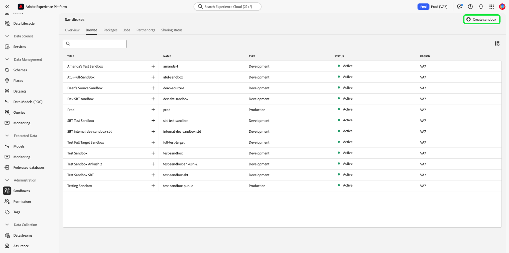

# Användargränssnittshandbok för sandlådan

Det här dokumentet innehåller steg om hur du utför olika åtgärder relaterade till sandlådor i Adobe Experience Platform användargränssnitt.

## Visa sandlådor

I användargränssnittet för Experience Platform väljer du **[!UICONTROL Sandboxes]** i den vänstra navigeringen för att öppna kontrollpanelen **[!UICONTROL Sandboxes]**. På kontrollpanelen visas alla tillgängliga sandlådor för din organisation, inklusive sandlådetyp (produktion eller utveckling) och tillstånd (aktiv, skapa, borttagen eller misslyckades).

## Växla mellan sandlådor

Kontrollen **sandlådeväxlaren** längst upp till vänster på skärmen visar den aktiva sandlådan.

Om du vill växla mellan sandlådor markerar du sandlådeväxlaren och väljer önskad sandlåda i listrutan.

När en sandlåda har valts uppdateras skärmen med den valda sandlådan i sandlådeväxlaren.

## Söka efter en sandlåda

Du kan navigera i listan med tillgängliga sandlådor med hjälp av sökfunktionen på sandlådeväxlarmenyn. Ange namnet på den sandlåda som du vill använda för att filtrera genom alla sandlådor som är tillgängliga för din organisation.

## Skapa en ny sandlåda

Använd följande video för en snabb översikt över hur du använder sandlådor i Experience Platform.

>[!VIDEO](https://video.tv.adobe.com/v/29838/?quality=12&learn=on)

Om du vill skapa en ny sandlåda i användargränssnittet väljer du knappen **[!UICONTROL Create Sandbox]** längst upp till höger på skärmen.

Dialogrutan **[!UICONTROL Create Sandbox]** visas och du uppmanas att ange en visningsrubrik och ett namn för sandlådan. **visningsrubriken** är avsedd att vara läsbar för människor och ska vara tillräckligt beskrivande för att vara lätt att identifiera. Sandlådan **[!UICONTROL Name]** är en helgemen identifierare som ska användas i API-anrop och ska därför vara unik och koncis. Sandlådan **[!UICONTROL Name]** får bara bestå av alfanumeriska tecken och bindestreck **(-)**, den måste börja med en bokstav och har högst 256 tecken.

När du är klar väljer du **[!UICONTROL Create]**.

>[!NOTE]
>
>Eftersom du endast är begränsad till att skapa icke-produktionssandlådtyper är alternativet **[!UICONTROL type]** låst vid &quot;Ej produktion&quot; och kan inte ändras.

När du har skapat sandlådan uppdaterar du sidan och den nya sandlådan visas på kontrollpanelen **[!UICONTROL Sandboxes]** med statusen [!UICONTROL Creating]. Det tar ca 15 minuter att etablera nya sandlådor av systemet, varefter deras status ändras till [!UICONTROL Active].

## Återställ en sandlåda

>[!NOTE]
>
>Den här funktionen är bara tillgänglig för icke-produktionssandlådor. Det går inte att återställa produktionssandlådor.

Om du återställer en icke-produktionssandlåda tas alla resurser som är associerade med den sandlådan (scheman, datauppsättningar o.s.v.) bort, samtidigt som sandlådans namn och associerade behörigheter behålls. Den här&quot;rena&quot; sandlådan är fortfarande tillgänglig under samma namn för användare som har åtkomst till den.

Om du vill återställa en sandlåda i användargränssnittet väljer du **[!UICONTROL Sandboxes]** i den vänstra navigeringen och markerar sedan den sandlåda som du vill återställa. Välj **[!UICONTROL Reset Sandbox]** i dialogrutan som visas till höger på skärmen.

En dialogruta visas där du uppmanas att bekräfta ditt val. Välj **[!UICONTROL Reset]** om du vill fortsätta.

Ett bekräftelsemeddelande visas och sandlådans tillstånd ändras till **[!UICONTROL Resetting]**. När det har etablerats av systemet uppdateras dess tillstånd till **&quot;[!UICONTROL Active]&quot;** eller **&quot;[!UICONTROL Failed]&quot;**.

## Ta bort en sandlåda

>[!NOTE]
>
>Den här funktionen är bara tillgänglig för icke-produktionssandlådor. Det går inte att ta bort produktionssandlådor.

Om du tar bort en icke-produktionssandlåda permanent tas alla resurser som är associerade med den sandlådan bort, inklusive behörigheter.

Om du vill ta bort en sandlåda i användargränssnittet väljer du **[!UICONTROL Sandboxes]** i den vänstra navigeringen och markerar sedan den sandlåda som du vill ta bort. Välj **[!UICONTROL Delete Sandbox]** i dialogrutan som visas till höger på skärmen.

En dialogruta visas där du uppmanas att bekräfta ditt val. Välj **[!UICONTROL Delete]** om du vill fortsätta.

Ett bekräftelsemeddelande visas och sandlådan tas bort från arbetsytan **[!UICONTROL Sandboxes]**.

## Nästa steg

Det här dokumentet visar hur du hanterar sandlådor i användargränssnittet för Experience Platform. Mer information om hur du hanterar sandlådor med hjälp av API:t för sandlådan finns i [utvecklarhandboken för sandlådan](../api/getting-started.md).