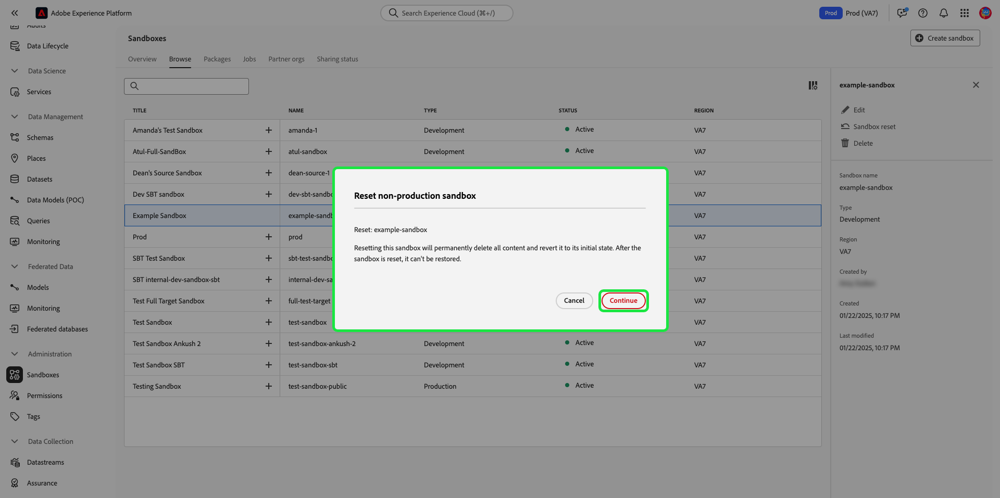

# Användargränssnittshandbok för sandlådan

Det här dokumentet innehåller steg om hur du utför olika åtgärder relaterade till sandlådor i Adobe Experience Platform användargränssnitt.

## Visa sandlådor

I plattformsgränssnittet väljer du **[!UICONTROL Sandboxes]** i den vänstra navigeringen för att öppna kontrollpanelen [!UICONTROL Sandboxes]. På kontrollpanelen visas alla tillgängliga sandlådor för din organisation, inklusive sandlådetyp (produktion eller utveckling) och tillstånd (aktiv, skapa, borttagen eller misslyckades).

## Växla mellan sandlådor

Kontrollen **sandlådeväxlaren** längst upp till vänster på skärmen visar den aktiva sandlådan.

Om du vill växla mellan sandlådor markerar du sandlådeväxlaren och väljer önskad sandlåda i listrutan.

När en sandlåda har valts uppdateras skärmen med den valda sandlådan i sandlådeväxlaren.

## Söka efter en sandlåda

Du kan navigera i listan med tillgängliga sandlådor med hjälp av sökfunktionen på sandlådeväxlarmenyn. Ange namnet på den sandlåda som du vill använda för att filtrera genom alla sandlådor som är tillgängliga för din organisation.

## Skapa en ny sandlåda

Använd följande video för en snabb översikt över hur du använder sandlådor i Experience Platform.

>[!VIDEO](https://video.tv.adobe.com/v/29838/?quality=12&learn=on)

Om du vill skapa en ny sandlåda väljer du **[!UICONTROL Create sandbox]** längst upp till höger på skärmen.

Dialogrutan **[!UICONTROL Create sandbox]** visas. Om du skapar en utvecklingssandlåda väljer du **[!UICONTROL Development]** i listrutepanelen. Om du vill skapa en ny produktionssandlåda väljer du **[!UICONTROL Production]**.

När du har valt typen anger du ett namn och en titel i sandlådan. Titeln ska vara läsbar för människor och ska vara tillräckligt beskrivande för att vara lätt att identifiera. Sandlådans namn är en helgemen identifierare som ska användas i API-anrop och ska därför vara unikt och koncist. Namnet på sandlådan måste börja med en bokstav, ha högst 256 tecken och bestå endast av alfanumeriska tecken och bindestreck (-).

När du är klar väljer du **[!UICONTROL Create]**.

När du har skapat sandlådan uppdaterar du sidan och den nya sandlådan visas på kontrollpanelen **[!UICONTROL Sandboxes]** med statusen [!UICONTROL Creating]. Det tar ca 30 sekunder att tilldela nya sandlådor av systemet, varefter deras status ändras till [!UICONTROL Active].

## Återställ en sandlåda

>[!IMPORTANT]
>
>Standardproduktionssandlådan kan inte återställas om identitetsdiagrammet som finns i den också används av Adobe Analytics för funktionen [Cross Device Analytics (CDA)](https://experienceleague.adobe.com/docs/analytics/components/cda/overview.html), eller om identitetsdiagrammet som finns i den också används av Adobe Audience Manager för funktionen [People Based Destinations (PBD)](https://experienceleague.adobe.com/docs/audience-manager/user-guide/features/destinations/people-based/people-based-destinations-overview.html). Det går inte heller att återställa produktionssandlådor som används för dubbelriktad segmentdelning med Adobe Audience Manager eller Audience Core Service.

Om du återställer en produktions- eller utvecklingssandlåda tas alla resurser som är kopplade till den sandlådan (scheman, datauppsättningar o.s.v.) bort, samtidigt som sandlådans namn och associerade behörigheter behålls. Den här&quot;rena&quot; sandlådan är fortfarande tillgänglig under samma namn för användare som har åtkomst till den.

Markera den sandlåda som du vill återställa i listan över sandlådor. Välj **[!UICONTROL Sandbox reset]** i den högra navigeringspanel som visas.

En dialogruta visas med en uppmaning om att bekräfta ditt val. Välj **[!UICONTROL Continue]** för att fortsätta.

I det sista bekräftelsefönstret anger du namnet på sandlådan i dialogrutan och väljer **[!UICONTROL Reset]**

## Ta bort en sandlåda

>[!IMPORTANT]
>
>Standardproduktionssandlådan kan inte tas bort och produktionssandlådor som används för dubbelriktad segmentdelning med Adobe Audience Manager eller Audience Core Service kan inte heller tas bort.

Om du tar bort en produktions- eller utvecklingssandlåda permanent tas alla resurser som är associerade med den sandlådan bort, inklusive behörigheter.

Markera den sandlåda som du vill ta bort i listan över sandlådor. Välj **[!UICONTROL Delete]** i den högra navigeringspanel som visas.

En dialogruta visas med en uppmaning om att bekräfta ditt val. Välj **[!UICONTROL Continue]** för att fortsätta.

I det sista bekräftelsefönstret anger du namnet på sandlådan i dialogrutan och väljer **[!UICONTROL Continue]**

## Nästa steg

Det här dokumentet visar hur du hanterar sandlådor i användargränssnittet för Experience Platform. Mer information om hur du hanterar sandlådor med hjälp av API:t för sandlådan finns i [utvecklarhandboken för sandlådan](../api/getting-started.md).
