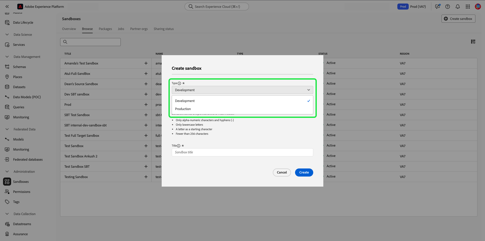

# Användargränssnittshandbok för sandlådan

Det här dokumentet innehåller steg om hur du utför olika åtgärder relaterade till sandlådor i Adobe Experience Platform användargränssnitt.

## Visa sandlådor

I plattformsgränssnittet väljer du **[!UICONTROL Sandboxes]** i den vänstra navigeringen och sedan **[!UICONTROL Browse]** för att öppna kontrollpanelen [!UICONTROL Sandboxes]. På kontrollpanelen visas alla tillgängliga sandlådor för din organisation, inklusive deras respektive typer (produktion eller utveckling).

## Växla mellan sandlådor

Sandlådeindikatorn finns i det övre huvudet i plattformsgränssnittet och visar titeln på den sandlåda som du för närvarande befinner dig i, dess region och dess typ.

Om du vill växla mellan sandlådor markerar du sandlådeindikatorn och väljer önskad sandlåda i listrutan.

När en sandlåda är markerad uppdateras skärmen och uppdateras till den sandlåda du har markerat.

## Skapa en ny sandlåda {#create}

>[!CONTEXTUALHELP]
>id="platform_sandboxes_sandboxname"
>title="Namn på sandlåda"
>abstract="Sandlådenamnet är den text som används i bakänden för att skapa ett unikt ID för den här sandlådan."

>[!CONTEXTUALHELP]
>id="platform_sandboxes_sandboxtitle"
>title="Sandlådetitel"
>abstract="Sandlådans titel är det visningsnamn som representerar sandlådan i menyer och listrutor i hela användargränssnittet i Experience Platform."

>[!NOTE]
>
>Om du vill skapa en ny sandlåda måste du lägga till den i en roll i [[!UICONTROL Permissions]](../../access-control/abac/ui/permissions.md) innan du kan börja använda den. Mer information om hur du etablerar en sandlåda för en roll finns i [dokumentationen för att hantera sandlådor för en roll](../../access-control/abac/ui/permissions.md#managing-sandboxes-for-role).

Använd följande video för en snabb översikt över hur du använder sandlådor i Experience Platform.

>[!VIDEO](https://video.tv.adobe.com/v/29838/?quality=12&learn=on)

Om du vill skapa en ny sandlåda väljer du **[!UICONTROL Create sandbox]** i skärmens övre högra hörn.

Dialogrutan **[!UICONTROL Create sandbox]** visas. Om du skapar en utvecklingssandlåda väljer du **[!UICONTROL Development]** i listrutepanelen. Välj **[!UICONTROL Production]** om du vill skapa en ny produktionssandlåda.

När du har valt typen anger du ett namn och en titel i sandlådan. Titeln ska vara läsbar för människor och ska vara tillräckligt beskrivande för att vara lätt att identifiera. Sandlådans namn är en helgemen identifierare som ska användas i API-anrop och ska därför vara unikt och koncist. Namnet på sandlådan måste börja med en bokstav, ha högst 256 tecken och bestå endast av alfanumeriska tecken och bindestreck (-).

När du är klar väljer du **[!UICONTROL Create]**.

När du har skapat sandlådan uppdaterar du sidan och den nya sandlådan visas på kontrollpanelen **[!UICONTROL Sandboxes]** med statusen [!UICONTROL Creating]. Det tar ca 30 sekunder att etablera nya sandlådor av systemet. Därefter ändras deras status till [!UICONTROL Active].

## Återställ en sandlåda

>[!WARNING]
>
>Nedan följer en lista med undantag som kan hindra dig från att återställa standardproduktionssandlådan eller en användarskapad produktionssandlåda:
>* Standardproduktionssandlådan kan inte återställas om identitetsdiagrammet som finns i sandlådan också används av Adobe Analytics för funktionen [Cross Device Analytics (CDA)](https://experienceleague.adobe.com/docs/analytics/components/cda/overview.html?lang=sv).
>* Standardproduktionssandlådan kan inte återställas om identitetsdiagrammet som finns i sandlådan också används av Adobe Audience Manager för [personbaserade mål (PBD)](https://experienceleague.adobe.com/docs/audience-manager/user-guide/features/destinations/people-based/people-based-destinations-overview.html?lang=sv).
>* Standardproduktionssandlådan kan inte återställas om den innehåller data för både CDA- och PBD-funktioner.
>* En användarskapad produktionssandlåda som används för dubbelriktad segmentdelning med Adobe Audience Manager eller Audience Core Service kan återställas efter ett varningsmeddelande.
>* Innan du initierar en sandlådeåterställning måste du ta bort dina kompositioner manuellt för att se till att de associerade målgruppsdata rensas ordentligt.

### Ta bort målgruppskompositioner

Målgruppskomposition är för närvarande inte integrerat med funktionen för återställning av sandlådor, så målgrupper måste tas bort manuellt innan de kan utföra återställningen av sandlådan.

Välj **[!UICONTROL Audiences]** i den vänstra navigeringen och välj sedan **[!UICONTROL Compositions]**.

![Fliken [!UICONTROL Compositions] på arbetsytan [!UICONTROL Audiences].](../images/ui/audiences.png)

Markera sedan ellipsen (`...`) bredvid den första målgruppen och välj **[!UICONTROL Delete]**.

![Målgruppsmenyn som markerar alternativet [!UICONTROL Delete].](../images/ui/delete-composition.png)

En bekräftelse på att borttagningen lyckades visas och du återgår till fliken **[!UICONTROL Compositions]**.

Upprepa stegen ovan med alla kompositioner. Detta tar bort alla målgrupper från målgruppslagret. När alla målgrupper har tagits bort kan du fortsätta att återställa sandlådan.

### Återställa en sandlåda

Om du återställer en produktions- eller utvecklingssandlåda tas alla resurser som är kopplade till den sandlådan (scheman, datauppsättningar o.s.v.) bort, samtidigt som sandlådans namn och associerade behörigheter behålls. Den här&quot;rena&quot; sandlådan är fortfarande tillgänglig under samma namn för användare som har åtkomst till den.

Markera den sandlåda som du vill återställa i listan över sandlådor. Välj **[!UICONTROL Sandbox reset]** i den högra navigeringspanelen som visas.

En dialogruta visas med en uppmaning om att bekräfta ditt val. Välj **[!UICONTROL Continue]** om du vill fortsätta.

I det sista bekräftelsefönstret anger du namnet på sandlådan i dialogrutan och väljer **[!UICONTROL Reset]**.

## Ta bort en sandlåda

>[!WARNING]
>
>Du kan inte ta bort standardproduktionssandlådan. Alla användarskapade produktionssandlådor som används för dubbelriktad segmentdelning med [!DNL Audience Manager] eller [!DNL Audience Core Service] kan dock tas bort efter ett varningsmeddelande.

Om du tar bort en produktions- eller utvecklingssandlåda permanent tas alla resurser som är associerade med den sandlådan bort, inklusive behörigheter.

Markera den sandlåda som du vill ta bort i listan över sandlådor. Välj **[!UICONTROL Delete]** i den högra navigeringspanelen som visas.

En dialogruta visas med en uppmaning om att bekräfta ditt val. Välj **[!UICONTROL Continue]** om du vill fortsätta.

I det sista bekräftelsefönstret anger du namnet på sandlådan i dialogrutan och väljer **[!UICONTROL Continue]**.

## Nästa steg

Det här dokumentet visar hur du hanterar sandlådor i användargränssnittet för Experience Platform. Mer information om hur du hanterar sandlådor med hjälp av API:t för sandlådan finns i [utvecklarhandboken för sandlådan](../api/getting-started.md).
