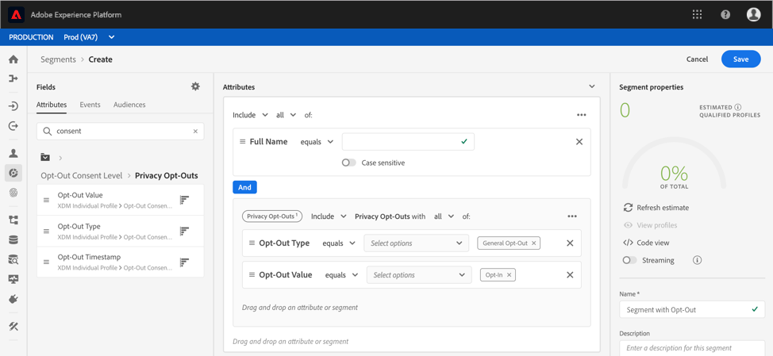

# Efterleva avanmälningsbegäranden i segment

Med Experience Platform kan era kunder skicka avanmälningsförfrågningar om användning och lagring av sina data inom kundprofilen i realtid. Dessa avanmälningsförfrågningar ingår i California Consumer Privacy Act (CCPA), som ger personer bosatta i Kalifornien rätt att få tillgång till och radera sina personuppgifter och att få veta om deras personuppgifter säljs eller offentliggörs (och till vem).

När en kund har avanmält sig är det viktigt att organisationen följer avanmälningarna när den genererar målgrupper för marknadsföringsaktiviteter. I det här dokumentet beskrivs viktig information om hur du hanterar avanmälningsbegäranden.

## Komma igång

För att uppfylla avanmälningsbegäranden krävs en förståelse för de olika Adobe Experience Platform-tjänsterna som är inblandade. Innan du arbetar med avanmälningsbegäranden ska du läsa dokumentationen för följande tjänster:

- [Kundprofil](../profile/home.md)i realtid: Ger en enhetlig kundprofil i realtid baserad på aggregerade data från flera källor.
- [Adobe Experience Platform Segmentation Service](./home.md): Gör att ni kan bygga målgruppssegment utifrån kundprofildata i realtid.
- [Experience Data Model (XDM)](../xdm/home.md): Det standardiserade ramverk som Platform använder för att organisera kundupplevelsedata.
- [Adobe Experience Platform Privacy Service](../privacy-service/home.md): Hjälper organisationer att automatisera efterlevnaden av datasekretesregler som omfattar kunddata inom plattformen. Dessa regler omfattar:
   - California Consumer Privacy Act (CCPA): Sekretessrättigheter för personer bosatta i Kalifornien, inklusive rätten att få tillgång till och radera personuppgifter och att få veta om personuppgifter säljs eller offentliggörs (och till vem).
   - Allmänna dataskyddsförordningen (GDPR): Sekretessrättigheter för EU-medlemmar, inklusive rätten till tillgång och rätten att bli glömd.

## Avanmäl mixar

För att uppfylla CCPA-begäran om avanmälan måste ett av schemana som är en del av unionsschemat innehålla de nödvändiga XDM-fälten (Experience Data Model) för avanmälan. Det finns två blandningar som kan användas för att lägga till avanmälningsfält i ett schema. De beskrivs mer ingående i följande avsnitt:

- [Profilsekretess](#profile-privacy): Används för att hämta olika typer av avanmälan (allmän eller försäljning/delning).
- [Information om profilinställningar](#profile-preferences-details): Används för att hämta avanmälningsbegäranden för specifika XDM-kanaler.

Stegvisa instruktioner om hur du lägger till en blandning i ett schema finns i avsnittet&quot;Lägg till en blandning&quot; i följande XDM-dokumentation:
- [API-självstudiekurs](../xdm/api/getting-started.md)för schemaregister.: Skapa ett schema med API:t för schemaregistret.
- [Schemaredigeraren, genomgång](../xdm/tutorials/create-schema-ui.md): Skapa ett schema med användargränssnittet för plattformen.

Här är en exempelbild som visar de avanmälningsblandningar som lagts till i ett schema i användargränssnittet:


Strukturen för varje blandning, samt en beskrivning av fälten som de bidrar till schemat, beskrivs mer ingående i följande avsnitt.

### Profilsekretess

Med integritetsmixen för profiler kan du hämta in två typer av CCPA-avanmälningsbegäranden från kunder:

1. Allmän avanmälan
2. Avanmäl dig till försäljning/delning


Integritetsmixen för profiler innehåller följande fält:

- Sekretessalternativ (`privacyOptOuts`): En array som innehåller en lista med avanmälningsobjekt.
- Typ av avanmälan (`optOutType`): Typ av avanmälan. Det här fältet är en uppräkning med två möjliga värden:
   - Allmän avanmälan (`general_opt_out`)
   - Avanmäl dig till säljdelning (`sales_sharing_opt_out`)
- Värde för avanmälan (`optOutValue`): Det aktiva tillståndet för avanmälan, även kallat värdet för avanmälningssignalen, baserat på den typ av avanmälan som har angetts. Det här fältet är en uppräkning med fyra möjliga värden:
   - Inte tillhandahållen (`not_provided`): Ingen avanmälningsbegäran har angetts.
   - Väntande verifiering (`pending`): Avanmälningsbegäran väntar på verifiering.
   - Avanmäl dig (`out`): Kunden har avanmält sig.
   - Opt-In (`in`): Kunden har anmält sig.
- Tidsstämpel för avanmälan (`timestamp`): Tidsstämpel för mottagen avanmälningssignal.

Om du vill visa den fullständiga strukturen för integritetsmixen för profiler, se [XDM-databasen](https://github.com/adobe/xdm/blob/master/schemas/context/profile-privacy.schema.json) för offentlig GitHub eller förhandsgranska mixen med hjälp av användargränssnittet för plattformen.

### Information om profilinställningar

I avsnittet Information om profilinställningar finns flera fält som representerar inställningar för kundprofiler (t.ex. e-postformat, önskat språk och tidszon). Ett av fälten i den här mixinen, OptInOut (`optInOut`), tillåter att avanmälningsvärden ställs in för enskilda kanaler.


Mixen Information om profilinställningar innehåller följande fält för avanmälan:

- OptInOut (`optInOut`): Ett objekt där varje nyckel representerar en giltig och känd URI för en kommunikationskanal och det aktiva tillståndet för avanmälan för varje kanal. Varje kanal kan ha ett av fyra möjliga värden:
   - Inte tillhandahållen (`not_provided`): Ingen avanmälningsbegäran har angetts för den här kanalen.
   - Väntande verifiering (`pending`): Avanmälningsbegäran för den här kanalen väntar på verifiering.
   - Avanmäl dig (`out`): Kunden har valt bort den här kanalen.
   - Opt-In (`in`): Kunden har valt den här kanalen.
- Global avanmälan (`globalOptout`): Ett booleskt värde som, när det är true, anger en global åsidosättning av avanmälan för profilen. Standardvärdet för det här fältet är false.

I exemplet nedan visar JSON hur OptInOut-objektet kan fånga upp flera avanmälningssignaler för olika kommunikationskanaler:

```json
{
  "xdm:optInOut": {
    "https://ns.adobe.com/xdm/channels/email": "pending",
    "https://ns.adobe.com/xdm/channels/phone": "out",
    "https://ns.adobe.com/xdm/channels/sms": "in",
    "https://ns.adobe.com/xdm/channels/fax": "not_provided",
    "https://ns.adobe.com/xdm/channels/direct-mail": "not_provided",
    "https://ns.adobe.com/xdm/channels/apns": "not_provided",
    "xdm:globalOptout": false
  }
}
```

Om du vill visa hela strukturen för blandningen Profilinställningar ska du besöka [XDM-databasen](https://github.com/adobe/xdm/blob/master/schemas/context/profile-preferences-details.schema.json) för offentlig GitHub eller förhandsgranska blandningen med hjälp av plattformsgränssnittet.

## Hantera avanmälningar vid segmentering

För att säkerställa att profiler som är markerade med CCPA-avanmälningsflaggor inte inkluderas i segment, måste specialfält läggas till i befintliga segment eller inkluderas när segment skapas.

I avsnitten nedan visas hur du lägger till lämpliga fält för de två typerna av avanmälningsflaggor:
1. Allmän avanmälan
2. Avanmäl dig till försäljning/delning

### Allmän avanmälan

Segmentering följer automatiskt alla profiler som innehåller flaggan&quot;General Opt-Out&quot;, vilket innebär att dessa profiler inte inkluderas i målgrupper eller exporter som standard. Det är dock bäst att lägga till lämpliga fält för att säkerställa att ej bortfallsprofiler inkluderas i målgrupper och marknadsföringsaktiviteter.

Detta kan du göra med hjälp av användargränssnittet i segmentbyggaren genom att lägga till attribut för **sekretessalternativ** . I den här instansen är segmentet inställt så att det bara omfattar dem som har valt att delta (vilket innebär att de inte har någon allmän avanmälningsflagga i sin profil. Detta görs genom att deklarera att &quot;Avankomsttyp&quot; är lika med &quot;allmänt avanmäl&quot; och &quot;avankomstvärde&quot; är lika med &quot;avanmäl dig&quot;.



### Avanmäl dig till försäljning/delning

Om en användare har en avanmälningsflagga för försäljning/delning inställd på sin profil, ska den här profilen inte längre användas för någon segmentskapelse eller marknadsföringsaktivitet. För att du ska kunna vara säker på att den här flaggan respekteras måste avanmälningstypen vara lika med avanmälningstypen och avanmälningsvärdet måste vara lika med avanmälan.


<!-- ### Overriding default exclusions

In some instances, such as building a segment of people who have opted out, it may be necessary to override the default exclusion of opted-out profiles. This override can be done via the API or in the Segment Builder user interface. -->

## Nästa steg

Mer information om segmentering, inklusive arbete med segmentdefinitioner och målgrupper via API:t och användargränssnittet, får du om du börjar med att läsa [segmenteringsöversikten](./home.md).

Mer information om datasekretess inom plattformen, inklusive hur sekretessservice underlättar automatiserad efterlevnad av juridiska och organisatoriska sekretessbestämmelser, finns i dokumentationen [för](../privacy-service/home.md)integritetstjänsten.
