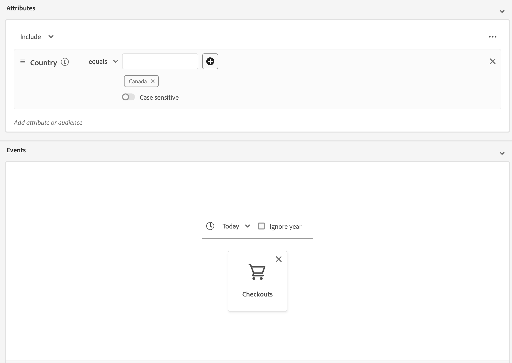
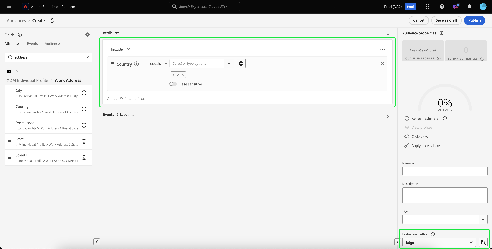

# Edge segmenteringsguide

Edge-segmentering är möjligheten att omedelbart utvärdera segmentdefinitioner i Adobe Experience Platform [på kanten](../../landing/edge-and-hub-comparison.md), vilket möjliggör användning av samma sida och nästa sidanpassning.

>[!IMPORTANT]
>
> Kantdata lagras på en edge-serverplats som ligger närmast den plats där de samlades in. Dessa data kan också lagras på en annan plats än den som anges som Adobe Experience Platform datacenter (eller huvudkontor).
>
> Dessutom kommer kantsegmenteringsmotorn endast att efterleva begäranden på kanten där det finns **en** primär markerad identitet, vilket är förenligt med icke-kantbaserade primära identiteter.

## Edge segmenteringsfrågetyper {#query-types}

En fråga kan utvärderas med kantsegmentering om den uppfyller något av villkoren i följande tabell.

>[!NOTE]
>
>Om frågan matchar någon av frågetyperna i följande tabell utvärderas den automatiskt med kantsegmentering. Den här funktionen bestäms automatiskt av systemet baserat på frågeuttrycket.
>
>Om målgruppen **only** innehåller profilattribut utvärderas den dagligen. Om ni vill att er målgrupp ska utvärderas i realtid måste ni lägga till händelsedata till er målgrupp.

| Frågetyp | Information | Fråga | Exempel |
| ---------- | ------- | ----- | ------- |
| En händelse inom ett tidsfönster på mindre än 24 timmar | En segmentdefinition som refererar till en enda inkommande händelse inom ett tidsfönster på mindre än 24 timmar. | `CHAIN(xEvent, timestamp, [C0: WHAT(eventType.equals("commerce.checkouts", false)) WHEN(today)])` | {zoomable="yes"} |
| Endast profil | En segmentdefinition som bara refererar till ett profilattribut. | `homeAddress.country.equals("US", false)` | {zoomable="yes"} |
| En händelse med ett profilattribut inom ett relativt tidsfönster på mindre än 24 timmar | En segmentdefinition som refererar till en enda inkommande händelse, med ett eller flera profilattribut, och som inträffar inom ett relativt tidsfönster på mindre än 24 timmar. | `workAddress.country.equals("US", false) and CHAIN(xEvent, timestamp, [C0: WHAT(eventType.equals("commerce.checkouts", false)) WHEN(today)])` | {zoomable="yes"} |
| Segmentering | En segmentdefinition som innehåller en eller flera grupp- eller kantsegment. **Obs!** Om ett segment används, inaktiveras profiler **var 24:e timme**. | `inSegment("a730ed3f-119c-415b-a4ac-27c396ae2dff") and inSegment("8fbbe169-2da6-4c9d-a332-b6a6ecf559b9")` | {zoomable="yes"} |

Dessutom måste segmentdefinitionen **** vara knuten till en sammanfogningsprincip som är aktiv på kanten. Mer information om sammanfogningsprinciper finns i [policyguiden för sammanfogning](../../profile/api/merge-policies.md).

En segmentdefinition är **inte** berättigad till kantsegmentering i följande scenario:

- Segmentdefinitionen innehåller en kombination av en enda händelse och en `inSegment`-händelse.
   - Om segmentdefinitionen i `inSegment`-händelsen bara är en profil aktiveras segmentdefinitionen **** för kantsegmentering.
- I segmentdefinitionen används&quot;Ignorera år&quot; som en del av tidsbegränsningarna.

## Skapa målgrupper {#create-audience}

Du kan skapa en målgrupp som utvärderas med hjälp av kantsegmentering med hjälp av antingen segmenteringstjänstens API eller genom målgruppsportalen i användargränssnittet.

En segmentdefinition kan vara kantaktiverad om den matchar någon av de [valbara frågetyperna](#eligible-query-types).

>[!BEGINTABS]

>[!TAB Segmenteringstjänstens API]

**API-format**

```http
POST /segment/definitions
```

**Begäran**

+++ En exempelbegäran om att skapa en segmentdefinition som är aktiverad för kantsegmentering

```shell
curl -X POST https://platform.adobe.io/data/core/ups/segment/definitions
 -H 'Authorization: Bearer {ACCESS_TOKEN}' \
 -H 'Content-Type: application/json' \
 -H 'x-gw-ims-org-id: {ORG_ID}' \
 -H 'x-api-key: {API_KEY}' \
 -H 'x-sandbox-name: {SANDBOX_NAME}'
 -d '{
        "name": "People in the USA",
        "description: "An audience that looks for people who live in the USA",
        "expression": {
            "type": "PQL",
            "format": "pql/text",
            "value": "homeAddress.country = \"US\""
        },
        "evaluationInfo": {
            "batch": {
                "enabled": false
            },
            "continuous": {
                "enabled": false
            },
            "synchronous": {
                "enabled": true
            }
        },
        "schema": {
            "name": "_xdm.context.profile"
        }
     }'
```

+++

**Svar**

Ett lyckat svar returnerar HTTP-status 200 med information om den segmentdefinition du nyss skapade.

+++Ett exempelsvar när du skapar en segmentdefinition.

```json
{
    "id": "4afe34ae-8c98-4513-8a1d-67ccaa54bc05",
    "schema": {
        "name": "_xdm.context.profile"
    },
    "profileInstanceId": "ups",
    "imsOrgId": "{ORG_ID}",
    "sandbox": {
        "sandboxId": "28e74200-e3de-11e9-8f5d-7f27416c5f0d",
        "sandboxName": "prod",
        "type": "production",
        "default": true
    },
    "name": "People in the USA",
    "description": "An audience that looks for people who live in the USA",
    "expression": {
        "type": "PQL",
        "format": "pql/text",
        "value": "homeAddress.country = \"US\""
    },
    "evaluationInfo": {
        "batch": {
            "enabled": false
        },
        "continuous": {
            "enabled": false
        },
        "synchronous": {
            "enabled": true
        }
    },
    "dataGovernancePolicy": {
        "excludeOptOut": true
    },
    "creationTime": 0,
    "updateEpoch": 1579292094,
    "updateTime": 1579292094000
}
```

+++

Mer information om hur du använder den här slutpunkten finns i [segmentdefinitionsguiden](../api/segment-definitions.md).

>[!TAB Målgruppsportal]

Välj **[!UICONTROL Create audience]** i Audience Portal.

{zoomable="yes"}

En pover visas. Välj **[!UICONTROL Build rules]** om du vill ange Segment Builder.

{zoomable="yes"}

Skapa en segmentdefinition som matchar någon av de [valbara frågetyperna](#eligible-query-types) i Segment Builder. Om segmentdefinitionen kvalificerar för kantsegmentering kan du välja **[!UICONTROL Edge]** som **[!UICONTROL Evaluation method]**.

{zoomable="yes"}

Mer information om hur du skapar segmentdefinitioner finns i guiden [Segment Builder](../ui/segment-builder.md)

>[!ENDTABS]

## Hämta in målgrupper som utvärderats med kantsegmentering {#retrieve-audiences}

Du kan hämta alla målgrupper som utvärderas med hjälp av kantsegmentering med hjälp av antingen segmenteringstjänstens API eller genom målgruppsportalen i användargränssnittet.

>[!BEGINTABS]

>[!TAB Segmenteringstjänstens API]

Hämta en lista över alla segmentdefinitioner som har utvärderats med hjälp av kantsegmentering i organisationen genom att göra en GET-begäran till slutpunkten `/segment/definitions`.

**API-format**

Du måste inkludera frågeparametern `evaluationInfo.synchronous.enabled=true` i sökvägen för begäran för att hämta segmentdefinitioner som utvärderats med hjälp av kantsegmentering.

```http
GET /segment/definitions?evaluationInfo.synchronous.enabled=true
```

**Begäran**

+++ Ett exempel på en begäran om att lista alla de edge-aktiverade segmentdefinitionerna

```shell
curl -X GET \
  'https://platform.adobe.io/data/core/ups/segment/definitions?evaluationInfo.synchronous.enabled=true' \
  -H 'Authorization: Bearer {ACCESS_TOKEN}' \
  -H 'x-api-key: {API_KEY}' \
  -H 'x-gw-ims-org-id: {ORG_ID}' \
  -H 'x-sandbox-name: {SANDBOX_NAME}'
```

+++

**Svar**

Ett lyckat svar returnerar HTTP-status 200 med en array med segmentdefinitioner i organisationen som är aktiverade för kantsegmentering.

+++ Ett exempelsvar som innehåller en lista med alla segmentdefinitioner som är aktiverade för kantsegmentering i organisationen

```json
{
    "segments": [
        {
            "id": "15063cb-2da8-4851-a2e2-bf59ddd2f004",
            "schema": {
                "name": "_xdm.context.profile"
            },
            "imsOrgId": "{ORG_ID}",
            "sandbox": {
                "sandboxId": "",
                "sandboxName": "",
                "type": "production",
                "default": true
            },
            "name": " People who are NOT on their homepage ",
            "expression": {
                "type": "PQL",
                "format": "pql/text",
                "value": "select var1 from xEvent where var1._experience.analytics.endUser.firstWeb.webPageDetails.isHomePage = false"
            },
            "evaluationInfo": {
                "batch": {
                    "enabled": false
                },
                "continuous": {
                    "enabled": false
                },
                "synchronous": {
                    "enabled": true
                }
            },
            "creationTime": 1572029711000,
            "updateEpoch": 1572029712000,
            "updateTime": 1572029712000
        },
        {
            "id": "f15063cb-2da8-4851-a2e2-bf59ddd2f004",
            "schema": {
                "name": "_xdm.context.profile"
            },
            "imsOrgId": "{ORG_ID}",
            "sandbox": {
                "sandboxId": "",
                "sandboxName": "",
                "type": "production",
                "default": true
            },
            "name": "Homepage_continuous",
            "description": "People who are on their homepage - continuous",
            "expression": {
                "type": "PQL",
                "format": "pql/text",
                "value": "select var1 from xEvent where var1._experience.analytics.endUser.firstWeb.webPageDetails.isHomePage = true"
            },
            "evaluationInfo": {
                "batch": {
                    "enabled": false
                },
                "continuous": {
                    "enabled": false
                },
                "synchronous": {
                    "enabled": true
                }
            },
            "creationTime": 1572021085000,
            "updateEpoch": 1572021086000,
            "updateTime": 1572021086000
        }
    ],
    "page": {
        "totalCount": 2,
        "totalPages": 1,
        "sortField": "creationTime",
        "sort": "desc",
        "pageSize": 2,
        "limit": 100
    },
    "link": {}
}
```

Mer detaljerad information om den returnerade segmentdefinitionen finns i [stödlinjen för segmentdefinitioner](../api/segment-definitions.md).

+++

>[!TAB Målgruppsportal]

Du kan hämta alla målgrupper som är aktiverade för kantsegmentering inom organisationen med hjälp av filter i Audience Portal. Välj  för att visa filterlistan.

{zoomable="yes"}

Gå till **Uppdateringsfrekvens** inom de tillgängliga filtren och välj Edge. Med det här filtret visas alla målgrupper i organisationen som utvärderas med kantsegmentering.

{zoomable="yes"}

Om du vill veta mer om hur du visar målgrupper i Experience Platform kan du läsa [guiden för målportalen](../ui/audience-portal.md).

>[!ENDTABS]

## Målgruppsinformation {#audience-details}

Du kan visa information om en viss målgrupp som utvärderats med hjälp av kantsegmentering genom att markera den i målgruppsportalen.

När du har valt en målgrupp på Audience Portal visas sidan med målgruppsinformation. Här visas information om målgruppen, inklusive en sammanfattning av målgruppsinformationen, antalet kvalificerade profiler över tiden samt vilka mål målgruppen har aktiverats för.


För kantaktiverade målgrupper visas **[!UICONTROL Profiles over time]**-kortet, som visar det totala antalet kvalificerade och det nya målgruppsuppdaterade måttet.

Måttet **[!UICONTROL Total qualified]** representerar det totala antalet kvalificerade målgrupper, baserat på kantutvärderingar för den här målgruppen.

Måttet **[!UICONTROL New audience updated]** representeras av ett linjediagram som visar förändringen i målgruppsstorlek genom kantsegmentering. Du kan justera listrutan så att den visar de senaste 24 timmarna, den senaste veckan eller de senaste 30 dagarna.

{zoomable="yes"}

Mer information om målgruppsinformation finns i [Översikt över målgruppsportalen](../ui/audience-portal.md#audience-details).

## Nästa steg

Den här guiden förklarar vilken kantsegmentering som är och hur du skapar en segmentdefinition som kan utvärderas med hjälp av kantsegmentering i Adobe Experience Platform.

Läs [Användarhandboken för segmentering](./overview.md) om du vill veta mer om hur du använder användargränssnittet i Experience Platform.

Vanliga frågor om kantsegmentering finns i avsnittet [kantsegmentering i Frågor och svar](../faq.md#edge-segmentation).

