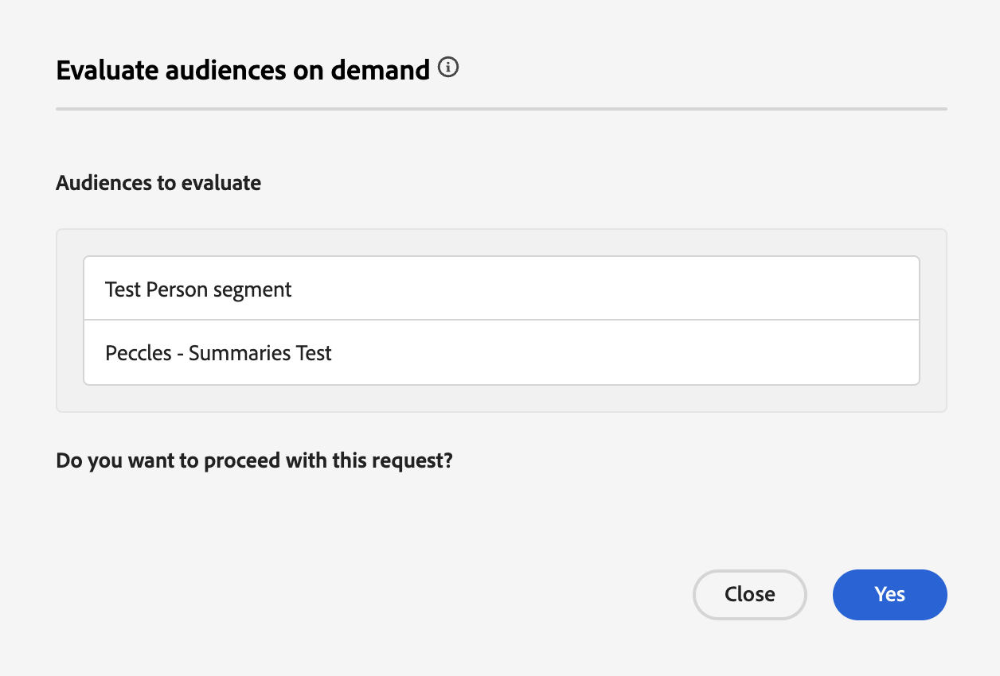

# Flexibel guide för målgruppsutvärdering

>[!AVAILABILITY]
>
>Flexibel målgruppsutvärdering är **endast** tillgängligt för instanser av Experience Platform som körs på [!DNL Microsoft Azure]. Mer information om den Experience Platform-infrastruktur som stöds finns i [Experience Platform översikt över flera moln](../../landing/multi-cloud.md).
>
>Flexibel målgruppsutvärdering är dessutom **endast** tillgänglig för användning med Real-Time CDP B2C Edition.

Med flexibel målgruppsutvärdering kan ni köra ett batchsegmenteringsjobb på begäran. Med flexibel målgruppsutvärdering kan ni köra ad hoc-kampanjer, just-in-time-kommunikation eller andra tidskänsliga aktiviteter.

## Skyddsräcken {#guardrails}

>[!CONTEXTUALHELP]
>id="platform_segmentation_browse_flexibleaudienceevaluation"
>title="Flexibla gränser för målgruppsutvärdering"
>abstract="Ni kan utvärdera upp till 20 målgrupper i en enda flexibel utvärderingsrunda.<br/><br/>Även om utvärderingsjobbet körs så snart som möjligt kan det uppstå systemfördröjningar eftersom on-demand-utvärderingar <b>inte</b> kan köras samtidigt som en annan on-demand- eller batch-utvärdering."

Tänk på följande när du gör en flexibel utvärdering av målgruppen:

- Du kan bara använda den flexibla målgruppsutvärderingen **två gånger** per dag och sandlåda. Den här gränsen återställs vid midnatt (UTC).
- Du har **maximalt** av 50 flexibla målgruppsutvärderingar som körs per år per **produktion** sandlåda.
   - Ett år definieras som ett år med början det datum då ditt Experience Platform-kontrakt tecknades för en flexibel målgruppsutvärdering. Om du till exempel började teckna avtal den 18 maj kommer antalet flexibla utvärderingstillfällen att återställas den 18 maj varje år.
- Du har **maximalt** av 100 flexibla målgruppsutvärderingar som körs per år per **utvecklingssandlåda**.
   - Ett år definieras som ett år med början det datum då ditt Experience Platform-kontrakt tecknades för en flexibel målgruppsutvärdering. Om du till exempel började teckna avtal den 18 maj kommer antalet flexibla utvärderingstillfällen att återställas den 18 maj varje år.
- Alla målgrupper som **måste** har ursprunget till segmenteringstjänsten.
- Alla målgrupper **måste** utvärderas med gruppsegmentering.
- Alla målgrupper **måste** vara personbaserade.
- Ni kan bara välja högst 20 målgrupper per flexibel utvärderingsperiod.

>[!NOTE]
>
>Ni kan köpa ytterligare flexibla utvärderingsversioner per år. Mer information får du av Adobe kundtjänst.

## Åtkomst {#access}

För att kunna använda flexibel målgruppsutvärdering måste du ha följande tillstånd:

- **[!UICONTROL Evaluate Segment to an Audience]** under avsnittet **[!DNL Profile Management]**.

Mer information om rollbaserad åtkomstkontroll finns i [åtkomstkontrollsöversikten](../../access-control/home.md).

## Flexibel målgruppsutvärdering

Du kan köra flexibel målgruppsutvärdering med Experience Platform API:er eller användargränssnittet.

>[!BEGINTABS]

>[!TAB Experience Platform API:er]

Om du vill köra en flexibel målgruppsutvärdering i Experience Platform API:er måste du skapa ett segmentjobb som innehåller ID:n för alla segmentdefinitioner (målgrupper) som du vill utvärdera.

>[!NOTE]
>
>Du kan bara lägga till **maximalt** av 20 segmentdefinition-ID:n per API-anrop för segmentjobb.

Du kan skapa ett nytt segmentjobb genom att göra en POST-begäran till slutpunkten `/segment/jobs` och inkludera ID:n för segmentdefinitionerna i begärandetexten.

+++En exempelbegäran för att skapa ett nytt segmentjobb

```shell
curl -X POST https://platform.adobe.io/data/core/ups/segment/jobs \
 -H 'Authorization: Bearer {ACCESS_TOKEN}' \
 -H 'Content-Type: application/json' \
 -H 'x-gw-ims-org-id: {ORG_ID}' \
 -H 'x-api-key: {API_KEY}' \
 -H 'x-sandbox-name: {SANDBOX_NAME}' \
 -d '[
    {
        "segmentId": "7863c010-e092-41c8-ae5e-9e533186752e"
    },
    {
        "segmentId": "07d39471-05d1-4083-a310-d96978fd7c85"
    }
 ]'
```

| Egenskap | Beskrivning |
| -------- | ----------- |
| `segmentId` | ID:t för segmentdefinitionen som du vill utvärdera. Dessa segmentdefinitioner kan tillhöra olika sammanfogningsprinciper. |

+++

Ett lyckat svar returnerar HTTP-status 200 med information om ditt nyligen skapade segmentjobb.

+++ Ett exempelsvar när du skapar ett nytt segmentjobb.

```json
{
    "id": "b31aed3d-b3b1-4613-98c6-7d3846e8d48f",
    "imsOrgId": "{ORG_ID}",
    "sandbox": {
        "sandboxId": "28e74200-e3de-11e9-8f5d-7f27416c5f0d",
        "sandboxName": "prod",
        "type": "production",
        "default": true
    },
    "profileInstanceId": "ups",
    "source": "api",
    "status": "PROCESSING",
    "batchId": "678f53bc-e21d-4c47-a7ec-5ad0064f8e4c",
    "computeJobId": 8811,
    "computeGatewayJobId": "9ea97b25-a0f5-410e-ae87-b2d85e58f399",
    "segments": [
        {
            "segmentId": "7863c010-e092-41c8-ae5e-9e533186752e",
            "segment": {
                "id": "7863c010-e092-41c8-ae5e-9e533186752e",
                "expression": {
                    "type": "PQL",
                    "format": "pql/json",
                    "value": "workAddress.country = \"US\""
                },
                "mergePolicyId": "25c548a0-ca7f-4dcd-81d5-997642f178b9",
                "mergePolicy": {
                    "id": "25c548a0-ca7f-4dcd-81d5-997642f178b9",
                    "version": 1
                }
            }
        },
        {
            "segmentId": "07d39471-05d1-4083-a310-d96978fd7c85",
            "segment": {
                "id": "07d39471-05d1-4083-a310-d96978fd7c85",
                "expression": {
                    "type": "PQL",
                    "format": "pql/json",
                    "value": "workAddress.country = \"US\""
                },
                "mergePolicyId": "25c548a0-ca7f-4dcd-81d5-997642f178b9",
                "mergePolicy": {
                    "id": "25c548a0-ca7f-4dcd-81d5-997642f178b9",
                    "version": 1
                }
            }
        }
    ],
    "metrics": {
        "totalTime": {
            "startTimeInMs": 1573203617195,
            "endTimeInMs": 1573204395655,
            "totalTimeInMs": 778460
        },
        "profileSegmentationTime": {
            "startTimeInMs": 1573204266727,
            "endTimeInMs": 1573204395655,
            "totalTimeInMs": 128928
        },
        "segmentedProfileCounter":{
            "7863c010-e092-41c8-ae5e-9e533186752e":1033
        },
        "segmentedProfileByNamespaceCounter":{
            "7863c010-e092-41c8-ae5e-9e533186752e":{
                "tenantiduserobjid":1033,
                "campaign_profile_mscom_mkt_prod2":1033
            }
        },
        "segmentedProfileByStatusCounter":{
            "7863c010-e092-41c8-ae5e-9e533186752e":{
                "exited":144646,
                "realized":2056
            }
        },
        "totalProfiles":13146432,
        "totalProfilesByMergePolicy":{
            "25c548a0-ca7f-4dcd-81d5-997642f178b9":13146432
        }
    },
    "requestId": "4e538382-dbd8-449e-988a-4ac639ebe72b-1573203600264",
    "schema": {
        "name": "_xdm.context.profile"
    },
    "properties": {
        "scheduleId": "4e538382-dbd8-449e-988a-4ac639ebe72b",
        "runId": "e6c1308d-0d4b-4246-b2eb-43697b50a149"
    },
    "_links": {
        "cancel": {
            "href": "/segment/jobs/b31aed3d-b3b1-4613-98c6-7d3846e8d48f",
            "method": "DELETE"
        },
        "checkStatus": {
            "href": "/segment/jobs/b31aed3d-b3b1-4613-98c6-7d3846e8d48f",
            "method": "GET"
        }
    },
    "updateTime": 1573204395000,
    "creationTime": 1573203600535,
    "updateEpoch": 1573204395
}
```

+++

När du har skapat segmentjobbet kan du kontrollera dess status genom att göra en GET-begäran till slutpunkten `/segment/jobs`, och ange ID:t för det nyligen skapade segmentjobbet i sökvägen för begäran.

+++Exempelbegäran för att hämta ett segmentjobb

```shell
curl -X GET https://platform.adobe.io/data/core/ups/segment/jobs/b31aed3d-b3b1-4613-98c6-7d3846e8d48f \
 -H 'Authorization: Bearer {ACCESS_TOKEN}' \
 -H 'x-gw-ims-org-id: {ORG_ID}' \
 -H 'x-api-key: {API_KEY}' \
 -H 'x-sandbox-name: {SANDBOX_NAME}'
```

+++

Ett lyckat svar returnerar HTTP-status 200 med detaljerad information om det angivna segmentjobbet.


+++ Ett exempelsvar för hämtning av ett segmentjobb.

```json
{
    "id": "b31aed3d-b3b1-4613-98c6-7d3846e8d48f",
    "imsOrgId": "{ORG_ID}",
    "sandbox": {
        "sandboxId": "28e74200-e3de-11e9-8f5d-7f27416c5f0d",
        "sandboxName": "prod",
        "type": "production",
        "default": true
    },
    "profileInstanceId": "ups",
    "source": "api",
    "status": "SUCCEEDED",
    "batchId": "678f53bc-e21d-4c47-a7ec-5ad0064f8e4c",
    "computeJobId": 8811,
    "computeGatewayJobId": "9ea97b25-a0f5-410e-ae87-b2d85e58f399",
    "segments": [
        {
            "segmentId": "7863c010-e092-41c8-ae5e-9e533186752e",
            "segment": {
                "id": "7863c010-e092-41c8-ae5e-9e533186752e",
                "expression": {
                    "type": "PQL",
                    "format": "pql/text",
                    "value": "workAddress.country = \"US\""
                },
                "mergePolicyId": "25c548a0-ca7f-4dcd-81d5-997642f178b9",
                "mergePolicy": {
                    "id": "25c548a0-ca7f-4dcd-81d5-997642f178b9",
                    "version": 1
                }
            }
        },
        {
            "segmentId": "07d39471-05d1-4083-a310-d96978fd7c85",
            "segment": {
                "id": "07d39471-05d1-4083-a310-d96978fd7c85",
                "expression": {
                    "type": "PQL",
                    "format": "pql/json",
                    "value": "workAddress.country = \"US\""
                },
                "mergePolicyId": "25c548a0-ca7f-4dcd-81d5-997642f178b9",
                "mergePolicy": {
                    "id": "25c548a0-ca7f-4dcd-81d5-997642f178b9",
                    "version": 1
                }
            }
        }
    ],
    "metrics": {
        "totalTime": {
            "startTimeInMs": 1579304313411
        },
        "profileSegmentationTime": {}
    },
    "requestId": "4e538382-dbd8-449e-988a-4ac639ebe72b-1573203600264",
    "schema": {
        "name": "_xdm.context.profile"
    },
    "_links": {
        "cancel": {
            "href": "/segment/jobs/d3b4a50d-dfea-43eb-9fca-557ea53771fd",
            "method": "DELETE"
        },
        "checkStatus": {
            "href": "/segment/jobs/d3b4a50d-dfea-43eb-9fca-557ea53771fd",
            "method": "GET"
        }
    },
    "updateTime": 1579304339000,
    "creationTime": 1579304260897,
    "updateEpoch": 1579304339
}
```

+++

>[!TAB Experience Platform UI]

Om du vill köra en flexibel målgruppsutvärdering i Experience Platform-gränssnittet väljer du **[!UICONTROL Audiences]** i avsnittet **[!UICONTROL Customers]**.


Audience Portal visas med en lista över alla målgrupper i organisationen. I Audience Portal kan du välja vilka målgrupper du vill ha utvärderat och välja **[!UICONTROL Evaluate audience]**.


Popovern **[!UICONTROL Evaluate audiences on demand]** visas med en lista över målgrupper som ska utvärderas med segmentjobbet on demand. Om en målgrupp inte är berättigad att utvärderas på begäran tas den automatiskt bort från utvärderingsjobbet. Bekräfta att de listade målgrupperna är de som du vill ska utvärderas.



När du har bekräftat att rätt målgrupper finns med i listan kan du fortsätta med begäran och den flexibla utvärderingen av målgruppen börjar. Du kan visa status för den här målgruppsutvärderingen i [utvärderingsjobbövervakningsvyn](../../dataflows/ui/monitor-audiences.md#evaluation-job-details).

>[!NOTE]
>
>Status för segmentjobbet kan rapporteras som i läget&quot;Köad&quot; på kontrollpanelen. Du kan visa den senaste statusen för segmentjobbet genom att göra en GET-begäran till slutpunkten `/segment/jobs` och ange ID:t för segmentjobbet i sökvägen för begäran. Mer information om hur du använder den här slutpunkten finns på fliken API.
>
>Om du kör en flexibel målgruppsutvärdering och vill att utvärderingen ska aktivera målgruppen för ett mål, måste du se till att frekvensen är inställd på **[!UICONTROL After segment evaluation]**. Om du kör en flexibel målgruppsutvärdering på målgrupper som redan är inställda på att aktiveras [efter segmentutvärderingen](../../destinations/ui/activate-batch-profile-destinations.md#export-full-files) aktiveras målgrupperna så snart det flexibla målgruppsutvärderingsjobbet har slutförts, oavsett eventuella tidigare dagliga aktiveringsjobb.

>[!ENDTABS]

## Video {#video}

I följande videofilm visas hur du får tillgång till och använder en flexibel målgruppsutvärdering i Experience Platform.

>[!VIDEO](https://video.tv.adobe.com/v/3453640?)

## Vanliga frågor och svar {#faq}

I följande avsnitt visas vanliga frågor om flexibel utvärdering av målgrupper.

### Hur snart kan jag aktivera en målgrupp med hjälp av en flexibel målgruppsutvärdering?

+++ Svar

Ni kan aktivera en målgrupp med hjälp av en flexibel målgruppsutvärdering direkt efter att målgruppen har skapats.

+++

### Hur lång tid tar det att göra en flexibel målgruppsutvärdering?

+++ Svar

Det kan ta upp till fyra timmar att slutföra ett flexibelt målgruppsutvärderingsjobb.

+++

### Kan jag schemalägga med flexibel målgruppsutvärdering?

+++ Svar

Nej, schemaläggningen kan inte användas vid flexibel målgruppsutvärdering.

+++

### Behöver jag köra ett ytterligare exportjobb när jag använder en flexibel målgruppsutvärdering?

+++ Svar

Nej, exportjobbet körs automatiskt när motsvarande segmentjobb har slutförts.

+++

### Vilka tjänster kan jag använda målgrupper som utvärderas med flexibel målgruppsutvärdering?

+++ Svar

Ni kan använda målgrupper i alla tjänster längre fram i kedjan, inklusive destinationer och Adobe Journey Optimizer resor.

+++

### När återställs de flexibla gränserna för målgruppsutvärdering?

+++ Svar

Den dagliga gränsen återställs vid midnatt (UTC). Den årliga gränsen återställs på kontraktets brytdatum.

+++

### Vilka typer av målgrupper stöds av flexibel målgruppsutvärdering?

+++ Svar

Endast målgrupper med ursprung i segmenteringstjänsten stöds för flexibel målgruppsutvärdering. Andra målgrupper, som kompositioner, anpassad uppladdning eller Data Distiller, stöds inte för flexibel målgruppsutvärdering.

+++

### Vilka testversioner bidrar till min flexibla utvärdering?

+++ Svar

Flexibla målgruppsutvärderingar som skapats antingen med API:t eller UI-antalet mot maxgränsen. Den dagliga batchsegmenteringsjobbskörningen som körs på nattbasis bidrar **inte** till den här gränsen.

+++

### Måste jag utvärdera alla beroende målgrupper när jag utvärderar huvudmålgruppen med flexibel målgruppsutvärdering?

+++ Svar

Nej. Flexibel målgruppsutvärdering utvärderar automatiskt alla beroende målgrupper. Om till exempel målgrupp A är beroende av målgrupp B behöver du bara utvärdera målgrupp B. Flexibel målgruppsutvärdering utvärderar automatiskt målgrupp A och sedan målgrupp B.

+++
