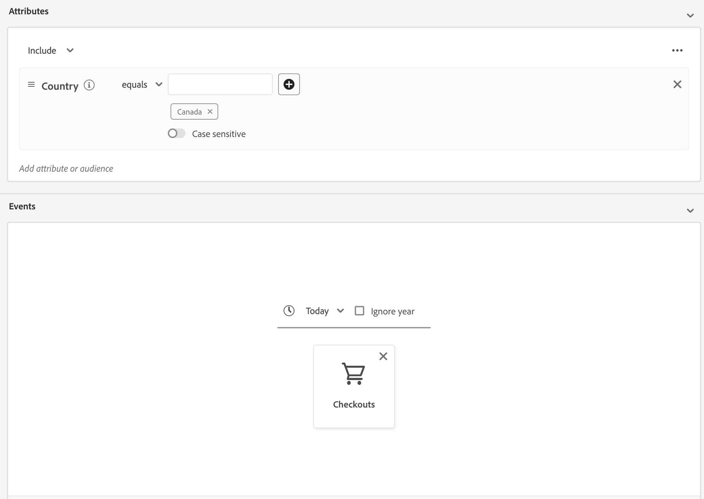

# Direktuppspelningssegmenteringsguide

>[!BEGINSHADEBOX]

>[!NOTE]
>
>Kriterierna för behörighet att dela upp direktuppspelning har uppdaterats den 20 maj 2025.

+++Behörighetsuppdateringar

>[!IMPORTANT]
>
>Alla befintliga segmentdefinitioner som för närvarande utvärderas med hjälp av direktuppspelning eller kantsegmentering fortsätter att fungera som de är, såvida de inte redigeras eller uppdateras.

## Linjeset {#ruleset}

Alla **nya eller redigerade**-segmentdefinitioner som matchar följande regeluppsättningar utvärderas **inte längre** med hjälp av direktuppspelning eller kantsegmentering. I stället utvärderas de med gruppsegmentering.

- En enstaka händelse med ett tidsfönster längre än 24 timmar
   - Aktivera en målgrupp med alla profiler som har visat en webbsida de senaste tre dagarna.
- En enda händelse utan tidsfönster
   - Aktivera en målgrupp med alla profiler som visade en webbsida.

## Tidsfönster {#time-window}

För att kunna utvärdera en målgrupp med direktuppspelningssegmentering måste **måste** begränsas inom ett 24-timmarsfönster.

## Inkludera batchdata i strömmande målgrupper {#include-batch-data}

Före den här uppdateringen kan du skapa en definition för direktuppspelad målgrupp som kombinerar både batchdatakällor och strömmande datakällor. I och med den senaste uppdateringen utvärderas dock möjligheten att skapa en målgrupp med både batch- och direktuppspelningsdatakällor med hjälp av gruppsegmentering.

Om du behöver utvärdera en segmentdefinition med hjälp av direktuppspelning eller kantsegmentering som matchar den uppdaterade regeluppsättningen, måste du explicit skapa en grupp- och direktuppspelningsregeluppsättning och kombinera dem med segment. Den här gruppregeluppsättningen **måste** baseras på ett profilschema.

Låt oss till exempel säga att du har två målgrupper, med en målgrupps schemadata och andra schemadata för boendeupplevelser:

| Målgrupp | Schema | Source type | Frågedefinition | Målgrupps-ID |
| -------- | ------ | ----------- | ---------------- | ----------- |
| Kalifornien | Profil | Grupp | Hemadressen är i delstaten Kalifornien | `e3be6d7f-1727-401f-a41e-c296b45f607a` |
| Senaste utcheckningar | Experience Event | Direktuppspelning | Har minst en utcheckning de senaste 24 timmarna | `9e1646bb-57ff-4309-ba59-17d6c5bab6a1` |

Om du vill använda gruppkomponenten i din direktuppspelande målgrupp måste du skapa en referens till gruppmålgruppen med hjälp av segment.

En exempelregeluppsättning som skulle kombinera de två målgrupperna skulle se ut så här:

```
inSegment("e3be6d7f-1727-401f-a41e-c296b45f607a") and 
CHAIN(xEvent, timestamp, [C0: WHAT(eventType.equals("commerce.checkouts", false)) 
WHEN(<= 24 hours before now)])
```

Den resulterande målgruppen *kommer* att utvärderas med direktuppspelningssegmentering, eftersom den utnyttjar gruppmålgruppens medlemskap genom att referera till gruppmålskomponenten.

Om du vill kombinera två målgrupper med händelsedata kan du **inte** bara kombinera de två händelserna. Du måste skapa båda målgrupperna och sedan skapa en annan målgrupp som använder `inSegment` för att referera till båda dessa målgrupper.

Låt oss till exempel säga att ni har två målgrupper, med båda målgrupperna som har händelseschemadata för upplevelsehändelser:

| Målgrupp | Schema | Source type | Frågedefinition | Målgrupps-ID |
| -------- | ------ | ----------- | ---------------- | ----------- |
| Senaste avhopp | Experience event | Grupp | Har minst en händelse om att användaren överger den under de senaste 24 timmarna | `e3be6d7f-1727-401f-a41e-c296b45f607a` |
| Senaste utcheckningar | Experience Event | Direktuppspelning | Har minst en utcheckning de senaste 24 timmarna | `9e1646bb-57ff-4309-ba59-17d6c5bab6a1` |

I den här situationen skulle du behöva skapa en tredje målgrupp enligt följande:

```
inSegment("e3be6d7f-1727-401f-a41e-c296b45f607a") and inSegment("9e1646bb-57ff-4309-ba59-17d6c5bab6a1")
```

>[!IMPORTANT]
>
>Alla befintliga segmentdefinitioner som matchar linjalerna utvärderas fortfarande med hjälp av direktuppspelning eller kantsegmentering tills de redigeras.
>
>Dessutom kommer alla befintliga segmentdefinitioner som för närvarande uppfyller de andra kriterierna för utvärdering av direktuppspelning eller kantsegmentering att utvärderas även fortsättningsvis med hjälp av direktuppspelning eller kantsegmentering.

## Kopplingsprincip {#merge-policy}

Alla **nya eller redigerade**-segmentdefinitioner som kvalificerar för direktuppspelning eller kantsegmentering **måste** finnas i sammanfogningsprincipen Aktiv på Edge.

Om det inte finns någon aktiv sammanfogningsprincip måste du [konfigurera din sammanfogningsprincip](../../profile/merge-policies/ui-guide.md#configure) och ange att den ska vara aktiv vid sidan.


+++

>[!ENDSHADEBOX]

Direktuppspelningssegmentering är möjligheten att utvärdera målgrupper i Adobe Experience Platform i nära realtid samtidigt som man fokuserar på datainsamling.

Med direktuppspelningssegmentering blir det numera en upplevelse av målgruppskvalificering när data strömmas in i Experience Platform, vilket minskar behovet av att schemalägga och köra segmenteringsjobb. På så sätt kan ni utvärdera data när de skickas till Experience Platform och automatiskt hålla målgruppsmedlemskapet uppdaterat.

## Tillgängliga regeluppsättningar {#rulesets}

>[!IMPORTANT]
>
>Om du vill använda direktuppspelningssegmentering **måste** använda en sammanfogningsprincip som är aktiv på Edge. Mer information om sammanfogningsprinciper finns i [översikten över sammanfogningsprinciper](../../profile/merge-policies/overview.md).

En regeluppsättning är berättigad till direktuppspelningssegmentering om den uppfyller något av de villkor som beskrivs i följande tabell.

>[!NOTE]
>
>För att direktuppspelningssegmenteringen ska fungera måste du aktivera schemalagd segmentering för organisationen. Mer information om hur du aktiverar schemalagd segmentering finns i [översikten över målportalen](../ui/audience-portal.md#scheduled-segmentation).

| Frågetyp | Information | Fråga | Exempel |
| ---------- | ------- | ----- | ------- |
| En händelse inom ett tidsfönster på mindre än 24 timmar | En segmentdefinition som refererar till en enda inkommande händelse inom ett tidsfönster på mindre än 24 timmar. | `CHAIN(xEvent, timestamp, [C0: WHAT(eventType.equals("commerce.checkouts", false)) WHEN(today)])` |  |
| Endast profil | En segmentdefinition som bara refererar till ett profilattribut. | `homeAddress.country.equals("US", false)` |  |
| En händelse med ett profilattribut inom ett relativt tidsfönster på mindre än 24 timmar | En segmentdefinition som refererar till en enda inkommande händelse, med ett eller flera profilattribut, och som inträffar inom ett relativt tidsfönster på mindre än 24 timmar. | `workAddress.country.equals("US", false) and CHAIN(xEvent, timestamp, [C0: WHAT(eventType.equals("commerce.checkouts", false)) WHEN(today)])` |  |
| Flera händelser inom ett relativt tidsfönster på 24 timmar | Alla segmentdefinitioner som refererar till flera händelser **under de senaste 24 timmarna** och (valfritt) har ett eller flera profilattribut. | `workAddress.country.equals("US", false) and CHAIN(xEvent, timestamp, [C0: WHAT(eventType.equals("directMarketing.emailClicked", false)) WHEN(today), C1: WHAT(eventType.equals("commerce.checkouts", false)) WHEN(today)])` |  |

En segmentdefinition är **inte** berättigad till direktuppspelningssegmentering i följande scenarier:

- Segmentdefinitionen innehåller segment eller egenskaper för Adobe Audience Manager (AAM).
- Segmentdefinitionen innehåller flera enheter (frågor om flera enheter).
- Segmentdefinitionen innehåller en kombination av en enda händelse och en `inSegment`-händelse.
   - Du kan till exempel kedja följande i en enda regeluppsättning: `inSegment("e3be6d7f-1727-401f-a41e-c296b45f607a") and  CHAIN(xEvent, timestamp, [C0: WHAT(eventType.equals("commerce.checkouts", false))  WHEN(<= 24 hours before now)])`.
- I segmentdefinitionen används&quot;Ignorera år&quot; som en del av tidsbegränsningarna.

Observera följande riktlinjer som gäller frågor om direktuppspelningssegmentering:

| Frågetyp | Riktlinje |
| ---------- | -------- |
| En enda händelselinjaluppsättning | Uppslagsfönstret är begränsat till **en dag**. |
| Fråga med händelsehistorik | <ul><li>Uppslagsfönstret är begränsat till **en dag**.</li><li>Det finns ett strikt tidsordningsvillkor **måste** mellan händelserna.</li><li>Frågor med minst en negerad händelse stöds. Hela händelsen **kan dock inte** vara en negation.</li></ul> |

Om en segmentdefinition ändras så att den inte längre uppfyller villkoren för direktuppspelningssegmentering, kommer segmentdefinitionen automatiskt att växla från&quot;direktuppspelning&quot; till&quot;Gruppering&quot;.

Dessutom sker okvalificerat segment, på samma sätt som segmentkvalificering, i realtid. Om en publik inte längre kvalificerar sig för ett segment blir det därför omedelbart okvalificerat. Om segmentdefinitionen till exempel frågar efter&quot;Alla användare som har köpt röda skor de senaste tre timmarna&quot;, efter tre timmar, kommer alla profiler som ursprungligen kvalificerades för segmentdefinitionen att vara okvalificerade.

### Kombinera målgrupper {#combine-audiences}

För att kunna kombinera data från både batch- och direktuppspelningskällor måste ni separera batch- och direktuppspelningskomponenterna till separata målgrupper.

### Profilattribut och upplevelsehändelse {#profile-and-event}

Låt oss till exempel ta följande två exempelmålgrupper i beaktande:

| Målgrupp | Schema | Source type | Frågedefinition | Målgrupps-ID |
| -------- | ------ | ----------- | ---------------- | ----------- |
| Kalifornien | Profil | Grupp | Hemadressen är i delstaten Kalifornien | `e3be6d7f-1727-401f-a41e-c296b45f607a` |
| Senaste utcheckningar | Experience Event | Direktuppspelning | Har minst en utcheckning de senaste 24 timmarna | `9e1646bb-57ff-4309-ba59-17d6c5bab6a1` |

Om du vill använda gruppkomponenten i din direktuppspelande målgrupp måste du skapa en referens till gruppmålgruppen med hjälp av segment.

En exempelregeluppsättning som skulle kombinera de två målgrupperna skulle se ut så här:

```
inSegment("e3be6d7f-1727-401f-a41e-c296b45f607a") and 
CHAIN(xEvent, timestamp, [C0: WHAT(eventType.equals("commerce.checkouts", false)) 
WHEN(<= 24 hours before now)])
```

Den resulterande målgruppen *kommer* att utvärderas med direktuppspelningssegmentering, eftersom den utnyttjar gruppmålgruppens medlemskap genom att referera till gruppmålskomponenten.

### Flera upplevelsehändelser {#two-events}

Om du vill kombinera flera målgrupper med händelsedata kan du **inte** bara kombinera händelserna. Du måste skapa en målgrupp för varje händelse och sedan skapa en annan målgrupp som använder `inSegment` för att referera till alla målgrupper.

Låt oss till exempel säga att ni har två målgrupper, med båda målgrupperna som har händelseschemadata för upplevelsehändelser:

| Målgrupp | Schema | Source type | Frågedefinition | Målgrupps-ID |
| -------- | ------ | ----------- | ---------------- | ----------- |
| Senaste avhopp | Experience event | Grupp | Har minst en händelse om att användaren överger den under de senaste 48 timmarna | `7deb246a-49b4-4687-95f9-6316df049948` |
| Senaste utcheckningar | Experience Event | Direktuppspelning | Har minst en utcheckning de senaste 24 timmarna | `9e1646bb-57ff-4309-ba59-17d6c5bab6a1` |

I den här situationen skulle du behöva skapa en tredje målgrupp enligt följande:

```
inSegment("7deb246a-49b4-4687-95f9-6316df049948) and inSegment("9e1646bb-57ff-4309-ba59-17d6c5bab6a1")
```

## Skapa målgrupper {#create-audience}

Du kan skapa en målgrupp som utvärderas med direktuppspelningssegmentering med hjälp av API:t för segmenteringstjänsten eller via Audience Portal i användargränssnittet.

En segmentdefinition kan vara direktuppspelningsaktiverad om den matchar någon av de [berättigade reglerna](#eligible-rulesets).

>[!BEGINTABS]

>[!TAB Segmenteringstjänstens API]

**API-format**

```http
POST /segment/definitions
```

**Begäran**

+++ En exempelbegäran om att skapa en segmentdefinition som är aktiverad för direktuppspelningssegmentering

```shell
curl -X POST https://platform.adobe.io/data/core/ups/segment/definitions
 -H 'Authorization: Bearer {ACCESS_TOKEN}' \
 -H 'Content-Type: application/json' \
 -H 'x-gw-ims-org-id: {ORG_ID}' \
 -H 'x-api-key: {API_KEY}' \
 -H 'x-sandbox-name: {SANDBOX_NAME}'
 -d '{
        "name": "People in the USA",
        "description: "An audience that looks for people who live in the USA",
        "expression": {
            "type": "PQL",
            "format": "pql/text",
            "value": "homeAddress.country = \"US\""
        },
        "evaluationInfo": {
            "batch": {
                "enabled": false
            },
            "continuous": {
                "enabled": true
            },
            "synchronous": {
                "enabled": false
            }
        },
        "schema": {
            "name": "_xdm.context.profile"
        }
     }'
```

+++

**Svar**

Ett lyckat svar returnerar HTTP-status 200 med information om den segmentdefinition du nyss skapade.

+++Ett exempelsvar när du skapar en segmentdefinition.

```json
{
    "id": "4afe34ae-8c98-4513-8a1d-67ccaa54bc05",
    "schema": {
        "name": "_xdm.context.profile"
    },
    "profileInstanceId": "ups",
    "imsOrgId": "{ORG_ID}",
    "sandbox": {
        "sandboxId": "28e74200-e3de-11e9-8f5d-7f27416c5f0d",
        "sandboxName": "prod",
        "type": "production",
        "default": true
    },
    "name": "People in the USA",
    "description": "An audience that looks for people who live in the USA",
    "expression": {
        "type": "PQL",
        "format": "pql/text",
        "value": "homeAddress.country = \"US\""
    },
    "evaluationInfo": {
        "batch": {
            "enabled": false
        },
        "continuous": {
            "enabled": true
        },
        "synchronous": {
            "enabled": false
        }
    },
    "dataGovernancePolicy": {
        "excludeOptOut": true
    },
    "creationTime": 0,
    "updateEpoch": 1579292094,
    "updateTime": 1579292094000
}
```

+++

Mer information om hur du använder den här slutpunkten finns i [segmentdefinitionsguiden](../api/segment-definitions.md).

>[!TAB Målgruppsportal]

Välj **[!UICONTROL Create audience]** i Audience Portal.


En pover visas. Välj **[!UICONTROL Build rules]** om du vill ange Segment Builder.


Skapa en segmentdefinition som matchar någon av de [berättigade reglerna](#eligible-rulesets) i Segment Builder. Om segmentdefinitionen kvalificerar för direktuppspelningssegmentering kan du välja **[!UICONTROL Streaming]** som **[!UICONTROL Evaluation method]**.


Mer information om hur du skapar segmentdefinitioner finns i guiden [Segment Builder](../ui/segment-builder.md)

>[!ENDTABS]

## Hämta målgrupper {#retrieve-audiences}

Du kan hämta alla målgrupper som utvärderas med hjälp av direktuppspelningssegmentering med hjälp av segmenteringstjänstens API eller via målgruppsportalen i användargränssnittet.

>[!BEGINTABS]

>[!TAB Segmenteringstjänstens API]

Hämta en lista över alla segmentdefinitioner som har utvärderats med hjälp av direktuppspelningssegmentering i organisationen genom att göra en GET-begäran till slutpunkten `/segment/definitions`.

**API-format**

Du måste inkludera frågeparametern `evaluationInfo.synchronous.enabled=true` i sökvägen för begäran för att hämta segmentdefinitioner som utvärderats med hjälp av direktuppspelningssegmentering.

```http
GET /segment/definitions?evaluationInfo.continuous.enabled=true
```

**Begäran**

+++ Ett exempel på en begäran om att lista alla segmentdefinitioner som kan direktuppspelas

```shell
curl -X GET 'https://platform.adobe.io/data/core/ups/segment/definitions?evaluationInfo.continuous.enabled=true' \
  -H 'Authorization: Bearer {ACCESS_TOKEN}' \
  -H 'Content-Type: application/json' \
  -H 'x-api-key: {API_KEY}' \
  -H 'x-gw-ims-org-id: {ORG_ID}' \
  -H 'x-sandbox-name: {SANDBOX_NAME}'
```

+++

**Svar**

Ett lyckat svar returnerar HTTP-status 200 med en array med segmentdefinitioner i organisationen som är aktiverade för direktuppspelningssegmentering.

+++Ett exempelsvar som innehåller en lista med alla segmentdefinitioner som kan direktuppspelas i organisationen

```json
{
    "segments": [
        {
            "id": "15063cb-2da8-4851-a2e2-bf59ddd2f004",
            "schema": {
                "name": "_xdm.context.profile"
            },
            "ttlInDays": 30,
            "imsOrgId": "{ORG_ID}",
            "sandbox": {
                "sandboxId": "",
                "sandboxName": "",
                "type": "production",
                "default": true
            },
            "name": " People who are NOT on their homepage ",
            "expression": {
                "type": "PQL",
                "format": "pql/text",
                "value": "select var1 from xEvent where var1._experience.analytics.endUser.firstWeb.webPageDetails.isHomePage = false"
            },
            "evaluationInfo": {
                "batch": {
                    "enabled": false
                },
                "continuous": {
                    "enabled": true
                },
                "synchronous": {
                    "enabled": false
                }
            },
            "creationTime": 1572029711000,
            "updateEpoch": 1572029712000,
            "updateTime": 1572029712000
        },
        {
            "id": "f15063cb-2da8-4851-a2e2-bf59ddd2f004",
            "schema": {
                "name": "_xdm.context.profile"
            },
            "ttlInDays": 30,
            "imsOrgId": "{ORG_ID}",
            "sandbox": {
                "sandboxId": "",
                "sandboxName": "",
                "type": "production",
                "default": true
            },
            "name": "Homepage_continuous",
            "description": "People who are on their homepage - continuous",
            "expression": {
                "type": "PQL",
                "format": "pql/text",
                "value": "select var1 from xEvent where var1._experience.analytics.endUser.firstWeb.webPageDetails.isHomePage = true"
            },
            "evaluationInfo": {
                "batch": {
                    "enabled": true
                },
                "continuous": {
                    "enabled": true
                },
                "synchronous": {
                    "enabled": false
                }
            },
            "creationTime": 1572021085000,
            "updateEpoch": 1572021086000,
            "updateTime": 1572021086000
        }
    ],
    "page": {
        "totalCount": 2,
        "totalPages": 1,
        "sortField": "creationTime",
        "sort": "desc",
        "pageSize": 2,
        "limit": 100
    },
    "link": {}
}
```

Mer detaljerad information om den returnerade segmentdefinitionen finns i [stödlinjen för segmentdefinitioner](../api/segment-definitions.md).

+++

>[!TAB Målgruppsportal]

Du kan hämta alla målgrupper som är aktiverade för direktuppspelningssegmentering inom organisationen med hjälp av filter i Audience Portal. Välj  för att visa filterlistan.


Gå till **[!UICONTROL Update frequency]** och välj [!UICONTROL Streaming] inom de tillgängliga filtren. När du använder det här filtret visas alla målgrupper i organisationen som utvärderas med direktuppspelningssegmentering.


Om du vill veta mer om hur du visar målgrupper i Experience Platform kan du läsa [guiden för målportalen](../ui/audience-portal.md).

>[!ENDTABS]

## Målgruppsinformation {#audience-details}

Du kan visa information om en viss målgrupp som utvärderats med hjälp av direktuppspelningssegmentering genom att markera den i målportalen.

När du har valt en målgrupp på Audience Portal visas sidan med målgruppsinformation. Här visas information om målgruppen, inklusive en sammanfattning av målgruppsinformationen, antalet kvalificerade profiler över tiden samt vilka mål målgruppen har aktiverats för.


För direktuppspelningsaktiverade målgrupper visas **[!UICONTROL Profiles over time]**-kortet, som visar det totala antalet kvalificerade och de nya målgruppsuppdaterade mätvärdena.

Måttet **[!UICONTROL Total qualified]** representerar det totala antalet kvalificerade målgrupper baserat på batch- och direktuppspelningsutvärderingar för den här målgruppen.

Måttet **[!UICONTROL New audience updated]** representeras av ett linjediagram som visar förändringen i målgruppsstorlek genom direktuppspelningssegmentering. Du kan justera listrutan så att den visar de senaste 24 timmarna, den senaste veckan eller de senaste 30 dagarna.


Mer information om målgruppsinformation finns i [Översikt över målgruppsportalen](../ui/audience-portal.md#audience-details).

## Nästa steg

Den här guiden förklarar hur definitioner av direktuppspelningsaktiverade segment fungerar i Adobe Experience Platform och hur man övervakar definitioner av direktuppspelningsaktiverade segment.

Läs [Användarhandboken för segmentering](./overview.md) om du vill veta mer om hur du använder användargränssnittet i Adobe Experience Platform.

Vanliga frågor om direktuppspelningssegmentering finns i avsnittet [direktuppspelningssegmentering i Frågor och svar](../faq.md#streaming-segmentation).
