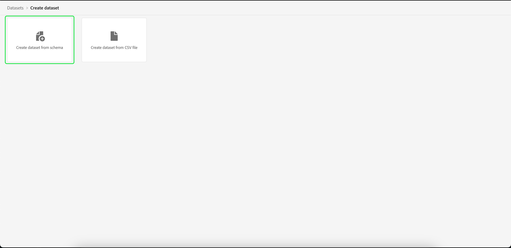

# Skapa en datauppsättning för att exportera ett målgruppssegment

[!DNL Adobe Experience Platform] gör att ni kan segmentera kundprofiler i målgrupper baserat på specifika attribut. När ett segment har skapats kan du exportera den målgruppen till en datauppsättning där den kan nås och hanteras. För att exporten ska lyckas måste datauppsättningen konfigureras korrekt.

I den här självstudiekursen går du igenom de steg som krävs för att skapa en datauppsättning som kan användas för att exportera ett målgruppssegment med hjälp av användargränssnittet i [!DNL Experience Platform].

Den här självstudiekursen är direkt relaterad till de steg som beskrivs i självstudiekursen om [utvärdering och åtkomst av segmentresultat](./evaluate-a-segment.md). I självstudiekursen för segmentutvärdering beskrivs stegen för hur du skapar en datauppsättning med hjälp av API:t [!DNL Catalog Service], medan den här självstudiekursen beskriver stegen för att skapa en datauppsättning med hjälp av användargränssnittet [!DNL Experience Platform].

## Komma igång

För att kunna exportera ett segment måste datauppsättningen baseras på [!DNL XDM Individual Profile Union Schema]. Ett unionsschema är ett systemgenererat, skrivskyddat schema som samlar fälten för alla scheman som delar samma klass. Mer information om unionsscheman finns i guiden [Grundläggande om schemakomposition](../../xdm/schema/composition.md#union).

Om du vill visa unionsscheman i användargränssnittet väljer du **[!UICONTROL Profiles]** i den vänstra navigeringen och väljer sedan **[!UICONTROL Union Schema]** enligt nedan.

## Arbetsytan Datauppsättningar

Med arbetsytan [!UICONTROL Datasets] kan du visa och hantera alla datauppsättningar för din organisation.

Välj **[!UICONTROL Datasets]** i den vänstra navigeringen för att komma åt arbetsytan och välj sedan **[!UICONTROL Browse]**. På den här fliken visas en lista med datauppsättningar och deras information. Beroende på bredden på varje kolumn kan du behöva rulla åt vänster eller höger för att se alla kolumner.

>[!NOTE]
>
>Markera filterikonen bredvid sökfältet om du vill använda filterfunktioner för att endast visa de datauppsättningar som är aktiverade för [!DNL Real-time Customer Profile].

## Skapa en datauppsättning

Om du vill skapa en datauppsättning väljer du **[!UICONTROL Create Dataset]**.

Välj **[!UICONTROL Create Dataset from Schema]** på nästa skärm.

## Välj XDM-schema för enskild profilunion

Om du vill välja [!DNL XDM Individual Profile Union Schema] som ska användas i din datauppsättning, söker du efter schemat [!UICONTROL XDM Individual Profile] på skärmen **[!UICONTROL Select Schema]**. När du har valt schemat kan du bekräfta om det är unionsschemat under **[!UICONTROL API Usage]** i den högra listen. Om sökvägen [!UICONTROL Schema] avslutas med `_union` är det ett unionsschema.

>[!NOTE]
>
>Trots att fackliga scheman per definition deltar i kundprofiler i realtid, listas de som&quot;Inte aktiverade&quot; på grund av att de inte är aktiverade för profil på samma sätt som traditionella scheman.

Markera alternativknappen bredvid **[!UICONTROL XDM Individual Profile]** och välj sedan **[!UICONTROL Next]**.

## Konfigurera datauppsättning

På nästa skärm måste du ge datauppsättningen ett namn. Du kan också lägga till en valfri beskrivning.

**Anteckningar om datauppsättningsnamn:**
* Datauppsättningsnamnen ska vara korta och beskrivande så att datauppsättningen kan hittas i biblioteket senare.
* Datauppsättningsnamnen måste vara unika, vilket innebär att de också måste vara tillräckligt specifika för att de inte ska återanvändas i framtiden.
* Det är bäst att ge ytterligare information om datauppsättningen med hjälp av beskrivningsfältet, eftersom det kan hjälpa andra användare att skilja mellan datauppsättningar i framtiden.

När datauppsättningen har ett namn och en beskrivning väljer du **[!UICONTROL Finish]**.

## Datauppsättningsaktivitet

När datauppsättningen har skapats visas aktivitetssidan för den datauppsättningen. Du bör se namnet på datauppsättningen i det övre vänstra hörnet av arbetsytan, tillsammans med ett meddelande om att&quot;Inga grupper har lagts till&quot;. Detta förväntas eftersom du inte har lagt till några batchar i den här datauppsättningen än.

Den högra listen innehåller information om din nya datauppsättning, t.ex. datauppsättnings-ID, namn, beskrivning, schema med mera. Observera **[!UICONTROL Dataset ID]** eftersom det här värdet krävs för att slutföra arbetsflödet för målgruppsexport.

## Nästa steg

Nu när du har skapat en datauppsättning baserad på [!DNL XDM Individual Profile Union Schema] kan du använda datauppsättnings-ID:t för att fortsätta med [utvärderingen och åtkomsten till segmentresultaten](./evaluate-a-segment.md)-självstudiekursen.

Återgå till självstudiekursen för att utvärdera segmentresultaten och fortsätt med att välja bland [genereringsprofiler för målgruppsmedlemmar](./evaluate-a-segment.md#generate-profiles) steg i processen för att exportera ett segmentarbetsflöde.
