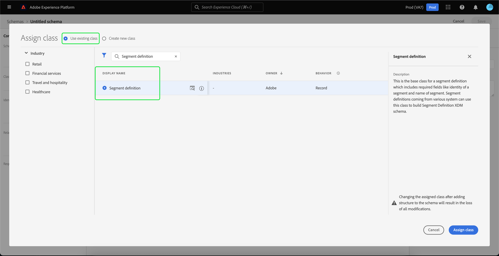

# Importera och använda externa målgrupper

Adobe Experience Platform har stöd för import av externa målgrupper, som sedan kan användas som komponenter för en ny segmentdefinition. Det här dokumentet innehåller en självstudiekurs om hur du konfigurerar Experience Platform för att importera och använda externa målgrupper.

## Komma igång

- [Segmenteringstjänst](../home.md): Gör att ni kan bygga målgruppssegment utifrån kundprofildata i realtid.
- [Kundprofil](../../profile/home.md) i realtid: Ger en enhetlig konsumentprofil i realtid baserad på aggregerade data från flera källor.
- [Experience Data Model (XDM)](../../xdm/home.md): Det standardiserade ramverk som Platform använder för att organisera kundupplevelsedata.
- [Datauppsättningar](../../catalog/datasets/overview.md): Konstruktionen för lagring och hantering av databeständighet i Experience Platform.
- [Direktinmatning](../../ingestion/streaming-ingestion/overview.md): Så här importerar och lagrar Experience Platform data från klient- och serverenheter i realtid.

## Skapa ett identitetsnamnutrymme för den externa målgruppen

Det första steget för att använda externa målgrupper är att skapa ett identitetsnamnutrymme. Med identitetsnamnutrymmen kan plattformen associera varifrån ett segment kommer.

Följ instruktionerna i [guiden för identitetsnamnutrymme](../../identity-service/namespaces.md#manage-namespaces) för att skapa ett identitetsnamnutrymme. När du skapar ditt identitetsnamnutrymme lägger du till källinformationen i identitetsnamnutrymmet och markerar dess [!UICONTROL Type] som **[!UICONTROL Non-people identifier]**.

## Skapa ett schema för segmentmetadata

När du har skapat ett identitetsnamnutrymme måste du skapa ett nytt schema för det segment som du ska skapa.

Om du vill börja komponera ett schema väljer du först **[!UICONTROL Schemas]** i det vänstra navigeringsfältet, följt av **[!UICONTROL Create schema]** i det övre högra hörnet på arbetsytan Scheman. Här väljer du **[!UICONTROL Browse]** för att se ett fullständigt urval av tillgängliga schematyper.

Eftersom du skapar en segmentdefinition, som är en fördefinierad klass, väljer du **[!UICONTROL Use existing class]**. Välj nu klassen **[!UICONTROL Segment definition]** följt av **[!UICONTROL Assign class]**.

Nu när schemat har skapats måste du ange vilket fält som ska innehålla segment-ID:t. Det här fältet bör markeras som primär identitet och tilldelas de namnutrymmen som du skapade tidigare.

När du har markerat `_id`-fältet som primär identitet väljer du schemats titel, följt av växlingsknappen **[!UICONTROL Profile]**. Välj **[!UICONTROL Enable]** om du vill aktivera schemat för [!DNL Real-time Customer Profile].

Det här schemat är nu aktiverat för profilen, med den primära identifieringen tilldelad till det icke-personliga ID-namnområdet som du skapade. Detta innebär att segmentmetadata som importeras till plattformen med det här schemat kommer att importeras till profilen utan att sammanfogas med andra personrelaterade profildata.

## Skapa en datauppsättning för schemat

När du har konfigurerat schemat måste du skapa en datauppsättning för segmentets metadata.

Om du vill skapa en datauppsättning följer du instruktionerna i [användarhandboken för datauppsättningen](../../catalog/datasets/user-guide.md#create). Du kommer att följa alternativet **[!UICONTROL Create dataset from schema]** med det schema du skapade tidigare.

När du har skapat datauppsättningen fortsätter du att följa instruktionerna i [användarhandboken för datauppsättningen](../../catalog/datasets/user-guide.md#enable-profile) för att aktivera datauppsättningen för kundprofilen i realtid.

## Konfigurera och importera målgruppsdata

När datauppsättningen är aktiverad kan data nu skickas till plattformen antingen via användargränssnittet eller med Experience Platform API:er. Om du vill importera dessa data till plattformen måste du skapa en direktuppspelningsanslutning.

Om du vill skapa en direktuppspelningsanslutning kan du följa instruktionerna i självstudiekursen [API](../../sources/tutorials/api/create/streaming/http.md) eller [användargränssnittet](../../sources/tutorials/ui/create/streaming/http.md).

När du har skapat en direktuppspelningsanslutning får du tillgång till din unika slutpunkt för direktuppspelning som du kan skicka data till. Läs [självstudiekursen om direktuppspelning av postdata](../../ingestion/tutorials/streaming-record-data.md#ingest-data) om du vill lära dig hur du skickar data till dessa slutpunkter.

## Skapa segment med importerade målgrupper

När de importerade målgrupperna har konfigurerats kan de användas som en del av segmenteringsprocessen. Om du vill hitta externa målgrupper går du till segmentbyggaren och väljer fliken **[!UICONTROL Audiences]** i avsnittet **[!UICONTROL Fields]**.

## Nästa steg

Nu när ni kan använda externa målgrupper i era segment kan ni använda segmentverktyget för att skapa segment. Om du vill veta mer om hur du skapar segment kan du läsa [självstudiekursen om hur du skapar segment](./create-a-segment.md).