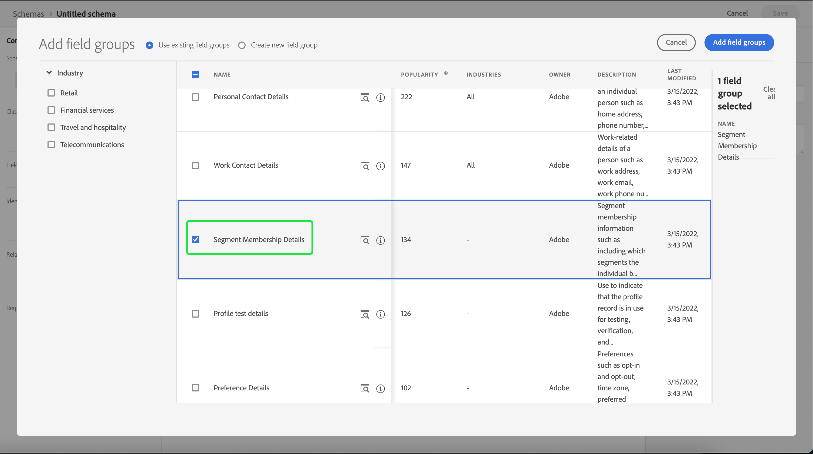

# Importera och använda externa målgrupper

>[!IMPORTANT]
>
>Dokumentationen innehåller information från en tidigare version av publikens dokumentation och är därför inaktuell.

Adobe Experience Platform stöder import av externa användare, som sedan kan användas som komponenter för en ny publik. Det här dokumentet innehåller en självstudiekurs om hur du konfigurerar Experience Platform för att importera och använda externa målgrupper.

## Komma igång

Den här självstudiekursen kräver en fungerande förståelse av de olika [!DNL Adobe Experience Platform]-tjänster som används för att skapa målgrupper. Innan du börjar med den här självstudiekursen bör du läsa dokumentationen för följande tjänster:

- [Segmenteringstjänst](../home.md): Gör att du kan skapa målgrupper från kundprofildata i realtid.
- [Kundprofil i realtid](../../profile/home.md): Tillhandahåller en enhetlig konsumentprofil i realtid baserad på aggregerade data från flera källor.
- [Experience Data Model (XDM)](../../xdm/home.md): Det standardiserade ramverk som Experience Platform organiserar kundupplevelsedata med. För att du ska kunna använda segmentering bör du se till att dina data är inmatade som profiler och händelser enligt [bästa praxis för datamodellering](../../xdm/schema/best-practices.md).
- [Datauppsättningar](../../catalog/datasets/overview.md): Konstruktionen för lagring och hantering av databeständighet i Experience Platform.
- [Direktuppspelningsuppläsning](../../ingestion/streaming-ingestion/overview.md): Hur Experience Platform importerar och lagrar data från klient- och serverenheter i realtid.

### Målgrupper jämfört med segmentdefinitioner

Innan du börjar importera och använda externa målgrupper är det viktigt att förstå skillnaden mellan målgrupper och segmentdefinitioner.

Publiken refererar till den grupp profiler som du försöker filtrera mot. När du använder segmentdefinitioner kan du skapa en målgrupp genom att skapa en segmentdefinition som filtrerar dina profiler till den delmängd som uppfyller kriterierna för segmentkvalificering.

Segmentdefinitioner innehåller information som namn, beskrivning, uttryck (om tillämpligt), skapandedatum, senaste ändringsdatum och ett ID. ID:t länkar segmentmetadata till de enskilda profiler som uppfyller segmentkvalificeringen och är en del av den slutliga målgruppen.

| Målgrupper | Segmentdefinition |
| --------- | ---------------- |
| Den grupp med profiler som du försöker hitta. När du använder segmentdefinitioner innebär det att det är den grupp av profiler som uppfyller villkoren för segment. | Den grupp regler som används för att segmentera målgruppen du söker. |

## Skapa ett identitetsnamnutrymme för den externa målgruppen

Det första steget för att använda externa målgrupper är att skapa ett identitetsnamnutrymme. Med identitetsnamnutrymmen kan Experience Platform associera var en målgrupp kommer ifrån.

Följ instruktionerna i guiden [Identitetsnamnrymd](../../identity-service/features/namespaces.md#manage-namespaces) om du vill skapa ett identitetsnamnutrymme. När du skapar ditt identitetsnamnutrymme lägger du till källinformationen i identitetsnamnutrymmet och markerar dess [!UICONTROL Type] som en **[!UICONTROL Non-people identifier]**.


## Skapa ett schema för segmentmetadata

När du har skapat ett identitetsnamnutrymme måste du skapa ett nytt schema för det segment som du ska skapa.

Om du vill börja komponera ett schema väljer du först **[!UICONTROL Schemas]** i det vänstra navigeringsfältet, följt av **[!UICONTROL Create schema]** i det övre högra hörnet på arbetsytan Scheman. Här väljer du **[!UICONTROL Browse]** om du vill se ett fullständigt urval av tillgängliga schematyper.


Eftersom du skapar en segmentdefinition, som är en fördefinierad klass, väljer du **[!UICONTROL Use existing class]**. Välj nu klassen **[!UICONTROL Segment definition]** följt av **[!UICONTROL Assign class]**.


Nu när schemat har skapats måste du ange vilket fält som ska innehålla segment-ID:t. Det här fältet bör markeras som primär identitet och tilldelas de namnutrymmen som du skapade tidigare.


När du har markerat fältet `_id` som primär identitet markerar du schemats titel, följt av växlingstecknet **[!UICONTROL Profile]**. Välj **[!UICONTROL Enable]** om du vill aktivera schemat för [!DNL Real-Time Customer Profile].


Det här schemat är nu aktiverat för profilen, med den primära identifieringen tilldelad till det icke-personliga ID-namnområdet som du skapade. Detta innebär att segmentmetadata som importeras till Experience Platform med det här schemat kommer att importeras till profilen utan att sammanfogas med andra personrelaterade profildata.

## Skapa en datauppsättning för schemat

När du har konfigurerat schemat måste du skapa en datauppsättning för segmentets metadata.

Om du vill skapa en datauppsättning följer du instruktionerna i användarhandboken för [datauppsättningen](../../catalog/datasets/user-guide.md#create). Du bör följa alternativet **[!UICONTROL Create dataset from schema]** med det schema som du skapade tidigare.


När du har skapat datauppsättningen fortsätter du att följa instruktionerna i [användarhandboken för datauppsättningen](../../catalog/datasets/user-guide.md#enable-profile) för att aktivera den här datauppsättningen för kundprofilen i realtid.


## Konfigurera och importera målgruppsdata

När datauppsättningen är aktiverad kan data nu skickas till Experience Platform antingen via användargränssnittet eller med Experience Platform API:er. Du kan importera dessa data antingen via en batch- eller direktuppspelningsanslutning.

### Infoga data med en batchanslutning

Om du vill skapa en gruppanslutning kan du följa instruktionerna i den allmänna [användargränssnittshandboken för lokal filöverföring](../../sources/tutorials/ui/create/local-system/local-file-upload.md). En fullständig lista över tillgängliga källor som du kan använda import av data med finns i [källöversikten](../../sources/home.md).

### Importera data via en direktuppspelningsanslutning

Om du vill skapa en direktuppspelningsanslutning kan du följa instruktionerna i [API-självstudiekursen](../../sources/tutorials/api/create/streaming/http.md) eller [gränssnittsjälvstudiekursen](../../sources/tutorials/ui/create/streaming/http.md).

När du har skapat en direktuppspelningsanslutning får du tillgång till din unika slutpunkt för direktuppspelning som du kan skicka data till. Om du vill lära dig hur du skickar data till de här slutpunkterna kan du läsa [självstudiekursen om direktuppspelning av postdata](../../ingestion/tutorials/streaming-record-data.md#ingest-data).


## Struktur för målgruppsmetadata

När du har skapat en anslutning kan du nu importera dina data till Experience Platform.

Ett exempel på den externa målgruppens nyttolastmetadata visas nedan:

```json
{
    "header": {
        "schemaRef": {
            "id": "https://ns.adobe.com/{TENANT_ID}/schemas/{SCHEMA_ID}",
            "contentType": "application/vnd.adobe.xed-full+json;version=1"
        },
        "imsOrgId": "{ORG_ID}",
        "datasetId": "{DATASET_ID}",
        "source": {
            "name": "Sample External Audience"
        }
    },
    "body": {
        "xdmMeta": {
            "schemaRef": {
                "id": "https://ns.adobe.com/{TENANT_ID}/schemas/{SCHEMA_ID}",
                "contentType": "application/vnd.adobe.xed-full+json;version=1"
            }
        },
        "xdmEntity": {
            "_id": "{SEGMENT_ID}",
            "description": "Sample description",
            "identityMap": {
                "{IDENTITY_NAMESPACE}": [{
                    "id": "{}"
                }]
            },
            "segmentName" : "{SEGMENT_NAME}",
            "segmentStatus": "ACTIVE",
            "version": "1.0"
        }
    }
}
```

| Egenskap | Beskrivning |
| -------- | ----------- |
| `schemaRef` | Schemat **måste** referera till det tidigare skapade schemat för segmentmetadata. |
| `datasetId` | Datauppsättnings-ID:t **måste** referera till den tidigare skapade datauppsättningen för det schema du just skapade. |
| `xdmEntity._id` | ID:t **måste** referera till samma segment-ID som du använder som din externa målgrupp. |
| `xdmEntity.identityMap` | Det här avsnittet **måste** innehålla identitetsetiketten som används när det tidigare skapade namnutrymmet skapas. |
| `{IDENTITY_NAMESPACE}` | Detta är etiketten för det identitetsnamnutrymme som skapades tidigare. Om du till exempel anropar ditt identitetsnamnutrymme &quot;externalAudience&quot;, använder du det som nyckel för arrayen. |
| `segmentName` | Namnet på det segment som du vill att den externa målgruppen ska segmenteras av. |

## Skapa segment med importerade målgrupper

När de importerade målgrupperna har konfigurerats kan de användas som en del av segmenteringsprocessen. Om du vill hitta externa målgrupper går du till segmentbyggaren och väljer fliken **[!UICONTROL Audiences]** i avsnittet **[!UICONTROL Fields]**.


## Nästa steg

Nu när ni kan använda externa målgrupper i era segment kan ni använda segmentverktyget för att skapa segment. Om du vill veta mer om hur du skapar segment kan du läsa [självstudiekursen om hur du skapar segment](./create-a-segment.md).

## Bilaga

Förutom att använda importerade externa målgruppsmetadata och använda dem för att skapa segment, kan du även importera externa segmentmedlemskap till Experience Platform.

### Ställ in ett externt målschema för segmentmedlemskap

Om du vill börja komponera ett schema väljer du först **[!UICONTROL Schemas]** i det vänstra navigeringsfältet, följt av **[!UICONTROL Create schema]** i det övre högra hörnet på arbetsytan Scheman. Välj **[!UICONTROL XDM Individual Profile]** härifrån.


Nu när schemat har skapats måste du lägga till fältgruppen för segmentmedlemskap som en del av schemat. Om du vill göra det väljer du [!UICONTROL Segment Membership Details] följt av [!UICONTROL Add field groups].



Kontrollera dessutom att schemat är markerat för **[!UICONTROL Profile]**. För att kunna göra detta måste du markera ett fält som primär identitet.


### Konfigurera datauppsättningen

När du har skapat schemat måste du skapa en datauppsättning.

Om du vill skapa en datauppsättning följer du instruktionerna i användarhandboken för [datauppsättningen](../../catalog/datasets/user-guide.md#create). Du bör följa alternativet **[!UICONTROL Create dataset from schema]** med det schema som du skapade tidigare.


När du har skapat datauppsättningen fortsätter du att följa instruktionerna i [användarhandboken för datauppsättningen](../../catalog/datasets/user-guide.md#enable-profile) för att aktivera den här datauppsättningen för kundprofilen i realtid.


## Ställ in och importera externa data för målgruppsmedlemskap

När datauppsättningen är aktiverad kan data nu skickas till Experience Platform antingen via användargränssnittet eller med Experience Platform API:er. Du kan importera dessa data antingen via en batch- eller direktuppspelningsanslutning.

### Infoga data med en batchanslutning

Om du vill skapa en gruppanslutning kan du följa instruktionerna i den allmänna [användargränssnittshandboken för lokal filöverföring](../../sources/tutorials/ui/create/local-system/local-file-upload.md). En fullständig lista över tillgängliga källor som du kan använda import av data med finns i [källöversikten](../../sources/home.md).

### Importera data via en direktuppspelningsanslutning

Om du vill skapa en direktuppspelningsanslutning kan du följa instruktionerna i [API-självstudiekursen](../../sources/tutorials/api/create/streaming/http.md) eller [gränssnittsjälvstudiekursen](../../sources/tutorials/ui/create/streaming/http.md).

När du har skapat en direktuppspelningsanslutning får du tillgång till din unika slutpunkt för direktuppspelning som du kan skicka data till. Om du vill lära dig hur du skickar data till de här slutpunkterna kan du läsa [självstudiekursen om direktuppspelning av postdata](../../ingestion/tutorials/streaming-record-data.md#ingest-data).


## Segmentmedlemsstruktur

När du har skapat en anslutning kan du nu importera dina data till Experience Platform.

Ett exempel på nyttolasten för det externa målgruppsmedlemskapet visas nedan:

```json
{
    "header": {
        "schemaRef": {
            "id": "https://ns.adobe.com/{TENANT_ID}/schemas/{SCHEMA_ID}",
            "contentType": "application/vnd.adobe.xed-full+json;version=1"
        },
        "imsOrgId": "{ORG_ID}",
        "datasetId": "{DATASET_ID}",
        "source": {
            "name": "Sample External Audience Membership"
        }
    },
    "body": {
        "xdmMeta": {
            "schemaRef": {
                "id": "https://ns.adobe.com/{TENANT_ID}/schemas/{SCHEMA_ID}",
                "contentType": "application/vnd.adobe.xed-full+json;version=1"
            }
        },
        "xdmEntity": {
            "_id": "{UNIQUE_ID}",
            "description": "Sample description",
            "{TENANT_NAME}": {
                "identities": {
                    "{SCHEMA_IDENTITY}": "sample-id"
                }
            },
            "personId" : "sample-name",
            "segmentMembership": {
                "{IDENTITY_NAMESPACE}": {
                    "{EXTERNAL_IDENTITY}": {
                        "status": "realized",
                        "lastQualificationTime": "2022-03-14T:00:00:00Z"
                    }
                }
            }
        }
    }
}
```

| Egenskap | Beskrivning |
| -------- | ----------- |
| `schemaRef` | Schemat **måste** referera till det tidigare skapade schemat för segmentmedlemskapsdata. |
| `datasetId` | Datauppsättnings-ID:t **måste** referera till den tidigare skapade datauppsättningen för det medlemsschema som du just skapade. |
| `xdmEntity._id` | Ett lämpligt ID som används för att unikt identifiera posten i datauppsättningen. |
| `{TENANT_NAME}.identities` | Det här avsnittet används för att koppla fältgruppen för anpassade identiteter till de användare som du tidigare importerat. |
| `segmentMembership.{IDENTITY_NAMESPACE}` | Det här är etiketten för det anpassade identitetsnamnutrymmet som skapades tidigare. Om du till exempel anropar ditt identitetsnamnutrymme &quot;externalAudience&quot;, använder du det som nyckel för arrayen. |

>[!NOTE]
>
>Som standard tas externa medlemskap bort efter 30 dagar. Om du vill förhindra att de tas bort och att de sparas i mer än 30 dagar använder du fältet `validUntil` när du importerar målgruppsdata. Mer information om det här fältet finns i guiden för [schemafältgrupper för segmentmedlemsinformation](../../xdm/field-groups/profile/segmentation.md).
