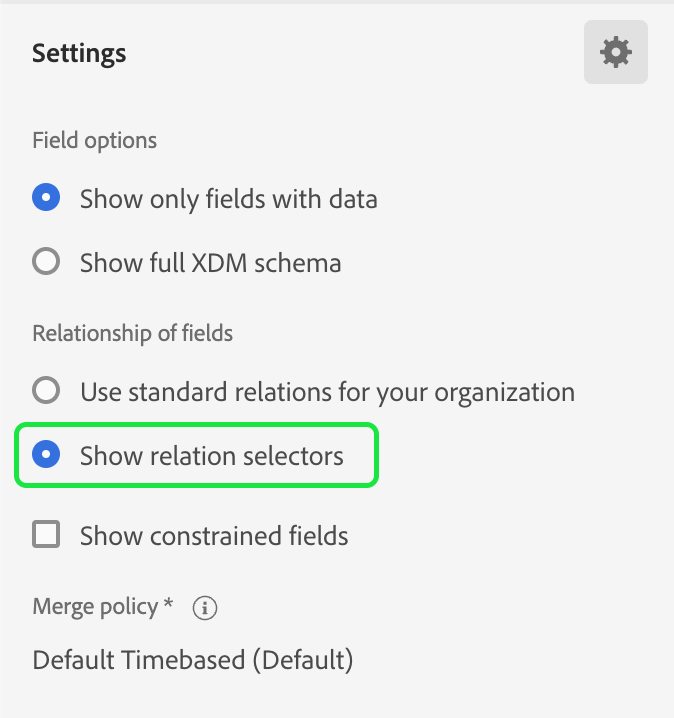

# Kontomålgrupper

>[!AVAILABILITY]
>
>Kontomålgrupper är bara tillgängliga i [B2B edition för Real-time Customer Data Platform](../../rtcdp/overview.md#rtcdp-b2b) och [B2P-utgåvan av Real-time Customer Data Platform](../../rtcdp/overview.md#rtcdp-b2p).

Med kontosegmentering kan Adobe Experience Platform göra marknadsföringssegmenteringen från personbaserade målgrupper till kontobaserade målgrupper så enkel och sofistikerad som möjligt.

Kontomålgrupper kan användas som indata för kontobaserade destinationer, så att ni kan inrikta er på personer inom dessa konton i underordnade tjänster. Du kan till exempel använda kontobaserade målgrupper för att hämta poster för alla konton som **inte** har kontaktinformation för alla personer med titeln Chief Operating Officer (COO) eller Chief Marketing Officer (CMO).

## Terminologi {#terminology}

Innan du börjar med kontomålgrupper bör du granska skillnaderna mellan olika typer av målgrupper:

- **Kontomålgrupper**: En kontomålgrupp är en målgrupp som skapas med **konto**-profildata. Kontoprofildata kan användas för att skapa målgrupper som riktar sig till personer i efterföljande konton. Mer information om kontoprofiler finns i översikten över [kontoprofilen](../../rtcdp/accounts/account-profile-overview.md).
- **Målgrupper**: En målgrupp är en målgrupp som skapas med **kundprofildata**. Kundprofildata kan användas för att skapa målgrupper som riktar sig till företagets kunder. Mer information om kundprofiler finns i [Översikt över kundprofiler i realtid](../../profile/home.md).
- **Potentiella målgrupper**: En publik för potentiella kunder är en målgrupp som skapas med **prospekt** profildata. Prospektprofildata kan användas för att skapa målgrupper från oautentiserade användare. Mer information om profiler för potentiella kunder finns i översikten över profilen för [potentiella kunder](../../profile/ui/prospect-profile.md).

## Åtkomst {#access}

Om du vill få åtkomst till målgrupper väljer du **[!UICONTROL Audiences]** i avsnittet **[!UICONTROL Accounts]**.

Sidan [!UICONTROL Browse] visas med en lista över alla kontomålgrupper för organisationen.

I den här vyn visas information om målgruppen, inklusive namn, antal profiler, ursprung, livscykelstatus, skapat datum och senaste uppdateringsdatum.

Du kan också använda sök- och filtreringsfunktionerna för att snabbt söka efter och sortera efter specifika kontogrupper. Mer information om den här funktionen finns i [Översikt över målportalen](./audience-portal.md#manage-audiences).

## Skapa målgrupper {#create}

>[!NOTE]
>
>Kontomålgrupper utvärderas med **batch**-segmentering och utvärderas var 24:e timme.

Välj **[!UICONTROL Create audience]** på sidan [!UICONTROL Browse] om du vill skapa en kontopublik.

![Knappen [!UICONTROL Create audience] är markerad på kontomålets webbsida.](../images/ui/account-audiences/select-create-audience.png)

Segmentbyggaren visas. Kontoattributen och målgrupperna visas i det vänstra navigeringsfältet. På fliken [!UICONTROL Attributes] kan du lägga till både plattformsskapade och anpassade attribut.

När du skapar kontomålgrupper bör du tänka på att händelser listas under **[!UICONTROL People]**, i stället för att vara deras egen flik, eftersom dessa attribut associeras med personer.

![Platsen där händelser ska hittas, som finns i mappen [!UICONTROL People], markeras.](../images/ui/account-audiences/attributes.png)

Under fliken [!UICONTROL Audiences] kan du lägga till tidigare skapade personbaserade målgrupper som du kan bygga vidare på när du skapar en egen målgrupp.

Mer information om hur du använder Segment Builder finns i [användargränssnittsguiden för Segment Builder](./segment-builder.md).

### Upprätta relationer {#relationships}

Som standard visas den direkta relationen mellan ett konto och en person i gränssnittet i Segment Builder. Andra relationstyper är dock tillgängliga för kontomålgrupper.

Om du vill använda de alternativa relationstyperna väljer du .

På fliken [!UICONTROL Settings] väljer du **[!UICONTROL Show relationship selectors]** i avsnittet **[!UICONTROL Relationship of fields]**.

Välj  igen om du vill gå tillbaka till fliken [!UICONTROL Fields]. Du kan nu se avsnittet **[!UICONTROL Establish relationships]** där du kan fastställa hur kontot är anslutet till personen och hur personen är ansluten till affärsmöjligheten.

När du ansluter kontot till personen kan du välja mellan följande alternativ:

| Alternativ | Beskrivning |
| ------ | ----------- |
| Direkt relation | Den direkta kopplingen mellan kontot och personen. Detta anger vilka konton varje person är länkad till via arrayen med `accountID` värden i arrayen `personComponents` i personschemat. Den här sökvägen används oftast. |
| Kontorelation | Relationen mellan kontot och personen, som definieras av objektet `accountPersonRelation`. Med den här sökvägen kan varje person även anslutas till flera konton. Den används när din organisation har definierat en explicit relationstabell från dina källdata. |
| Relation mellan möjlighet och person | Relationen mellan affärsmöjligheten och personen, som definieras av objektet `opportunityPersonRelation`. Detta kopplar personen till ett konto genom att gå från affärsmöjligheten till kontot. På så sätt kan du beskriva vilka företag personen är kopplad till affärsmöjligheterna. |

När du ansluter affärsmöjligheten till personen kan du välja mellan följande alternativ:

| Alternativ | Beskrivning |
| ------ | ----------- |
| Konto | Den direkta anslutningen mellan kontot och affärsmöjligheten. När du använder detta för en kontompubliken kopplar den här vägen alla personer på företaget till affärsmöjligheten. |
| Relation mellan möjlighet och person | Förhållandet mellan affärsmöjligheten och personen, som baseras på objektet affärsmöjlighet/person. Den här vägen ansluter bara personer som har identifierats som engagerade i en möjlighet till den möjligheten. |

När du har etablerat önskat förhållande kan du lägga till nödvändiga personer/målgrupper i din segmentdefinition.

## Aktivera målgrupp {#activate}

>[!NOTE]
>
>Endast ett begränsat antal destinationer har stöd för målgrupper på konton. Kontrollera att den destination som du vill aktivera har stöd för kontomålgrupper innan du fortsätter med den här processen.

När du har skapat din kontopublik kan du aktivera målgruppen för andra tjänster längre fram i kedjan.

Välj den målgrupp som du vill aktivera, följt av **[!UICONTROL Activate to destination]**.

![Knappen [!UICONTROL Activate to destination] markeras i snabbåtgärdsmenyn för den valda målgruppen.](../images/ui/account-audiences/activate.png)

Sidan [!UICONTROL Activate destination] visas. Mer information om aktiveringsprocessen, inklusive vilka mål som stöds och information om fältmappningar, finns i självstudiekursen [Aktivera kontominnen](/help/destinations/ui/activate-account-audiences.md).

## Nästa steg {#next-steps}

När du har läst den här guiden får du nu en bättre förståelse för hur du skapar och använder kontomålgrupper i Adobe Experience Platform. Om du vill lära dig hur du använder andra typer av målgrupper i Platform läser du [gränssnittshandboken för segmenteringstjänsten](./overview.md).

## Bilaga {#appendix}

Följande avsnitt innehåller ytterligare information om kontomaterial.

### Validering av kontosegmentering {#validation}

>[!CONTEXTUALHELP]
>id="platform_audiences_account_constraint_eventLookbackWindow"
>title="Maximalt uppslagsfönsterfel"
>abstract="Det maximala uppslagsfönstret för Experience Events är 30 dagar."

>[!CONTEXTUALHELP]
>id="platform_audiences_account_constraint_combinationMaxDepth"
>title="Största antal kapslade behållardjupfel"
>abstract="Det maximala djupet för kapslade behållare är **5**. Det innebär att du **inte kan** ha fler än fem kapslade behållare när du skapar målgruppen."

>[!CONTEXTUALHELP]
>id="platform_audiences_account_constraint_combinationMaxBreadth"
>title="Högsta regelbeloppsfel"
>abstract="Det högsta antalet regler i en enskild behållare är **5**. Det innebär att du **inte kan** ha fler än fem regler i en enda behållare när du skapar din målgrupp."

>[!CONTEXTUALHELP]
>id="platform_audiences_account_constraint_crossEntityMaxDepth"
>title="Största korsenhetsbeloppsfel"
>abstract="Det maximala antalet korsentiteter som kan användas inom en enskild målgrupp är **5**. En korsenhet är när du ändrar mellan olika enheter inom målgruppen. Du kan till exempel gå från ett konto till en person till en marknadsföringslista."

>[!CONTEXTUALHELP]
>id="platform_audiences_account_constraint_allowCustomEntity"
>title="Fel för anpassad entitet"
>abstract="Anpassade entiteter är **inte** tillåtna."

>[!CONTEXTUALHELP]
>id="platform_audiences_account_constraint_b2bBuiltInEntities"
>title="Ogiltigt B2B-entitetsfel"
>abstract="Endast följande B2B-entiteter får användas: `_xdm.context.account`, `_xdm.content.opportunity`, `_xdm.context.profile`, `_xdm.context.experienceevent`, `_xdm.context.account-person`, `_xdm.classes.opportunity-person`, `_xdm.classes.marketing-list-member`, `_xdm.classes.marketing-list`, `_xdm.context.campaign-member` och `_xdm.classes.campaign`."

>[!CONTEXTUALHELP]
>id="platform_audiences_account_constraint_rhsMaxOptions"
>title="Fel med högsta värden"
>abstract="Det maximala antalet värden som kan kontrolleras för ett enskilt fält är **50**."

>[!CONTEXTUALHELP]
>id="platform_audiences_account_constraint_allowInSegmentByReference"
>title="inSegment-händelsefel"
>abstract="inSegment-händelser är **inte** tillåtna."

>[!CONTEXTUALHELP]
>id="platform_audiences_account_constraint_allowInSegmentByValue"
>title="inSegment-händelsefel"
>abstract="inSegment-händelser är **inte** tillåtna."

>[!CONTEXTUALHELP]
>id="platform_audiences_account_constraint_allowSequentialEvents"
>title="Sekventiellt händelsefel"
>abstract="Sekventiella händelser är **inte** tillåtna."

>[!CONTEXTUALHELP]
>id="platform_audiences_account_constraint_allowMaps"
>title="Egenskapsfel av typen Map"
>abstract="Karttypegenskaper är **inte** tillåtna."

>[!CONTEXTUALHELP]
>id="platform_audiences_account_constraint_maxNestedAggregationDepth"
>title="Största antal kapslade entitetsdjupfel"
>abstract="Det maximala djupet för kapslade arrayer är **5**."

>[!CONTEXTUALHELP]
>id="platform_audiences_account_constraint_maxObjectNestingLevel"
>title="Högsta antal kapslade objekt-fel"
>abstract="Det högsta tillåtna antalet kapslade objekt är **10**."

>[!CONTEXTUALHELP]
>id="platform_audiences_account_constraint_generic"
>title="Begränsningsöverträdelse"
>abstract="Publiken bryter mot en begränsning. Läs det länkade dokumentet för mer information."

När du använder kontomålgrupper måste målgruppen **** uppfylla följande begränsningar:

>[!NOTE]
>
>I följande lista visas **standardbegränsningarna** för kontomålgrupper. Dessa värden **kan** ändras beroende på inställningarna som implementeras av organisationens administratör.

- Det maximala uppslagsfönstret för Experience Events är **30 dagar**.
- Det maximala djupet för kapslade behållare är **5**.
   - Det innebär att du **inte kan** ha fler än fem kapslade behållare när du skapar målgruppen.
- Det högsta antalet regler i en enskild behållare är **5**.
   - Det innebär att målgruppen **inte kan** ha fler än fem regler som utgör målgruppen.
- Det maximala antalet korsentiteter som kan användas är **5**.
   - En korsenhet är när du ändrar mellan olika enheter inom målgruppen. Du kan till exempel gå från ett konto till en person till en marknadsföringslista.
- Anpassade entiteter **kan inte** användas.
- Det maximala antalet värden som kan kontrolleras för ett enskilt fält är **50**.
   - Om du till exempel har fältet&quot;Ortnamn&quot; kan du kontrollera det värdet mot 50 stadsnamn.
- Kontomålgrupper **kan inte** använda `inSegment` händelser.
- Kontomålgrupper **kan inte** använda sekventiella händelser.
- Kontomålgrupper **kan inte** använda kartor.
- Det maximala djupet för kapslade arrayer är **5**.
- Det högsta antalet kapslade objekt är **10**.
