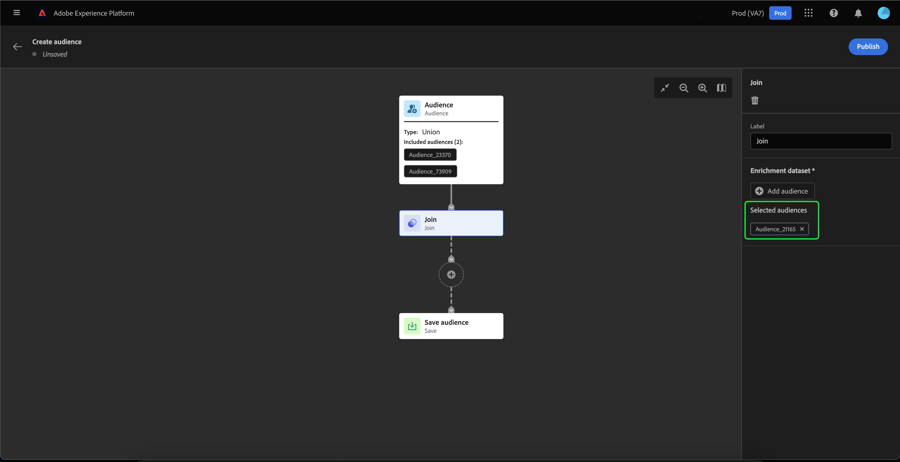

# Användargränssnittshandbok för Audience Builder

>[!IMPORTANT]
>
>Audience Builder är för närvarande i betaversion och är inte tillgängligt för alla användare. Dokumentationen och funktionaliteten kan komma att ändras.

I Audience Builder finns en arbetsyta där du kan skapa och redigera målgrupper med hjälp av block som används för att representera olika åtgärder.

Målgruppens arbetsyta består av fem olika typer av block: **[[!UICONTROL Audience]](#audience-block)**, **[[!UICONTROL Exclude]](#exclude-block)**, **[[!UICONTROL Join]](#join-block)**, **[[!UICONTROL Rank]](#rank-block)** och **[[!UICONTROL Split]](#split-block)**.

## [!UICONTROL Audience] {#audience-block}

The **[!UICONTROL Audience]** Med blocktyp kan ni lägga till de undermålgrupper som ni vill skapa en ny större publik. Som standard är **[!UICONTROL Audience]** -blocket inkluderas högst upp på kompositionens arbetsyta.

När du väljer **[!UICONTROL Audience]** höger räl visar kontroller för etikettering och tillägg av målgrupper i blocket.

Efter markering **[!UICONTROL Add Audience]** visas en lista med målgrupper. Välj vilka målgrupper du vill inkludera, följt av **[!UICONTROL Add]** för att lägga in dem i era målgruppsblock.

De valda målgrupperna visas nu i rätt spår när **[!UICONTROL Audience]** -block är markerat. Härifrån kan du ändra sammanfogningstypen för de kombinerade målgrupperna.

| Sammanfoga typ | Beskrivning |
| ---------- | ----------- |
| [!UICONTROL Union] | Målgrupperna samlas i en och samma målgrupp. Detta motsvarar en OR-åtgärd. |
| [!UICONTROL Intersection] | Målgrupperna kombineras med endast de målgrupper som delas i **alla** av dem som läggs till. Detta motsvarar en AND-åtgärd. |
| [!UICONTROL Exclude overlap] | Målgrupperna kombineras med endast de målgrupper som delas i **en, men inte alla** av dem som läggs till. Detta motsvarar en XOR-åtgärd. |

## [!UICONTROL Exclude] {#exclude-block}

The **[!UICONTROL Exclude]** Med blocktyp kan du utesluta angivna undergrupper eller attribut från din nya större publik.

Lägga till en **[!UICONTROL Exclude]** markerar du **+** ikon, följt av **[!UICONTROL Exclude]**.

The **[!UICONTROL Exclude]** -block läggs till. När det här blocket är markerat visas information om undantaget i den högra listen. Detta inkluderar blockets etikett och undantagstyp. Du kan utesluta [per målgrupp](#exclude-audience) eller [efter attribut](#exclude-attribute).

### Exkludera efter målgrupp {#exclude-audience}

Om du utesluter utifrån målgrupp kan du välja vilka målgrupper du vill utesluta genom att välja **[!UICONTROL Add Audience]**.

En lista över målgrupper visas. Välj **[!UICONTROL Add]** för att lägga till de målgrupper du vill utesluta i exkluderingsblocket.

### Exkludera efter attribut {#exclude-attribute}

Om du utelämnar efter attribut kan du välja vilka attribut du vill utesluta genom att välja  -ikonen i **[!UICONTROL Exclusion rule]** -avsnitt.

En lista med profilattribut visas. Välj den attributtyp som du vill exkludera, följt av **[!UICONTROL Select]** för att lägga till dem i exkluderingsblocket.

## [!UICONTROL Join] {#join-block}

The **[!UICONTROL Join]** blocktyp gör att du kan lägga till externa målgrupper från datauppsättningar som ännu inte har bearbetats av Adobe Experience Platform.

Lägga till en **[!UICONTROL Join]** markerar du **+** ikon, följt av **[!UICONTROL Join]**.

När du markerar blocket visas information om kopplingen i den högra listen, inklusive blockets etikett och möjligheten att lägga till målgrupper i datauppsättningen för anrikning.

Efter markering **[!UICONTROL Add Audience]** visas en lista med målgrupper. Välj vilka målgrupper du vill inkludera, följt av **[!UICONTROL Add]** för att lägga till dem i ditt kopplingsblock.

De valda målgrupperna visas nu i rätt spår när **[!UICONTROL Join]** -block är markerat.

## [!UICONTROL Rank] {#rank-block}

The **[!UICONTROL Rank]** Med blocktyp kan ni rangordna och sortera målgrupperna innan den nya målgruppen publiceras.

Lägga till en **[!UICONTROL Rank]** markerar du **+** ikon, följt av **[!UICONTROL Rank]**.

När du markerar blocket visas information om rangordningen i den högra listen, inklusive blockets etikett, det attribut som ska rangordnas efter, rangordningsordningen och en växling för att begränsa antalet profiler som ska rangordnas.

Om du vill välja vilket attribut som målgrupperna ska rangordnas efter väljer du  ikon.

En lista med profilattribut visas. I den här povern kan du välja den attributtyp som du vill rangordna målgruppen efter. Välj **[!UICONTROL Select]** för att lägga till den i ditt rangblock. Observera att det valda attributet kan **endast** vara av typen `int`.

När du har valt attributet kan du välja den ordning som det ska rangordnas efter. Detta sker antingen i stigande ordning (från lägsta till högsta) eller i fallande ordning (från högsta till lägsta).

Dessutom kan du begränsa antalet returnerade målgrupper genom att aktivera **[!UICONTROL Add profile limit]** växla. När den här växeln är aktiverad kan du ange det maximala antalet målgrupper som returneras inom **[!UICONTROL Included profiles]** fält.

## [!UICONTROL Split] {#split-block}

The **[!UICONTROL Split]** blocktyp gör att ni kan dela upp er nya målgrupp i olika undergrupper. Du kan antingen dela den här målgruppen baserat på procent eller ett attribut.

Lägga till en **[!UICONTROL Split]** markerar du **+** ikon, följt av **[!UICONTROL Split]**.

### Dela efter procent {#split-percentage}

Vid uppdelning efter procent delas målgrupperna slumpmässigt, baserat på antalet banor och procentandelar.

Du kan t.ex. ha tre banor med olika procentandelar av profiler.

Dessutom kan du markera en av de delade målgrupperna som kontrollgrupp.

### Dela efter attribut {#split-attribute}

Vid uppdelning efter attribut delas målgrupperna upp utifrån de angivna attributen. Markera attributet som ska delas med **[!UICONTROL Split]** -block, följt av  ikon.

En lista med profilattribut visas. Välj attributtyp, följt av **[!UICONTROL Select]** för att lägga till den i det delade blocket.

När du har valt attributet kan du välja vilka profiler som ska tillhöra vilka undermålgrupper genom att lägga till värdena i **[!UICONTROL Values]** fält.

Dessutom kan du aktivera **[!UICONTROL Other profiles]** för att skapa en undermålgrupp som består av alla profiler som inte är markerade.

## Publicera era målgrupper

När ni har komponerat målgruppen kan ni spara och publicera den genom att välja **[!UICONTROL Publish]**.

Om det uppstår fel när målgruppen skapas visas ett varningsmeddelande som talar om hur du löser problemet.

## Nästa steg

Audience Builder har ett omfattande arbetsflöde där du kan skapa målgrupper från olika blocktyper. Läs mer om andra delar av segmenteringstjänstens gränssnitt i [Användarhandbok för segmenteringstjänsten](./overview.md).
