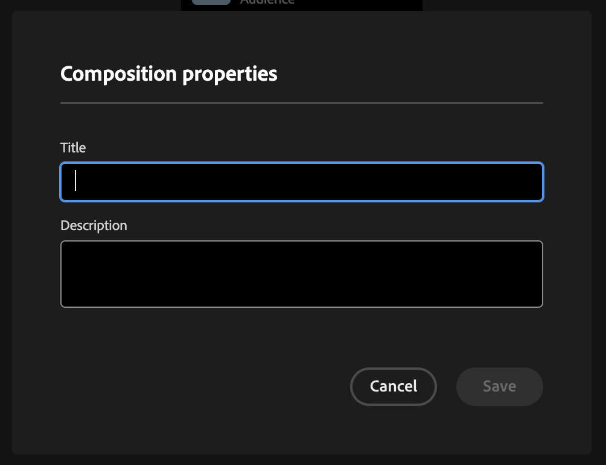
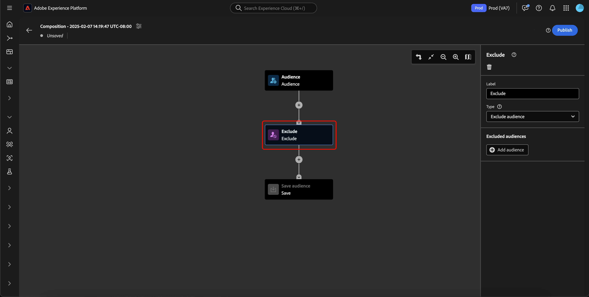

# Användargränssnittsguide för målgruppskomposition

>[!NOTE]
>
>Den här guiden förklarar hur du skapar målgrupper med Audience Composition. Om du vill lära dig hur du skapar målgrupper genom segmentdefinitioner med segmentbyggaren kan du läsa [Användargränssnittsguide för segmentbyggare](./segment-builder.md).

Audience Composition har en arbetsyta för att bygga och redigera målgrupper med hjälp av block som används för att representera olika åtgärder.

Om du vill ändra detaljerna för kompositionen, inklusive rubriken och beskrivningen, väljer du  -knappen.

The **[!UICONTROL Composition properties]** popover visas. Du kan infoga information om din komposition, inklusive rubriken och beskrivningen här.

>[!NOTE]
>
>Om du **not** ger din komposition en titel, har den titeln &quot;Disposition&quot; följt av datum och tid när den skapades som standard. Dessutom kan varje komposition **måste** har ett eget unikt namn.

När du har uppdaterat dispositionsinformationen väljer du **[!UICONTROL Save]** för att bekräfta dessa uppdateringar. Målgruppsarbetsytan visas igen.

Målgruppens arbetsyta består av fyra olika typer av block: **[[!UICONTROL Audience]](#audience-block)**, **[[!UICONTROL Exclude]](#exclude-block)**, **[[!UICONTROL Rank]](#rank-block)** och **[[!UICONTROL Split]](#split-block)**.

## [!UICONTROL Audience] {#audience-block}

The **[!UICONTROL Audience]** Med blocktyp kan ni lägga till de undermålgrupper som ni vill skapa en ny större publik. Som standard är **[!UICONTROL Audience]** -blocket inkluderas högst upp på kompositionens arbetsyta.

När du väljer **[!UICONTROL Audience]** höger räl visar kontroller för att etikettera målgruppen, lägga till målgrupper i blocket samt skapa anpassade regler för målgruppsblocket.

>[!NOTE]
>
>Du kan antingen lägga till målgrupper **eller** skapa en anpassad regel. Dessa två funktioner **inte** användas tillsammans.

### [!UICONTROL Add audience] {#add-audience}

Lägga till målgrupper i Audience-blocket. välj **[!UICONTROL Add Audience]**.

>[!IMPORTANT]
>
>Observera att **endast** Målgrupper som definierats med standardprincipen för sammanslagning visas.

En lista över målgrupper visas. Välj vilka målgrupper du vill inkludera, följt av **[!UICONTROL Add]** för att lägga in dem i era målgruppsblock.

De valda målgrupperna visas nu i rätt spår när **[!UICONTROL Audience]** -block är markerat. Härifrån kan du ändra sammanfogningstypen för de kombinerade målgrupperna.

| Sammanfoga typ | Beskrivning |
| ---------- | ----------- |
| [!UICONTROL Union] | Målgrupperna samlas i en och samma målgrupp. Detta motsvarar en OR-åtgärd. |
| [!UICONTROL Intersection] | Målgrupperna kombineras med endast de målgrupper som delas i **alla** av dem som läggs till. Detta motsvarar en AND-åtgärd. |
| [!UICONTROL Exclude overlap] | Målgrupperna kombineras med endast de målgrupper som delas i **en, men inte alla** av dem som läggs till. Detta motsvarar en XOR-åtgärd. |

### [!UICONTROL Build rule] {#build-rule}

Om du vill lägga till en anpassad regel i målgruppsblocket väljer du **[!UICONTROL Build rule]**.

Segmentbyggaren visas. Du kan använda Segment Builder för att skapa en anpassad regel som målgruppen ska följa. Mer information om hur du använder Segment Builder finns i [Segment Builder Guide](./segment-builder.md).

När du har lagt till en anpassad regel väljer du **[!UICONTROL Save]** för att lägga till regeln till er målgrupp.

## [!UICONTROL Exclude] {#exclude-block}

The **[!UICONTROL Exclude]** Med blocktyp kan du utesluta angivna undergrupper eller attribut från din nya större publik.

Lägga till en **[!UICONTROL Exclude]** -block, markera **+** ikon, följt av **[!UICONTROL Exclude]**.

The **[!UICONTROL Exclude]** -block läggs till. När det här blocket är markerat visas information om undantaget i den högra listen. Detta inkluderar blockets etikett och undantagstyp. Du kan utesluta [per målgrupp](#exclude-audience) eller [efter attribut](#exclude-attribute).

### Exkludera efter målgrupp {#exclude-audience}

Om du utesluter utifrån målgrupp kan du välja vilka målgrupper du vill utesluta genom att välja **[!UICONTROL Add Audience]**.

![The [!UICONTROL Add audience] knappen är markerad, vilket gör att du kan välja vilken målgrupp du vill utesluta.](../images/ui/audience-composition/add-excluded-audience.png)

En lista över målgrupper visas. Välj **[!UICONTROL Add]** för att lägga till de målgrupper du vill utesluta i exkluderingsblocket.

### Exkludera efter attribut {#exclude-attribute}

Om du utelämnar efter attribut kan du välja vilka attribut du vill utesluta genom att välja  -ikonen i **[!UICONTROL Exclusion rule]** -avsnitt.

En lista med profilattribut visas. Välj den attributtyp som du vill exkludera, följt av **[!UICONTROL Select]** för att lägga till dem i exkluderingsblocket.

>[!IMPORTANT]
>
>När du exkluderar efter attribut kan du bara ange **en** värde som ska exkluderas. Om du använder någon form av avgränsare, som ett komma eller semikolon, utesluts bara det exakta värdet. Ange till exempel värdet som `red, blue` leder till att termen utesluts `red, blue` från attributet, men **not** resulterar i att antingen termen utesluts `red` eller `blue`.

## [!UICONTROL Enrich] {#enrich-block}

>[!IMPORTANT]
>
>Nu kan anrikningsattribut **endast** användas i Adobe Journey Optimizer längre fram i kedjan.

The **[!UICONTROL Enrich]** Med blocktyp kan ni berika er målgrupp med ytterligare attribut från en datamängd. Du kan använda dessa attribut i användningsfall för personalisering.

Lägga till en **[!UICONTROL Enrich]** -block, markera **+** ikon, följt av **[!UICONTROL Enrich]**.

![The [!UICONTROL Enrich] är markerat.](../images/ui/audience-composition/add-enrich-block.png)

The **[!UICONTROL Enrich]** -block läggs till. När det här blocket är markerat visas information om anrikningen i den högra listen. Detta inkluderar blockets etikett och datauppsättningen för anrikning.

Om du vill välja den datauppsättning som ska berika publiken med väljer du  -ikon.

![Filterknappen är markerad. Om du väljer det här leder det dig till [!UICONTROL Select dataset] popover.](../images/ui/audience-composition/enrich-select-dataset.png)

The **[!UICONTROL Select dataset]** popover visas. Välj den datauppsättning som du vill lägga till för berikning, följt av **[!UICONTROL Select]** för att lägga till datauppsättningen för berikning.

>[!IMPORTANT]
>
>Den valda datauppsättningen **måste** uppfyller följande kriterier:
>
>- Datauppsättningen **måste** vara av posttyp.
>   - Datauppsättningen **inte** vara av händelsetyp, vara systemgenererad eller markeras som Profil.
>- Datauppsättningen **måste** vara 1 GB eller mindre.

The **[!UICONTROL Enrichment criteria]** -avsnittet visas nu på den högra listen. I det här avsnittet kan du välja **[!UICONTROL Source join key]** och **[!UICONTROL Enrichment dataset join key]**, vilket gör att du kan länka datauppsättningen för berikning till den målgrupp du försöker skapa.

![The [!UICONTROL Enrichment criteria] området markeras.](../images/ui/audience-composition/enrichment-criteria.png)

Så här väljer du **[!UICONTROL Source join key]** väljer du  -ikon.

![Filterikonen för [!UICONTROL Source join key] är markerat.](../images/ui/audience-composition/enrich-select-source-join-key.png)

The **[!UICONTROL Select a profile attribute]** popover visas. Välj det profilattribut som du vill använda som källkopplingsnyckel, följt av **[!UICONTROL Select]** för att välja det attributet som källkopplingsnyckel.

Så här väljer du **[!UICONTROL Enrichment dataset join key]** väljer du  -ikon.

![Filterikonen för [!UICONTROL Enrichment dataset join key] är markerat.](../images/ui/audience-composition/enrich-select-enrichment-dataset-join-key.png)

The **[!UICONTROL Enrichment attributes]** popover visas. Välj det attribut som du vill använda som kopplingsnyckel för anrikningsdatauppsättningen, följt av **[!UICONTROL Select]** att välja det attributet som kopplingsnyckel för datauppsättningen för anrikning.

Nu när du har lagt till båda dina kopplingsnycklar, **[!UICONTROL Enrichment attributes]** visas. Nu kan du lägga till det attribut du vill förbättra din publik med. Om du vill lägga till dessa attribut väljer du **[!UICONTROL Add attribute]**.

![The [!UICONTROL Add attribute] knappen är markerad.](../images/ui/audience-composition/enrich-select-add-attribute.png)

The **[!UICONTROL Enrichment attributes]** popover visas. Du kan välja attribut från datauppsättningen som berikar din målgrupp med, följt av **[!UICONTROL Select]** för att lägga till attribut till er målgrupp.

<!-- ## [!UICONTROL Join] {#join-block}

The **[!UICONTROL Join]** block type allows you to add in external audiences from datasets that have not yet been processed by Adobe Experience Platform.

To add a **[!UICONTROL Join]** block, select the **+** icon, followed by **[!UICONTROL Join]**.

When you select the block, details about the join are shown in the right rail, including the block's label and the option to add audiences to the enrichment dataset.

After selecting **[!UICONTROL Add Audience]**, a list of audiences appears. Select the audiences you want to include, followed by **[!UICONTROL Add]** to add them to your join block.

Your selected audiences now appear within the right rail when the **[!UICONTROL Join]** block is selected. 

 -->

## [!UICONTROL Rank] {#rank-block}

The **[!UICONTROL Rank]** Med blocktyp kan du rangordna och sortera profiler baserat på ett angivet attribut och inkludera dessa rankade profiler i din komposition.

Lägga till en **[!UICONTROL Rank]** -block, markera **+** ikon, följt av **[!UICONTROL Rank]**.

När du markerar blocket visas information om rangordningen i den högra listen, inklusive blockets etikett, det attribut som ska rangordnas efter, rangordningsordningen och en växling för att begränsa antalet profiler som ska rangordnas.

Om du vill välja vilket attribut som målgrupperna ska rangordnas efter väljer du  -ikon.

En lista med profilattribut visas. I den här povern kan du välja den attributtyp som du vill rangordna målgruppen efter. Välj **[!UICONTROL Select]** för att lägga till den i ditt rangblock. Observera att det valda attributet kan **endast** vara tal.

När du har valt attributet kan du välja den ordning som det ska rangordnas efter. Detta sker antingen i stigande ordning (från lägsta till högsta) eller i fallande ordning (från högsta till lägsta).

Dessutom kan du begränsa antalet returnerade målgrupper genom att aktivera **[!UICONTROL Add profile limit]** växla. När den här växeln är aktiverad kan du ange det maximala antalet målgrupper som returneras inom **[!UICONTROL Included profiles]** fält.

## [!UICONTROL Split] {#split-block}

The **[!UICONTROL Split]** blocktyp gör att ni kan dela upp er nya målgrupp i olika undergrupper. Du kan antingen dela den här målgruppen baserat på procent eller ett attribut.

Lägga till en **[!UICONTROL Split]** -block, markera **+** ikon, följt av **[!UICONTROL Split]**.

När ni delar er målgrupp kan ni antingen dela efter procent eller dela efter attribut.

### Dela efter procent {#split-percentage}

Vid uppdelning efter procent delas målgrupperna slumpmässigt, baserat på antalet banor och procentandelar.

Du kan t.ex. ha tre banor med olika profiler.

### Dela efter attribut {#split-attribute}

Vid uppdelning efter attribut delas målgrupperna upp utifrån de angivna attributen. Markera attributet som ska delas med **[!UICONTROL Split]** -block, följt av  -ikon.

En lista med profilattribut visas. Välj attributtyp, följt av **[!UICONTROL Select]** för att lägga till den i det delade blocket.

När du har valt attributet kan du välja vilka profiler som ska tillhöra vilka undermålgrupper genom att lägga till värdena i **[!UICONTROL Values]** fält.

Dessutom kan du aktivera **[!UICONTROL Other profiles]** för att skapa en undermålgrupp som består av alla profiler som inte är markerade.

## Publicera era målgrupper

När ni har komponerat målgruppen kan ni spara och publicera den genom att välja **[!UICONTROL Publish]**.

Om det uppstår fel när målgruppen skapas visas ett varningsmeddelande som talar om hur du löser problemet.

## Nästa steg

Audience Composition har ett omfattande arbetsflöde som gör att du kan skapa målgrupper från olika blocktyper. Läs mer om andra delar av segmenteringstjänstens gränssnitt i [Användarhandbok för segmenteringstjänsten](./overview.md).
