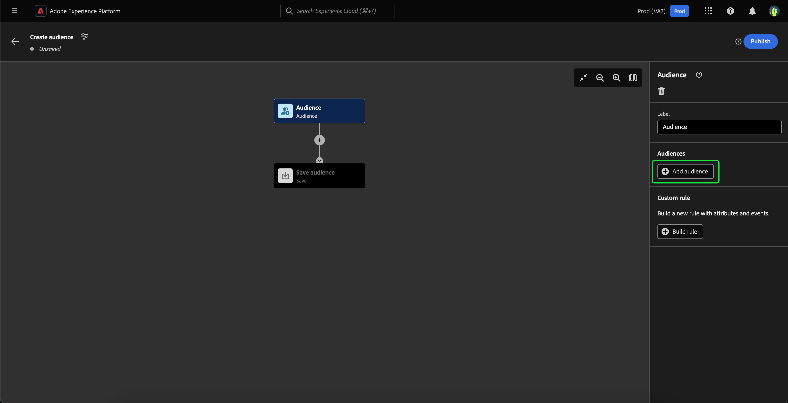
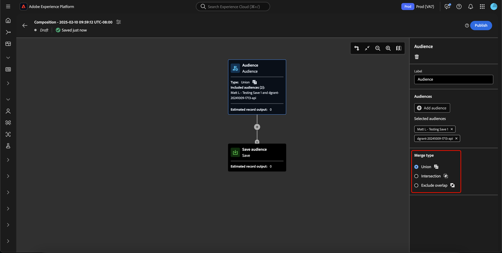

# Användargränssnittsguide för målgruppskomposition

>[!NOTE]
>
>Den här guiden förklarar hur du skapar målgrupper med Audience Composition. Om du vill lära dig hur du skapar målgrupper med hjälp av segmentdefinitioner med hjälp av segmentverktyget läser du [gränssnittshandboken för segmentbyggaren](./segment-builder.md).

Audience Composition har en arbetsyta för att bygga och redigera målgrupper med hjälp av block som används för att representera olika åtgärder.

Om du vill ändra detaljer för kompositionen, inklusive rubrik och beskrivning, väljer du knappen  .

**[!UICONTROL Composition properties]**-pekaren visas. Du kan infoga information om din komposition, inklusive rubriken och beskrivningen här.

>[!NOTE]
>
>Om du **inte** ger kompositionen en titel får den titeln &quot;Disposition&quot; följt av datum och tid när den skapades som standard. Dessutom måste varje disposition **måste** ha ett eget unikt namn.

När du har uppdaterat dispositionsinformationen väljer du **[!UICONTROL Save]** för att bekräfta uppdateringarna. Målgruppsarbetsytan visas igen.

Målgruppens kompositionsyta består av fyra olika typer av block: **[[!UICONTROL Audience]](#audience-block)**, **[[!UICONTROL Exclude]](#exclude-block)**, **[[!UICONTROL Rank]](#rank-block)** och **[[!UICONTROL Split]](#split-block)**.

## [!UICONTROL Audience] {#audience-block}

Med blocktypen **[!UICONTROL Audience]** kan du lägga till de undermålgrupper som du vill skapa din nya större publik. Som standard inkluderas ett **[!UICONTROL Audience]**-block högst upp på kompositionens arbetsyta.

När du markerar **[!UICONTROL Audience]**-blocket visas kontroller för att märka målgruppen, lägga till målgrupper i blocket samt skapa anpassade regler för målgruppsblocket i den högra listen.

>[!NOTE]
>
>Du kan antingen lägga till målgrupper **eller** för att skapa en anpassad regel. De här två funktionerna **kan inte** användas tillsammans.

### [!UICONTROL Add audience] {#add-audience}

Lägga till målgrupper i Audience-blocket. välj **[!UICONTROL Add Audience]**.

>[!IMPORTANT]
>
>Observera att **endast** målgrupper som definierats med standardprincipen för sammanslagning visas.
>
>Dessutom kan bara **publicerade** målgrupper som skapats med Segment Builder användas. Publiker som skapats med Audience Composition och externt genererade målgrupper är **inte** tillgängliga.

En lista över målgrupper visas. Välj de målgrupper som du vill inkludera, följt av **[!UICONTROL Add]**, för att lägga till dem i ditt målgruppsblock.

De valda målgrupperna visas nu i den högra listen när **[!UICONTROL Audience]**-blocket är markerat. Härifrån kan du ändra sammanfogningstypen för de kombinerade målgrupperna.

| Sammanfoga typ | Beskrivning |
| ---------- | ----------- |
| [!UICONTROL Union] | Målgrupperna samlas i en och samma målgrupp. Detta motsvarar en OR-åtgärd. |
| [!UICONTROL Intersection] | Målgrupperna kombineras med endast de målgrupper som delas i **alla** av dem som läggs till. Detta motsvarar en AND-åtgärd. |
| [!UICONTROL Exclude overlap] | Målgrupperna kombineras med endast de målgrupper som delas i **en, men inte alla** av dem. Detta motsvarar en XOR-åtgärd. |

### [!UICONTROL Build rule] {#build-rule}

Om du vill lägga till en anpassad regel i målgruppsblocket väljer du **[!UICONTROL Build rule]**.

Segmentbyggaren visas. Du kan använda Segment Builder för att skapa en anpassad regel som målgruppen ska följa. Mer information om hur du använder Segment Builder finns i [guiden för segmentbyggaren](./segment-builder.md).

När du har lagt till en anpassad regel väljer du **[!UICONTROL Save]** för att lägga till regeln till din målgrupp.

## [!UICONTROL Exclude] {#exclude-block}

Blocktypen **[!UICONTROL Exclude]** gör att du kan exkludera angivna undermålgrupper eller attribut från din nya större målgrupp.

Om du vill lägga till ett **[!UICONTROL Exclude]**-block väljer du ikonen **+** följt av **[!UICONTROL Exclude]**.

Blocket **[!UICONTROL Exclude]** har lagts till. När det här blocket är markerat visas information om undantaget i den högra listen. Detta inkluderar blockets etikett och undantagstyp. Du kan exkludera [efter målgrupp](#exclude-audience) eller [efter attribut](#exclude-attribute).

### Exkludera efter målgrupp {#exclude-audience}

Om du exkluderar utifrån målgrupp kan du välja vilka målgrupper du vill exkludera genom att välja **[!UICONTROL Add Audience]**.

![Knappen [!UICONTROL Add audience] är markerad, vilket gör att du kan välja vilken målgrupp du vill utesluta.](../images/ui/audience-composition/add-excluded-audience.png)

>[!IMPORTANT]
>
>Endast **publicerade** målgrupper som skapats med Segment Builder kan användas. Publiker som skapats med Audience Composition och externt genererade målgrupper är **inte** tillgängliga.

En lista över målgrupper visas. Välj **[!UICONTROL Add]** om du vill lägga till de målgrupper som du vill utesluta i exkluderingsblocket.

### Exkludera efter attribut {#exclude-attribute}

Om du utelämnar efter attribut kan du välja vilka attribut du vill utesluta genom att markera ikonen  i avsnittet **[!UICONTROL Exclusion rule]**.

En lista med profilattribut visas. Välj den attributtyp som du vill exkludera, följt av **[!UICONTROL Select]**, för att lägga till dem i exkluderingsblocket.

>[!IMPORTANT]
>
>När du exkluderar efter attribut kan du bara ange **ett**-värde som ska exkluderas. Om du använder någon form av avgränsare, som ett komma eller semikolon, utesluts bara det exakta värdet. Om du till exempel anger värdet som `red, blue` utesluts termen `red, blue` från attributet, men **inte** leder till att varken termen `red` eller `blue` utesluts.

## [!UICONTROL Enrich] {#enrich-block}

>[!IMPORTANT]
>
>Vid den här tidpunkten kan anrikningsattribut **endast** användas i Adobe Journey Optimizer-scenarier längre fram i kedjan.

Med blocktypen **[!UICONTROL Enrich]** kan du berika din målgrupp med ytterligare attribut från en datauppsättning. Du kan använda dessa attribut i användningsfall för personalisering.

Om du vill lägga till ett **[!UICONTROL Enrich]**-block väljer du ikonen **+** följt av **[!UICONTROL Enrich]**.

![Alternativet [!UICONTROL Enrich] är markerat.](../images/ui/audience-composition/add-enrich-block.png)

Blocket **[!UICONTROL Enrich]** har lagts till. När det här blocket är markerat visas information om anrikningen i den högra listen. Detta inkluderar blockets etikett och datauppsättningen för anrikning.

Om du vill välja den datauppsättning som ska berika målgruppen med väljer du ikonen  .

![Filterknappen är markerad. Om du väljer det här leder det dig till [!UICONTROL Select dataset]-porten.](../images/ui/audience-composition/enrich-select-dataset.png)

**[!UICONTROL Select dataset]**-pekaren visas. Välj den datauppsättning som du vill lägga till för berikning, följt av **[!UICONTROL Select]**, för att lägga till datauppsättningen för anrikning.

>[!IMPORTANT]
>
>Den valda datauppsättningen **måste** uppfylla följande villkor:
>
>- Datauppsättningen **måste** vara av posttyp.
>   - Datauppsättningen **kan inte** vara av händelsetyp, systemgenereras eller markeras som Profil.
>- Datauppsättningen **måste** vara 1 GB eller mindre.

Avsnittet **[!UICONTROL Enrichment criteria]** visas nu till höger. I det här avsnittet kan du välja **[!UICONTROL Source join key]** och **[!UICONTROL Enrichment dataset join key]**, vilket gör att du kan länka anrikningsdatauppsättningen till målgruppen som du försöker skapa.

![Området [!UICONTROL Enrichment criteria] är markerat.](../images/ui/audience-composition/enrichment-criteria.png)

Om du vill markera **[!UICONTROL Source join key]** väljer du ikonen  .

![Filterikonen för [!UICONTROL Source join key] är markerad.](../images/ui/audience-composition/enrich-select-source-join-key.png)

**[!UICONTROL Select a profile attribute]**-pekaren visas. Välj det profilattribut som du vill använda som källkopplingsnyckel, följt av **[!UICONTROL Select]**, för att välja det attributet som källkopplingsnyckel.

Om du vill markera **[!UICONTROL Enrichment dataset join key]** väljer du ikonen  .

![Filterikonen för [!UICONTROL Enrichment dataset join key] är markerad.](../images/ui/audience-composition/enrich-select-enrichment-dataset-join-key.png)

**[!UICONTROL Enrichment attributes]**-pekaren visas. Välj det attribut som du vill använda som kopplingsnyckel för anrikningsdatauppsättningen, följt av **[!UICONTROL Select]**, för att välja det attributet som kopplingsnyckel för anrikningsdatauppsättningen.

Nu när du har lagt till båda dina kopplingsnycklar visas avsnittet **[!UICONTROL Enrichment attributes]**. Nu kan du lägga till det attribut du vill förbättra din publik med. Om du vill lägga till dessa attribut väljer du **[!UICONTROL Add attribute]**.

![Knappen [!UICONTROL Add attribute] är markerad.](../images/ui/audience-composition/enrich-select-add-attribute.png)

**[!UICONTROL Enrichment attributes]**-pekaren visas. Du kan välja de attribut från datauppsättningen som ska berika din målgrupp med, följt av **[!UICONTROL Select]**, för att lägga till attributen till din målgrupp.

<!-- ## [!UICONTROL Join] {#join-block}

The **[!UICONTROL Join]** block type allows you to add in external audiences from datasets that have not yet been processed by Adobe Experience Platform.

To add a **[!UICONTROL Join]** block, select the **+** icon, followed by **[!UICONTROL Join]**.

When you select the block, details about the join are shown in the right rail, including the block's label and the option to add audiences to the enrichment dataset.

After selecting **[!UICONTROL Add Audience]**, a list of audiences appears. Select the audiences you want to include, followed by **[!UICONTROL Add]** to add them to your join block.

Your selected audiences now appear within the right rail when the **[!UICONTROL Join]** block is selected. 

 -->

## [!UICONTROL Rank] {#rank-block}

Blocktypen **[!UICONTROL Rank]** gör att du kan rangordna och sortera profiler baserat på ett angivet attribut och inkludera de rankade profilerna i din komposition.

Om du vill lägga till ett **[!UICONTROL Rank]**-block väljer du ikonen **+** följt av **[!UICONTROL Rank]**.

När du markerar blocket visas information om rangordningen i den högra listen, inklusive blockets etikett, det attribut som ska rangordnas efter, rangordningsordningen och en växling för att begränsa antalet profiler som ska rangordnas.

Välj ikonen  om du vill välja vilket attribut som målgrupperna ska rangordnas efter.

En lista med profilattribut visas. I den här povern kan du välja den attributtyp som du vill rangordna målgruppen efter. Välj **[!UICONTROL Select]** om du vill lägga till den i rangblocket. Observera att det markerade attributet kan **endast** vara tal.

När du har valt attributet kan du välja den ordning som det ska rangordnas efter. Detta sker antingen i stigande ordning (från lägsta till högsta) eller i fallande ordning (från högsta till lägsta).

Dessutom kan du begränsa antalet profiler som returneras genom att aktivera växlingsknappen **[!UICONTROL Add profile limit]**. När den här växlingen är aktiverad kan du ange det maximala antalet profiler som returneras i fältet **[!UICONTROL Included profiles]**.

## [!UICONTROL Split] {#split-block}

Med blocktypen **[!UICONTROL Split]** kan du dela upp din nya målgrupp i olika undermålgrupper. Du kan antingen dela den här målgruppen baserat på procent eller ett attribut. När du delar upp din målgrupp i undermålgrupper är den här delningen **inte** beständig. Detta innebär att profilerna kan finnas i de olika undergrupperna för varje utvärdering.

Om du vill lägga till ett **[!UICONTROL Split]**-block väljer du ikonen **+** följt av **[!UICONTROL Split]**.

När ni delar er målgrupp kan ni antingen dela efter procent eller dela efter attribut.

### Dela efter procent {#split-percentage}

Vid uppdelning efter procent delas målgrupperna slumpmässigt, baserat på antalet banor och procentandelar.

Du kan t.ex. ha tre banor med olika profiler.

### Dela efter attribut {#split-attribute}

Vid uppdelning efter attribut delas målgrupperna upp utifrån de angivna attributen. Om du vill markera attributet som ska delas med markerar du **[!UICONTROL Split]**-blocket följt av ikonen  .

En lista med profilattribut visas. Markera attributtypen, följt av **[!UICONTROL Select]**, för att lägga till den i det delade blocket.

När du har valt attributet kan du välja vilka profiler som ska tillhöra vilka undermålgrupper genom att lägga till värdena i fältet **[!UICONTROL Values]**.

Dessutom kan du aktivera växlingsknappen **[!UICONTROL Other profiles]** för att skapa en undermålgrupp som består av alla profiler som inte är markerade.

## Publicera era målgrupper

>[!IMPORTANT]
>
>Observera att det kan ta upp till 48 timmar innan publikationen publiceras att utvärderas och aktiveras för användning i tjänster som Real-Time CDP eller Adobe Journey Optimizer.

När du har skapat kompositionen kan du spara och publicera den genom att välja **[!UICONTROL Publish]**.

Om det uppstår fel när målgruppen skapas visas ett varningsmeddelande som talar om hur du löser problemet.

## Nästa steg

Audience Composition har ett omfattande arbetsflöde där du kan skapa kompositioner från olika blocktyper. Om du vill veta mer om andra delar av segmenteringstjänstens gränssnitt kan du läsa användarhandboken för [segmenteringstjänsten](./overview.md).
