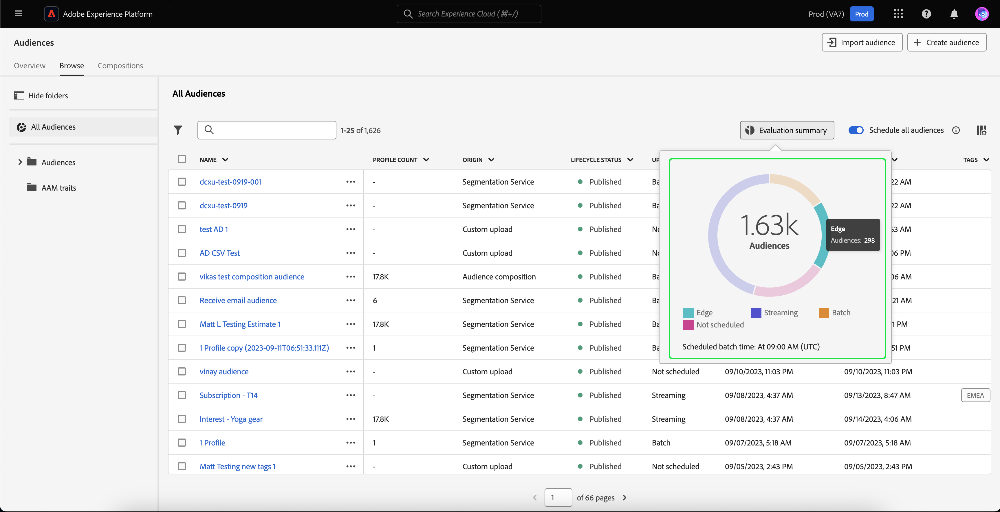

# Översikt över målgruppsportalen

Audience Portal är ett centralt nav i Adobe Experience Platform som gör att ni kan visa, hantera och skapa målgrupper.

I Audience Portal kan du utföra följande uppgifter:

- [Visa en lista över era målgrupper](#audience-list)
   - [Använd snabba åtgärder på era målgrupper](#quick-actions)
   - [Anpassa egenskaperna som visas i din lista över målgrupper](#customize)
   - [Använd filter, mappar och taggar för att ordna era målgrupper](#manage-audiences)
- [Visa information om er målgrupp](#audience-details)
   - [Se en sammanfattning om er målgrupp](#audience-summary)
- [Aktivera era målgrupper för schemalagd segmentering](#scheduled-segmentation)
- [Skapa en målgrupp](#create-audience)
   - [Använd Segment Builder för att skapa en målgrupp](#segment-builder)
   - [Använd Audience Composition för att skapa en målgrupp](#audience-composition)
   - [Använd Federated Audience Composition för att skapa en målgrupp med data från ert befintliga datalager](#fac)
- [Importera externt genererade målgrupper](#import-audience)

Om du vill öppna målportalen väljer du fliken **[!UICONTROL Browse]** i segmenteringsavsnittet.

## Målgruppslista {#list}

>[!CONTEXTUALHELP]
>id="platform_segments_browse_churncolumnname"
>title="Churn"
>abstract="Förändringen representerar den procentandel profiler som ändras inom en målgrupp jämfört med den senaste gången segmentjobbet kördes."

>[!CONTEXTUALHELP]
>id="platform_segments_browse_evaluationmethodcolumnname"
>title="Utvärderingsmetod"
>abstract="Utvärderingsmetoder för målgrupper är bland annat batch, strömning och edge."

Som standard visar Audience Portal en lista över alla målgrupper i din organisation och sandlåda, inklusive antal profiler, ursprung, skapat datum, senaste ändringsdatum, taggar och uppdelning.

### Snabbåtgärder {#quick-actions}

Bredvid varje publik finns en ellips-ikon. Om du väljer det här alternativet visas en lista med tillgängliga snabbåtgärder för målgruppen. Listan med åtgärder skiljer sig åt beroende på målgruppens ursprung.

![Listan med snabbåtgärder visas för målgrupper med ursprung i [!UICONTROL Audience composition].](../images/ui/audience-portal/browse-audience-composition-details.png)

| Åtgärd | Original | Beskrivning |
| ------ | ------- | ----------- |
| [!UICONTROL Edit] | Segmenteringstjänst | Öppnar segmentbyggaren för att redigera målgruppen. Observera att om målgruppen skapades via API:t kan du **inte** redigera den med hjälp av Segment Builder. Mer information om hur du använder Segment Builder finns i [användargränssnittsguiden för Segment Builder](./segment-builder.md). |
| [!UICONTROL Open composition] | Målgruppskomposition | Öppnar Audience-kompositionen för att se er målgrupp. Mer information om publikens komposition finns i [användargränssnittsguiden för målgruppskomposition](./audience-composition.md). |
| [!UICONTROL Activate to destination] | Segmenteringstjänst | Aktiverar målgruppen till ett mål. Mer information om hur du aktiverar en målgrupp till ett mål finns i [aktiveringsöversikten](../../destinations/ui/activation-overview.md). |
| [!UICONTROL Share with partners] | Målgruppskomposition, anpassad överföring, segmenteringstjänst | Delar er målgrupp med andra plattformsanvändare. Mer information om den här funktionen finns i översikten [Segmentmatchning](./segment-match/overview.md). |
| [!UICONTROL Manage tags] | Målgruppskomposition, anpassad överföring, segmenteringstjänst | Hanterar de användardefinierade taggar som tillhör målgruppen. Mer information om den här funktionen finns i avsnittet om [filtrering och taggning](#manage-audiences). |
| [!UICONTROL Move to folder] | Målgruppskomposition, anpassad överföring, segmenteringstjänst | Hanterar den mapp som målgruppen tillhör. Mer information om den här funktionen finns i avsnittet om [filtrering och taggning](#manage-audiences). |
| [!UICONTROL Copy] | Segmenteringstjänst | Duplicerar den valda målgruppen. Mer information om den här funktionen finns i [Vanliga frågor om segmentering](../faq.md#copy). |
| [!UICONTROL Apply access labels] | Målgruppskomposition, anpassad överföring, segmenteringstjänst | Hanterar de åtkomstetiketter som tillhör målgruppen. Mer information om åtkomstetiketter finns i dokumentationen om [hantering av etiketter](../../access-control/abac/ui/labels.md). |
| [!UICONTROL Publish] | Anpassad överföring, segmenteringstjänst | Publicerar den valda målgruppen. Mer information om hantering av livscykelstatus finns i avsnittet [livscykeltillstånd i Vanliga frågor om segmentering](../faq.md#lifecycle-states). |
| [!UICONTROL Deactivate] | Anpassad överföring, segmenteringstjänst | Inaktiverar den valda målgruppen. Mer information om hantering av livscykelstatus finns i avsnittet [livscykeltillstånd i Vanliga frågor om segmentering](../faq.md#lifecycle-states). |
| [!UICONTROL Delete] | Målgruppskomposition, anpassad överföring, segmenteringstjänst | Tar bort den valda målgruppen. Publiker som används i underordnade mål eller är beroende av andra målgrupper **kan inte** tas bort. Mer information om borttagning av målgrupper finns i [Frågor och svar om segmentering](../faq.md#lifecycle-states). |
| [!UICONTROL Add to package] | Målgruppskomposition, anpassad överföring, segmenteringstjänst | Flyttar publiken mellan sandlådor. Mer information om den här funktionen finns i [handboken för sandlådeverktyg](../../sandboxes/ui/sandbox-tooling.md). |

>[!IMPORTANT]
>
>Innan du tar bort målgruppen kontrollerar du att målgruppen **inte** används som en komponent i en kontobaserad målgrupp eller används i Adobe Journey Optimizer.

Överst på sidan finns alternativ för att lägga till alla målgrupper i ett schema, importera en målgrupp, skapa en ny målgrupp och visa en sammanfattning av målgruppsutvärderingen.

Om du växlar **[!UICONTROL Schedule all audiences]** aktiveras schemalagd segmentering. Mer information om schemalagd segmentering finns i avsnittet [schemalagd segmentering i den här användarhandboken](#scheduled-segmentation).

Om du väljer **[!UICONTROL Import audience]** kan du importera en externt genererad publik. Läs avsnittet [Importera en målgrupp i användarhandboken](#import-audience) om du vill veta mer om hur du importerar målgrupper.

Om du väljer **[!UICONTROL Create audience]** kan du skapa en målgrupp. Läs avsnittet [Skapa en målgrupp i användarhandboken](#create-audience) om du vill veta mer om hur du skapar målgrupper.

Du kan välja **[!UICONTROL Evaluation summary]** om du vill visa ett cirkeldiagram som visar en sammanfattning av publikens utvärderingar.

Cirkeldiagrammet visas med en uppdelning av målgrupperna efter målgruppsutvärdering. Diagrammet visar det totala antalet målgrupper i mitten och den dagliga batchutvärderingstiden i UTC längst ned. Om du hovrar över de olika delarna av publiken visas antalet målgrupper som tillhör varje uppdateringsfrekvenstyp.

### Anpassa {#customize}

Du kan lägga till fler fält i målportalen genom att välja . Dessa ytterligare fält innehåller livscykelstatus, uppdateringsfrekvens, senast uppdaterad av, beskrivning, skapad av och åtkomstetiketter.

| Fält | Beskrivning |
| ----- | ----------- |
| [!UICONTROL Name] | Namnet på publiken. |
| [!UICONTROL Profile count] | Det totala antalet profiler som är kvalificerade för målgruppen. |
| [!UICONTROL Origin] | Målgruppens ursprung. Det är här som publiken kommer ifrån. Möjliga värden är segmenteringstjänsten, anpassad överföring, målgruppskomposition och Audience Manager. |
| [!UICONTROL Lifecycle status] | Publiken. Möjliga värden för fältet är `Draft`, `Inactive` och `Published`. Mer information om livscykelstatus, inklusive vad de olika stadierna innebär och hur du flyttar målgrupper till olika livscykeltillstånd, finns i avsnittet [livscykelstatus i Vanliga frågor om segmentering](../faq.md#lifecycle-status). |
| [!UICONTROL Update frequency] | Ett värde som anger hur ofta målgruppens data uppdateras. Möjliga värden för fältet är [!UICONTROL Batch], [!UICONTROL Streaming], [!UICONTROL Edge] och [!UICONTROL Not Scheduled]. |
| [!UICONTROL Last updated by] | Namnet på den person som senast uppdaterade målgruppen. |
| [!UICONTROL Created] | Datum och tid, i UTC, då målgruppen skapades. |
| [!UICONTROL Last updated] | Datum och tid, i UTC, då målgruppen senast uppdaterades. |
| [!UICONTROL Tags] | De användardefinierade taggar som tillhör målgruppen. Mer information om de här taggarna finns i avsnittet [om taggar](#tags). |
| [!UICONTROL Description] | Beskrivning av målgruppen. |
| [!UICONTROL Created by] | Namnet på den person som skapade målgruppen. |
| [!UICONTROL Access labels] | Åtkomstetiketterna för målgruppen. Med åtkomstetiketter kan du kategorisera datauppsättningar och fält enligt de användarprofiler som gäller för dessa data. Dessa etiketter kan användas när som helst, vilket ger flexibilitet i hur du vill styra data. Mer information om åtkomstetiketter finns i dokumentationen om [hantering av etiketter](../../access-control/abac/ui/labels.md). |
| [!UICONTROL Breakdown] | Uppdelning av profilstatus för målgruppen. En mer detaljerad beskrivning av den här profilstatusuppdelningen finns nedan. |

Om nedbrytning är markerat visas ett stolpdiagram med procentandelen profiler som tillhör följande beräknade profilstatusar: [!UICONTROL Realized], [!UICONTROL Existing] och [!UICONTROL Exiting]. Dessutom är den uppdelning som visas på fliken [!UICONTROL Browse] den mest korrekta uppdelningen av segmentdefinitionsstatusen. Om det här talet skiljer sig från vad som anges på fliken [!UICONTROL Overview] bör du använda siffrorna på fliken [!UICONTROL Browse] som rätt informationskälla eftersom tabbnumren [!UICONTROL Overview] bara uppdateras en gång om dagen.

| Status | Beskrivning |
| ------ | ----------- |
| [!UICONTROL Realized] | Antalet profiler som **kvalificerat** för målgruppen under de senaste 24 timmarna sedan det senaste batchsegmentjobbet kördes. |
| [!UICONTROL Existing] | Antalet profiler som **förblev** i publiken under de senaste 24 timmarna sedan det senaste batchsegmentjobbet kördes. Det här fältet är **beräknat** och visas inte i [`segmentMembership`-objektet ](../../xdm/field-groups/profile/segmentation.md). |
| [!UICONTROL Exiting] | Antalet profiler som **slutade** publiken under de senaste 24 timmarna sedan det senaste batchsegmentjobbet kördes. |

När du har markerat de fält som du vill visa kan du även ändra storlek på de visade kolumnernas bredd. Du kan antingen göra detta genom att dra området mellan kolumnerna eller genom att markera  för kolumnen som du vill ändra storlek på, följt av **[!UICONTROL Resize column]**.

### Filtrering, mappar och taggning {#manage-audiences}

För att effektivisera arbetet kan du söka efter befintliga målgrupper, lägga till användardefinierade taggar till målgrupper, placera målgrupper i mappar och filtrera de visade målgrupperna.

#### Sök {#search}

Du kan söka bland befintliga målgrupper på upp till 9 olika språk med [!DNL Unified Search].

Om du vill använda [!DNL Unified Search] lägger du till den term som du vill söka efter i det markerade sökfältet.

Mer information om [!DNL Unified Search], inklusive funktioner som stöds, finns i [dokumentationen för enhetlig sökning](https://experienceleague.adobe.com/docs/core-services/interface/services/search-experience-cloud.html).

#### Taggar {#tags}

Du kan lägga till användardefinierade taggar för att bättre beskriva, hitta och hantera era målgrupper.

Om du vill lägga till en tagg väljer du **[!UICONTROL Manage tags]** på målgruppen som du vill tagga.

![Knappen [!UICONTROL Manage tags] har valts för en angiven målgrupp.](../images/ui/audience-portal/browse-manage-tags.png)

**[!UICONTROL Manage tags]**-pekaren visas. I den här drivrutinen kan du antingen välja en kategoriserad tagg eller en okategoriserad tagg.

| Tagg type | Beskrivning |
| -------- | ----------- |
| Kategoriserad | En tagg som skapas och hanteras av organisationens administratörer. |
| Okategoriserad | En tagg som skapas i poseraren [!UICONTROL Manage tags]. Vem som helst kan skapa eller hantera de här taggtyperna. |

![Leveransen [!UICONTROL Manage tags] visas. Alternativen för att välja en kategoriserad eller okategoriserad är markerade.](../images/ui/audience-portal/create-tag.png)

När du har lagt till alla taggar som du vill bifoga till målgruppen väljer du **[!UICONTROL Save]**.

![I povern [!UICONTROL Manage tags] markeras de tillagda taggarna.](../images/ui/audience-portal/created-tags.png)

Mer information om hur du skapar och hanterar taggar finns i handboken [Hantera taggar](../../administrative-tags/ui/managing-tags.md).

#### Mappar {#folders}

Ni kan placera målgrupper i mappar för bättre målgruppshantering.

Välj **[!UICONTROL Create folder]** om du vill skapa en mapp för dina målgrupper.

>[!NOTE]
>
>Du kan bara skapa en mapp om du befinner dig i en annan mapp. Det innebär att du **inte kan** skapa en mapp om du har **[!UICONTROL All Audiences]** markerat i det vänstra navigeringsfältet.

En pover visas där du kan namnge den nya mappen. Välj **[!UICONTROL Save]** efter att du har namngett mappen för att slutföra skapandet av mappen. Observera att namnen **måste** vara unika för den överordnade mappen.

Om du vill flytta en målgrupp till en mapp väljer du **[!UICONTROL Move to folder]** på den målgrupp du vill flytta.

![Knappen [!UICONTROL Move to folder] har valts för en viss målgrupp.](../images/ui/audience-portal/browse-move-to-folder.png)

**Flytta målgruppen till mappen** visas. Markera mappen som du vill flytta målgruppen till och välj sedan **[!UICONTROL Save]**.

När målgruppen finns i en mapp kan du välja att bara visa målgrupper som tillhör en viss mapp.

#### Filter {#filter}

Du kan även filtrera dina målgrupper baserat på en mängd olika inställningar.

Om du vill filtrera de tillgängliga målgrupperna väljer du .

Listan med tillgängliga filter visas.

| Filter | Beskrivning |
| ------ | ----------- |
| [!UICONTROL Origin] | Gör att du kan filtrera baserat på målgruppens ursprung. De tillgängliga alternativen är segmenteringstjänst, anpassad överföring, målgruppskomposition och Audience Manager. |
| [!UICONTROL Has any tag] | Gör att du kan filtrera efter taggar. Du kan välja mellan **[!UICONTROL Has any tag]** och **[!UICONTROL Has all tags]**. När **[!UICONTROL Has any tag]** har valts kommer de filtrerade målgrupperna att inkludera **alla** av de taggar som du har lagt till. När **[!UICONTROL Has all tags]** har valts måste de filtrerade målgrupperna innehålla **all** av de taggar du har lagt till. |
| [!UICONTROL Lifecycle status] | Gör att du kan filtrera baserat på målgruppens livscykelstatus. De tillgängliga alternativen är [!UICONTROL Deleted], [!UICONTROL Draft], [!UICONTROL Inactive] och [!UICONTROL Published]. |
| [!UICONTROL Update frequency] | Gör att du kan filtrera baserat på målgruppens uppdateringsfrekvens (utvärderingsmetod). Tillgängliga alternativ är [!UICONTROL Batch], [!UICONTROL Streaming] och [!UICONTROL Edge] |
| [!UICONTROL Created by] | Gör att du kan filtrera baserat på den person som skapade målgruppen. |
| [!UICONTROL Creation date] | Gör att du kan filtrera baserat på målgruppens skapandedatum. Du kan välja ett datumintervall att filtrera när målgruppen skapades. |
| [!UICONTROL Modified date] | Gör att du kan filtrera baserat på målgruppens senaste ändringsdatum. Du kan välja ett datumintervall som ska filtreras när målgruppen senast ändrades. |

### Massåtgärder {#bulk-actions}

Dessutom kan ni välja upp till 25 olika målgrupper och utföra olika åtgärder på dessa målgrupper. Dessa åtgärder omfattar [flyttning till en mapp](#folders), [redigering eller användning av en tagg](#tags), [utvärdering av målgrupper](#flexible-audience-evaluation), [användning av åtkomstetiketter](../../access-control/abac/ui/labels.md) och [borttagning](#browse).

När du tillämpar gruppåtgärder på målgrupper gäller följande villkor:

- Du **kan** välja målgrupper från olika sidor.
- Du **kan inte** ta bort en målgrupp som används i en målaktivering.
- Om du väljer ett filter återställs de valda målgrupperna **till**.

#### Flexibel utvärdering av målgrupper {#flexible-audience-evaluation}

Med flexibel målgruppsutvärdering kan ni köra ett segmenteringsjobb på begäran. Om du vill veta mer om flexibel målgruppsutvärdering kan du läsa [den flexibla guiden för målgruppsutvärdering](../methods/flexible-audience-evaluation.md).

## Målgruppsinformation {#audience-details}

Om du vill visa mer information om en viss målgrupp väljer du en målgrupps namn på fliken **[!UICONTROL Browse]**.

Sidan med målgruppsinformation visas. Dessutom finns det en sammanfattning av målgruppen, information om den kvalificerade målgruppsstorleken samt destinationer som segmentet är aktiverat för.

### Målgruppssammanfattning {#audience-summary}

Avsnittet **[!UICONTROL Audience summary]** innehåller information om attributens ID, namn, beskrivning, ursprung och detaljer.

Dessutom får du möjlighet att aktivera målgruppen för ett mål, använda åtkomstetiketter eller redigera/uppdatera målgruppen.

Om du väljer **[!UICONTROL Activate to destination]** kan du aktivera målgruppen till ett mål. Mer information om hur du aktiverar en målgrupp till ett mål finns i [aktiveringsöversikten](../../destinations/ui/activation-overview.md).

Om du väljer **[!UICONTROL Apply access labels]** kan du hantera åtkomstetiketterna som tillhör målgruppen. Mer information om åtkomstetiketter finns i dokumentationen om [hantering av etiketter](../../access-control/abac/ui/labels.md).

>[!BEGINTABS]

>[!TAB Målgruppskomposition]

![Sidan med målgruppsinformation visas med knappen [!UICONTROL Open composition] markerad.](../images/ui/audience-portal/audience-details-open-composition.png)

Om du väljer **[!UICONTROL Open composition]** kan du visa din målgrupp i Målgruppskomposition. Mer information om Audience Composition finns i handboken [Audience Composition UI](./audience-composition.md).

>[!TAB Anpassad överföring]

![Sidan med målgruppsinformation visas med knappen [!UICONTROL Update audience] markerad.](../images/ui/audience-portal/audience-details-update-audience.png)

Om du väljer **[!UICONTROL Update audience]** kan du överföra en externt genererad publik igen. Mer information om hur du importerar en externt genererad publik finns i avsnittet [Importera en publik](#import-audience).

>[!TAB Segmenteringstjänst]

![Sidan med målgruppsinformation visas med knappen [!UICONTROL Edit audience] markerad.](../images/ui/audience-portal/audience-details-edit-audience.png)

Om du väljer **[!UICONTROL Edit audience]** kan du redigera målgruppen i segmentbyggaren. Mer information om hur du använder arbetsytan [!DNL Segment Builder] finns i [[!DNL Segment Builder] användarhandboken](./segment-builder.md).

>[!ENDTABS]

Om du väljer **[!UICONTROL Edit properties]** kan du redigera grundläggande information om målgruppen, till exempel namn, beskrivning och taggar.

### Målgruppssumma {#audience-total}

För plattformsgenererade målgrupper och kompositioner visar avsnittet **[!UICONTROL Audience total]** det totala antalet profiler som kvalificerar sig för målgruppen.

>[!NOTE]
>
>Det kan ta upp till 30 minuter för det totala antalet målgrupper att uppdatera när exportjobbet är klart.

Uppskattningar genereras med en provstorlek för den aktuella dagens exempeldata. Om det finns mindre än 1 miljon enheter i din profilbutik används hela datauppsättningen, för mellan 1 och 20 miljoner enheter används 1 miljon enheter och för över 20 miljoner enheter används 5 % av det totala antalet enheter. Mer information om hur du genererar uppskattningar finns i [uppskattningsgenereringsavsnittet](../tutorials/create-a-segment.md#estimate-and-preview-an-audience) i självstudiekursen för att skapa målgrupper.

### Inmatningsinformation {#ingestion-details}

För målgrupper med ursprung **[!UICONTROL Custom upload]** visar avsnittet **[!UICONTROL Ingestion details]** både profilsumman och information om datauppsättningen som den externt genererade målgruppen har importerats till.

>[!NOTE]
>
>Det kan ta upp till 30 minuter efter exportjobbet för att profilantalet för målgruppen ska uppdateras fullständigt.

| Egenskap | Beskrivning |
| -------- | ----------- |
| Profilantal | Det totala antalet profiler som är kvalificerade för målgruppen. |
| Namn på datauppsättning | Namnet på datauppsättningen som målgruppen har importerats till. Du kan markera datauppsättningsnamnet om du vill ha mer information om datauppsättningen. Mer information om datauppsättningar finns i [gränssnittsguiden för datauppsättningar](../../catalog/datasets/user-guide.md). |
| Datauppsättningsbatch | ID:t för datauppsättningen som målgruppen är inkapslad i. Du kan välja batchens ID för mer information om batchen. Läs [övervakningsguiden](../../ingestion/quality/monitor-data-ingestion.md#viewing-batches) om du vill veta mer om batchar. |
| Profilbatch | ID för den batch som skapade profilerna på plattformen. Du kan välja batchens ID för mer information om batchen. Läs [övervakningsguiden](../../ingestion/quality/monitor-data-ingestion.md#viewing-batches) om du vill veta mer om batchar. |
| Schema | Namnet på schemat som målgruppen tillhör. Du kan markera schemats namn om du vill visa information om schemats struktur och använda dataanvändningsetiketter. Mer information finns i [Hantera dataanvändningsetiketter för en schemaguide](../../xdm/tutorials/labels.md). |
| Insamlade poster | Antalet poster som har importerats till datauppsättningen. |
| Misslyckade poster | Antalet poster som inte kunde hämtas till datauppsättningen. |
| Nya profilfragment | Antalet nya profiler som skapades. |
| Befintliga profilfragment | Antalet befintliga profiler som har uppdaterats. |

>[!NOTE]
>
>Det bästa sättet att använda dataanvändningsetiketter på schemat är att använda dem. Du **kan inte** använda en dataanvändningsetikett direkt på målgruppen.

### Aktiverade mål {#activated-destinations}

Avsnittet **[!UICONTROL Activated destinations]** visar de mål som den här målgruppen är aktiverad för.

>[!NOTE]
>
> Destinationer är en funktion som är tillgänglig med [!DNL Adobe Real-Time Customer Data Platform] och som gör att du kan exportera data till externa plattformar. Mer information om destinationer finns i [målöversikten](../../destinations/home.md). Mer information om hur du aktiverar ett segment till ett mål finns i [aktiveringsöversikt](../../destinations/ui/activation-overview.md).

### Profilexempel {#profile-samples}

Under finns ett exempel på profiler som är kvalificerade för segmentet, med detaljerad information om bland annat [!DNL Profile]-ID:t, förnamn, efternamn och personlig e-post.

Det sätt på vilket datainsamling utlöses beror på metoden för intag.

För batchimport skannas profilarkivet automatiskt var 15:e minut för att se om en ny batch har importerats sedan den senaste samplingsjobbet kördes. I så fall genomsöks sedan profilarkivet för att se om det har skett minst 5 % ändring av antalet poster. Om dessa villkor uppfylls utlöses ett nytt samplingsjobb.

För direktuppspelningsinläsning genomsöks profilarkivet automatiskt varje timme för att se om det har skett minst 5 procents ändring av antalet poster. Om det här villkoret är uppfyllt utlöses ett nytt samplingsjobb.

Exempelstorleken för sökningen beror på det totala antalet enheter i din profilbutik. De här exempelstorlekarna visas i följande tabell:

| Enheter i profilarkivet | Samplingsstorlek |
| ------------------------- | ----------- |
| Mindre än 1 miljon | Fullständig datauppsättning |
| 1 till 20 miljoner | 1 miljon |
| Över 20 miljoner | 5 % av det totala |

Mer detaljerad information om varje [!DNL Profile] kan du se genom att välja [!DNL Profile]-ID. Läs [[!DNL Real-Time Customer Profile] användarhandboken](../../profile/ui/user-guide.md#profile-detail) om du vill veta mer om en profils information.

## Schemalagd segmentering {#scheduled-segmentation}

>[!CONTEXTUALHELP]
>id="platform_segments_browse_addallsegmentstoschedule"
>title="Lägg till alla målgrupper som ska schemaläggas"
>abstract="Gör det möjligt att inkludera alla målgrupper som utvärderats med batchsegmentering i den dagliga schemalagda uppdateringen. Inaktivera borttagning av alla målgrupper från den schemalagda uppdateringen."

När målgrupperna har skapats kan du sedan utvärdera dem via on-demand eller schemalagd (kontinuerlig) utvärdering. Utvärdering innebär att [!DNL Real-Time Customer Profile] data flyttas genom segmentjobb för att skapa motsvarande målgrupper. När målgrupperna har skapats sparas och lagras de så att de kan exporteras med [!DNL Experience Platform] API:er.

I On-demand-utvärderingen ingår att använda API:t för att utvärdera och bygga målgrupper efter behov, medan schemalagd utvärdering (även kallat schemalagd segmentering) gör att du kan skapa ett återkommande schema för att utvärdera målgrupper vid en viss tidpunkt (högst en gång om dagen).

### Aktivera schemalagd segmentering {#enable-scheduled-segmentation}

Du kan aktivera dina målgrupper för schemalagd utvärdering med hjälp av gränssnittet eller API:t. Gå tillbaka till fliken **[!UICONTROL Browse]** i **[!UICONTROL Audiences]** i användargränssnittet och aktivera **[!UICONTROL Schedule all audiences]**. Detta gör att alla målgrupper utvärderas baserat på det schema som angetts av organisationen.

>[!NOTE]
>
>Schemalagd utvärdering kan aktiveras för sandlådor med högst fem (5) sammanslagningsprinciper för [!DNL XDM Individual Profile]. Om din organisation har fler än fem sammanfogningsprinciper för [!DNL XDM Individual Profile] i en enda sandlådemiljö kommer du inte att kunna använda schemalagd utvärdering.

Scheman kan för närvarande bara skapas med API:t. Detaljerade steg för hur du skapar, redigerar och arbetar med scheman med API:t finns i självstudiekursen för utvärdering och åtkomst av segmenteringsresultat, särskilt avsnittet [schemalagd utvärdering med API:t](../tutorials/evaluate-a-segment.md#scheduled-evaluation).

## Skapa en målgrupp {#create-audience}

Du kan välja **[!UICONTROL Create audience]** för att skapa en målgrupp.

En pover visas där du kan välja mellan att sätta ihop en målgrupp eller skapa regler.

### Målgruppssammansättning {#audience-composition}

Om du väljer **[!UICONTROL Compose audiences]** dirigeras du till Målgruppskomposition. Den här arbetsytan innehåller intuitiva kontroller för att skapa och redigera målgrupper, till exempel dra-och-släpp-paneler som används för att representera olika åtgärder. Läs [handboken om målgruppssammansättning](./audience-composition.md) om du vill veta mer om hur du skapar målgrupper.

### Segment Builder {#segment-builder}

Om du väljer **[!UICONTROL Build rule]** kommer du till segmentbyggaren. Den här arbetsytan innehåller intuitiva kontroller för att skapa och redigera segmentdefinitioner, till exempel dra-och-släpp-paneler som används för att representera dataegenskaper. Mer information om hur du skapar segmentdefinitioner finns i guiden [Segment Builder](./segment-builder.md)

### Federerad målgruppssammansättning {#fac}

Förutom målgruppskompositioner och segmentdefinitioner kan du använda Adobe Federated Audience Composition för att skapa nya målgrupper från företagsdatauppsättningar utan att kopiera underliggande data och lagra dessa målgrupper i Adobe Experience Platform Audience Portal. Ni kan också berika befintliga målgrupper i Adobe Experience Platform genom att använda sammansatta målgruppsdata som har federerats från företagets datalager. Läs guiden om [Federated Audience Composition](https://experienceleague.adobe.com/sv/docs/federated-audience-composition/using/home).

## Importera en målgrupp {#import-audience}

>[!IMPORTANT]
>
>För att kunna importera en externt genererad publik måste **ha följande behörigheter:**, [!UICONTROL View segments], [!UICONTROL Manage segments] och [!UICONTROL Import audience]. Mer information om den här behörigheten finns i [åtkomstkontrollsöversikten](../../access-control/home.md#permissions).

Du kan välja **[!UICONTROL Import audience]** om du vill importera en externt genererad publik.

Arbetsflödet **[!UICONTROL Import audience CSV]** visas. Du kan välja en CSV-fil som ska importeras som en externt genererad publik.

![I [!UICONTROL Import audience CSV]-arbetsflödet är rutan [!UICONTROL Drag and drop files] markerad och visar var du kan överföra din externt genererade publik.](../images/ui/audience-portal/import-audience-csv.png)

>[!NOTE]
>
>Den externa målgruppen **måste** vara i CSV-format, ha **maximalt** på 25 kolumner och vara mindre än 1 GB.
>
>Dessutom kan du **inte** använda blanksteg eller streck i den första raden eller i de associerade kolumnerna i CSV-filen.
>
>Den första radens värde kan till exempel vara &quot;FirstName&quot; eller &quot;First_Name&quot;, men det kan inte vara &quot;First Name&quot; eller &quot;First-Name&quot;.

När du har valt den CSV-fil som ska importeras visas en lista med exempeldata för den externt genererade målgruppen. När du har bekräftat att exempeldata är korrekta väljer du **[!UICONTROL Next]**.

Sidan **[!UICONTROL Audience details]** visas. Du kan lägga till information om målgruppen, inklusive namn, beskrivning, primär identitet och ID-namnutrymmesvärde.

När du importerar den externt genererade målgruppen måste du markera en av kolumnerna som primärt identitetsfält och ange namnutrymmesvärde. Observera att alla återstående fält betraktas som **nyttolastattribut**. Dessa attribut betraktas som **ej varaktiga** eftersom de bara associeras med den här målgruppen för personalisering och **inte** är anslutna till profilen.

![Sidan [!UICONTROL Audience details] visas.](../images/ui/audience-portal/import-audience-audience-details.png)

Du kan också lägga till ytterligare information till den externt genererade målgruppen, som att ge den ett ID, definiera dess sammanfogningsprincip eller redigera dess kolumndatatyp.

>[!NOTE]
>
>Om du använder ett anpassat externt målgrupps-ID måste det följa följande riktlinjer:
>
> - Det **måste** börja med en bokstav (a-z eller A-Z), ett understreck (_) eller ett dollartecken ($).
> - Alla efterföljande tecken kan vara alfanumeriska (a-z, A-Z, 0-9), understreck (_) eller dollartecken ($).

När du har fyllt i målgruppsinformationen väljer du **[!UICONTROL Next]**.

![Knappen [!UICONTROL Next] är markerad på sidan [!UICONTROL Audience details].](../images/ui/audience-portal/import-audience-filled-details.png)

Sidan **[!UICONTROL Review]** visas. Du kan granska informationen om den nyligen importerade externt genererade målgruppen.

![Sidan [!UICONTROL Review] visas med information om den nyligen importerade externt genererade målgruppen.](../images/ui/audience-portal/import-audience-review-details.png)

När du har bekräftat att informationen är korrekt väljer du **[!UICONTROL Finish]** för att importera den externt genererade målgruppen till Adobe Experience Platform.

>[!IMPORTANT]
>
>Som standard har externt genererade målgrupper en dataförfallotid på 30 dagar. Förfallodatumet för data återställs om målgruppen uppdateras eller ändras på något sätt.
>
>Om din externt genererade publik dessutom innehåller känslig och/eller vårdrelaterad information måste du **använda** nödvändiga dataanvändningsetiketter innan du aktiverar den på något mål. Eftersom variabler från externt genererade målgrupper lagras i datasjön i stället för i kundprofilen i realtid, bör du **inte** ta med medgivandedata i CSV-filen.
>
>Mer information om hur du använder dataanvändningsetiketter finns i dokumentationen om [hantering av etiketter](../../access-control/abac/ui/labels.md). Mer information om etiketter för dataanvändning på plattformen i allmänhet finns i översikten över [etiketter för dataanvändning](../../data-governance/labels/overview.md). Läs [Frågor och svar](../faq.md#consent) om du vill veta hur samtycke fungerar i externt genererade målgrupper.

## Nästa steg

När du har läst den här översikten bör du kunna använda Audience Portal för att hantera, skapa och importera målgrupper till Adobe Experience Platform på ett effektivt sätt.

Mer information om hur du använder gränssnittet för segmenteringstjänsten finns i [Översikt över användargränssnittet för segmenteringstjänsten](./overview.md).

Läs [vanliga frågor och svar](../faq.md) om du vill veta mer om Audience Portal.
