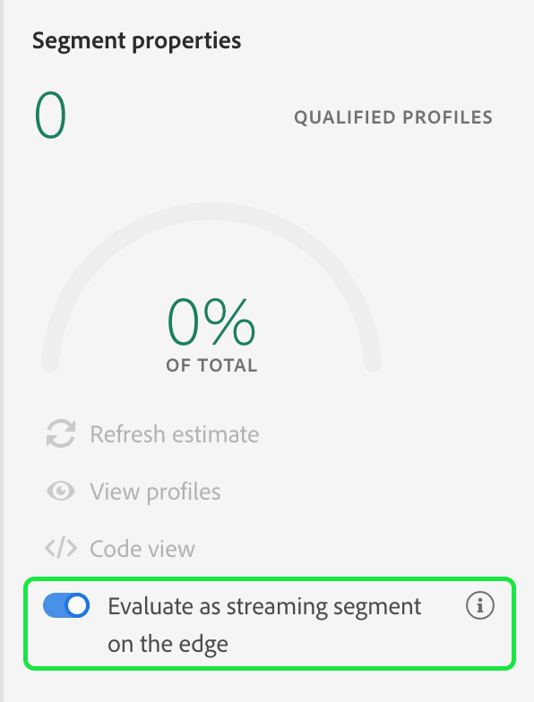

# Användargränssnittsguide för kantsegmentering

Kantsegmentering är möjligheten att utvärdera segment i Adobe Experience Platform direkt, vilket möjliggör användning av samma sida och nästa sida vid personalisering.

## Frågetyper för kantsegmentering

En fråga kan utvärderas med kantsegmentering om den uppfyller något av följande kriterier:

| Frågetyp | Detaljer | Exempel |
| ---------- | ------- | ------- |
| Inkommande träff | En segmentdefinition som refererar till en enda inkommande händelse utan tidsbegränsning. |  |
| Inkommande träde som refererar till en profil | En segmentdefinition som refererar till en enda inkommande händelse, utan tidsbegränsning, och ett eller flera profilattribut. |  |
| Frekvensfråga | En segmentdefinition som refererar till en händelse som inträffar ett visst antal gånger. |  |
| Frekvensfråga som refererar till en profil | En segmentdefinition som refererar till en händelse som inträffar ett visst antal gånger och som har ett eller flera profilattribut. |  |

Om frågan matchar någon av ovanstående frågetyper kan du aktivera den för kantsegmentering genom att aktivera alternativet **[!UICONTROL Evaluate as streaming segment on the edge]**.

Följande frågetyper är **inte** som stöds för kantsegmentering:

| Frågetyp | Detaljer |
| ---------- | ------- |
| Fönster för relativ tid | Om en fråga refererar till ett tidsfönster kan den inte utvärderas med kantsegmentering. |
| Negation | Om en fråga innehåller en negation kan den inte utvärderas med kantsegmentering. |
| Flera händelser | Om en fråga innehåller mer än en händelse kan den inte utvärderas med kantsegmentering. |

## Nästa steg

Den här användarhandboken förklarar hur du utvärderar segment med kantsegmentering på Adobe Experience Platform.

Läs [användarhandboken för segmentering](./overview.md) om du vill veta mer om hur du använder Adobe Experience Platform användargränssnitt. Om du vill veta hur du utför liknande åtgärder och arbetar med segment med Adobe Experience Platform användargränssnitt kan du läsa [API-guiden för kantsegmentering](../api/edge-segmentation.md).