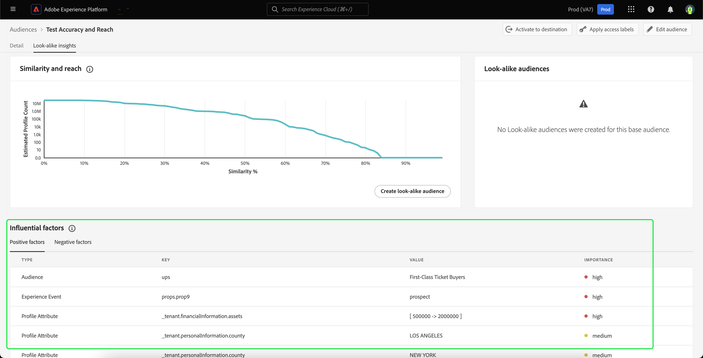

# Guide för lookalike-målgrupper

>[!IMPORTANT]
>
>Insikter som liknar varandra och lookalike-målgrupper är bara tillgängliga i **B2C-utgåvan**.

I Adobe Experience Platform ger lookalike-målgrupper intelligenta insikter om var och en av era målgrupper och utnyttjar maskininlärningsbaserade insikter för att identifiera och inrikta sig på värdefulla kunder med era marknadsföringskampanjer.

Med lookalike-målgrupper kan ni skapa expanderade målgrupper som riktar sig till kunder som liknar era högpresterande målgrupper eller målgrupper som liknar tidigare konverterade målgrupper.

## Terminologi {#terminology}

Innan du börjar använda lookalike-målgrupper måste du förstå följande koncept:

- **Baskåpubliken**: Baskåpspelaren är den målgrupp som du vill få mer information om. Det här är målgruppen som den lookalike-modellen är **baserad** på.
- **Look-alike-modell**: En look-alike-modell är en maskininlärningsmodell som är utbildad på alla berättigade grundmålgrupper utan några kundindata. Varje look-alike-modell skapar inflytelserika faktorer och likhetsdiagram. En lookalike-modell får **inte** poäng.
- **Look-alike-målgrupp**: En Look-alike-målgrupp är den målgrupp som skapas när en look-alike-modell med ett valt likhetströskelvärde tillämpas på basmålgruppen. Du kan skapa flera lookalike-målgrupper med samma look-alike-modell. Den lookalike-målgruppen är vad som får poäng.
- **Total adresserbar målgruppsstorlek**: Den totala adresserbara målgruppsstorleken är det totala antalet profiler under de senaste 30 dagarna minus basmålgruppspopulationen under de senaste 30 dagarna. Om en kund t.ex. har 10 miljoner profiler under de senaste 30 dagarna, och den allmänna målgruppen har 1 miljon profiler under de senaste 30 dagarna, är den totala adresserbara storleken 9 miljoner profiler.

## Kvalificering {#eligibility}

För att kunna använda look-alike-insikter måste **basmålgruppen** uppfylla följande kriterier:

- Baskåpubliken **måste** skapas inom plattformen.
   - Externt genererade målgrupper är **inte** berättigade till lookalike-insikter.
- Baskåpubliken **måste** vara på standardprincipen för sammanslagning.
- Baskåpubliken **får** inte använda fält som begränsas av datastyrning.

## Liknande modellinformation {#details}

>[!CONTEXTUALHELP]
>id="platform_audiences_lookAlike_notEligible"
>title="Ej berättigade"
>abstract="Den här målgruppen är för närvarande inte berättigad till look-alike-insikter eftersom den kan ha mindre än det minsta antalet profiler som krävs för utbildning, eller så har inte profilexporten utlösts ännu."

>[!CONTEXTUALHELP]
>id="platform_audiences_lookAlike_processing"
>title="Bearbetar"
>abstract="Den här målgruppen bearbetas för närvarande. Modellen kan ta upp till 24 timmar att slutföra bearbetningen. Kontrollera igen senare."

>[!CONTEXTUALHELP]
>id="platform_audiences_lookAlike_error"
>title="Fel"
>abstract="Ett fel uppstod när den här modellen bearbetades. Ta bort och återskapa den här modellen eller försök igen senare."

I Adobe Experience Platform förbrukar lookalike-modellen tre olika typer av datapunkter:

- Målgruppsmedlemskap de senaste 30 dagarna
- Upplev händelser under de senaste 30 dagarna som har importerats i kundprofilen i realtid
- Profilattribut under de senaste 30 dagarna som har importerats i kundprofilen i realtid

Alla dessa datapunkter omvandlas till nyckelvärdepar som matas in i lookalike-modellen. Endast nyckelvärdepar med en betydande procentandel av profilmatchningen behålls.

I nuläget körs lookalike-modellen var 24:e timme, vilket skapar och återskapar inflytelserika faktorer och likhetsdiagram för baspubliken. Poängen för lookalike-målgrupper körs också ofta.

## Berättiganden {#entitlements}

Följande berättiganden gäller för användning av lookalike-målgrupper:

- Real-Time CDP Prime-kunder har rätt till **5** aktiva lookalike-målgrupper i produktionssandlådor
- Real-Time CDP Ultimate-kunder är berättigade till **20** aktiva lookalike-målgrupper i produktionssandlådor
- Utvecklingssandlådor är begränsade till **5** lookalike-målgrupper för alla Real-Time CDP-kunder

Tilläggspaket, som blir tillgängliga vid ett senare tillfälle, ökar berättigandena för produktionssandlådor med 20 lookalike-målgrupper per paket.

Kontakta din Adobe-representant för att bekräfta om du har tillgång till lookalike-målgrupper.

## Visa lookalike-insikter {#view}

Insikter som ser likadana ut är inbyggda i sidan med målgruppsinformation. Om du vill titta på utseendeliknande insikter för en målgrupp väljer du **[!UICONTROL Audiences]** i det vänstra navigeringsfältet, följt av **[!UICONTROL Browse]**, och den målgrupp du vill visa insikterna för.

Sidan med målgruppsinformation visas. Välj fliken **[!UICONTROL Look-alike insights]** om du vill visa målgruppens look-alike-insikter. Sidan **[!UICONTROL Look-alike insights]** visas. Den här sidan har tre huvudelement - likhets- och räckvidd-diagram, lookalike-målgrupper och inflytelserika faktorer.

### Likhet och räckvidd {#similarity-and-reach}

>[!CONTEXTUALHELP]
>id="platform_audiences_lookAlike_similarityAndReach"
>title="Likhet och räckvidd"
>abstract="Likheten och räckviddsdiagrammet visar den förväntade räckvidden för en Look-alike-målgrupp bestående av profiler över ett givet likhetspoäng. Du kan hålla pekaren över en viss punkt i diagrammet om du vill visa procentandelen likhet och det förväntade antalet profiler för den markerade punkten."

Avsnittet Likhet och räckvidd visar ett diagram som ritar upp den förväntade räckvidden för en Look-alike-målgrupp bestående av profiler över ett givet likhetspoäng. Likhetspoängen representerar **avståndet** mellan baspublikens profil och den look-alike-liknande insiktens profil.

I det här diagrammet mäter x-axeln andelen likhet i procent mellan en profil och medlemmar i den valda publiken. Likhetspoängen varierar mellan 0 % och 100 %, med ett högre likhetspoäng som anger att en profil är närmare medlemmar i den valda publiken vad gäller värden för inflytelserika faktorer.

På y-axeln visas det förväntade antalet profiler med den likhet i procent som motsvarar det matchande värdet för x-axeln. Det förväntade antalet profiler varierar mellan 0 och den totala adresserbara målgruppen eller 25 miljoner profiler, beroende på vilken som är lägst. Den här axeln mäts på en **logaritmisk skala** för att förbättra diagrammets läsbarhet.

Observera att diagrammet är **kumulativt** från höger till vänster. Det innebär att värdet för y-axeln vid varje punkt i diagrammet är antalet profiler som har en likhet **över** som ligger över likhetströskeln. Om x-axeln till exempel är 60 % och y-axeln är 10 miljoner innebär det att det finns 10 miljoner profiler som är lika med eller mer än 60 % jämfört med baspubliken.

Du kan hålla pekaren över en viss punkt i diagrammet om du vill visa procentandelen likhet och det förväntade antalet profiler för den markerade punkten.

### Målgrupper som ser likadana ut {#list}

I avsnittet för lookalike-målgrupper visas en lista med alla lookalike-målgrupper som tidigare har skapats för den valda basmålgruppen.

### Influensafaktorer {#influential-factors}

>[!CONTEXTUALHELP]
>id="platform_audiences_lookAlike_influentialFactors"
>title="Influensafaktorer"
>abstract="Inflytelserika faktorer är attribut, händelser och målgruppsmedlemskap som är viktiga när det gäller att förklara en profils likhet med medlemmarna i den grundläggande målgruppen. Dataanvändningsetiketter och dataprofiler kan användas för att utesluta vissa data från att betraktas som inflytelserika faktorer i lookalike-modeller."
>additional-url="https://experienceleague.adobe.com/docs/experience-platform/segmentation/ui/lookalike-audiences.html#exclude" text="Uteslut data"

I avsnittet Inflytelserika faktorer visas de 100 viktigaste faktorerna som påverkar den look-alike-modellen för den valda baspubliken. Dessa inflytelserika faktorer är profilattribut, upplevelsehändelser och målgruppsmedlemskap som är de viktigaste när det gäller att förklara likheter hos den grundläggande målgruppen. Genom att förstå de viktigaste inflytelserika faktorerna kan ni personalisera ert marknadsföringsinnehåll bättre för den här målgruppen och alla lookalike-målgrupper ni skapar utifrån den. Observera att inte alla inflytelserika faktorer som påverkar lookalike-modellen visas.

För numeriska faktorer kan nyckelvärdepar placeras i grupper, beroende på hur många olika värden nyckeln har. Om du till exempel har nyckeln `income`, finns det troligen många unika värden. Därför placeras nyckelvärdepar i grupper som kan se ut som `income=[0 -> 30000]`, `income=[30000 -> 50000]` och `income=[50000 -> 100000]`.

Dessa luckor beräknas regelbundet om för att säkerställa att data hålls aktuella.

>[!NOTE]
>
>Influensafaktorerna sorteras efter prioritet och är oberoende av varandra.

| Fält | Beskrivning |
| ----- | ----------- |
| Typ | Den typ av data som den inflytelserika faktorn härleds från. Detta kan vara ett profilattribut, en upplevelsehändelse eller ett målgruppsmedlemskap. |
| Nyckel | Datafältets namn. För nycklar av typen målgruppsmedlemskap representerar det här värdet **namnområdet** för målgruppen som data kommer från. Möjliga värden är `ups` (segmenteringstjänst) och `AO` (målgruppssamordning). För nycklar av andra typer representerar det här värdet sökvägen till XDM-fältet. Om företaget Luma t.ex. har ett anpassat fält som heter Inkomst blir nyckeln `_luma.income` |
| Värde | Värdet varierar beroende på vilken inflytelserik faktor det representerar. För profilattribut eller upplevelsehändelser representerar det här fältet värdet eller värdeintervallet för datafältet som anger likheten med medlemmarna i basmålgruppen. Värdeintervallet skrivs i formatet `[A -> B]`, där `A` representerar det nedre intervallet medan `B` representerar det övre intervallet. För målgruppsmedlemskap är det här fältet namnet på målgruppen. |
| Prioritet | Den inflytelserika faktorens relativa betydelse. Detta kan vara högt, medelstort eller lågt. |

## Skapa en lookalike-målgrupp {#create}

>[!IMPORTANT]
>
>Du **kan inte** använda en lookalike-målgrupp som basmålgrupp för en annan Look-alike-målgrupp. Det innebär att du **inte kan** skapa kedjade lookalike-målgrupper.

Om du vill skapa en lookalike-målgrupp måste du välja den målgrupp du vill basera den lookalike-målgruppen på. Om du vill komma åt din lista över tillgängliga målgrupper väljer du **[!UICONTROL Audiences]** i det vänstra navigeringsfältet följt av **[!UICONTROL Browse]**. Listan över målgrupper visas. På den här sidan kan du välja den målgrupp som du vill använda som din grundmålgrupp.

På sidan med målgruppsinformation väljer du **[!UICONTROL Create look-alike audience]** för att börja skapa en Look-alike-målgrupp.

![Knappen [!UICONTROL Create look-alike audience] är markerad.](../images/ui/lookalike-audiences/create-look-alike-audience.png)

**[!UICONTROL Create a look-alike audience]**-pekaren visas. På den här sidan kan du ange likhetsprocenten för den lookalike-målgruppen.

![Leveransen [!UICONTROL Create a look-alike audience] visas.](../images/ui/lookalike-audiences/create-audience.png)

Du kan ange den här procentandelen för likhet på tre olika sätt:

- Flytta reglaget för att ange procentandelen för likhet
- Ange procentvärdet för likhet i den numeriska postrutan bredvid skjutreglaget
- Håll pekaren över diagrammet och välj önskad plats för att ange procentandelen för likhet

Du kan även uppdatera information om den lookalike-målgruppen, inklusive dess namn och beskrivning. Som standard genereras namnet på den lookalike-målgruppen baserat på den ursprungliga målgruppens namn och den tidigare angivna procentandelen för likhet.

![Den grundläggande informationen är markerad i [!UICONTROL Create a look-alike audience]-porten.](../images/ui/lookalike-audiences/basic-info.png)

Välj **[!UICONTROL Create]** för att slutföra skapandet av din Look-alike-målgrupp.

![Knappen för att skapa är markerad i [!UICONTROL Create a look-alike audience]-porten.](../images/ui/lookalike-audiences/create-audience.png)

Den nya lookalike-målgruppen kan nås i avsnittet **[!UICONTROL Look-alike audiences]** på sidan med målgruppsinformation, och är även tillgänglig i Audience Portal och för andra senare användningar. Observera att det kommer att ta lite tid för den lookalike-målgruppen att poängsättas. Profilantalet blir 0 tills det poängsätts.

## Visa information om lookalike-målgrupper {#view-details}

Om du vill visa information om en lookalike-målgrupp väljer du den lookalike-målgruppen i **[!UICONTROL Look-alike audiences]**-delen av basmålgruppen.

Sidan med målgruppsinformation visas. Mer information om den här sidan finns i avsnittet [målgruppsinformation i översikten över målportalen](./audience-portal.md#audience-details).

## Uteslut datafält från look-alike-modellering {#exclude}

>[!IMPORTANT]
>
> **Du** ansvarar för att se till att data, inklusive känsliga data, är märkta på rätt sätt och att dataanvändningsprinciperna har definierats och aktiverats för att uppfylla de rättsliga och lagstadgade skyldigheter som du tillämpar. Du bör också vara medveten om att de datafält eller segmentmedlemskap som **inte** är direkt korrelerade med datafält som vanligtvis är associerade med känsliga eller skyddade datatyper kan vara en källa till potentiell avvikelse. **Du** ansvarar för att analysera dina data för att identifiera, etikettera och tillämpa lämpliga dataanvändningsprofiler på dina data, inklusive eventuella datafält som kan användas som proxy för känsliga eller skyddade datatyper och som bör undantas från modellering.

Målgrupper som ser likadana ut kan konfigureras för att exkludera datafält som är begränsade för marknadsföringsåtgärden&quot;Data Science&quot; genom att använda relevanta etiketter och policyer för dataanvändning. Data som är märkta som begränsade från användning för datavetenskap kommer att tas bort från övervägandet vid utbildning av en lookalike-målgruppsmodell och vid generering av en Look-alike-målgrupp från den utbildade modellen. 

>[!NOTE]
>
>Det kan ta upp till 48 timmar innan ändringar i dataanvändningsetiketterna för den grundläggande målgruppen börjar gälla.

Standardetiketten&quot;C9&quot; kan användas för att märka data som inte ska användas för datavetenskap och kan användas genom att aktivera standardprincipen&quot;Begränsa datavetenskap&quot;. Du kan också skapa ytterligare profiler för att begränsa data med andra etiketter, inklusive känsliga etiketter, från användning för datavetenskap. Mer information om hur du hanterar dataanvändningsprinciper finns i [användargränssnittshandboken för dataanvändningsprinciper](../../data-governance/policies/user-guide.md). Mer information om hur du hanterar dataanvändningsetiketter finns i [användargränssnittshandboken för dataanvändningsetiketter](../../data-governance/labels/user-guide.md).

Om en basmålgrupp inte har några kontraktsetiketter kommer modelleringsprocessen för lookalike-målgrupper som standard att exkludera **alla**-fält, datamängd eller målgrupp baserat på din organisations aktiverade sekretesspolicy.

## Nästa steg

När du har läst den här guiden har du lärt dig att se lookalike-insikter och skapa Look-alike-målgrupper baserat på dessa insikter. Mer information om målgrupper i Adobe Experience Platform användargränssnitt finns i [gränssnittshandboken för segmenteringstjänsten](./overview.md).
