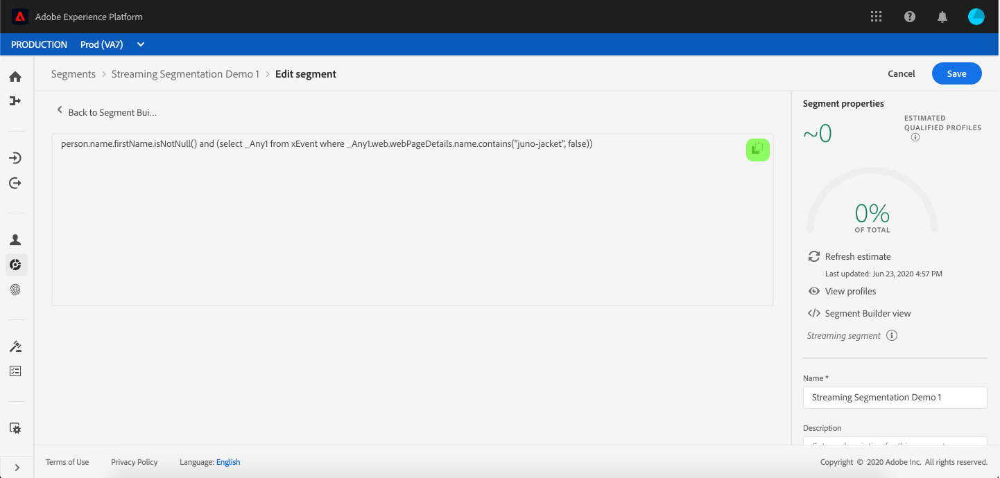
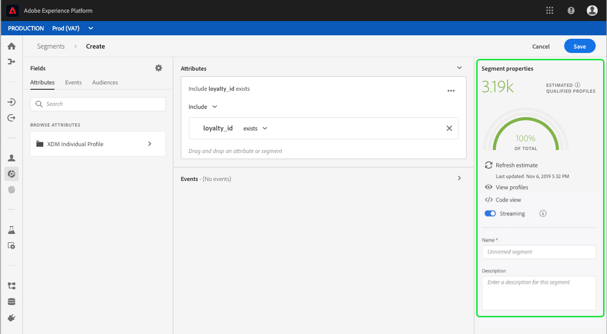
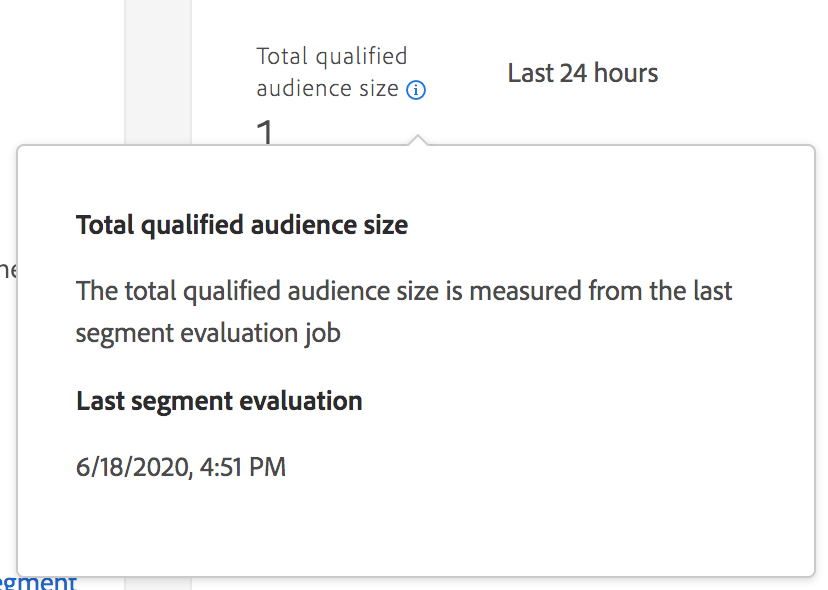

# [!DNL Segment Builder] användarhandbok

[!DNL Adobe Experience Platform Segmentation Service] innehåller ett RESTful-API och användargränssnitt för att skapa segmentdefinitioner utifrån [!DNL Real-time Customer Profile] data.

## Komma igång

Att arbeta med segmentdefinitioner kräver förståelse för de olika [!DNL Experience Platform] tjänster som är förknippade med segmentering. Innan du läser den här användarhandboken bör du läsa dokumentationen för följande tjänster:

- [!DNL Segmentation Service](../home.md): Med hjälp av segmenteringstjänsten kan ni dela in data som lagras i [!DNL Experience Platform] som rör enskilda personer (t.ex. kunder, prospects, användare eller organisationer) i mindre grupper som delar liknande egenskaper och som kommer att svara på marknadsstrategier.
- [!DNL Real-time Customer Profile](../../profile/home.md): Ger en enhetlig konsumentprofil i realtid baserad på aggregerade data från flera källor.
- [!DNL Identity Service](../../identity-service/home.md): Möjliggör [!DNL Real-time Customer Profile] genom att överbrygga identiteter från olika datakällor som importeras till Platform.
- [!DNL Experience Data Model (XDM)](../../xdm/home.md): Det standardiserade ramverket som [!DNL Platform] organiserar kundupplevelsedata.

Det är också viktigt att känna till två nyckeltermer som används i det här dokumentet och förstå skillnaden mellan dem:
- **Segmentdefinition**: Den regeluppsättning som används för att beskriva nyckelegenskaper eller beteenden för en målgrupp.
- **Målgrupp**: Den resulterande uppsättningen profiler som uppfyller villkoren för en segmentdefinition.

## Åtkomst till segmentdefinitioner

Om du vill börja arbeta med segmentdefinitioner i [!DNL Adobe Experience Platform]klickar du **[!UICONTROL Segments]** i den vänstra navigeringen. Om du vill visa alla segmentdefinitioner för din organisation klickar du på *[!UICONTROL Browse]* fliken. I den här vyn visas information om segmentdefinitionen, inklusive utvärderingsmetod, datum då segmentet skapades och senaste ändringsdatum.

Utvärderingsmetoden kan antingen vara direktuppspelning eller batch. Direktuppspelningssegment utvärderas ständigt när data kommer in i systemet. Gruppsegmenten utvärderas enligt ett angivet schema.

Gruppsegmenten har ytterligare information som visas, både det senaste utvärderingsdatumet och nästa utvärderingsdatum för gruppen.

Om du klickar **[!UICONTROL Create segment]** i det övre högra hörnet öppnas arbetsytan Segmentbyggaren, där du kan börja skapa en segmentdefinition.

## [!DNL Segment Builder] arbetsyta

[!DNL Segment Builder] innehåller en omfattande arbetsyta som gör att du kan interagera med [!DNL Profile] dataelement. Arbetsytan innehåller intuitiva kontroller för att skapa och redigera regler, till exempel dra-och-släpp-paneler som används för att representera dataegenskaper.

## Byggstenar för segmentdefinitioner

De grundläggande byggstenarna för segmentdefinitioner är **[!UICONTROL Attributes]** och **[!UICONTROL Events]**. Dessutom **[!UICONTROL Audiences]** kan attributen och händelserna som finns i befintliga komponenter också användas som komponenter för nya definitioner.

Dessa byggstenar visas i *[!UICONTROL Fields]* avsnittet till vänster på [!DNL Segment Builder] arbetsytan. *[!UICONTROL Fields]* innehåller en flik för varje huvudbyggsten: **[!UICONTROL Attributes]**, **[!UICONTROL Events]** och **[!UICONTROL Audiences]**.

### Attribut

På fliken **[!UICONTROL Attributes]** kan du bläddra bland [!DNL Profile] attribut som tillhör [!DNL XDM Individual Profile] klassen. Varje mapp kan expanderas för att visa ytterligare attribut, där varje attribut är en platta som kan dras till regelbyggararbetsytan i mitten av arbetsytan. Arbetsytan för [regelbyggaren](#rule-builder-canvas) beskrivs mer ingående senare i den här guiden.

### Händelser

På fliken **[!UICONTROL Events]** kan du skapa en målgrupp baserat på händelser eller åtgärder som har utförts med XDM ExperienceEvent-dataelement. Du hittar även Händelsetyper på fliken **[!UICONTROL Events]** , som är en samling vanliga händelser som gör att du kan skapa segment snabbare.

Förutom att du kan bläddra efter [!DNL ExperienceEvent] element kan du även söka efter händelsetyper. Händelsetyper använder samma kodningslogik som [!DNL ExperienceEvents], utan att du behöver söka igenom den klass som [!DNL XDM ExperienceEvent] söker efter rätt händelse. Om du till exempel använder sökfältet för att söka efter &quot;kundvagn&quot; returneras händelsetyperna &quot;[!UICONTROL AddCart]&quot; och &quot;[!UICONTROL RemoveCart]&quot;, som är två mycket vanliga kundvagnsåtgärder när du skapar segmentdefinitioner.

Du kan söka efter alla typer av komponenter genom att skriva deras namn i sökfältet, som använder [Lucenes söksyntax](https://docs.microsoft.com/en-us/azure/search/query-lucene-syntax). Sökresultaten fylls i när hela ord anges. Om du till exempel vill skapa en regel som baseras på XDM-fältet `ExperienceEvent.commerce.productViews`börjar du skriva&quot;produktvyer&quot; i sökfältet. När ordet &quot;product&quot; har skrivits in börjar sökresultaten visas. Varje resultat innehåller den objekthierarki som det hör till.

>[!NOTE]
>
>Det kan ta upp till 24 timmar innan anpassade schemafält som definieras av organisationen visas och blir tillgängliga för användning i byggregler.

Sedan kan du enkelt dra och släppa [!DNL ExperienceEvents] och [!UICONTROL Event Types] in i segmentdefinitionen.

Som standard visas endast ifyllda schemafält från ditt datalager. Det inkluderar [!UICONTROL Event Types]. Om [!UICONTROL Event Types] listan inte visas, eller om du bara kan välja &quot;[!UICONTROL Any]&quot; som [!UICONTROL Event Type]en, klickar du på kugghjulsikonen bredvid *[!UICONTROL Fields]* och väljer **[!UICONTROL Show full XDM schema]** under *[!UICONTROL Available Fields]*. Klicka på kugghjulsikonen igen för att gå tillbaka till *[!UICONTROL Fields]* fliken och du bör nu kunna visa flera [!UICONTROL Event Types] - och schemafält, oavsett om de innehåller data eller inte.

### Målgrupper

På **[!UICONTROL Audiences]** fliken visas alla målgrupper som importerats från externa källor, till exempel Adobe Audience Manager, samt målgrupper som skapats i [!DNL Experience Platform].

På [!UICONTROL Audiences] fliken kan du se alla tillgängliga källor som en grupp mappar. När du klickar in i dessa mappar visas tillgängliga undermappar och målgrupper. Dessutom kan du klicka på mappikonen (som visas längst till höger) för att visa mappstrukturen (en bock anger den mapp du befinner dig i) och enkelt navigera tillbaka genom mapparna genom att klicka på namnet på en mapp i trädet.

Du kan hovra över ⓘ bredvid en målgrupp för att visa information om målgruppen, inklusive dess ID, beskrivning och mapphierarkin för att hitta målgruppen.

Du kan också söka efter [!UICONTROL Audiences] med sökfältet som använder [Lucenes söksyntax](https://docs.microsoft.com/en-us/azure/search/query-lucene-syntax). Om du väljer en mapp på den översta nivån på fliken *[!UICONTROL Audiences]* visas sökfältet så att du kan söka i mappen. Sökresultaten fylls bara i när hela ord anges. Om du till exempel vill söka efter ett [!UICONTROL Audience] namn `Online Shoppers`börjar du skriva &quot;Online&quot; i sökfältet. När ordet &quot;Online&quot; har skrivits in fullständigt visas sökresultat som innehåller ordet &quot;Online&quot;.

## Regelbyggarens arbetsyta {#rule-builder-canvas}

En segmentdefinition är en samling regler som används för att beskriva viktiga egenskaper eller beteenden hos en målgrupp. Dessa regler skapas med hjälp av *[!UICONTROL rule builder canvas]*, som finns i mitten av [!DNL Segment Builder].

Om du vill lägga till en ny regel i segmentdefinitionen drar du en platta från *[!UICONTROL Fields]* fliken och släpper den på regelbyggarens arbetsyta. Därefter visas sammanhangsspecifika alternativ beroende på vilken typ av data som läggs till. Tillgängliga datatyper: strängar, datum [!DNL ExperienceEvents], [!UICONTROL Event Types]och [!UICONTROL Audiences].

### Lägga till målgrupper

Du kan dra och släppa en målgrupp från fliken *[!UICONTROL Audience]* till regelbyggararbetsytan för att referera till målgruppsmedlemskap i den nya segmentdefinitionen. På så sätt kan du inkludera eller exkludera målgruppsmedlemskap som ett attribut i den nya segmentregeln.

För [!DNL Platform] målgrupper som skapats med [!DNL Segment Builder]får ni möjligheten att konvertera målgruppen till den uppsättning regler som användes i segmentdefinitionen för den målgruppen. Den här konverteringen skapar en kopia av regellogiken som sedan kan ändras utan att den ursprungliga segmentdefinitionen påverkas. Kontrollera att du har sparat alla senaste ändringar av segmentdefinitionen innan du konverterar den till regellogik.

>[!NOTE]
>
>När du lägger till en målgrupp från en extern källa refereras endast målgruppsmedlemskapet. Du kan inte konvertera målgruppen till regler, och därför kan reglerna som används för att skapa den ursprungliga målgruppen inte ändras i den nya segmentdefinitionen.

Om det uppstår några konflikter när målgrupper konverteras till regler försöker [!DNL Segment Builder] bevara de befintliga alternativen så gott de kan.

### kodvyn

Du kan också visa en kodbaserad version av en regel som har skapats i [!DNL Segment Builder]. När du har skapat regeln på arbetsytan i regelbyggaren kan du välja **[!UICONTROL Code view]** att visa ditt segment som en PQL.

I kodvyn finns en knapp som du kan använda för att kopiera segmentets värde för API-anrop. Kontrollera att du har sparat dina senaste ändringar i segmentet för att få den senaste versionen av segmentet.

## Behållare

Segmentregler utvärderas i den ordning som de listas. Behållare ger kontroll över körningsordningen med hjälp av kapslade frågor.

När du har lagt till minst en platta på regelbyggararbetsytan kan du börja lägga till behållare. Om du vill skapa en ny behållare klickar du på ellipserna (..) i rutans övre högra hörn och klickar sedan på **[!UICONTROL Add container]**.

En ny behållare visas som underordnad till den första behållaren, men du kan justera hierarkin genom att dra och flytta behållarna. Standardbeteendet för en behållare är att&quot;[!UICONTROL Include]&quot; attributet, händelsen eller målgruppen som anges. Du kan ställa in regeln på &quot;[!UICONTROL Exclude]&quot;-profiler som matchar behållarvillkoren genom att klicka **[!UICONTROL Include]** i rutans övre vänstra hörn och välja &quot;[!UICONTROL Exclude]&quot;.

En underordnad behållare kan också extraheras och läggas till i den överordnade behållaren genom att klicka på Bryt upp behållare i den underordnade behållaren. Klicka på ellipserna (..) i det övre högra hörnet av den underordnade behållaren för att komma åt det här alternativet.

När du klickar på **[!UICONTROL Unwrap container]** den underordnade behållaren tas den bort och villkoren visas textbundna.

>[!NOTE]
>
>När du delar upp behållare ska du se till att logiken fortsätter att uppfylla den önskade segmentdefinitionen.

## Sammanfoga profiler

[!DNL Experience Platform] gör att ni kan samla data från flera olika källor och kombinera dem för att få en fullständig bild av varje enskild kund. När du sammanför dessa data är sammanfogningsprinciper de regler som [!DNL Platform] använder för att avgöra hur data ska prioriteras och vilka data som ska kombineras för att skapa en profil.

Du kan välja en sammanfogningsprincip som matchar ditt marknadsföringssyfte för den här målgruppen eller använda den standardsammanfogningsprincip som tillhandahålls av [!DNL Platform]. Du kan skapa flera sammanfogningsprinciper som är unika för din organisation, inklusive skapa en egen standardsammanfogningsprincip. Stegvisa instruktioner om hur du skapar sammanfogningspolicyer för din organisation finns i självstudiekursen om hur du [arbetar med sammanfogningspolicyer med användargränssnittet](../../profile/ui/merge-policies.md).

Om du vill välja en sammanfogningsprincip för segmentdefinitionen klickar du på kugghjulsikonen på *[!UICONTROL Fields]* -fliken och använder sedan *[!UICONTROL Merge Policy]listrutan *för att välja den sammanfogningsprincip som du vill använda.

## Segmentegenskaper

När du skapar en segmentdefinition visas en uppskattning av storleken på det *[!UICONTROL Segment Properties]* segment som skapas i avsnittet till höger om arbetsytan, så att du kan justera segmentdefinitionen efter behov innan du skapar själva målgruppen.

I det *[!UICONTROL Segment Properties]* här avsnittet kan du även ange viktig information om segmentdefinitionen, inklusive dess *[!UICONTROL Name]* och *[!UICONTROL Description]*. Segmentdefinitionsnamn används för att identifiera ditt segment bland dem som definieras av organisationen och bör därför vara beskrivande, koncisa och unika.

När du fortsätter att skapa en segmentdefinition kan du visa en sidnumrerad förhandsvisning av målgruppen genom att välja **[!UICONTROL View Profiles]**.

>[!NOTE]
>
>Målgruppsuppskattningar genereras med en provstorlek för den aktuella dagens exempeldata. Om det finns mindre än 1 miljon enheter i din profilbutik används hela datauppsättningen. För mellan 1 och 20 miljoner enheter används 1 miljon enheter. och för över 20 miljoner enheter används 5 % av det totala antalet enheter. Mer information om hur du genererar segmentuppskattningar finns i avsnittet [för att generera](../tutorials/create-a-segment.md#estimate-and-preview-an-audience) uppskattningar i självstudiekursen för att skapa segment.

## Aktivera schemalagd segmentering {#enable-scheduled-segmentation}

När segmentdefinitionerna har skapats kan du utvärdera dem vid behov eller genom en schemalagd (kontinuerlig) utvärdering. Utvärdering innebär att flytta [!DNL Real-time Customer Profile] data genom segmentdefinitioner för att skapa motsvarande målgrupper. När målgrupperna har skapats sparas och lagras de så att de kan exporteras med API: [!DNL Experience Platform] er.

I On-demand-utvärderingen ingår att använda API:t för att utvärdera och bygga målgrupper efter behov, medan schemalagd utvärdering (även kallat schemalagd segmentering) gör att du kan skapa ett återkommande schema för att utvärdera segmentdefinitioner vid en viss tidpunkt (högst en gång om dagen).

Du kan aktivera dina segmentdefinitioner för schemalagd utvärdering med hjälp av gränssnittet eller API:t. Gå tillbaka till fliken *[!UICONTROL Browse]* i användargränssnittet **[!UICONTROL Segments]** och aktivera **[!UICONTROL Evaluate all segments]**. Detta gör att alla segment utvärderas baserat på det schema som angetts av organisationen.

>[!NOTE]
>
>Schemalagd utvärdering kan aktiveras för sandlådor med högst fem (5) sammanfogningsprinciper för [!DNL XDM Individual Profile]. Om din organisation har fler än fem sammanfogningsprinciper för [!DNL XDM Individual Profile] i en enda sandlådemiljö kan du inte använda schemalagd utvärdering.

Scheman kan för närvarande bara skapas med API:t. Detaljerade anvisningar om hur du skapar, redigerar och arbetar med scheman med API:t finns i självstudiekursen för utvärdering och åtkomst av segmentresultat, särskilt avsnittet om [schemalagd utvärdering med API](../tutorials/evaluate-a-segment.md#scheduled-evaluation).

## Direktuppspelningssegmentering {#streaming-segmentation}

>[!NOTE]
>
>För att direktuppspelningssegmentering ska fungera måste kunden aktivera schemalagd segmentering för organisationen. Mer information om hur du aktiverar schemalagd segmentering finns [i föregående avsnitt i den här användarhandboken](#enable-scheduled-segmentation).

En fråga utvärderas automatiskt med direktuppspelningssegmentering om den uppfyller något av följande kriterier:

| Frågetyp | Detaljer | Exempel |
| ---------- | ------- | ------- |
| Inkommande träff | En segmentdefinition som refererar till en enda inkommande händelse utan tidsbegränsning. |  |
| Inkommande träff inom ett relativt tidsfönster | En segmentdefinition som refererar till en enda inkommande händelse **inom de senaste sju dagarna**. |  |
| Inkommande träde som refererar till en profil | En segmentdefinition som refererar till en enda inkommande händelse, utan tidsbegränsning, och ett eller flera profilattribut. |  |
| Inkommande träde som refererar till en profil inom ett relativt tidsfönster | En segmentdefinition som refererar till en enda inkommande händelse och ett eller flera profilattribut **under de senaste sju dagarna**. |  |
| Flera händelser som refererar till en profil | Alla segmentdefinitioner som refererar till flera händelser **under de senaste 24 timmarna** och (valfritt) har ett eller flera profilattribut. |  |

I följande avsnitt visas exempel på segmentdefinitioner som **inte** kommer att aktiveras för direktuppspelningssegmentering.

| Frågetyp | Detaljer |
| ---------- | ------- | 
| Inkommande träff inom ett relativt tidsfönster | Om segmentdefinitionen refererar till en inkommande händelse **som inte** är under den **senaste sju-dagarsperioden**. Till exempel under de **senaste två veckorna**. |  |
| Inkommande träde som refererar till en profil i ett relativt fönster | Följande alternativ har **inte** stöd för direktuppspelningssegmentering:<ul><li>En inkommande händelse **som inte** är under den **senaste sjudagarsperioden**.</li><li>En segmentdefinition som innehåller [!DNL Adobe Audience Manager (AAM)] segment eller egenskaper.</li></ul> |  |
| Flera händelser som refererar till en profil | Följande alternativ har **inte** stöd för direktuppspelningssegmentering:<ul><li>En händelse som **inte** inträffar **de senaste 24 timmarna**.</li><li>En segmentdefinition som innehåller Adobe Audience Manager-segment (AAM) eller -egenskaper.</li></ul> |  |
| Flerenhetsfrågor | Flerenhetsfrågor stöds **inte** av direktuppspelningssegmentering som helhet. |  |

Dessutom gäller vissa riktlinjer för direktuppspelningssegmentering:

| Frågetyp | Riktlinje |
| ---------- | -------- |
| Enkel händelsefråga | Fönstret för att titta tillbaka är begränsat till **sju dagar**. |
| Fråga med händelsehistorik | <ul><li>Fönstret för att titta tillbaka är begränsat till **en dag**.</li><li>Det **måste** finnas ett strikt ordningsvillkor mellan händelserna.</li><li>Endast enkla tidsinställningar (före och efter) mellan händelserna tillåts.</li><li>De enskilda händelserna **kan inte** negeras. Hela frågan **kan** dock negeras.</li></ul> |

### Övervaka direktuppspelningssegmentering

När du har skapat ett direktuppspelningsaktiverat segment kan du övervaka detaljer i det segmentet.

Mer information om *[!UICONTROL total qualified audience size]* finns. Om ett jobb har körts inom de senaste 24 timmarna visas **[!UICONTROL Total Audience Size]** från jobbet, förutom ett linjediagram för målgruppen som lagts till. I annat fall visas **[!UICONTROL Estimated Audience Size]** bilden, förutom en trendlinje för visualisering.

Du hittar mer information om den senaste utvärderingen av segment genom att klicka på informationsbubblan.

### Film om direktuppspelad segmentering

Följande video är avsedd att ge en bättre förståelse för direktuppspelningssegmentering. Här visas ett exempel på en kundupplevelse följt av en snabb genomgång av de viktigaste funktionerna i [!DNL Platform] gränssnittet.

>[!VIDEO](https://video.tv.adobe.com/v/36184?quality=12&learn=on)

## Felaktiga policyöverträdelser

>[!NOTE]
>
>Principöverträdelser av typen DULE gäller bara om du skapar ett segment som har tilldelats ett mål.

När du är klar med segmentet analyseras segmentet av [!DNL Data Governance] att kontrollera att det inte finns några policyöverträdelser inom segmentet. Mer information om DULE och policyöverträdelser finns i [översikten](../../data-governance/labels/overview.md)för dataanvändningsetiketten.

## Nästa steg och ytterligare resurser {#next-steps}

Segment Builder har ett omfattande arbetsflöde som gör det möjligt att isolera marknadsmässiga målgrupper från [!DNL Real-time Customer Profile] data. När du har läst den här guiden bör du nu kunna:

- Skapa segmentdefinitioner med en kombination av attribut, händelser och befintliga målgrupper som byggstenar.
- Använd regelbyggarens arbetsyta och behållare för att styra i vilken ordning segmentreglerna körs.
- Visa uppskattningar av er presumtiva målgrupp, så att ni kan justera era segmentdefinitioner efter behov.
- Aktivera alla segmentdefinitioner för schemalagd segmentering.
- Aktivera angivna segmentdefinitioner för direktuppspelningssegmentering.

Om du vill veta mer [!DNL Segmentation Service]kan du fortsätta att läsa dokumentationen och komplettera din inlärning genom att titta på filmerna nedan. Stegvisa instruktioner om hur du arbetar med [!DNL Segmentation Service] att använda [!DNL Segmentation Service] API:t finns i [självstudiekursen om att skapa målgruppssegment med API:er](../tutorials/create-a-segment.md) .

>[!WARNING]
>
> Gränssnittet [!DNL Platform] som visas i följande videofilmer är inaktuellt. Läs dokumentationen ovan för de senaste skärmbilderna och funktionerna i användargränssnittet.

**Skapa ett segment:**

>[!VIDEO](https://video.tv.adobe.com/v/27254?quality=12&learn=on)

**Skapa ett dynamiskt segment:**

>[!VIDEO](https://video.tv.adobe.com/v/27428?quality=12&learn=on)
