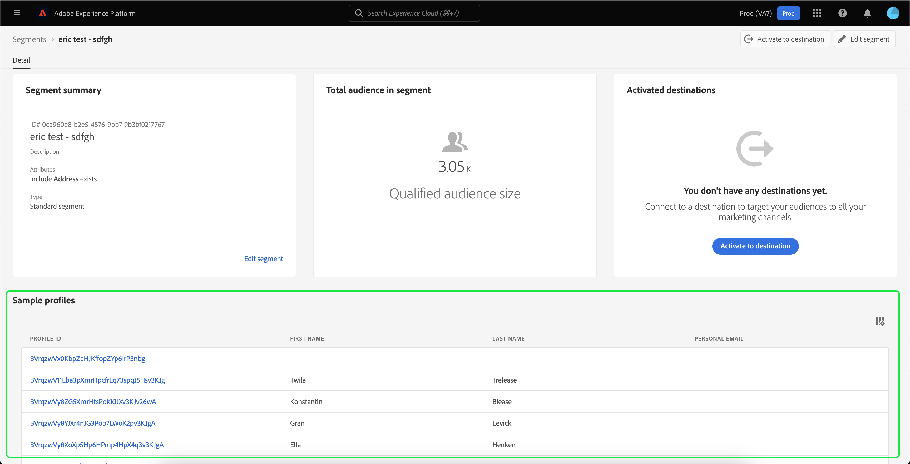

# Användargränssnittsguide för segmenteringstjänst

[!DNL Adobe Experience Platform Segmentation Service] innehåller ett användargränssnitt för att skapa och hantera segmentdefinitioner.

## Komma igång

Att arbeta med segmentdefinitioner kräver förståelse för de olika [!DNL Experience Platform] tjänster som är förknippade med segmentering. Innan du läser den här användarhandboken bör du läsa dokumentationen för följande tjänster:

- [[!DNL Segmentation Service]](../home.md): [!DNL Segmentation Service] gör att du kan dela in data som lagras i [!DNL Experience Platform] som rör enskilda personer (t.ex. kunder, prospects, användare eller organisationer) i mindre grupper.
- [[!DNL Real-time Customer Profile]](../../profile/home.md): Ger en enhetlig konsumentprofil i realtid baserad på aggregerade data från flera källor.
- [[!DNL Adobe Experience Platform Identity Service]](../../identity-service/home.md): Gör det möjligt att skapa kundprofiler genom att överbrygga identiteter från olika datakällor som importeras till [!DNL Platform].
- [[!DNL Experience Data Model (XDM)]](../../xdm/home.md): Det standardiserade ramverket som [!DNL Platform] organiserar kundupplevelsedata.

Det är också viktigt att känna till två nyckeltermer som används i det här dokumentet och förstå skillnaden mellan dem:
- **Segmentdefinition**: Den regeluppsättning som används för att beskriva nyckelegenskaper eller beteenden för en målgrupp.
- **Målgrupp**: Den resulterande uppsättningen profiler som uppfyller villkoren för en segmentdefinition.

## Översikt

I [[!DNL Experience Platform] användargränssnittet](http://platform.adobe.com/)väljer du **[!UICONTROL Segments]** i den vänstra navigeringen för att öppna **[!UICONTROL Overview]** fliken. På den här fliken finns länkar till dokumentation och videoklipp som hjälper dig att förstå och börja arbeta med segment.

## Bläddra

Klicka på **[!UICONTROL Browse]** fliken för att visa en lista över alla segmentdefinitioner för din IMS-organisation.

I den här vyn visas information om segmentdefinitionen, inklusive uppdelning, kurva, antal profiler, utvärderingsmetod, datum när segmentet skapades och senaste ändringsdatum.

Neddelningen visar ett stolpdiagram som visar procentandelen profiler som tillhör var och en av följande statusvärden: [!UICONTROL Entered], [!UICONTROL Realized]och [!UICONTROL Exiting].

| Status | Beskrivning |
| ------ | ----------- |
| Anges | En ny profil inom segmentet. |
| Realiserad | En befintlig profil som finns kvar inom segmentet. |
| Avslutar | En befintlig profil som lämnar segmentet. |

Kurvan anger hur många procent av profilerna som ändras inom en segmentdefinition jämfört med den senaste gången segmentjobbet kördes, medan antalet profiler representerar det totala antalet profiler som kvalificerar sig för segmentet.

Utvärderingsmetoden kan antingen vara direktuppspelning eller batch. Direktuppspelningssegment utvärderas ständigt när data kommer in i systemet. Gruppsegmenten utvärderas enligt ett angivet schema.

Överst på sidan finns alternativ för att lägga till alla segment i ett schema och för att skapa ett nytt segment.

Växling **[!UICONTROL Add all segments to schedule]** aktiverar schemalagd segmentering. Mer information om schemalagd segmentering finns i avsnittet om [schemalagd segmentering i den här användarhandboken](#scheduled-segmentation).

Om du väljer **[!UICONTROL Create segment]** det här alternativet kommer du till segmentbyggaren. Mer information om hur du skapar segment finns i avsnittet om [att skapa segment i användarhandboken](#create-segment).

Den högra sidopanelen innehåller information om alla segment i IMS-organisationen, med en lista över det totala antalet segment, det sista utvärderingsdatumet, nästa utvärderingsdatum samt en uppdelning av segmenten efter värderingsmetod.

Om du väljer segmentdefinitionens rad får du en sammanfattning av segmentdefinitionen, inklusive alternativ för att antingen redigera eller ta bort segmentet, kvalificerad publik för segmentet, total målgruppsstorlek, utöver segmentets namn, beskrivning, utvärderingsmetod, skapad den och senaste ändringsdatum.

## Segmentdefinitionsinformation {#segment-details}

Om du vill visa mer information om en viss segmentdefinition markerar du segmentets namn på **[!UICONTROL Browse]** fliken.

Sidan med segmentinformation visas. Överst finns en sammanfattning av segmentdefinitionen, information om den kvalificerade målgruppsstorleken samt vilka mål som segmentet är aktiverat för.

### Segmentsammanfattning

Avsnittet innehåller information om attributens ID, namn, beskrivning och detaljer **[!UICONTROL Segment summary]** .

Dessutom kan du redigera segmentet. Om du väljer **[!UICONTROL Edit segment]** det här alternativet kommer du till [!DNL Segment Builder]. Mer information om hur du använder [!DNL Segment Builder] arbetsytan finns i [[!DNL Segment Builder] användarhandboken](./segment-builder.md).

### Total publik i segmentet

I **[!UICONTROL Total audience in segment]** avsnittet visas det totala antalet profiler som är kvalificerade för segmentet.

Uppskattningar genereras med en provstorlek för den aktuella dagens exempeldata. Om det finns mindre än 1 miljon enheter i din profilbutik används hela datauppsättningen. För mellan 1 och 20 miljoner enheter används 1 miljon enheter. och för över 20 miljoner enheter används 5 % av det totala antalet enheter. Mer information om hur du genererar segmentuppskattningar finns i avsnittet [för att generera](../tutorials/create-a-segment.md#estimate-and-preview-an-audience) uppskattningar i självstudiekursen för att skapa segment.

### Aktiverade destinationer

I **[!UICONTROL Activated destinations]** avsnittet visas de mål som det här segmentet är aktiverat för.

>[!NOTE]
>
> Destinationer är en funktion som är tillgänglig med [!DNL Real-time Customer Data Platform]och som gör att du kan exportera data till externa plattformar. Mer information om destinationer finns i [destinationsöversikten](../../destinations/home.md). Om du vill veta hur du aktiverar ett segment till ett mål kan du läsa [guiden om hur du aktiverar segment till ett mål](../../destinations/ui/activate-destinations.md).

### Profilexempel

Under finns ett urval profiler som är kvalificerade för segmentet, med detaljerad information som [!DNL Profile] ID, förnamn, efternamn och personlig e-post.

Det sätt på vilket datainsamling utlöses beror på metoden för intag.

För batchimport skannas profilarkivet automatiskt var 15:e minut för att se om en ny batch har importerats sedan den senaste samplingsjobbet kördes. Om så är fallet genomsöks sedan profilarkivet för att se om det har skett minst 5 procents ändring av antalet poster. Om dessa villkor uppfylls utlöses ett nytt samplingsjobb.

För direktuppspelningsinläsning genomsöks profilarkivet automatiskt varje timme för att se om det har skett minst 5 procents ändring av antalet poster. Om det här villkoret är uppfyllt utlöses ett nytt samplingsjobb.

Exempelstorleken för genomsökningen beror på det totala antalet enheter i din profilbutik. De här exempelstorlekarna visas i följande tabell:

| Enheter i profilarkivet | Samplingsstorlek |
| ------------------------- | ----------- |
| Mindre än 1 miljon | Fullständig datauppsättning |
| 1 till 20 miljoner | 1 miljon |
| Över 20 miljoner | 5 % av det totala |

Mer detaljerad information om varje [!DNL Profile] alternativ finns om du väljer [!DNL Profile] ID. Mer information om en profils detaljer finns i [[!DNL Real-time Customer Profile] användarhandboken](../../profile/ui/user-guide.md#profile-detail).

## Skapa ett segment {#create-segment}

Om du väljer **[!UICONTROL Create segment]** i det övre högra hörnet öppnas [!DNL Segment Builder] arbetsytan där du kan börja skapa en segmentdefinition.

### [!DNL Segment Builder] arbetsyta

[!DNL Segment Builder] innehåller en omfattande arbetsyta som gör att du kan interagera med [!DNL Profile] dataelement. Arbetsytan innehåller intuitiva kontroller för att skapa och redigera regler, till exempel dra-och-släpp-paneler som används för att representera dataegenskaper.

Mer information om hur du använder [!DNL Segment Builder] arbetsytan finns i [[!DNL Segment Builder] användarhandboken](./segment-builder.md).

## Schemalagd segmentering {#scheduled-segmentation}

När segmentdefinitionerna har skapats kan du utvärdera dem vid behov eller genom en schemalagd (kontinuerlig) utvärdering. Utvärdering innebär att flytta [!DNL Real-time Customer Profile] data genom segmentdefinitioner för att skapa motsvarande målgrupper. När målgrupperna har skapats sparas och lagras de så att de kan exporteras med API: [!DNL Experience Platform] er.

I On-demand-utvärderingen ingår att använda API:t för att utvärdera och bygga målgrupper efter behov, medan schemalagd utvärdering (även kallat schemalagd segmentering) gör att du kan skapa ett återkommande schema för att utvärdera segmentdefinitioner vid en viss tidpunkt (högst en gång om dagen).

### Aktivera schemalagd segmentering {#enable-scheduled-segmentation}

Du kan aktivera dina segmentdefinitioner för schemalagd utvärdering med hjälp av gränssnittet eller API:t. Gå tillbaka till fliken **[!UICONTROL Browse]** i användargränssnittet **[!UICONTROL Segments]** och aktivera **[!UICONTROL Add all segments to schedule]**. Detta gör att alla segment utvärderas baserat på det schema som angetts av organisationen.

>[!NOTE]
>
>Schemalagd utvärdering kan aktiveras för sandlådor med högst fem (5) sammanfogningsprinciper för [!DNL XDM Individual Profile]. Om din organisation har fler än fem sammanfogningsprinciper för [!DNL XDM Individual Profile] i en enda sandlådemiljö kan du inte använda schemalagd utvärdering.

Scheman kan för närvarande bara skapas med API:t. Detaljerade anvisningar om hur du skapar, redigerar och arbetar med scheman med API:t finns i självstudiekursen för utvärdering och åtkomst av segmentresultat, särskilt avsnittet om [schemalagd utvärdering med API](../tutorials/evaluate-a-segment.md#scheduled-evaluation).

## Direktuppspelningssegmentering {#streaming-segmentation}

Direktuppspelningssegmentering är möjligheten att segmentera [!DNL Platform] i nära realtid, samtidigt som man fokuserar på datamöjligheter. Med direktuppspelningssegmentering sker nu segmentkvalificering allt eftersom data når [!DNL Platform]och eliminerar behovet av att schemalägga och köra segmenteringsjobb.

Mer information om direktuppspelningssegmentering finns i användarhandboken för [direktuppspelningssegmentering](./streaming-segmentation.md).

>[!NOTE]
>
>För att direktuppspelningssegmenteringen ska fungera måste du aktivera schemalagd segmentering för organisationen. Mer information om hur du aktiverar schemalagd segmentering finns [i avsnittet om direktuppspelningssegmentering i den här användarhandboken](#scheduled-segmentation).

## Policyöverträdelser

>[!NOTE]
>
>Policyöverträdelser gäller bara om du skapar ett segment som har tilldelats ett mål.

När du är klar med segmentet analyseras segmentet av Adobe Experience Platform Data Governance för att säkerställa att det inte förekommer några överträdelser av policyer inom segmentet. Mer information finns i [[!DNL Data Governance] översikten](../../data-governance/home.md) .

## Nästa steg och ytterligare resurser {#next-steps}

Gränssnittet [!DNL Segmentation Service] innehåller ett omfattande arbetsflöde som gör det möjligt att isolera marknadsföringsbara målgrupper från [!DNL Real-time Customer Profile] data.

Om du vill veta mer [!DNL Segmentation Service]kan du fortsätta läsa dokumentationen. Om du vill lära dig hur du använder [!DNL Segmentation Service] API:t läser du [[!DNL Segmentation Service] utvecklarhandboken](../api/overview.md).
