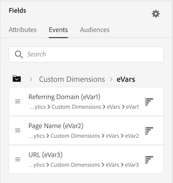
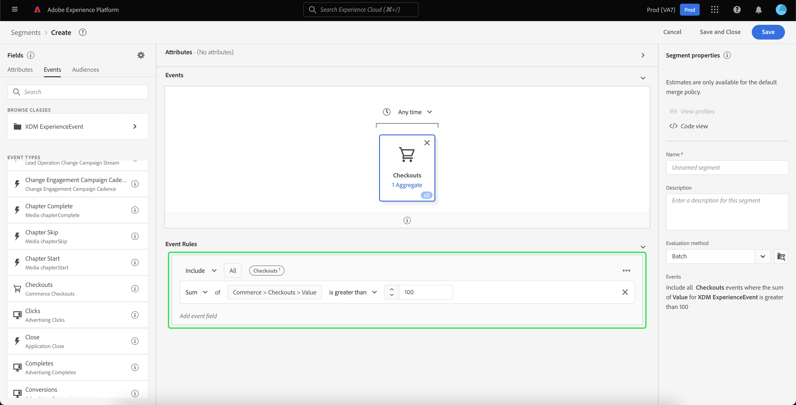
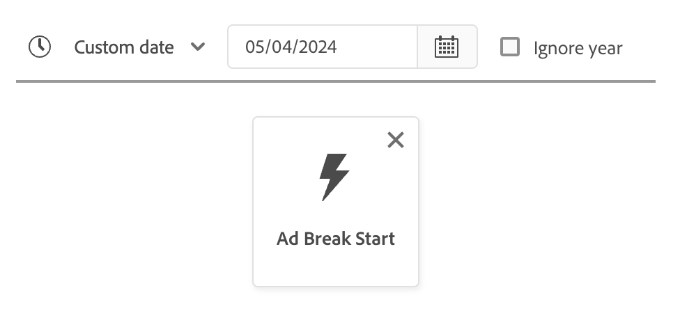
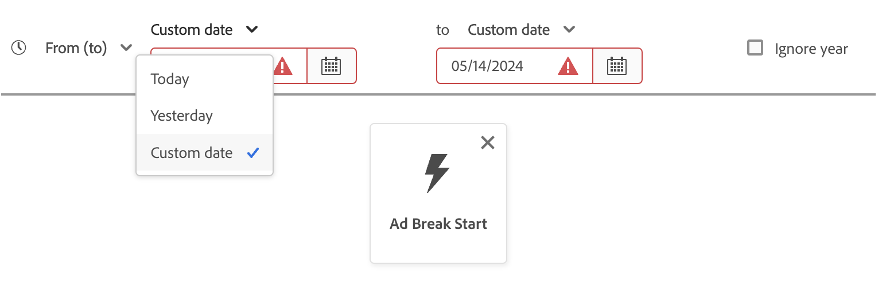
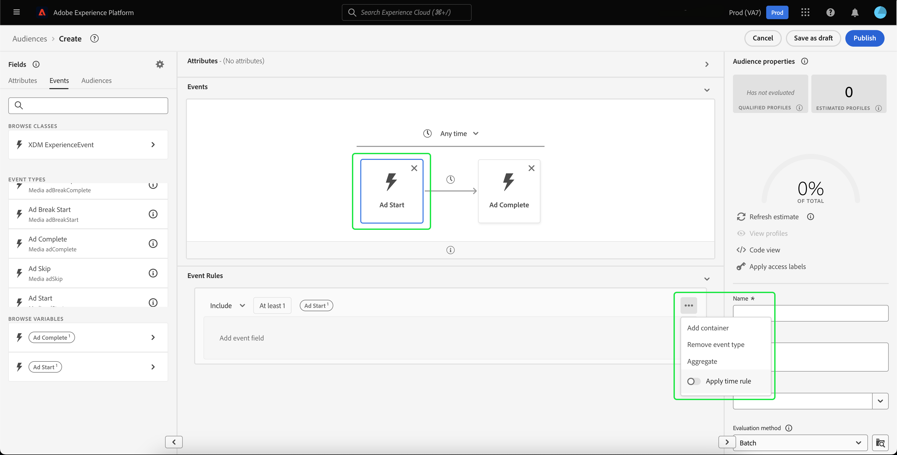

# Användargränssnittshandbok för [!DNL Segment Builder]

>[!NOTE]
>
>I den här guiden förklaras hur du skapar målgrupper med hjälp av **segmentdefinitioner** med segmentverktyget. Om du vill lära dig hur du skapar målgrupper med hjälp av Audience Composition, kan du läsa användargränssnittsguiden för [Audience Composition](./audience-composition.md).

[!DNL Segment Builder] innehåller en omfattande arbetsyta som du kan använda för att interagera med [!DNL Profile]-dataelement. Arbetsytan innehåller intuitiva kontroller för att skapa och redigera regler, till exempel dra-och-släpp-paneler som används för att representera dataegenskaper.

## Byggstenar för segmentdefinitioner {#building-blocks}

>[!CONTEXTUALHELP]
>id="platform_segments_createsegment_segmentbuilder_fields"
>title="Fält"
>abstract="De tre fälttyperna som utgör en segmentdefinition är attribut, händelser och målgrupper. Med attribut kan du använda profilattribut som tillhör klassen XDM Individual Profile, händelser gör att du kan skapa en målgrupp baserat på åtgärder och händelser som inträffar med hjälp av dataelementen XDM ExperienceEvent, och målgrupper låter dig använda importerade målgrupper från externa källor."

>[!CONTEXTUALHELP]
>id="platform_segmentation_segmentbuilder_showfullxdmschema"
>title="Visa fullständigt XDM-schema"
>abstract="Som standard visas bara fält som innehåller data. Aktivera det här alternativet om du vill visa alla fält i XDM-schemat."

>[!CONTEXTUALHELP]
>id="platform_segmentation_segmentbuilder_showdeprecatedfields"
>title="Visa inaktuella fält"
>abstract="Som standard visas inte inaktuella XDM-fält. Aktivera det här alternativet om du vill visa inaktuella XDM-fält."

De grundläggande byggstenarna för segmentdefinitioner är attribut och händelser. Dessutom kan attribut och händelser i befintliga målgrupper användas som komponenter för nya definitioner.

>[!CONTEXTUALHELP]
>id="platform_segments_createsegment_segmentbuilder_summarydata"
>title="Sammanfattningsdata"
>abstract="Sammanfattningsdata visas bara för profilattribut och <b>visas inte</b> för antingen händelse- eller målgruppsattribut.  Sammanfattningsdata för profilattribut får inte visas under följande omständigheter: <ol><li>Vissa av värdena i attributet är längre än 100 tecken.</li><li>Det finns mer än 3000 unika värden för attributet.</li></ol>"

>[!NOTE]
>
>Om du väljer informationsbubblan för ett attribut kan du visa fältets värdefördelning, även känd som sammanfattningsdata. Dessa är **endast** tillgängliga på fliken Attribut och är inte tillgängliga för användning på fliken Händelser eller målgrupper.
>
>Sammanfattningsdata visas om attributet uppfyller följande kriterier: Alla värden för attributet är 100 tecken eller färre och det finns 3 000 eller färre unika värden för attributet.
>
>Ett attribut kommer **inte** att ha sammanfattningsdata om det är data med flera enheter som är länkade till profilen via en relation. Om du till exempel har ett anpassat schema med namnet `Vehicle` kommer **-egenskaperna** i `Vehicle`-schemat **inte** att ha sammanfattningsdata.

Dessa byggstenar visas i avsnittet **[!UICONTROL Fields]** till vänster på arbetsytan i [!DNL Segment Builder]. **[!UICONTROL Fields]** innehåller en flik för varje huvudbyggsten: [!UICONTROL Attributes], [!UICONTROL Events] och [!UICONTROL Audiences].

### Attribut

På fliken **[!UICONTROL Attributes]** kan du bläddra bland [!DNL Profile]-attribut som tillhör klassen [!DNL XDM Individual Profile]. Varje mapp kan expanderas för att visa ytterligare attribut, där varje attribut är en platta som kan dras till regelbyggararbetsytan i mitten av arbetsytan. [Regelbyggararbetsytan](#rule-builder-canvas) beskrivs mer ingående senare i den här handboken.

### Händelser

På fliken **[!UICONTROL Events]** kan du skapa en målgrupp baserat på händelser eller åtgärder som har utförts med dataelement från [!DNL XDM ExperienceEvent]. Du kan också hitta händelsetyper på fliken **[!UICONTROL Events]**, som är en samling händelser som du använder ofta, så att du kan skapa segmentdefinitioner snabbare.

Förutom att du kan bläddra efter [!DNL ExperienceEvent] element kan du även söka efter händelsetyper. Händelsetyper använder samma kodningslogik som [!DNL ExperienceEvents], utan att du behöver söka igenom klassen [!DNL XDM ExperienceEvent] för att hitta rätt händelse. Om du till exempel använder sökfältet för att söka efter kundvagn returneras händelsetyperna [!UICONTROL AddCart] och [!UICONTROL RemoveCart], som är två mycket vanliga kundvagnsåtgärder när du skapar segmentdefinitioner.

Du kan söka efter alla typer av komponenter genom att skriva dess namn i sökfältet, som använder [Lucenes söksyntax](https://docs.microsoft.com/en-us/azure/search/query-lucene-syntax). Sökresultaten fylls i när hela ord anges. Om du till exempel vill skapa en regel baserad på XDM-fältet `ExperienceEvent.commerce.productViews` börjar du skriva &quot;produktvyer&quot; i sökfältet. När ordet &quot;product&quot; har skrivits in börjar sökresultaten visas. Varje resultat innehåller den objekthierarki som det hör till.

>[!NOTE]
>
>Det kan ta upp till 24 timmar innan anpassade schemafält som definieras av organisationen visas och blir tillgängliga för användning i byggregler.

Du kan sedan enkelt dra och släppa [!DNL ExperienceEvents] och [!UICONTROL Event Types] i segmentdefinitionen.

Som standard visas endast ifyllda schemafält från ditt datalager. Detta inkluderar [!UICONTROL Event Types]. Om listan [!UICONTROL Event Types] inte visas, eller om du bara kan välja [!UICONTROL Any] som [!UICONTROL Event Type], väljer du **kugghjulsikonen** bredvid **[!UICONTROL Fields]** och sedan **[!UICONTROL Show full XDM schema]** under **[!UICONTROL Available Fields]**. Välj **kugghjulsikonen** igen om du vill gå tillbaka till fliken **[!UICONTROL Fields]** och du bör nu kunna visa flera [!UICONTROL Event Types]- och schemafält, oavsett om de innehåller data eller inte.

#### Adobe Analytics rapportuppsättningar

Du kan använda data från en eller flera Adobe Analytics-rapportsviter som händelser inom segmentering.

När du använder data från en enda analysrapportsserie lägger Experience Platform automatiskt till beskrivningar och egna namn i eVars, vilket gör det enklare att hitta fälten i [!DNL Segment Builder].

När du använder data från flera rapportsviter i Analytics kan Experience Platform **inte** automatiskt lägga till beskrivningar eller egna namn i eVars. Därför måste du mappa till XDM-fält innan du använder data från rapportsviterna i Analytics. Mer information om mappning av Analytics-variabler till XDM finns i [Adobe Analytics källanslutningsguide](../../sources/tutorials/ui/create/adobe-applications/analytics.md#mapping).

Tänk dig till exempel en situation där du har två rapportsviter med följande variabler:

| Fält | Report Suite Schema A | Report Suite Schema B |
| ----- | --------------------- | --------------------- |
| eVar1 | Refererande domän | Inloggad J/N |
| eVar2 | Sidnamn | Medlemmens lojalitets-ID |
| eVar3 | URL | Sidnamn |
| eVar4 | Sökvillkor | Produktnamn |
| event1 | Klickningar | Sidvyer |
| event2 | Sidvyer | Cart Additions |
| event3 | Cart Additions | Utcheckningar |
| event4 | Inköp | Inköp |

I det här fallet kan du mappa de två rapportsviterna med följande schema:

>[!NOTE]
>
>De generiska eVar-värdena fylls i men du bör **inte** använda dem i dina segmentdefinitioner (om det är möjligt), eftersom värdena kan betyda andra saker än vad de ursprungligen var i sina rapporter.

När rapportsviterna har mappats kan du använda dessa nyligen mappade fält i dina profilrelaterade arbetsflöden och segmentering.

| Scenario | Unionens schemaupplevelse | Generisk variabel för segmentering | Segmentmappad variabel |
| -------- | ----------------------- | ----------------------------- | ---------------------------- |
| Ett rapportpaket | En egen namnbeskrivning ingår i generiska variabler.   **Exempel:** Sidnamn (eVar2) | <ul><li>Egen namnbeskrivning ingår i generiska variabler</li><li>Frågor använder data från den specifika datauppsättningen, eftersom det är den enda</li></ul> | Frågor kan använda Adobe Analytics-data och eventuellt andra källor. |
| Flera rapportsviter | Inga egna namnbeskrivningar ingår i generiska variabler.   **Exempel:** eVar2 | <ul><li>Alla fält med flera beskrivningar visas som generiska. Det innebär att inga egna namn visas i användargränssnittet.</li><li>Frågor kan använda data från alla datauppsättningar som innehåller eVar, vilket kan resultera i blandade eller felaktiga resultat.</li></ul> | Frågor använder korrekt kombinerade resultat från flera datauppsättningar. |

### Målgrupper

>[!CONTEXTUALHELP]
>id="platform_segmentation_segmentBuilder_b2b_decomposition"
>title="Komplex utvärdering"
>abstract="Följande uttryck är för komplicerat för att uttryckas som en enskild målgrupp. Om du vill använda både B2B-regler och personbaserade händelser i samma segmentdefinition följer du stegen nedan.<ol><li>Skapa en segmentdefinition som bara refererar till personbaserade händelser och spara den som en egen segmentdefinition.</li><li>I en ny segmentdefinition importerar du den segmentdefinition som skapats tidigare och refererar till B2B-reglerna.</li></ol>"

>[!CONTEXTUALHELP]
>id="platform_segmentation_segmentbuilder_externalaudiences"
>title="Externa målgrupper"
>abstract="Publiker som importeras via fliken Publiker visas nu automatiskt via Audience Portal. Målgrupper som importerats från Audience Manager, Customer Journey Analytics, Segment Match och andra anpassade integreringar är tillgängliga utan att först behöva konfigurera i Segment Builder. Från och med den 1 september 2025 hämtas alla målgrupper exklusivt via Unified Search, och det tidigare arbetsflödet stöds inte längre."
>additional-url="https://experienceleague.adobe.com/sv/docs/experience-platform/segmentation/ui/audience-portal#list" text="Målgruppsportal"

>[!NOTE]
>
>För målgrupper som skapats i Experience Platform visas endast målgrupper som har **same**-sammanslagningsprincipen.

På fliken **[!UICONTROL Audiences]** visas alla målgrupper som importerats från externa källor, som Adobe Audience Manager eller Customer Journey Analytics, samt målgrupper som skapats i [!DNL Experience Platform].

På fliken **[!UICONTROL Audiences]** kan du se alla tillgängliga källor som en grupp med mappar. När du markerar mapparna visas tillgängliga undermappar och målgrupper. Dessutom kan du välja mappikonen (som visas längst till höger) för att visa mappstrukturen (en bock anger den mapp du befinner dig i) och enkelt navigera tillbaka genom mapparna genom att välja namnet på en mapp i trädet.

Du kan hovra över ⓘ bredvid en målgrupp för att visa information om målgruppen, inklusive dess ID, beskrivning och mapphierarkin för att hitta målgruppen.

## Regelbyggarens arbetsyta {#rule-builder-canvas}

>[!IMPORTANT]
>
>Från och med versionen från juni 2024 representerar tidsbegränsningarna&quot;Den här månaden&quot; och&quot;Det här året&quot; både&quot;månad till datum&quot; och&quot;år till datum&quot;. Om du till exempel skapade en målgrupp den 18 juli som letade efter&quot;alla kunder vars födelsedag inträffar den här månaden&quot;, skulle målgruppen få alla kunder vars födelsedagar inträffade mellan 1 juli och 31 juli. Den 1 augusti får den här publiken alla kunder vars födelsedag inträffar från den 1 augusti till den 31 augusti.
>
>Tidigare representerade &quot;Den här månaden&quot; och &quot;det här året&quot; 30 dagar respektive 365 dagar, som inte kunde räkna med månader med 31 dagar respektive skottår.
>
>För att uppdatera era målgruppers logik måste ni spara om era målgrupper som ni skapat tidigare.

En segmentdefinition är en samling regler som används för att beskriva viktiga egenskaper eller beteenden hos en målgrupp. Dessa regler skapas med hjälp av regelbyggararbetsytan som finns i mitten av [!DNL Segment Builder].

Om du vill lägga till en ny regel i segmentdefinitionen drar du en platta från fliken **[!UICONTROL Fields]** och släpper den på regelbyggararbetsytan. Därefter visas sammanhangsspecifika alternativ beroende på vilken typ av data som läggs till. Tillgängliga datatyper är: strängar, datum, [!DNL ExperienceEvents], [!UICONTROL Event Types] och målgrupper.

>[!IMPORTANT]
>
>De senaste ändringarna av Adobe Experience Platform har uppdaterat användningen av de logiska operatorerna `OR` och `AND` mellan händelser. Dessa uppdateringar påverkar inte befintliga segmentdefinitioner. Alla efterföljande uppdateringar av befintliga segmentdefinitioner och nya segmentdefinitioner kommer dock att påverkas av dessa ändringar. Mer information finns i [tidskonstanternas uppdatering](./segment-refactoring.md).

När du väljer ett värde för attributet visas en lista med uppräkningsvärden som attributet kan vara.

Om du väljer ett värde i den här listan med enum, visas värdet med en heldragen kantlinje. För fält som använder `meta:enum` (mjuka) enum kan du dock även välja ett värde som **inte** i listan med enum. Om du skapar ett eget värde kontureras det med en prickad ram tillsammans med en varning om att det här värdet inte finns med i uppräkningslistan.

Om du skapar flera värden kan du lägga till alla samtidigt genom att använda massöverföringen. Markera plusikonen  för att visa povern **[!UICONTROL Add values in bulk]**.

På porten **[!UICONTROL Add values in bulk]** kan du överföra en CSV- eller TSV-fil.

Du kan också lägga till kommaavgränsade värden manuellt.

Observera att högst 250 värden tillåts. Om du överskrider detta värde måste du ta bort vissa värden innan du lägger till fler.

### Lägga till målgrupper

>[!CONTEXTUALHELP]
>id="platform_segmentation_segmentbuilder_addaudiences"
>title="Sök efter uppdateringar"
>abstract="Det befintliga söksystemet har uppdaterats för att använda enhetlig sökning. Med enhetlig sökning kan ni enklare och tillförlitligare söka efter medlemskap i segment hos era målgrupper."

Du kan dra och släppa en målgrupp från fliken **[!UICONTROL Audience]** till regelbyggararbetsytan för att referera till målgruppsmedlemskap i den nya segmentdefinitionen. På så sätt kan du inkludera eller exkludera målgruppsmedlemskap som ett attribut i de nya segmentdefinitionsreglerna.

För [!DNL Experience Platform] målgrupper som skapats med [!DNL Segment Builder] får du alternativet att konvertera målgruppen till den uppsättning regler som användes i segmentdefinitionen för den målgruppen. Den här konverteringen skapar en kopia av regellogiken som sedan kan ändras utan att den ursprungliga segmentdefinitionen påverkas. Kontrollera att du har sparat alla senaste ändringar av segmentdefinitionen innan du konverterar den till regellogik.

>[!NOTE]
>
>När du lägger till en målgrupp från en extern källa refereras endast målgruppsmedlemskapet. Du kan inte konvertera målgruppen till regler, och därför kan reglerna som används för att skapa den ursprungliga målgruppen inte ändras i den nya segmentdefinitionen.

Om det uppstår konflikter när målgrupper konverteras till regler försöker [!DNL Segment Builder] bevara de befintliga alternativen så att de blir så bra som möjligt.

### kodvyn

Du kan också visa en kodbaserad version av en regel som har skapats i [!DNL Segment Builder]. När du har skapat regeln på arbetsytan i regelbyggaren kan du välja **[!UICONTROL Code view]** om du vill se segmentdefinitionen som PQL.

I kodvyn finns en knapp som gör att du kan kopiera värdet för segmentdefinitionen som ska användas i API-anrop. Kontrollera att du har sparat dina senaste ändringar av segmentdefinitionen för att få tillgång till den senaste versionen av segmentdefinitionen.

### Sammanställningsfunktioner

En aggregering i [!DNL Segment Builder] är en beräkning för en grupp av XDM-attribut vars datatyp är ett tal (antingen en dubbel eller ett heltal). De fyra aggregeringsfunktionerna som stöds i Segment Builder är SUM, AVERAGE, MIN och MAX.

Om du vill skapa en aggregeringsfunktion väljer du en händelse från den vänstra listen och infogar den i behållaren [!UICONTROL Events].

När du har placerat händelsen i händelsebehållaren markerar du ellipsikonen (..) följt av **[!UICONTROL Aggregate]**.

Aggregeringsvärdet har nu lagts till. Nu kan du välja sammanställningsfunktionen, välja vilket attribut som ska sammanställas, likhetsfunktionen samt värdet. I exemplet nedan kvalificerar den här segmentdefinitionen alla profiler som har en summa köpta värden som är större än 100 USD, även om varje enskilt köp är mindre än 100 USD.

### Räkningsfunktioner {#count-functions}

Räkningsfunktioner i Segment Builder används för att söka efter angivna händelser och räkna antalet gånger de är klara. De räkningsfunktioner som stöds i Segment Builder är &quot;Minst&quot;, &quot;Högst&quot;, &quot;Exakt&quot;, &quot;Mellan&quot; och &quot;Alla&quot;.

Om du vill skapa en räkningsfunktion väljer du en händelse från den vänstra listen och infogar den i behållaren [!UICONTROL Events].

När du har placerat händelsen i händelsebehållaren markerar du knappen [!UICONTROL At least 1].

Funktionen count har nu lagts till. Nu kan du välja funktionen count och värdet för funktionen. Exemplet nedan är att inkludera alla händelser som har minst ett klick.

### Tidsbegränsningar {#time-constraints}

Tidsbegränsningar gör att du kan tillämpa tidsbegränsningar för tidsbaserade attribut, händelser och sekvensen mellan händelserna.

>[!IMPORTANT]
>
>Om du har skapat en segmentdefinition med tidsbegränsningen &quot;Den här månaden&quot; eller &quot;Det här året&quot; före juni 2024 måste du spara om segmentdefinitionerna. Före juni 2024 baserades&quot;Denna månad&quot; på 30 dagar och&quot;Detta år&quot; på 365 dagar.

>[!NOTE]
>
>Både tidsbegränsningen [för ignorering av årstid](./ignore-year.md) och [tidsbegränsningen på regelnivå](./segment-refactoring.md) har redan omarbetats, med mer information tillgänglig i de länkade översikterna.

Listan över tillgängliga tidsbegränsningar är följande:

+++ Tillgängliga tidsbegränsningar

>[!NOTE]
>
>Alla tidsbegränsningar baseras på UTC.
>
>Om kryssrutan [!UICONTROL Ignore year] är aktiverad jämförs dessutom året **inte** som en del av utvärderingen av segmentdefinitionen.

| Tidsbegränsning | Beskrivning | Kan aktivera ignorering av år | Exempel |
| --------------- | ----------- | ------------------- | ------- |
| Idag | Attributet eller händelsen som jämförs **måste** inträffa idag. | Ja | {width="100" zoomable="yes"} |
| Igår | Attributet eller händelsen som jämförs **måste** inträffa i går. | Ja | {width="100" zoomable="yes"} |
| Den här månaden | Attributet eller händelsen som jämförs **måste** inträffa den här kalendermånaden. | Ja | {width="100" zoomable="yes"} |
| I år | Attributet eller händelsen som jämförs **måste** inträffa det här kalenderåret. | Nej | {width="100" zoomable="yes"} |
| Anpassat datum | Attributet eller händelsen som jämförs **måste** inträffa på det angivna datumet. | Ja | {width="100" zoomable="yes"} |
| I sista | Attributet eller händelsen som jämförs **måste** inträffa inom den senast valda perioden. Den här tidsperioden är **inkluderande** tills utvärderingstiden är slut. | Nej | {width="100" zoomable="yes"} |
| Från (till) | Attributet eller händelsen som jämförs **måste** inträffa inom de två valda kalenderdatumen. Den här tidsperioden är **inkluderande** av båda datumen. | Ja, om anpassat datum | {width="100" zoomable="yes"} |
| Under | Attributet eller händelsen som jämförs **måste** inträffa inom den valda månaden eller det valda året. Om du väljer en månad måste du välja både den månad och det år som attributet eller händelsen ägde rum i.  Om du väljer ett år behöver du bara välja vilket år attributet eller händelsen ägde rum i. Om du väljer en månad kan du även aktivera kryssrutan [!UICONTROL Ignore year]. | Ja | {width="100" zoomable="yes"} |
| Inom (+/-) | Attributet eller händelsen som jämförs **måste** inträffa inom dagar, veckor, månader eller år från det valda datumet. Den här tidsperioden är **inkluderande** av båda datumen. Det valda datumet kan vara i dag, i går eller ett annat anpassat datum som du väljer. | Ja | {width="100" zoomable="yes"} |
| Före | Attributet eller händelsen som jämförs **måste** inträffa före det valda datumet. Det valda datumet kan vara ett anpassat datum som du väljer, eller ett val mellan dagar, veckor, månader eller år sedan. | Ja | {width="100" zoomable="yes"} |
| Efter | Attributet eller händelsen som jämförs **måste** inträffa efter det valda datumet. Det valda datumet kan vara ett anpassat datum som du väljer, eller ett val mellan dagar, veckor, månader eller år sedan. | Ja | {width="100" zoomable="yes"} |
| Rullningsområde | Attributet eller händelsen som jämförs måste inträffa mellan de två relativa datumen. Datumen kan anges i sekunder, minuter, timmar, dagar, veckor, månader eller år. | Nej | {width="100" zoomable="yes"} |
| I nästa | Attributet eller händelsen som jämförs måste inträffa inom nästa valda tidsperiod. De valda tidsperioderna är minuter, timmar, dagar, veckor, månader och år. | Nej | {width="100" zoomable="yes"} |
| Finns | Attributet finns. | Nej | {width="100" zoomable="yes"} |
| Finns inte | Attributet finns inte. | Nej | {width="100" zoomable="yes"} |

+++

När du tillämpar en tidsbegränsning för en händelse kan du antingen använda den på arbetsytans nivå, på kortnivån eller mellan händelser.

#### Begränsning på arbetsytenivå

Om du vill använda en tidsbegränsning på arbetsytenivå väljer du klockikonen som visas ovanför tidslinjen för händelser.

När du tillämpar en tidsbegränsning på arbetsytans nivå tillämpas tidsbegränsningen på **alla** -händelser i målgruppen.

#### Kortnivåbegränsning

Om du vill använda en begränsning på kortnivå markerar du det kort som du vill använda tidsbegränsningen på, följt av ellipsikonen och **[!UICONTROL Apply time rule]**. Detta gör att du kan välja en tidsbegränsning i behållaren **[!UICONTROL Event Rules]**.

När du tillämpar en tidsbegränsning på kortnivån tillämpas tidsbegränsningen på den **angivna** -händelsen i målgruppen.

#### Mellan händelsebegränsning

Om du vill använda en tidsbegränsning mellan händelser väljer du klockikonen mellan de två händelser som du vill tillämpa tidsbegränsningen på.

När du tillämpar en tidsbegränsning mellan händelsen tillämpas tidsbegränsningen på tiden **mellan** händelserna.

Listan över tillgängliga tidsbegränsningar för den här åtgärden skiljer sig från huvudlistan över tidsbegränsningar och är följande:

+++ Tillgängliga tidsbegränsningar

| Tidsbegränsning | Beskrivning |
| --------------- | ----------- |
| Efter | Den senare händelsen **måste minst** äga rum efter den föregående händelsen. |
| Inom | De två händelserna **måste** äga rum under den tidsperiod som anges i tidsbegränsningen. |

>[!NOTE]
>
>När du använder After-tidsbegränsningen kan den senare händelsen inträffa mer än den tid som anges i tidsbegränsningen. >
>&#x200B;>Om du till exempel har en sidvyhändelse och en utcheckningshändelse, och du placerar tidsbegränsningen &quot;Efter 1 timme&quot; mellan dessa två händelser, skulle en segmentdefinition med en utcheckningshändelse 2 timmar efter sidvyhändelsen vara giltig.
>
>Dessutom kan dessa två tidsbegränsningar användas tillsammans.
>
>Om du till exempel har en sidvyhändelse och en utcheckningshändelse, och du placerar både tidsbegränsningen &quot;Efter 1 timme&quot; och &quot;Inom 24 timmar&quot;, skulle en segmentdefinition med en utcheckningshändelse 12 timmar efter sidvyhändelsen vara giltig, men en segmentdefinition med en utcheckningshändelse 36 timmar efter sidvyhändelsen skulle inte vara giltig.

+++

## Behållare {#containers}

Segmentregler utvärderas i den ordning som de listas. Behållare ger kontroll över körningsordningen med hjälp av kapslade frågor.

När du har lagt till minst en platta på regelbyggararbetsytan kan du börja lägga till behållare. Om du vill skapa en ny behållare markerar du ellipserna (..) i rutans övre högra hörn och väljer sedan **[!UICONTROL Add container]**.

En ny behållare visas som underordnad till den första behållaren, men du kan justera hierarkin genom att dra och flytta behållarna. Standardbeteendet för en behållare är [!UICONTROL Include], det angivna attributet, händelsen eller målgruppen. Du kan ange regeln till [!UICONTROL Exclude]-profiler som matchar behållarvillkoren genom att välja **[!UICONTROL Include]** i det övre vänstra hörnet av rutan och välja [!UICONTROL Exclude].

En underordnad behållare kan också extraheras och läggas till i den överordnade behållaren genom att markera&quot;dela upp behållare&quot; i den underordnade behållaren. Markera ellipserna (..) i det övre högra hörnet av den underordnade behållaren för att komma åt det här alternativet.

När du har valt **[!UICONTROL Unwrap container]** tas den underordnade behållaren bort och villkoren visas textbundna.

>[!NOTE]
>
>När du delar upp behållare ska du se till att logiken fortsätter att uppfylla den önskade segmentdefinitionen.

## Sammanfoga profiler

>[!CONTEXTUALHELP]
>id="platform_segmentation_createSegment_segmentBuilder_mergePolicies"
>title="Sammanfoga profiler"
>abstract="En sammanfogningsprincip gör det möjligt att sammanfoga olika datauppsättningar för att skapa din profil. Experience Platform har angett en standardprincip för sammanfogning eller så kan du skapa en ny standardprincip för sammanfogning i Profiler. Välj en sammanfogningspolicy som matchar ert marknadsföringssyfte för den här målgruppen."

Med [!DNL Experience Platform] kan du samla data från flera olika källor och kombinera dem för att få en fullständig bild av varje enskild kund. När du sammanfogar dessa data är sammanfogningsprinciper de regler som [!DNL Experience Platform] använder för att avgöra hur data ska prioriteras och vilka data som ska kombineras för att skapa en profil.

Du kan välja en sammanfogningsprincip som matchar ditt marknadsföringssyfte för den här målgruppen eller använda standardprincipen för sammanfogning som tillhandahålls av [!DNL Experience Platform]. Du kan skapa flera sammanfogningsprinciper som är unika för din organisation, inklusive skapa en egen standardsammanfogningsprincip. Om du vill ha stegvisa instruktioner om hur du skapar sammanfogningsprinciper för din organisation börjar du med att läsa översikten [för sammanfogningsprinciper](../../profile/merge-policies/overview.md).

Om du vill välja en sammanfogningsprincip för segmentdefinitionen väljer du kugghjulsikonen på fliken **[!UICONTROL Fields]** och väljer sedan den sammanfogningsprincip som du vill använda på den nedrullningsbara menyn **[!UICONTROL Merge Policy]**.

## Målgruppsegenskaper {#audience-properties}

>[!CONTEXTUALHELP]
>id="platform_segments_createsegment_segmentbuilder_segmentproperties"
>title="Målgruppsegenskaper"
>abstract="I avsnittet för målgruppsegenskaper visas en uppskattning av storleken på den slutliga målgruppen, med antalet kvalificerade profiler jämfört med det totala antalet profiler. På så sätt kan ni justera målgruppen efter behov innan ni själva bygger målgruppen."

>[!CONTEXTUALHELP]
>id="platform_segments_createsegment_segmentbuilder_refreshestimate"
>title="Uppdatera uppskattningar"
>abstract="Du kan uppdatera uppskattningarna av din segmentdefinition så att du omedelbart ser en förhandsvisning av hur många profiler som skulle kvalificera sig för den föreslagna segmentdefinitionen. Målgruppsuppskattningar genereras med en provstorlek för den aktuella dagens exempeldata."
>additional-url="https://experienceleague.adobe.com/docs/experience-platform/segmentation/tutorials/create-a-segment.html?lang=sv-SE#estimate-and-preview-an-audience" text="Beräkna och förhandsgranska en målgrupp"

>[!CONTEXTUALHELP]
>id="platform_segments_createsegment_segmentbuilder_qualifiedprofiles"
>title="Kvalificerade profiler"
>abstract="Kvalificerade profiler anger det faktiska antalet profiler som matchar målgruppens regler. Antalet uppdateras var 24:e timme efter att segmentutvärderingsjobbet har körts."

>[!CONTEXTUALHELP]
>id="platform_segments_createsegment_segmentbuilder_estimatedprofiles"
>title="Uppskattade profiler"
>abstract="Uppskattade profiler anger ett ungefärligt antal profiler, baserade på provjobbet, som uppfyller målgruppens regler."

När du skapar en segmentdefinition visas en uppskattning av storleken på den resulterande segmentdefinitionen i avsnittet **[!UICONTROL Audience properties]** till höger om arbetsytan, så att du kan justera segmentdefinitionen efter behov innan du skapar själva målgruppen.

**[!UICONTROL Qualified Profiles]** anger det **faktiska** antalet profiler som matchar segmentdefinitionens regler. Antalet uppdateras var 24:e timme efter att segmentutvärderingsjobbet har körts.

Tidsstämpeln för kvalificerade profiler anger det senaste **batch**-segmentutvärderingsjobbet och visas **inte** för segmentdefinitioner som utvärderas med hjälp av direktuppspelning eller kantsegmentering. Om du redigerar segmentdefinitionen ändras antalet kvalificerade profiler inte förrän nästa segmentutvärderingsjobb körs.

**[!UICONTROL Estimated Profiles]** anger ett **ungefärligt profilintervall** baserat på **exempeljobbet**. Detta innebär att exempeldata projiceras på den större profiluppsättningen, vilket resulterar i ett uppskattat antal som kan skilja sig från det faktiska antalet kvalificerade profiler. Det uppskattade profilprovet har ett 95% konfidensintervall.

Numret uppdateras i två scenarier:

1. Kunddata förändras med mer än 3 % eller så är det senaste exempeljobbet äldre än tre dagar.
2. Målgruppens regler har ändrats eller tagits bort.

Om du väljer informationsbubblan visas datum och tid då det senaste exempeljobbet kördes.

I avsnittet **[!UICONTROL Audience properties]** kan du även ange viktig information om din målgrupp, inklusive namn, beskrivning och utvärderingstyp. Namnen används för att identifiera en segmentdefinition bland de som definieras av organisationen och bör därför vara beskrivande, koncisa och unika.

När du fortsätter att skapa din målgrupp kan du visa en sidnumrerad förhandsvisning av målgruppen genom att välja **[!UICONTROL View Profiles]**.

>[!NOTE]
>
>Målgruppsuppskattningar genereras med en provstorlek för den aktuella dagens exempeldata. Om det finns mindre än 1 miljon enheter i din profilbutik används hela datauppsättningen, för mellan 1 och 20 miljoner enheter används 1 miljon enheter och för över 20 miljoner enheter används 5 % av det totala antalet enheter.
>
>Beräkningen baseras dessutom på när det senaste profilexempeljobbet kördes. Det innebär att om du använder en relativ datumfunktion som&quot;Idag&quot; eller&quot;Den här veckan&quot;, kommer uppskattningen att basera sina beräkningar på körtiden för det sista profilprovjobbet. Om till exempel den 24 januari i dag är den 24 januari och det sista profilprovjobbet kördes den 22 januari, kommer den relativa datumfunktionen i går att baseras på den 21 januari och inte den 23 januari.
>
>Mer information om hur du genererar uppskattningar för segmentdefinitioner finns i [uppskattningsavsnittet ](../tutorials/create-a-segment.md#estimate-and-preview-an-audience) i självstudiekursen för att skapa segmentdefinitioner.

Du kan också välja en utvärderingsmetod. Om du vet vilken utvärderingsmetod du vill använda kan du välja önskad utvärderingsmetod med hjälp av listrutan. Om du vill veta vilka utvärderingstyper som den här segmentdefinitionen kvalificerar för kan du välja bläddringsikonen  för att visa en lista över tillgängliga metoder för utvärdering av segmentdefinition.

[!UICONTROL Evaluation method eligibility]-pekaren visas. Den här drivrutinen visar tillgängliga utvärderingsmetoder, som batchvis, direktuppspelning och kant. Förvisaren visar vilka utvärderingsmetoder som är kvalificerade och inte berättigade. Beroende på vilka parametrar du har använt i segmentdefinitionen kanske den inte uppfyller kraven för vissa utvärderingsmetoder. Mer information om kraven för respektive bedömningsmetod finns i översikterna för [direktuppspelningssegmentering](../methods/streaming-segmentation.md#query-types) eller [kantsegmentering](../methods/edge-segmentation.md#query-types).

Du kan också ändra utvärderingsmetoden för segmentdefinitionen när du är klar med att skapa den. Om du ändrar utvärderingsmetoden från Edge eller Streaming till Batch kan du **inte** ändra tillbaka till Edge eller Streaming. Ändringen av utvärderingsmetoden träder **endast** i kraft när du väljer **[!UICONTROL Save]** i povern. Om du avbryter dialogrutan **behålls** den ursprungliga utvärderingsmetoden.

Om du väljer en ogiltig utvärderingsmetod uppmanas du att antingen ändra segmentdefinitionsreglerna eller ändra utvärderingsmetoden.

Mer information om de olika utvärderingsmetoderna för segmentdefinitioner finns i [segmenteringsöversikten](../home.md#evaluate-segments).

## Nästa steg {#next-steps}

I Segment Builder finns ett omfattande arbetsflöde som gör att du kan isolera marknadsföringsbara målgrupper från [!DNL Real-Time Customer Profile]-data. När du har läst den här guiden bör du nu kunna:

- Skapa segmentdefinitioner med en kombination av attribut, händelser och befintliga målgrupper som byggstenar.
- Använd regelbyggarens arbetsyta och behållare för att styra i vilken ordning segmentreglerna körs.
- Visa uppskattningar av er presumtiva målgrupp, så att ni kan justera era segmentdefinitioner efter behov.
- Aktivera alla segmentdefinitioner för schemalagd segmentering.
- Aktivera angivna segmentdefinitioner för direktuppspelningssegmentering.

Om du vill veta mer om [!DNL Segmentation Service] kan du fortsätta läsa dokumentationen och komplettera din inlärning genom att titta på relaterade videor. Läs [!DNL Segmentation Service]användarhandboken[[!DNL Segmentation Service]  om du vill veta mer om de andra delarna i användargränssnittet för ](./overview.md).
