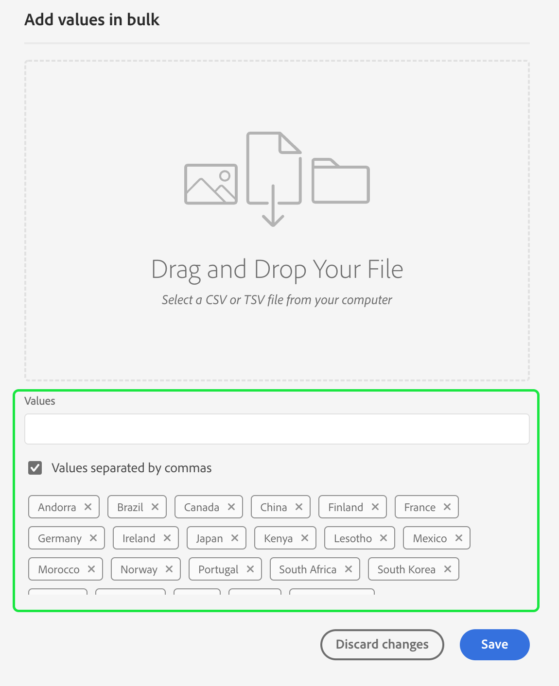

# [!DNL Segment Builder] Användargränssnittsguide

>[!NOTE]
>
>I den här guiden beskrivs hur du skapar målgrupper genom **segmentdefinitioner** med segmentbyggaren. Läs mer om hur du skapar målgrupper med Audience Composition i [Användargränssnittsguide för målgruppskomposition](./audience-composition.md).

[!DNL Segment Builder] innehåller en omfattande arbetsyta som gör att du kan arbeta med [!DNL Profile] dataelement. Arbetsytan innehåller intuitiva kontroller för att skapa och redigera regler, till exempel dra-och-släpp-paneler som används för att representera dataegenskaper.

## Byggstenar för segmentdefinitioner {#building-blocks}

>[!CONTEXTUALHELP]
>id="platform_segments_createsegment_segmentbuilder_fields"
>title="Fält"
>abstract="De tre fälttyperna som utgör en segmentdefinition är attribut, händelser och målgrupper. Med attribut kan du använda profilattribut som tillhör klassen XDM Individual Profile, händelser gör att du kan skapa en målgrupp baserat på åtgärder och händelser som inträffar med hjälp av dataelementen XDM ExperienceEvent, och målgrupper låter dig använda importerade målgrupper från externa källor."

De grundläggande byggstenarna för segmentdefinitioner är attribut och händelser. Dessutom kan attribut och händelser i befintliga målgrupper användas som komponenter för nya definitioner.

Dessa byggstenar visas i **[!UICONTROL Fields]** till vänster i [!DNL Segment Builder] arbetsyta. **[!UICONTROL Fields]** innehåller en flik för varje huvudbyggsten: &quot;[!UICONTROL Attributes]&quot;, &quot;[!UICONTROL Events]&quot;, och &quot;[!UICONTROL Audiences]&quot;.

### Attribut

The **[!UICONTROL Attributes]** kan du bläddra [!DNL Profile] attribut som tillhör [!DNL XDM Individual Profile] klassen. Varje mapp kan expanderas för att visa ytterligare attribut, där varje attribut är en platta som kan dras till regelbyggararbetsytan i mitten av arbetsytan. The [arbetsyta för regelbyggaren](#rule-builder-canvas) beskrivs mer ingående senare i den här guiden.

### Händelser

The **[!UICONTROL Events]** kan du skapa en målgrupp baserat på händelser eller åtgärder som har utförts med [!DNL XDM ExperienceEvent] dataelement. Du kan även hitta händelsetyper på **[!UICONTROL Events]** -fliken, som är en samling vanliga händelser som gör att du kan skapa segmentdefinitioner snabbare.

Förutom att kunna bläddra bland [!DNL ExperienceEvent] kan du också söka efter händelsetyper. Händelsetyper använder samma kodningslogik som [!DNL ExperienceEvents]utan att du behöver söka i [!DNL XDM ExperienceEvent] klassen letar efter rätt händelse. Om du till exempel använder sökfältet för att söka efter &quot;kundvagn&quot; returneras händelsetyperna &quot;[!UICONTROL AddCart]och &quot;[!UICONTROL RemoveCart]&quot;, som är två mycket vanliga kundvagnsåtgärder när man bygger upp segmentdefinitioner.

Du kan söka efter alla typer av komponenter genom att skriva dess namn i sökfältet, som använder [Lucenes söksyntax](https://docs.microsoft.com/en-us/azure/search/query-lucene-syntax). Sökresultaten fylls i när hela ord anges. Du kan till exempel skapa en regel som baseras på XDM-fältet `ExperienceEvent.commerce.productViews`börjar du skriva &quot;produktvyer&quot; i sökfältet. När ordet &quot;product&quot; har skrivits in börjar sökresultaten visas. Varje resultat innehåller den objekthierarki som det hör till.

>[!NOTE]
>
>Det kan ta upp till 24 timmar innan anpassade schemafält som definieras av organisationen visas och blir tillgängliga för användning i byggregler.

Sedan kan du enkelt dra och släppa [!DNL ExperienceEvents] och &quot;[!UICONTROL Event Types]&quot; i segmentdefinitionen.

Som standard visas endast ifyllda schemafält från ditt datalager. Det inkluderar &quot;[!UICONTROL Event Types]&quot;. Om[!UICONTROL Event Types]&quot; visas inte eller så kan du bara välja &quot;[!UICONTROL Any]&quot; som &quot;[!UICONTROL Event Type]&quot;, välj **kugghjulsikon** nästa **[!UICONTROL Fields]** väljer **[!UICONTROL Show full XDM schema]** under **[!UICONTROL Available Fields]**. Välj **kugghjulsikon** att gå tillbaka till **[!UICONTROL Fields]** och du bör nu kunna visa flera[!UICONTROL Event Types]&quot; och schemafält, oavsett om de innehåller data eller inte.

#### Adobe Analytics rapportuppsättningar

Du kan använda data från en eller flera Adobe Analytics-rapportsviter som händelser inom segmentering.

När du använder data från en enda analysrapportsserie lägger Platform automatiskt till beskrivningar och egna namn i eVars, vilket gör det enklare att hitta fälten i [!DNL Segment Builder].

När du använder data från flera olika rapportsviter i Analytics **inte** lägger automatiskt till beskrivningar eller egna namn i eVars. Därför måste du mappa till XDM-fält innan du använder data från rapportsviterna i Analytics. Mer information om mappning av Analytics-variabler till XDM finns i [Anslutningsguide för Adobe Analytics](../../sources/tutorials/ui/create/adobe-applications/analytics.md#mapping).

Tänk dig till exempel en situation där du har två rapportsviter med följande variabler:

| Fält | Report Suite Schema A | Report Suite Schema B |
| ----- | --------------------- | --------------------- |
| eVar1 | Refererande domän | Inloggad J/N |
| eVar2 | Sidnamn | Medlemmens lojalitets-ID |
| eVar3 | URL | Sidnamn |
| eVar4 | Sökvillkor | Produktnamn |
| event1 | Klickningar | Sidvisningar |
| event2 | Sidvisningar | Tillägg i kundvagn |
| event3 | Tillägg i kundvagn | Utcheckningar |
| event4 | Inköp | Inköp |

I det här fallet kan du mappa de två rapportsviterna med följande schema:

>[!NOTE]
>
>De generiska värdena för eVar fylls i men du bör **not** använda dem i segmentdefinitionerna (om det är möjligt), eftersom värdena kan betyda andra saker än vad de ursprungligen var i sina rapporter.

När rapportsviterna har mappats kan du använda dessa nyligen mappade fält i dina profilrelaterade arbetsflöden och segmentering.

| Scenario | Unionens schemaupplevelse | Generisk variabel för segmentering | Segmentmappad variabel |
| -------- | ----------------------- | ----------------------------- | ---------------------------- |
| Ett rapportpaket | En egen namnbeskrivning ingår i generiska variabler.   **Exempel:** Sidnamn (eVar2) | <ul><li>Egen namnbeskrivning ingår i generiska variabler</li><li>Frågor använder data från den specifika datauppsättningen, eftersom det är den enda</li></ul> | Frågor kan använda Adobe Analytics-data och eventuellt andra källor. |
| Flera rapportsviter | Inga egna namnbeskrivningar ingår i generiska variabler.   **Exempel:** eVar2 | <ul><li>Alla fält med flera beskrivningar visas som generiska. Det innebär att inga egna namn visas i användargränssnittet.</li><li>Frågor kan använda data från alla datauppsättningar som innehåller eVarna, vilket kan resultera i blandade eller felaktiga resultat.</li></ul> | Frågor använder korrekt kombinerade resultat från flera datauppsättningar. |

### Målgrupper

>[!NOTE]
>
>För målgrupper som skapats inom Platform är det bara målgrupper som har **samma** sammanfogningsprincipen visas.

The **[!UICONTROL Audiences]** På -fliken visas alla målgrupper som importerats från externa källor, som Adobe Audience Manager, samt målgrupper som skapats i [!DNL Experience Platform].

På **[!UICONTROL Audiences]** kan du se alla tillgängliga källor som en grupp mappar. När du markerar mapparna visas tillgängliga undermappar och målgrupper. Dessutom kan du välja mappikonen (som visas längst till höger) för att visa mappstrukturen (en bock anger den mapp du befinner dig i) och enkelt navigera tillbaka genom mapparna genom att välja namnet på en mapp i trädet.

Du kan hovra över ⓘ bredvid en målgrupp för att visa information om målgruppen, inklusive dess ID, beskrivning och mapphierarkin för att hitta målgruppen.

Du kan också söka efter målgrupper med hjälp av sökfältet som använder [Lucenes söksyntax](https://docs.microsoft.com/en-us/azure/search/query-lucene-syntax). På **[!UICONTROL Audiences]** om du väljer en mapp på den översta nivån visas sökfältet så att du kan söka i den mappen. Sökresultaten fylls bara i när hela ord anges. Om du till exempel vill hitta en publik med namnet `Online Shoppers`börjar du skriva &quot;Online&quot; i sökfältet. När ordet &quot;Online&quot; har skrivits in fullständigt visas sökresultat som innehåller ordet &quot;Online&quot;.

## Regelbyggarens arbetsyta {#rule-builder-canvas}

En segmentdefinition är en samling regler som används för att beskriva viktiga egenskaper eller beteenden hos en målgrupp. Dessa regler skapas med hjälp av regelbyggararbetsytan, som finns i mitten av [!DNL Segment Builder].

Om du vill lägga till en ny regel i segmentdefinitionen drar du en ruta från **[!UICONTROL Fields]** och släpp det på regelbyggarens arbetsyta. Därefter visas sammanhangsspecifika alternativ beroende på vilken typ av data som läggs till. Tillgängliga datatyper är: strängar, datum, [!DNL ExperienceEvents], &quot;[!UICONTROL Event Types]och målgrupper.

>[!IMPORTANT]
>
>De senaste ändringarna av Adobe Experience Platform har uppdaterat användningen av `OR` och `AND` logiska operatorer mellan händelser. Dessa uppdateringar påverkar inte befintliga segmentdefinitioner. Alla efterföljande uppdateringar av befintliga segmentdefinitioner och nya segmentdefinitioner kommer dock att påverkas av dessa ändringar. Läs [uppdatering av tidskonstanter](./segment-refactoring.md) för mer information.

När du väljer ett värde för attributet visas en lista med uppräkningsvärden som attributet kan vara.

Om du väljer ett värde i den här listan med enum, visas värdet med en heldragen kantlinje. För fält som använder `meta:enum` (mjuk) uppräkning kan du även välja ett värde som är **not** från listan med enum. Om du skapar ett eget värde kontureras det med en prickad ram tillsammans med en varning om att det här värdet inte finns med i uppräkningslistan.

Om du skapar flera värden kan du lägga till alla samtidigt genom att använda massöverföringen. Välj  för att visa **[!UICONTROL Add values in bulk]** popover.

På **[!UICONTROL Add values in bulk]** pover kan du överföra en CSV- eller TSV-fil.

Du kan också lägga till kommaavgränsade värden manuellt.

Observera att högst 250 värden tillåts. Om du överskrider detta värde måste du ta bort vissa värden innan du lägger till fler.

### Lägga till målgrupper

Du kan dra och släppa en målgrupp från **[!UICONTROL Audience]** på regelbyggarens arbetsyta för att referera till målgruppsmedlemskap i den nya segmentdefinitionen. På så sätt kan du inkludera eller exkludera målgruppsmedlemskap som ett attribut i de nya segmentdefinitionsreglerna.

För [!DNL Platform] målgrupper skapade med [!DNL Segment Builder]kan du konvertera målgruppen till den uppsättning regler som användes i segmentdefinitionen för den målgruppen. Den här konverteringen skapar en kopia av regellogiken som sedan kan ändras utan att den ursprungliga segmentdefinitionen påverkas. Kontrollera att du har sparat alla senaste ändringar av segmentdefinitionen innan du konverterar den till regellogik.

>[!NOTE]
>
>När du lägger till en målgrupp från en extern källa refereras endast målgruppsmedlemskapet. Du kan inte konvertera målgruppen till regler, och därför kan reglerna som används för att skapa den ursprungliga målgruppen inte ändras i den nya segmentdefinitionen.

Om det uppstår några konflikter när målgrupper konverteras till regler, [!DNL Segment Builder] försöker bevara de befintliga alternativen så gott de kan.

### kodvyn

Du kan även visa en kodbaserad version av en regel som har skapats i [!DNL Segment Builder]. När du har skapat regeln på arbetsytan i regelbyggaren kan du välja **[!UICONTROL Code view]** för att se segmentdefinitionen som PQL.

I kodvyn finns en knapp som gör att du kan kopiera värdet för segmentdefinitionen som ska användas i API-anrop. Kontrollera att du har sparat dina senaste ändringar av segmentdefinitionen för att få tillgång till den senaste versionen av segmentdefinitionen.

### Sammanställningsfunktioner

En aggregering i [!DNL Segment Builder] är en beräkning för en grupp XDM-attribut vars datatyp är ett tal (antingen ett dubbelt tal eller ett heltal). De fyra aggregeringsfunktionerna som stöds i Segment Builder är SUM, AVERAGE, MIN och MAX.

Om du vill skapa en aggregeringsfunktion väljer du en händelse från den vänstra listen och infogar den i [!UICONTROL Events] behållare.

När du har placerat händelsen i händelsebehållaren markerar du ellipsikonen (..) följt av **[!UICONTROL Aggregate]**.

Aggregeringsvärdet har nu lagts till. Nu kan du välja sammanställningsfunktionen, välja vilket attribut som ska sammanställas, likhetsfunktionen samt värdet. I exemplet nedan kvalificerar den här segmentdefinitionen alla profiler som har en summa köpta värden som är större än 100 USD, även om varje enskilt köp är mindre än 100 USD.

### Räkningsfunktioner {#count-functions}

Räkningsfunktioner i Segment Builder används för att söka efter angivna händelser och räkna antalet gånger de är klara. De räkningsfunktioner som stöds i Segment Builder är &quot;Minst&quot;, &quot;Högst&quot;, &quot;Exakt&quot;, &quot;Mellan&quot; och &quot;Alla&quot;.

Om du vill skapa en räkningsfunktion väljer du en händelse från den vänstra listen och infogar den i dialogrutan [!UICONTROL Events] behållare.

När du har placerat händelsen i händelsebehållaren markerar du [!UICONTROL At least 1] -knappen.

Funktionen count har nu lagts till. Nu kan du välja funktionen count och värdet för funktionen. Exemplet nedan är att inkludera alla händelser som har minst ett klick.

## Behållare

Segmentregler utvärderas i den ordning som de listas. Behållare ger kontroll över körningsordningen med hjälp av kapslade frågor.

När du har lagt till minst en platta på regelbyggararbetsytan kan du börja lägga till behållare. Om du vill skapa en ny behållare markerar du ellipserna (..) i rutans övre högra hörn och väljer sedan **[!UICONTROL Add container]**.

En ny behållare visas som underordnad till den första behållaren, men du kan justera hierarkin genom att dra och flytta behållarna. Standardbeteendet för en behållare är &quot;[!UICONTROL Include]&quot; attributet, händelsen eller publiken som anges. Du kan ställa in regeln på[!UICONTROL Exclude]&quot; profiler som matchar behållarvillkoren genom att välja **[!UICONTROL Include]** i rutans övre vänstra hörn och väljer &quot;[!UICONTROL Exclude]&quot;.

En underordnad behållare kan också extraheras och läggas till i den överordnade behållaren genom att markera&quot;dela upp behållare&quot; i den underordnade behållaren. Markera ellipserna (..) i det övre högra hörnet av den underordnade behållaren för att komma åt det här alternativet.

När du har valt **[!UICONTROL Unwrap container]** den underordnade behållaren tas bort och villkoren visas textbundna.

>[!NOTE]
>
>När du delar upp behållare ska du se till att logiken fortsätter att uppfylla den önskade segmentdefinitionen.

## Sammanfoga profiler

>[!CONTEXTUALHELP]
>id="platform_segmentation_createSegment_segmentBuilder_mergePolicies"
>title="Sammanfoga profiler"
>abstract="En sammanfogningsprincip gör det möjligt att sammanfoga olika datauppsättningar för att skapa din profil. Plattformen har angett en standardprincip för sammanfogning eller så kan du skapa en ny standardprincip för sammanfogning i profiler. Välj en sammanfogningspolicy som matchar ert marknadsföringssyfte för den här målgruppen."

[!DNL Experience Platform] gör att ni kan samla data från flera olika källor och kombinera dem för att få en fullständig bild av varje enskild kund. Sammanslagningsprinciper är reglerna som [!DNL Platform] använder för att avgöra hur data ska prioriteras och vilka data som ska kombineras för att skapa en profil.

Du kan välja en sammanfogningsprincip som matchar ditt marknadsföringssyfte för den här målgruppen eller använda standardprincipen för sammanfogning som tillhandahålls av [!DNL Platform]. Du kan skapa flera sammanfogningsprinciper som är unika för din organisation, inklusive skapa en egen standardsammanfogningsprincip. Om du vill ha stegvisa instruktioner om hur du skapar sammanfogningspolicyer för din organisation börjar du med att läsa [sammanfogningsprinciper - översikt](../../profile/merge-policies/overview.md).

Välj en kopplingsprincip för segmentdefinitionen genom att klicka på kugghjulsikonen på sidan **[!UICONTROL Fields]** -fliken och sedan använder du **[!UICONTROL Merge Policy]** i listrutan för att välja den sammanfogningsprincip som du vill använda.

## Segmentdefinitionsegenskaper {#segment-properties}

>[!CONTEXTUALHELP]
>id="platform_segments_createsegment_segmentbuilder_segmentproperties"
>title="Segmentdefinitionsegenskaper"
>abstract="I avsnittet för segmentdefinitionsegenskaper visas en uppskattning av storleken på den resulterande segmentdefinitionen, med antalet kvalificerade profiler jämfört med det totala antalet profiler. På så sätt kan du justera segmentdefinitionen efter behov innan du skapar själva målgruppen."

>[!CONTEXTUALHELP]
>id="platform_segments_createsegment_segmentbuilder_refreshestimate"
>title="Uppdatera uppskattningar"
>abstract="Du kan uppdatera uppskattningarna av din segmentdefinition så att du omedelbart ser en förhandsvisning av hur många profiler som skulle kvalificera sig för den föreslagna segmentdefinitionen. Målgruppsuppskattningar genereras med en provstorlek för den aktuella dagens exempeldata."
>additional-url="https://experienceleague.adobe.com/docs/experience-platform/segmentation/tutorials/create-a-segment.html?lang=en#estimate-and-preview-an-audience" text="Beräkna och förhandsgranska en målgrupp"

När du skapar en segmentdefinition visas **[!UICONTROL Segment Properties]** -avsnittet till höger om arbetsytan visar en uppskattning av storleken på den resulterande segmentdefinitionen, så att du kan justera segmentdefinitionen efter behov innan du skapar själva målgruppen.

The **[!UICONTROL Segment Properties]** är också där du kan ange viktig information om segmentdefinitionen, inklusive namn, beskrivning och utvärderingstyp. Segmentdefinitionsnamn används för att identifiera din segmentdefinition bland dem som definieras av organisationen och bör därför vara beskrivande, koncisa och unika.

När du fortsätter att skapa en segmentdefinition kan du visa en sidnumrerad förhandsvisning av målgruppen genom att välja **[!UICONTROL View Profiles]**.

>[!NOTE]
>
>Målgruppsuppskattningar genereras med en provstorlek för den aktuella dagens exempeldata. Om det finns mindre än 1 miljon enheter i din profilbutik används hela datauppsättningen, för mellan 1 och 20 miljoner enheter används 1 miljon enheter och för över 20 miljoner enheter används 5 % av det totala antalet enheter. Mer information om hur du genererar uppskattningar för segmentdefinitioner finns i [uppskattningsgenereringsavsnitt](../tutorials/create-a-segment.md#estimate-and-preview-an-audience) av självstudiekursen för att skapa segmentdefinitioner.

Du kan också välja en utvärderingsmetod. Om du vet vilken utvärderingsmetod du vill använda kan du välja önskad utvärderingsmetod med hjälp av listrutan. Om du vill veta vilka utvärderingstyper som den här segmentdefinitionen kvalificerar för kan du välja bläddringsikonen  om du vill se en lista över tillgängliga metoder för utvärdering av segmentdefinitioner.

The [!UICONTROL Evaluation method eligibility] popover visas. Den här drivrutinen visar tillgängliga utvärderingsmetoder, som batchvis, direktuppspelning och kant. Förvisaren visar vilka utvärderingsmetoder som är kvalificerade och inte berättigade. Beroende på vilka parametrar du har använt i segmentdefinitionen kanske den inte uppfyller kraven för vissa utvärderingsmetoder. Mer information om kraven för respektive utvärderingsmetod finns i [strömningssegmentering](./streaming-segmentation.md#query-types) eller [kantsegmentering](./edge-segmentation.md#query-types) översikter.

Om du väljer en ogiltig utvärderingsmetod uppmanas du att antingen ändra segmentdefinitionsreglerna eller ändra utvärderingsmetoden.

Mer information om olika metoder för utvärdering av segmentdefinitioner finns i [segmenteringsöversikt](../home.md#evaluate-segments).

## Nästa steg {#next-steps}

Segment Builder har ett omfattande arbetsflöde som gör det möjligt att isolera marknadsföringsbara målgrupper från [!DNL Real-Time Customer Profile] data. När du har läst den här guiden bör du nu kunna:

- Skapa segmentdefinitioner med en kombination av attribut, händelser och befintliga målgrupper som byggstenar.
- Använd regelbyggarens arbetsyta och behållare för att styra i vilken ordning segmentreglerna körs.
- Visa uppskattningar av er presumtiva målgrupp, så att ni kan justera era segmentdefinitioner efter behov.
- Aktivera alla segmentdefinitioner för schemalagd segmentering.
- Aktivera angivna segmentdefinitioner för direktuppspelningssegmentering.

Mer information om [!DNL Segmentation Service]kan du fortsätta läsa dokumentationen och komplettera din inlärning genom att titta på relaterade videor. Mer information om de andra delarna i [!DNL Segmentation Service] Gränssnittet, läs [[!DNL Segmentation Service] användarhandbok](./overview.md)
