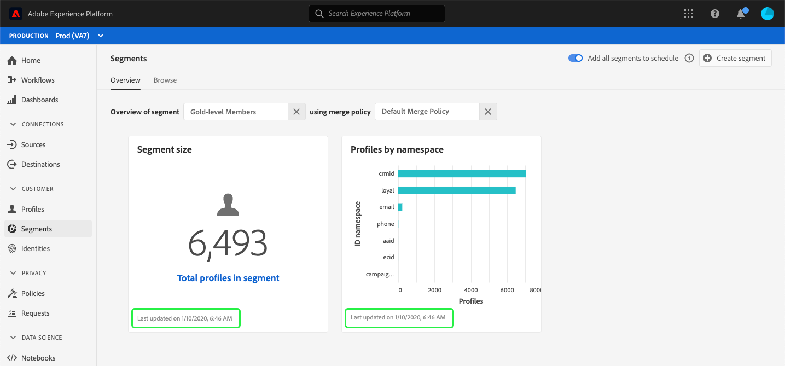

# (Alfa) Kontrollpanel för segment {#segment-dashboard}

>[!IMPORTANT]
>
>Instrumentpanelsfunktionen som beskrivs i det här dokumentet är för närvarande alfavertiv och är inte tillgänglig för alla användare. Dokumentationen och funktionaliteten kan komma att ändras.

Adobe Experience Platform användargränssnitt (UI) är en kontrollpanel där du kan visa viktig information om dina segment, som de tagits under en daglig ögonblicksbild. I den här handboken beskrivs hur du kommer åt och arbetar med segmentkontrollpanelen i användargränssnittet och den innehåller mer information om de visualiseringar som visas på kontrollpanelen.

En översikt över alla funktioner i Adobe Experience Platform Segmentation Service i användargränssnittet för plattformen finns i [gränssnittshandboken för segmenteringstjänsten](overview.md).

## Instrumentpanelsdata för segment

På segmentkontrollpanelen visas en ögonblicksbild av de attributdata (postdata) som din organisation har i profilarkivet i Experience Platform. Ögonblicksbilden innehåller inga händelsedata (tidsserier).

Attributdata i ögonblicksbilden visar data exakt som de visas vid den specifika tidpunkten när ögonblicksbilden togs. Ögonblicksbilden är alltså inte en uppskattning eller ett urval av data och segmentkontrollpanelen uppdateras inte i realtid.

>[!NOTE]
>
>Ändringar eller uppdateringar som gjorts i data sedan ögonblicksbilden togs kommer inte att visas på kontrollpanelen förrän nästa ögonblicksbild tas.

## Utforska segmentkontrollpanelen

Om du vill navigera till segmentkontrollpanelen i plattformsgränssnittet väljer du **[!UICONTROL Segments]** i den vänstra listen och sedan fliken **[!UICONTROL Overview]** för att visa kontrollpanelen.

### Markera ett segment

Om du vill markera ett segment som ska visas på kontrollpanelen väljer du dialogväljaren för textrutan **[!UICONTROL Select segment]**.

>[!NOTE]
>
>Om ett segment redan är markerat använder du `X` för att ta bort segmentet först och sedan visas dialogväljaren.
>
>

Dialogrutan **[!UICONTROL Select segment]** öppnas så att du kan välja vilket segment du vill visa. När du har valt det segment du vill använda använder du **[!UICONTROL Select]** för att gå tillbaka till kontrollpanelen.

### Kopplingsprincip

När du har valt ett segment fylls textrutan för sammanfogningspolicy automatiskt i med den sammanfogningspolicy som är relaterad till det segmentet.

Mer information om hur du skapar segment i Experience Platform finns i [användargränssnittshandboken för segmentbyggaren](segment-builder.md). Mer information om kopplingsprofiler får du om du börjar med att läsa översikten över kundprofilen i realtid](../../profile/home.md).[

### Widgetar och mätvärden

Segmentkontrollpanelen består av widgetar, som är skrivskyddade mått som ger viktig information om det valda segmentet. Datum och tid för den senaste uppdateringen av widgeten visas när den senaste ögonblicksbilden av data togs.

## Tillgängliga widgetar

Experience Platform tillhandahåller flera widgetar som du kan använda för att visualisera olika mätvärden för ditt segment. Välj namnet på en widget nedan om du vill veta mer:

* [[!UICONTROL Segment size]](#segment-size)
* [[!UICONTROL Profiles by namespace]](#profiles-by-namespace)

### [!UICONTROL Segment size] {#segment-size}

Widgeten **[!UICONTROL Segment size]** visar det totala antalet sammanslagna profiler i det valda segmentet när ögonblicksbilden togs. Det här numret är resultatet av att du har tillämpat segmentsammanfogningsprincipen på dina profildata för att sammanfoga profilfragment till en enda profil för varje enskild person i segmentet.

Mer information om fragment och sammanfogade profiler får du om du börjar med att läsa [Kundprofilöversikt i realtid](../home.md).

### [!UICONTROL Profiles by namespace] {#profiles-by-namespace}

Widgeten **[!UICONTROL Profiles by namespace]** visar uppdelningen av namnutrymmen i alla sammanfogade profiler i det valda segmentet. Det totala antalet profiler med [!UICONTROL ID namespace] (d.v.s. om du lägger ihop värdena som visas för varje namnutrymme) är vanligtvis högre än det totala antalet profiler i segmentet eftersom en profil kan ha flera namnutrymmen kopplade till sig. Om en kund till exempel interagerar med varumärket i mer än en kanal kan flera namnutrymmen kopplas till den enskilda kunden.

Mer information om identitetsnamnutrymmen finns i [dokumentationen för Adobe Experience Platform Identity Service](../../identity-service/home.md).

## Ytterligare instrumentpaneler

Plattformsgränssnittet innehåller ytterligare instrumentpaneler för att visa ögonblicksbilder av dina data i Experience Platform. Dessa instrumentpaneler innehåller kundprofil i realtid och [!UICONTROL License usage]. Om du vill ha mer information om dessa ytterligare instrumentpaneler väljer du bland följande länkar:

* [[!DNL Profile] kontrollpanel](../../profile/ui/profile-dashboard.md)
* [[!UICONTROL License usage] kontrollpanel](../../landing/license-usage-dashboard.md)

## Nästa steg

Genom att följa det här dokumentet bör du nu kunna hitta segmentkontrollpanelen och välja ett segment att visa. Du bör också förstå mätvärdena som visas i de tillgängliga widgetarna. Mer information om hur du arbetar med segment i användargränssnittet för Experience Platform finns i [Användargränssnittshandboken för segmenteringstjänster](overview.md).