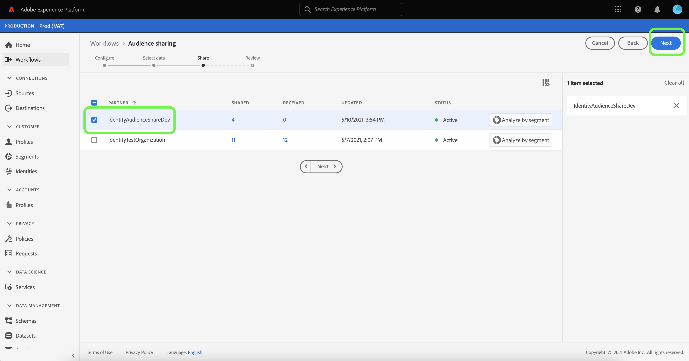

# [!DNL Segment Match] översikt

Adobe Experience Platform Segment Match är en segmentdelningstjänst som gör det möjligt för två eller flera Experience Platform-användare att utbyta segmentdata på ett säkert, styrt och sekretessvänligt sätt. [!DNL Segment Match] använder Experience Platform sekretessstandarder och personliga identifierare som hash-kodade e-postmeddelanden, hashade telefonnummer och enhetsidentifierare som IDFA och GAID.

Med [!DNL Segment Match] kan du:

* Hantera processen för identitetsöverlappning.
* Visa uppskattningar före delning.
* Använd etiketter för dataanvändning för att kontrollera om data kan delas med partners.
* Bibehåll livscykelhanteringen för delade målgrupper efter att ha publicerat en feed och fortsätt ett dynamiskt datautbyte genom att lägga till, ta bort och ta bort delning.

[!DNL Segment Match] använder en identitetsöverlappningsprocess för att säkerställa att segmentdelning sker på ett säkert och sekretessfokuserat sätt. En **överlappad identitet** är en identitet som matchar både ditt segment och den valda partnerns segment. Innan ett segment delas mellan en avsändare och en mottagare kontrolleras om namnutrymmen överlappar varandra och om det finns godkännandekontroller mellan avsändaren och mottagaren/mottagarna. Båda överlappningskontrollerna måste skickas för att ett segment ska kunna delas.

I följande avsnitt finns mer information om [!DNL Segment Match], inklusive information om konfiguration och arbetsflöde från början till slut.

## Inställningar

I följande avsnitt beskrivs hur du konfigurerar och konfigurerar [!DNL Segment Match]:

### Konfigurera identitetsdata och namnutrymmen {#namespaces}

Det första steget för att komma igång med [!DNL Segment Match] är att se till att du importerar data mot de identitetsnamnutrymmen som stöds.

Identitetsnamnutrymmen är en komponent i [Adobe Experience Platform Identity Service](../../../identity-service/home.md). Varje kundidentitet innehåller ett associerat namnutrymme som anger identitetsens kontext. Ett namnutrymme kan t.ex. skilja ett värde på&quot;name@email.com&quot; från en e-postadress eller&quot;443522&quot; från ett numeriskt CRM-ID.

En fullständigt kvalificerad identitet innehåller ett ID-värde och ett namnutrymme. När postdata matchas mellan profilfragment (till exempel när [!DNL Real-Time Customer Profile] sammanfogar profildata) måste både identitetsvärdet och namnutrymmet matcha.

I kontexten för [!DNL Segment Match] används namnutrymmen i överlappningsprocessen när data delas.

Nedan följer en lista över namnutrymmen som stöds:

| Namnutrymme | Beskrivning |
| --------- | ----------- |
| E-post (SHA256, nedsänkt) | Ett namnutrymme för förhasrad e-postadress. Värden som anges i det här namnutrymmet konverteras till gemener innan de hash-kodas med SHA256. Radavståndsavstånd måste trimmas innan en e-postadress normaliseras. Den här inställningen kan inte ändras retroaktivt. Experience Platform erbjuder två metoder som stöder hashning vid datainsamling, via [`setCustomerIDs`](https://experienceleague.adobe.com/docs/id-service/using/reference/hashing-support.html#hashing-support) och via [data prep](../../../data-prep/functions.md#hashing). |
| Telefon (SHA256_E.164) | Ett namnutrymme som representerar råa telefonnummer som behöver hashas med formaten SHA256 och E.164. |
| ECID | Ett namnutrymme som representerar ett Experience Cloud ID-värde (ECID). Detta namnutrymme kan även refereras av följande alias:&quot;Adobe Marketing Cloud ID&quot;,&quot;Adobe Experience Cloud ID&quot;,&quot;Adobe Experience Platform ID&quot;. Mer information finns i [ECID-översikten](../../../identity-service/features/ecid.md). |
| Apple IDFA (ID för annonsörer) | Ett namnutrymme som representerar Apple ID för annonsörer. Mer information finns i följande dokument om [intressebaserade annonser](https://support.apple.com/en-us/HT202074). |
| Google Ad ID | Ett namnutrymme som representerar ett Google Advertising ID. Mer information finns i följande dokument på [Google Advertising ID](https://support.google.com/googleplay/android-developer/answer/6048248?hl=en). |

### Konfigurera samtycke

Du måste ange en medgivandekonfiguration och ange standardvärdet till antingen `opt-in` eller `opt-out` för en godkännandekontroll.

Kontrollen av godkännande av anmälan och avanmälan avgör om du kan arbeta med samtycke att dela användardata som standard. Om standardinställningen för medgivandekonfigurationen är `opt-out` kan användardata delas, såvida inte en användare uttryckligen avanmäler sig. Om standardvärdet är `opt-in` kan användardata inte delas, såvida inte en användare uttryckligen väljer att gå in.

Standardkonfigurationen för samtycke för [!DNL Segment Match] är `opt-out`. Om du vill tillämpa en anmälningsmodell för dina data skickar du en e-postförfrågan till ditt Adobe-kontoteam.

Mer information om attributet `share` som används för att ange medgivandevärde för datadelning finns i följande dokumentation om fältgruppen [Sekretess och samtycke](../../../xdm/field-groups/profile/consents.md). Mer information om den specifika fältgrupp som används för att samla in och använda konsumentens samtycke för insamling och användning av data som rör sekretess, personalisering och marknadsföring finns i följande [exempel på GitHub för godkännande för sekretess, Personalization och marknadsföring](https://github.com/adobe/xdm/blob/master/docs/reference/datatypes/consent/consent-preferences.schema.md).

### Konfigurera etiketter för dataanvändning

Den sista förutsättningen du måste ställa är att konfigurera en ny dataanvändningsetikett för att förhindra datadelning. Genom dataanvändningsetiketter kan du hantera vilka data som får delas via [!DNL Segment Match].

Med etiketter för dataanvändning kan du kategorisera datauppsättningar och fält enligt de användarprofiler som gäller för dessa data. Etiketter kan användas när som helst, vilket ger flexibilitet i hur du väljer att styra data. De bästa sätten är att uppmuntra märkningsdata så snart de har importerats till Experience Platform, eller så snart data finns tillgängliga för användning i Experience Platform.

[!DNL Segment Match] använder C11-etiketten, en kontraktsetikett som är specifik för [!DNL Segment Match], som du kan lägga till manuellt i datauppsättningar eller attribut för att säkerställa att de utesluts från partnerdelningsprocessen i [!DNL Segment Match]. C11-etiketten anger data som inte ska användas i [!DNL Segment Match]-processer. När du har fastställt vilka datauppsättningar och/eller fält du vill utesluta från [!DNL Segment Match] och lagt till C11-etiketten i enlighet med detta, används etiketten automatiskt av arbetsflödet i [!DNL Segment Match]. [!DNL Segment Match] aktiverar [!UICONTROL Restrict data sharing]-kärnprincipen automatiskt. Mer information om hur du använder dataanvändningsetiketter på datauppsättningar finns i självstudiekursen [Hantera dataanvändningsetiketter i användargränssnittet](../../../data-governance/labels/user-guide.md).

En lista över dataanvändningsetiketter och definitioner för dem finns i [etikettordlistan för dataanvändning](../../../data-governance/labels/reference.md). Mer information om dataanvändningsprinciper finns i [översikten över dataanvändningsprinciper](../../../data-governance/policies/overview.md).

### [!DNL Segment Match]-behörigheter

Det finns två behörigheter associerade med [!DNL Segment Match]:

| Behörighet | Beskrivning |
| --- | --- |
| Hantera anslutningar för målgruppsdelning | Med den här behörigheten kan du slutföra partnerhandskakningsprocessen, som ansluter två organisationer för att aktivera [!DNL Segment Match]-flöden. |
| Hantera målgruppsresurser | Med den här behörigheten kan du skapa, redigera och publicera feeds (det datapaket som används för [!DNL Segment Match]) med aktiva partner (partner som har anslutits av administratörsanvändaren med **[!UICONTROL Audience Share Connections]**-åtkomst). |

Mer information om åtkomstkontroll och behörigheter finns i [åtkomstkontrollsöversikten](../../../access-control/home.md).

## [!DNL Segment Match]-arbetsflöde från början till slut

När du har konfigurerat dina identitetsdata och namnutrymmen, konfiguration för samtycke och etikett för dataanvändning kan du börja arbeta med [!DNL Segment Match] och dess funktioner.

### Hantera partner

I Experience Platform-gränssnittet väljer du **[!UICONTROL Segments]** i den vänstra navigeringen och sedan **[!UICONTROL Feeds]** i den övre rubriken.

Sidan [!UICONTROL Feeds] innehåller en lista över feeds som tagits emot från partner samt feeds som du har delat. Välj **[!UICONTROL Manage partners]** om du vill visa en lista över befintliga partner eller skapa en anslutning till en ny partner.

En koppling mellan två partner är en&quot;tvåvägshandskakning&quot; som fungerar som en självbetjäningsmetod för användare som vill koppla samman sina Experience Platform-organisationer på sandlådenivå. Anslutningen krävs för att informera Experience Platform om att ett avtal har upprättats och att Experience Platform kan underlätta delning av tjänster mellan dig och din partner.

>[!NOTE]
>
>&quot;Tvåvägshandskakningen&quot; mellan dig och din partner är helt enkelt en koppling. Inga data utbyts under denna process.

Du kan visa en lista över anslutningar med befintliga partners i huvudgränssnittet på skärmen [!UICONTROL Manage partners]. På den högra listen finns panelen [!UICONTROL Share setting] där du kan välja att generera en ny [!UICONTROL connect ID] samt en inmatningsruta där du kan ange en partners [!UICONTROL connect ID].

Om du vill skapa en ny [!UICONTROL connect ID] väljer du **[!UICONTROL Regenerate]** under [!UICONTROL Share setting] och sedan kopieringsikonen bredvid det nya genererade ID:t.

Om du vill ansluta en partner med hjälp av deras [!UICONTROL connect ID] anger du deras unika ID-värde i inmatningsrutan under [!UICONTROL Connect partner] och väljer sedan **[!UICONTROL Request]**.

### Skapa feed {#create-feed}

>[!CONTEXTUALHELP]
>id="platform_segment_match_marketing"
>title="Begränsade användningsfall för marknadsföring"
>abstract="Begränsade användningsexempel för marknadsföring hjälper er att ge vägledning till era partner för att säkerställa att delade segment används korrekt enligt era begränsningar för datastyrning."
>text="Learn more in documentation"

En **feed** är en gruppering av data (segment), reglerna för hur data kan visas eller användas och konfigurationerna som bestämmer hur data matchas mot dina partners data. En feed kan hanteras separat och utbytas med andra Experience Platform-användare via [!DNL Segment Match].

Om du vill skapa en ny feed väljer du **[!UICONTROL Create feed]** på kontrollpanelen [!UICONTROL Feeds].

Den grundläggande konfigurationen av en feed innehåller ett namn, en beskrivning och konfigurationer för användningsfall för marknadsföring och identitetsinställningar. Ange ett namn och en beskrivning för din feed och använd sedan de användningsfall för marknadsföring som du vill att dina data ska uteslutas från. Du kan välja mer än ett användningsfall i en lista som innehåller:

* [!UICONTROL Analytics]
* [!UICONTROL Combine with PII]
* [!UICONTROL Cross-site targeting]
* [!UICONTROL Data Science]
* [!UICONTROL Email targeting]
* [!UICONTROL Export to third party]
* [!UICONTROL Onsite advertising]
* [!UICONTROL Onsite personalization]
* [!UICONTROL Segment Match]
* [!UICONTROL Single identity personalization]

Välj sedan lämpliga identitetsnamnutrymmen för din feed. Mer information om de namnutrymmen som stöds av [!DNL Segment Match] finns i tabellen [Identitetsdata och namnutrymmen](#namespaces). När du är klar väljer du **[!UICONTROL Next]**.

När du har fastställt inställningarna för din feed väljer du de segment som du vill dela i listan över förstapartssegment. Du kan markera mer än ett segment i listan och du kan använda den högra listen för att hantera listan över valda segment. När du är klar väljer du **[!UICONTROL Next]**.

Sidan [!UICONTROL Share] visas med ett gränssnitt där du kan välja vilka partners du vill dela din feed med. Under det här steget kan du även visa uppskattningsrapporten för överlappning före delning och se antalet överlappande identiteter per namnutrymme mellan dig och din partner, antalet överlappande identiteter som har samtycke till att dela data.

Välj **[!UICONTROL Analyze by segment]** om du vill visa uppskattningsrapporten.

Med hjälp av överlappningsuppskattningsrapporten kan du hantera överlappnings- och godkännandekontroller per partner och per segment innan du delar din feed.

| Mätvärden | Beskrivning |
| ------- | ----------- |
| Uppskattade identiteter med samtycke | Det totala antalet överlappande identiteter som uppfyller de krav för samtycke som konfigurerats för din organisation. |
| Uppskattad överlappande identiteter | Antalet identiteter som är kvalificerade för det valda segmentet och som också matchar den valda partnern. Dessa identiteter visas med namnutrymme och representerar inte enskilda profilidentiteter. Överlappningsuppskattningarna baseras på profilskisser. |

När du är klar väljer du **[!UICONTROL Close]**.

När du har valt dina partners och visat din rapport över överlappande uppskattningar väljer du **[!UICONTROL Next]** för att fortsätta.

Steget [!UICONTROL Review] visas så att du kan granska din nya feed innan den delas och publiceras. I det här steget finns information om den identitetsinställning du har använt samt information om de användningsfall, segment och partners du har valt.

Välj **[!UICONTROL Finish]** om du vill fortsätta.

### Uppdatera feed

Om du vill lägga till eller ta bort segment väljer du **[!UICONTROL Create feed]** på sidan [!UICONTROL Feeds] och sedan **[!UICONTROL Existing feed]**. Markera den feed som du vill uppdatera i listan över befintliga feeds som visas och välj sedan **[!UICONTROL Next]**.

Listan med segment visas. Härifrån kan du lägga till nya segment i din feed och du kan använda högerspåret för att ta bort segment som du inte längre behöver. När du har slutfört hanteringen av segmenten i din feed väljer du **[!UICONTROL Next]** och följer sedan instruktionerna ovan för att slutföra den uppdaterade feeden.

>[!NOTE]
>
>När du lägger till eller tar bort ett segment från en delad feed, måste den mottagande partnern bekräfta ändringen genom att aktivera [!DNL Profile]-växeln igen i sin lista över mottagna feeds.

### Acceptera en inkommande feed

Om du vill visa en inkommande feed väljer du **[!UICONTROL Received]** i sidhuvudet på sidan [!UICONTROL Feeds] och väljer sedan den feed du vill visa från listan. Om du vill acceptera flödet väljer du **[!UICONTROL Enable for profile]** och tillåter en stund så att statusen uppdateras från [!UICONTROL Pending] till [!UICONTROL Enabled].

När du har accepterat en delad feed kan du börja använda delade data för att skapa nya segment.

## Nästa steg

Genom att läsa det här dokumentet har du fått en förståelse för [!DNL Segment Match], dess funktioner och hela arbetsflödet. Läs följande dokument om du vill veta mer om andra plattformstjänster:

* [[!DNL Segmentation Service]](../../home.md)
* [[!DNL Identity Service]](../../../identity-service/home.md)
* [[!DNL Real-Time Customer Profile] översikt](../../../profile/home.md)
