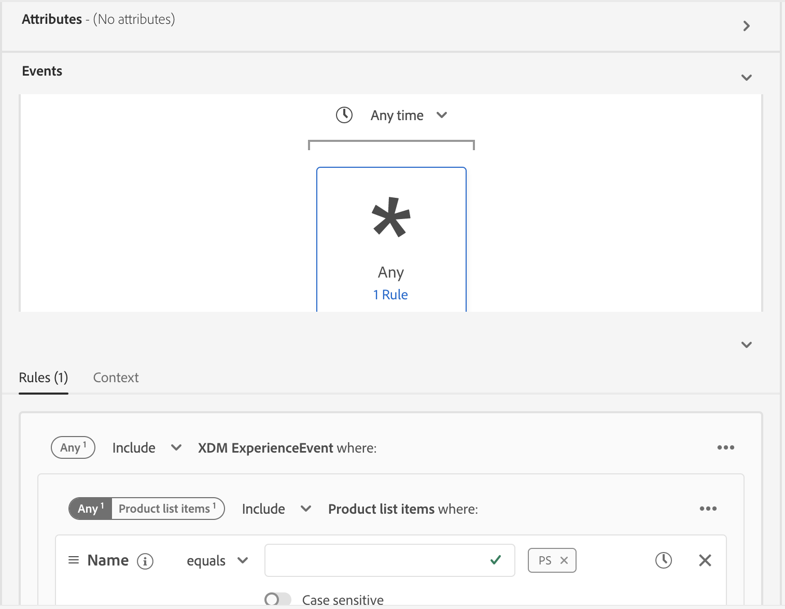

# Direktuppspelningssegmentering

>[!NOTE]
>
>Följande dokument visar hur du använder direktuppspelningssegmentering med användargränssnittet. Mer information om hur du använder direktuppspelningssegmentering med API:t finns i [API-handboken](../api/streaming-segmentation.md)för direktuppspelningssegmentering.

Med direktuppspelningssegmentering på [!DNL Adobe Experience Platform] kan kunderna segmentera i nära realtid samtidigt som de fokuserar på datarikedom. Med direktuppspelningssegmentering sker nu segmentkvalificering allt eftersom data når [!DNL Platform]och eliminerar behovet av att schemalägga och köra segmenteringsjobb. Med den här funktionen kan de flesta segmentregler utvärderas när data överförs till [!DNL Platform], vilket innebär att segmentmedlemskapet hålls uppdaterat utan att schemalagda segmenteringsjobb körs.

## Frågetyper för direktuppspelningssegmentering

>[!NOTE]
>
>För att direktuppspelningssegmenteringen ska fungera måste du aktivera schemalagd segmentering för organisationen. Mer information om hur du aktiverar schemalagd segmentering finns [i avsnittet om direktuppspelningssegmentering i användarhandboken](./overview.md#scheduled-segmentation)för segmentering.

En fråga utvärderas automatiskt med direktuppspelningssegmentering om den uppfyller något av följande kriterier:

| Frågetyp | Detaljer | Exempel |
| ---------- | ------- | ------- |
| Inkommande träff | En segmentdefinition som refererar till en enda inkommande händelse utan tidsbegränsning. |  |
| Inkommande träff inom ett relativt tidsfönster | En segmentdefinition som refererar till en enda inkommande händelse **inom de senaste sju dagarna**. |  |
| Endast profil | En segmentdefinition som bara refererar till ett profilattribut. |  |
| Inkommande träde som refererar till en profil | En segmentdefinition som refererar till en enda inkommande händelse, utan tidsbegränsning, och ett eller flera profilattribut. |  |
| Inkommande träde som refererar till en profil inom ett relativt tidsfönster | En segmentdefinition som refererar till en enda inkommande händelse och ett eller flera profilattribut **under de senaste sju dagarna**. |  |
| Flera händelser som refererar till en profil | Alla segmentdefinitioner som refererar till flera händelser **under de senaste 24 timmarna** och (valfritt) har ett eller flera profilattribut. |  |

I följande avsnitt visas exempel på segmentdefinitioner som **inte** kommer att aktiveras för direktuppspelningssegmentering.

| Frågetyp | Detaljer | Exempel |
| ---------- | ------- | ------- |
| Inkommande träff inom ett relativt tidsfönster | Om segmentdefinitionen refererar till en inkommande händelse **som inte** är under den **senaste sju-dagarsperioden**. Till exempel under de **senaste två veckorna**. |  |
| Inkommande träde som refererar till en profil i ett relativt fönster | Följande alternativ har **inte** stöd för direktuppspelningssegmentering:<ul><li>En inkommande händelse **som inte** är under den **senaste sjudagarsperioden**.</li><li>En segmentdefinition som innehåller [!DNL Adobe Audience Manager (AAM)] segment eller egenskaper.</li></ul> |  |
| Flera händelser som refererar till en profil | Följande alternativ har **inte** stöd för direktuppspelningssegmentering:<ul><li>En händelse som **inte** inträffar **de senaste 24 timmarna**.</li><li>En segmentdefinition som innehåller Adobe Audience Manager-segment (AAM) eller egenskaper.</li></ul> |  |
| Flerenhetsfrågor | Flerenhetsfrågor stöds **inte** av direktuppspelningssegmentering som helhet. |  |

Dessutom gäller vissa riktlinjer för direktuppspelningssegmentering:

| Frågetyp | Riktlinje |
| ---------- | -------- |
| Enkel händelsefråga | Fönstret för att titta tillbaka är begränsat till **sju dagar**. |
| Fråga med händelsehistorik | <ul><li>Fönstret för att titta tillbaka är begränsat till **en dag**.</li><li>Det **måste** finnas ett strikt ordningsvillkor mellan händelserna.</li><li>Endast enkla tidsinställningar (före och efter) mellan händelserna tillåts.</li><li>De enskilda händelserna **kan inte** negeras. Hela frågan **kan** dock negeras.</li></ul> |

## Segmentdetaljer för direktuppspelning

När du har skapat ett direktuppspelningsaktiverat segment kan du visa information om det segmentet.

Mer information om **[!UICONTROL total qualified audience size]** finns. Om ett jobb har körts inom de senaste 24 timmarna visas **[!UICONTROL Total qualified audience size]** från jobbet, förutom ett linjediagram för målgruppen som lagts till. I annat fall visas **[!UICONTROL Total estimated audience size]** bilden, förutom en trendlinje för visualisering.

Du hittar mer information om den senaste utvärderingen av segment genom att välja informationsbubblan.

Mer information om segmentdefinitioner finns i föregående avsnitt om [segmentdefinitionsdetaljer](#segment-details).

## Film om direktuppspelad segmentering

Följande video är avsedd att ge en bättre förståelse för direktuppspelningssegmentering. Här visas ett exempel på en kundupplevelse följt av en snabb genomgång av de viktigaste funktionerna i [!DNL Platform] gränssnittet.

>[!VIDEO](https://video.tv.adobe.com/v/36184?quality=12&learn=on)

## Nästa steg

Den här användarhandboken förklarar hur definitioner av direktuppspelningsaktiverade segment fungerar i Adobe Experience Platform och hur man övervakar direktuppspelningsaktiverade segment.

Mer information om hur du använder Adobe Experience Platform användargränssnitt finns i användarhandboken för [segmentering](./overview.md).