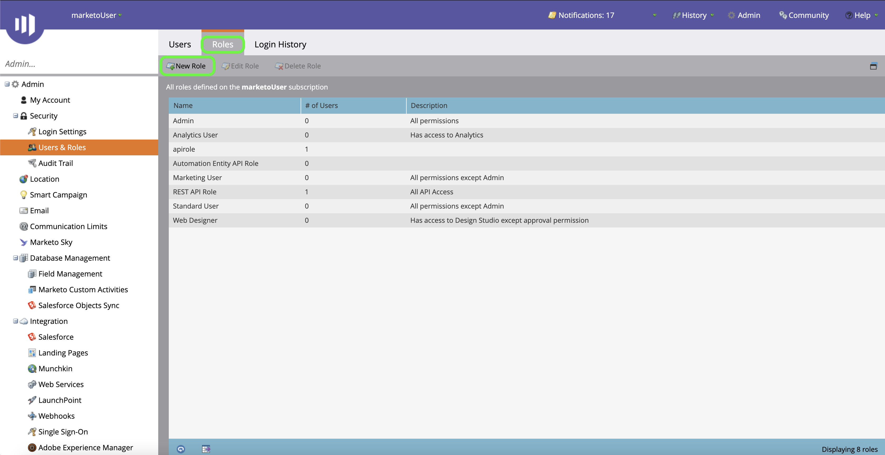
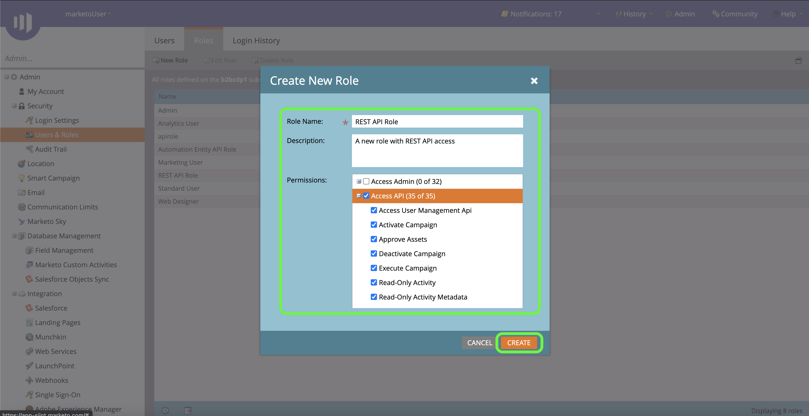
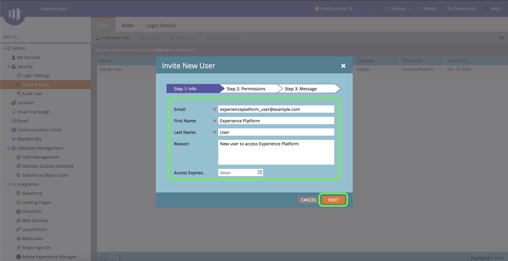
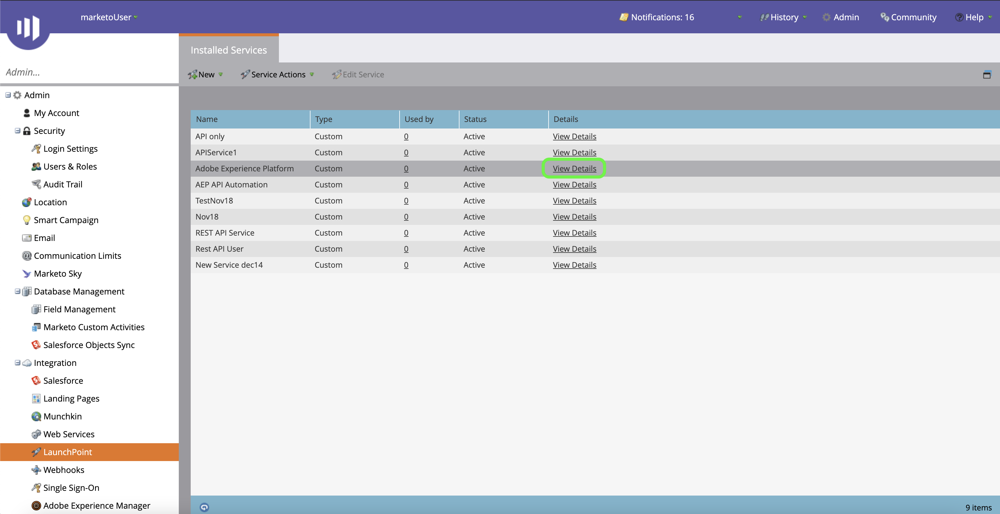
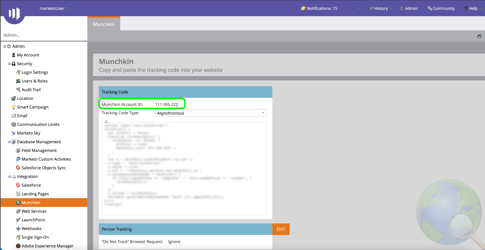

# (Beta) Autentisera din [!DNL Marketo Engage]-källanslutning

>[!IMPORTANT]
>
>Källan [!DNL Marketo Engage] är för närvarande i betaversion. Dess funktioner och dokumentation kan komma att ändras.

Innan du kan skapa en [!DNL Marketo Engage]-källkoppling (kallas nedan &quot;[!DNL Marketo]&quot;) måste du först konfigurera en anpassad tjänst via gränssnittet [!DNL Marketo], samt hämta värden för ditt Munchkin-ID, klient-ID och klienthemlighet.

I dokumentationen nedan beskrivs hur du hämtar autentiseringsuppgifter för att skapa en [!DNL Marketo]-källkoppling.

## Konfigurera en ny roll

Det första steget i att hämta autentiseringsuppgifter är att konfigurera en ny roll via gränssnittet [[!DNL Marketo]](https://app-sjint.marketo.com/#MM0A1).

Logga in på [!DNL Marketo] och välj **[!DNL Admin]** i det övre navigeringsfältet.

Sidan *[!DNL Users & Role]s* innehåller information om användare, roller och inloggningshistorik. Om du vill skapa en ny roll väljer du **[!DNL Roles]** i den översta rubriken och sedan **[!DNL New Role]**.

Dialogrutan **[!DNL Create New Role]** visas. Ange ett namn och en beskrivning och välj sedan de behörigheter du vill ge för den här rollen. Behörigheterna är begränsade till vissa arbetsytor och användarna kan bara utföra åtgärder i arbetsytor som de har behörighet till i.

När du har valt de behörigheter du vill ge väljer du **[!DNL Create]**.

Du kan hantera begränsade behörigheter för API när du skapar roller med [!DNL Marketo]. I stället för att välja&quot;Access API&quot; kan du ange en roll med lägsta åtkomstnivå genom att välja följande behörigheter:

* [!DNL Read-Only Activity]
* [!DNL Read-Only Assets]
* [!DNL Read-Only Campaign]
* [!DNL Read-Only Company]
* [!DNL Read-Only Custom Object]
* [!DNL Read-Only Custom Object Type]
* [!DNL Read-Only Named Account]
* [!DNL Read-Only Named Account List]
* [!DNL Read-Only Opportunity]
* [!DNL Read-Only Person]
* [!DNL Read-Only Sales Person]

## Konfigurera en ny användare

På liknande sätt som roller kan du konfigurera en ny användare från sidan **[!DNL Users & Roles]**. Sidan **[!DNL Users]** innehåller en lista med aktiva användare som för närvarande är tilldelade i Marketo. Välj **[!DNL Invite New User]** om du vill etablera en ny användare.

En snabbmeny visas. Ange lämplig information för e-post, förnamn, efternamn och orsak. Under det här steget kan du även ange ett förfallodatum för åtkomst till det nya användarkontot som du bjuder in. När du är klar väljer du **[!DNL Next]**.

>[!IMPORTANT]
>
>När du konfigurerar en ny användare måste du tilldela åtkomst till en användare som är dedikerad till den anpassade tjänst som du skapar.

Markera lämpliga fält i steget **[!DNL Permissions]** och markera sedan kryssrutan **[!DNL API Only]** för att ge den nya användaren en API-roll. Välj **[!DNL Next]** för att fortsätta.

Välj **[!DNL Send]** om du vill slutföra processen.

## Konfigurera en anpassad tjänst

När du har etablerat en ny användare kan du konfigurera en anpassad tjänst för att hämta dina nya inloggningsuppgifter. Välj **[!DNL LaunchPoint]** på adminsidan.

Sidan **[!DNL Installed services]** innehåller en lista över befintliga tjänster. Om du vill skapa en ny anpassad tjänst väljer du **[!DNL New]** och sedan **[!DNL New Service]**.

Ange ett beskrivande visningsnamn för den nya tjänsten och välj sedan **[!DNL Custom]** i listrutan **[!DNL Service]**. Ange en lämplig beskrivning och välj sedan den användare som du vill etablera i listrutan **[!DNL API Only User]**. När du har fyllt i de nödvändiga uppgifterna väljer du **[!DNL Create]** för att skapa din nya anpassade tjänst.

## Hämta klient-ID och klienthemlighet

När en ny anpassad tjänst har skapats kan du nu hämta värden för ditt klient-ID och din klienthemlighet. På **[!DNL Installed Services]**-menyn letar du reda på den anpassade tjänst du vill komma åt och väljer sedan **[!DNL View Details]**.

En dialogruta med ditt klient-ID och din klienthemlighet visas.

## Skaffa ett Munchkin-ID

Det sista steget du måste slutföra för att autentisera din [!DNL Marketo]-källanslutning är att hämta ditt Munchkin-ID. Välj **[!DNL Munchkin]** under panelen **[!DNL Integration]** på adminsidan.

Sidan *[!DNL Munchkin]* visas med ditt unika Munchkin-ID längst upp på panelen.

I kombination med ditt klient-ID och din klienthemlighet kan du använda ditt Munchkin-ID för att konfigurera ett nytt konto och [skapa en ny [!DNL Marketo] källanslutning](../../../tutorials/ui/create/adobe-applications/marketo.md) på Experience Platform.
