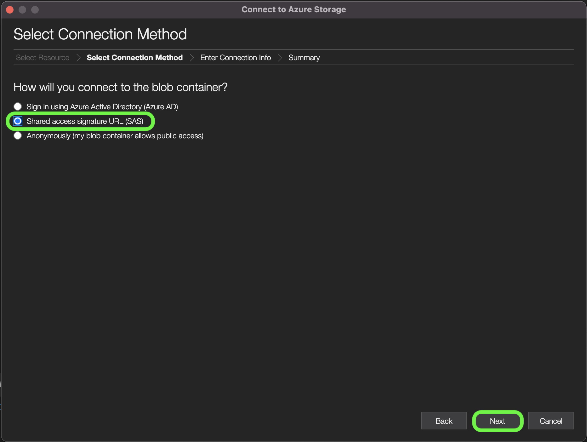
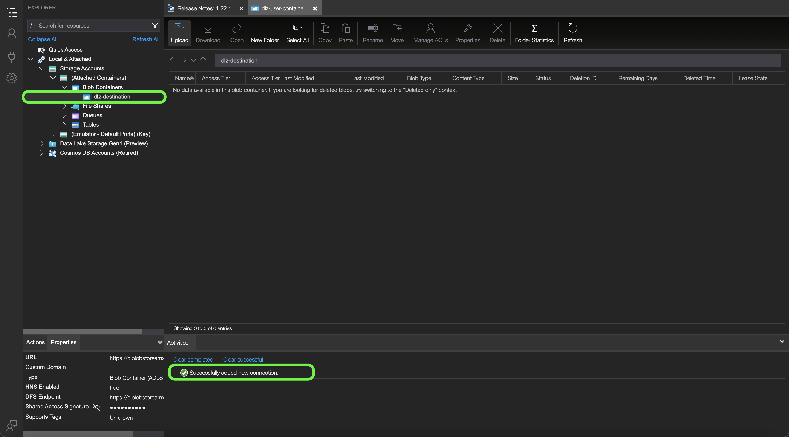

# [!DNL Data Landing Zone]

[!DNL Data Landing Zone] är en [!DNL Azure Blob] lagringsgränssnittet som tillhandahålls av Adobe Experience Platform, vilket ger dig tillgång till en säker, molnbaserad fillagringsfunktion för att hämta filer till plattformen. Du har tillgång till en [!DNL Data Landing Zone] behållare per sandlåda och den totala datavolymen för alla behållare begränsas till den totala datamängd som ingår i din licens för plattformsprodukter och -tjänster. Alla kunder med Platform och dess programtjänster som [!DNL Customer Journey Analytics], [!DNL Journey Orchestration], [!DNL Intelligent Services]och [!DNL Adobe Real-Time Customer Data Platform] har etablerats med en [!DNL Data Landing Zone] behållare per sandlåda. Du kan läsa och skriva filer till behållaren via [!DNL Azure Storage Explorer] eller kommandoradsgränssnittet.

[!DNL Data Landing Zone] stöder SAS-baserad autentisering och dess data skyddas med standard [!DNL Azure Blob] Mekanismer för förvaringssäkerhet i vila och under transitering. SAS-baserad autentisering ger säker åtkomst till [!DNL Data Landing Zone] behållaren via en offentlig internetanslutning. Du behöver inte göra några nätverksändringar [!DNL Data Landing Zone] container, vilket betyder att du inte behöver konfigurera några tillåtelselista- eller korsregionsinställningar för ditt nätverk. Plattformen tillämpar en strikt 7-dagars förfallotid för alla filer som överförs till en [!DNL Data Landing Zone] behållare. Alla filer tas bort efter sju dagar.

## Namnbegränsningar för filer och kataloger

Nedan följer en lista över begränsningar som du måste ta hänsyn till när du namnger molnlagringsfiler eller -kataloger.

- Katalog- och filkomponentnamn får inte innehålla fler än 255 tecken.
- Katalog- och filnamn får inte sluta med ett snedstreck (`/`). Om det finns kommer det att tas bort automatiskt.
- Följande reserverade URL-tecken måste escape-konverteras: `! ' ( ) ; @ & = + $ , % # [ ]`
- Följande tecken tillåts inte: `" \ / : | < > * ?`.
- Ogiltiga URL-sökvägstecken tillåts inte. Kodpunkter som `\uE000`, som är giltigt i NTFS-filnamn, är inte giltiga Unicode-tecken. Dessutom kan vissa ASCII- eller Unicode-tecken, som kontrolltecken (som `0x00` till `0x1F`, `\u0081`och så vidare) tillåts inte heller. Information om regler för Unicode-strängar i HTTP/1.1 finns i [RFC 2616, avsnitt 2.2: Grundregler](https://www.ietf.org/rfc/rfc2616.txt) och [RFC 3987](https://www.ietf.org/rfc/rfc3987.txt).
- Följande filnamn är inte tillåtna: LPT1, LPT2, LPT3, LPT4, LPT5, LPT6, LPT7, LPT8, LPT9, COM1, COM2, COM3, COM4, COM5, COM6, COM7, COM8, COM9, PRN, AUX, NUL, CON, CLOCK$, punkttecken (.) och två punkttecken (.).

## Hantera innehållet i [!DNL Data Landing Zone]

Du kan använda [[!DNL Azure Storage Explorer]](https://azure.microsoft.com/en-us/features/storage-explorer/) för att hantera innehållet i [!DNL Data Landing Zone] behållare.

I [!DNL Azure Storage Explorer] I användargränssnittet väljer du anslutningsikonen i den vänstra navigeringen. The **Välj resurs** visas så att du kan ansluta till dem. Välj **[!DNL Blob container]** för att ansluta till [!DNL Data Landing Zone].


Nästa, välj **URL för delad åtkomstsignatur (SAS)** som anslutningsmetod och välj **Nästa**.



När du har valt anslutningsmetod måste du sedan ange en **visningsnamn** och **[!DNL Blob]container SAS-URL** som motsvarar dina [!DNL Data Landing Zone] behållare.

>[!TIP]
>
>Du kan hämta dina [!DNL Data Landing Zone] autentiseringsuppgifter från källkatalogen i plattformsgränssnittet.

Ange [!DNL Data Landing Zone] SAS-URL och välj sedan **Nästa**


The **Sammanfattning** visas så att du får en översikt över dina inställningar, inklusive information om [!DNL Blob] slutpunkt och behörigheter. Välj **Anslut**.


Anslutningen uppdaterar [!DNL Azure Storage Explorer] Gränssnitt med [!DNL Data Landing Zone] behållare.



Med [!DNL Data Landing Zone] behållare ansluten till [!DNL Azure Storage Explorer]kan du nu börja överföra filer till [!DNL Data Landing Zone] behållare. Välj **Överför** och sedan markera **Överför filer**.


När du har valt den fil som du vill överföra måste du identifiera [!DNL Blob] typ som du vill överföra som och målkatalogen. När du är klar väljer du **Överför**.

| [!DNL Blob] typer | Beskrivning |
| --- | --- |
| Blockera [!DNL Blob] | Blockera [!DNL Blobs] är optimerade för att överföra stora mängder data på ett effektivt sätt. Blockera [!DNL Blobs] är standardalternativet för [!DNL Data Landing Zone]. |
| Lägg till [!DNL Blob] | Lägg till [!DNL Blobs] är optimerade för att lägga till data i slutet av filen. |


## Överför filer till [!DNL Data Landing Zone] med kommandoradsgränssnittet

Du kan också använda kommandoradsgränssnittet på enheten och få åtkomst till överföringsfiler till [!DNL Data Landing Zone].

### Överföra en fil med Bash

I följande exempel används Bash och cURL för att överföra en fil till en [!DNL Data Landing Zone] med [!DNL Azure Blob Storage] REST API:

```shell
# Set Azure Blob-related settings
DATE_NOW=$(date -Ru | sed 's/\+0000/GMT/')
AZ_VERSION="2018-03-28"
AZ_BLOB_URL="<URL TO BLOB ACCOUNT>"
AZ_BLOB_CONTAINER="<BLOB CONTAINER NAME>"
AZ_BLOB_TARGET="${AZ_BLOB_URL}/${AZ_BLOB_CONTAINER}"
AZ_SAS_TOKEN="<SAS TOKEN, STARTING WITH ? AND ENDING WITH %3D>"

# Path to the file we wish to upload
FILE_PATH="</PATH/TO/FILE>"
FILE_NAME=$(basename "$FILE_PATH")

# Execute HTTP PUT to upload file (remove '-v' flag to suppress verbose output)
curl -v -X PUT \
   -H "Content-Type: application/octet-stream" \
   -H "x-ms-date: ${DATE_NOW}" \
   -H "x-ms-version: ${AZ_VERSION}" \
   -H "x-ms-blob-type: BlockBlob" \
   --data-binary "@${FILE_PATH}" "${AZ_BLOB_TARGET}/${FILE_NAME}${AZ_SAS_TOKEN}"
```

### Överföra en fil med Python

I följande exempel används [!DNL Microsoft's] Python v12 SDK för att överföra en fil till en [!DNL Data Landing Zone]:

>[!TIP]
>
>I exemplet nedan används den fullständiga SAS-URI:n för att ansluta till en [!DNL Azure Blob] kan du använda andra metoder och åtgärder för att autentisera. Se det här [[!DNL Microsoft] dokument om Python v12 SDK](https://docs.microsoft.com/en-us/azure/storage/blobs/storage-quickstart-blobs-python) för mer information.

```py
import os
from azure.storage.blob import ContainerClient

try:
    # Set Azure Blob-related settings
    sasUri = "<SAS URI>"
    srcFilePath = "<FULL PATH TO FILE>" 
    srcFileName = os.path.basename(srcFilePath)

    # Connect to container using SAS URI
    containerClient = ContainerClient.from_container_url(sasUri)

    # Upload file to Data Landing Zone with overwrite enabled
    with open(srcFilePath, "rb") as fileToUpload:
        containerClient.upload_blob(srcFileName, fileToUpload, overwrite=True)

except Exception as ex:
    print("Exception: " + ex.strerror)
```

### Överföra en fil med [!DNL AzCopy]

I följande exempel används [!DNL Microsoft's] [!DNL AzCopy] verktyg för att överföra en fil till en [!DNL Data Landing Zone]:

>[!TIP]
>
>När exemplet nedan använder `copy` kan du använda andra kommandon och alternativ för att överföra en fil till [!DNL Data Landing Zone], använda [!DNL AzCopy]. Se det här [[!DNL Microsoft AzCopy] dokument](https://docs.microsoft.com/en-us/azure/storage/common/storage-ref-azcopy?toc=/azure/storage/blobs/toc.json) för mer information.

```bat
set sasUri=<FULL SAS URI, PROPERLY ESCAPED>
set srcFilePath=<PATH TO LOCAL FILE(S); WORKS WITH WILDCARD PATTERNS>

azcopy copy "%srcFilePath%" "%sasUri%" --overwrite=true --recursive=true
```

## Anslut [!DNL Data Landing Zone] till [!DNL Platform]

Dokumentationen nedan innehåller information om hur du hämtar data från [!DNL Data Landing Zone] behållare till Adobe Experience Platform med API:er eller användargränssnittet.

### Använda API:er

- [Skapa en [!DNL Data Landing Zone] källanslutning med API:t för Flow Service](../../tutorials/api/create/cloud-storage/data-landing-zone.md)
- [Skapa ett dataflöde för en molnlagringskälla med API:t för Flow Service](../../tutorials/api/collect/cloud-storage.md)

### Använda gränssnittet

- [Anslut [!DNL Data Landing Zone] till plattform med användargränssnittet](../../tutorials/ui/create/cloud-storage/data-landing-zone.md)
- [Skapa ett dataflöde för en molnlagringsanslutning i användargränssnittet](../../tutorials/ui/dataflow/batch/cloud-storage.md)
