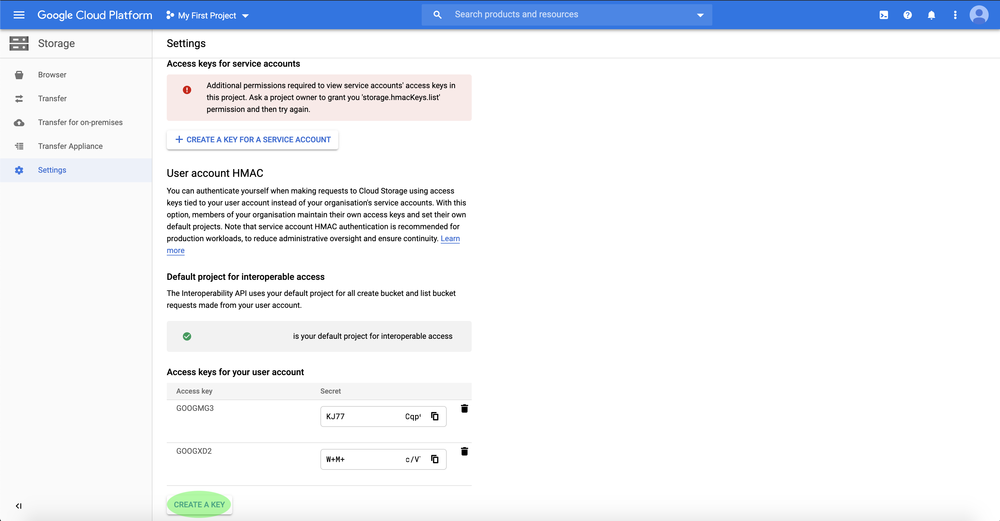

# Google Cloud Storage Connector

Adobe Experience Platform erbjuder inbyggd anslutningsbarhet för molnleverantörer som AWS [!DNL Google Cloud Platform]och [!DNL Azure]så att ni kan hämta data från dessa system.

Lagringskällor i molnet kan hämta dina egna data [!DNL Platform] utan att du behöver hämta, formatera eller överföra dem. Inkapslade data kan formateras som XDM JSON, XDM-parquet eller avgränsade. Varje steg i processen är integrerat i arbetsflödet för källor. [!DNL Platform] gör att du kan hämta in data från [!DNL Google Cloud Storage] grupper.

## IP-adress tillåtelselista

En lista med IP-adresser måste läggas till tillåtelselista innan du kan arbeta med källanslutningar. Om du inte lägger till dina regionspecifika IP-adresser i tillåtelselista kan det leda till fel eller sämre prestanda när du använder källor. Mer information finns på sidan [IP-adress tillåtelselista](../../ip-address-allow-list.md) .

## Krav för att ansluta ditt [!DNL Google Cloud Storage] konto

För att kunna ansluta till [!DNL Platform]måste du först aktivera interoperabilitet för ditt [!DNL Google Cloud Storage] konto. Om du vill få åtkomst till inställningen för interoperabilitet öppnar du [!DNL Google Cloud Platform] och väljer **[!UICONTROL Settings]** ett av **[!UICONTROL Storage]** alternativen på navigeringspanelen.

Sidan visas **[!UICONTROL Settings]** . Härifrån kan du se information om ditt projekt- [!DNL Google] ID och information om ditt [!DNL Google Cloud Storage] konto. Om du vill komma åt inställningarna för interoperabilitet väljer du **[!UICONTROL Interoperability]** i det övre huvudet.

Sidan innehåller **[!UICONTROL Interoperability]** information om autentisering, åtkomstnycklar och standardprojektet som är kopplat till ditt användarkonto. Om du inte redan har etablerat ett standardprojekt för interoperabel åtkomst kan du konfigurera ett i **[!UICONTROL Default project for interoperable access]** -avsnittet. Om ett standardprojekt redan har etablerats visas en bekräftelse på att ett projekt har angetts som standard i avsnittet.

Om du vill generera ett nytt ID för åtkomstnyckel och en hemlig åtkomstnyckel för ditt användarkonto väljer du **[!UICONTROL Create a Key]**.

Du kan använda ditt nyligen genererade ID för åtkomstnyckel och hemlig åtkomstnyckel för att ansluta ditt [!DNL Google Cloud Storage] konto till [!DNL Platform].

## Namnbegränsningar för filer och kataloger

Nedan följer en lista över begränsningar som du måste ta hänsyn till när du namnger molnlagringsfilen eller -katalogen.

- Katalog- och filkomponentnamn får inte innehålla fler än 255 tecken.
- Katalog- och filnamn får inte sluta med ett snedstreck (`/`). Om det finns kommer det att tas bort automatiskt.
- Följande reserverade URL-tecken måste escape-konverteras: `! * ' ( ) ; : @ & = + $ , / ? % # [ ]`
- Följande tecken tillåts inte: `" \ / : | < > * ?`.
- Ogiltiga URL-sökvägstecken tillåts inte. Kodpunkter som `\uE000`är ogiltiga i NTFS-filnamn, men som inte är giltiga Unicode-tecken. Dessutom tillåts inte vissa ASCII- eller Unicode-tecken, som kontrolltecken (0x00 till 0x1F, \u0081 osv.). Regler som styr Unicode-strängar i HTTP/1.1 finns i [RFC 2616, avsnitt 2.2: Grundregler](https://www.ietf.org/rfc/rfc2616.txt) och [RFC 3987](https://www.ietf.org/rfc/rfc3987.txt).
- Följande filnamn är inte tillåtna: LPT1, LPT2, LPT3, LPT4, LPT5, LPT6, LPT7, LPT8, LPT9, COM1, COM2, COM3, COM4, COM5, COM6, COM7, COM8, COM9, PRN, AUX, NUL, CON, CLOCK$, punkttecken (.) och två punkttecken (.).

## Anslut [!DNL Google Cloud Storage] till [!DNL Platform]

Dokumentationen nedan innehåller information om hur du ansluter [!DNL Google Cloud Storage] till [!DNL Platform] med API:er eller användargränssnittet:

### Använda API:er

- [Skapa en Google Cloud-lagringskontakt med API:t för flödestjänsten](../../tutorials/api/create/cloud-storage/google.md)
- [Utforska ett molnlagringssystem med API:t för Flow Service](../../tutorials/api/explore/cloud-storage.md)
- [Samla in molnlagringsdata med API:t för Flow Service](../../tutorials/api/collect/cloud-storage.md)

### Använda gränssnittet

- [Skapa en Google Cloud-källanslutning för lagring i användargränssnittet](../../tutorials/ui/create/cloud-storage/google-cloud-storage.md)
- [Konfigurera ett dataflöde för en molnlagringskontakt i användargränssnittet](../../tutorials/ui/dataflow/batch/cloud-storage.md)