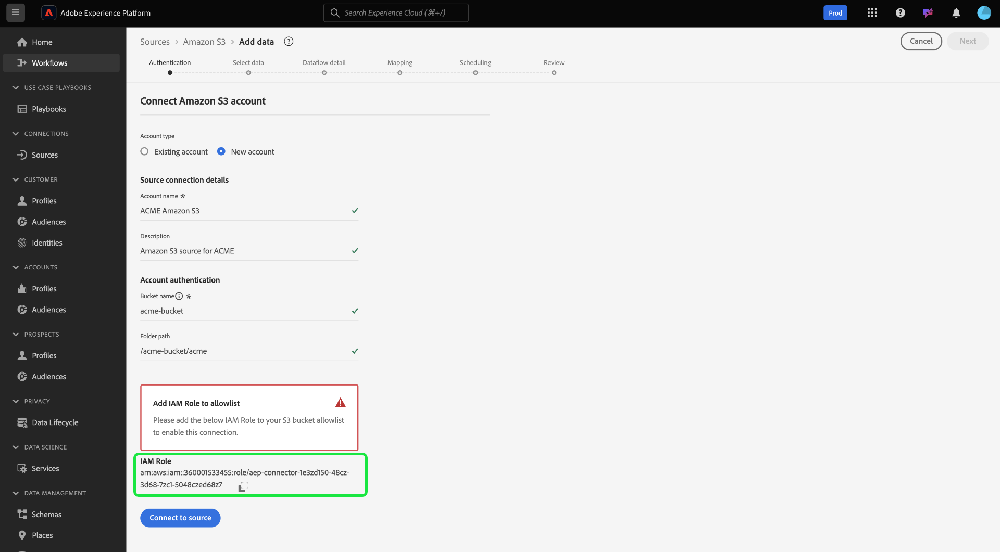

# [!DNL Amazon S3]-källa

>[!IMPORTANT]
>
>Du kan nu använda källan [!DNL Amazon S3] när du kör Adobe Experience Platform på Amazon Web Services (AWS). Experience Platform som körs på AWS är för närvarande tillgängligt för ett begränsat antal kunder. Mer information om den Experience Platform-infrastruktur som stöds finns i [Översikt över flera moln i Experience Platform](../../../landing/multi-cloud.md).

Adobe Experience Platform erbjuder inbyggd anslutning för molnleverantörer som AWS, [!DNL Google Cloud Platform] och [!DNL Azure]. Ni kan föra in data från dessa system i Experience Platform.

Lagringskällor i molnet kan hämta dina egna data till Experience Platform utan att du behöver hämta, formatera eller överföra dem. Inkapslade data kan formateras som XDM JSON, XDM Parquet eller avgränsade. Varje steg i processen är integrerat i arbetsflödet för källor. Med Experience Platform kan du hämta in data från S3 via grupper.

## Förhandskrav {#prerequisites}

I det här avsnittet beskrivs nödvändiga steg som du måste slutföra innan du kan ansluta ditt [!DNL Amazon S3]-konto till Experience Platform.

### IP-adress tillåtelselista

En lista med IP-adresser måste läggas till tillåtelselista innan du kan arbeta med källanslutningar. Om du inte lägger till dina regionspecifika IP-adresser i tillåtelselista kan det leda till fel eller sämre prestanda när du använder källor. Mer information finns på sidan [IP-adress tillåtelselista](../../ip-address-allow-list.md).

### Namnbegränsningar för filer och kataloger

Nedan följer en lista över begränsningar som du måste ta hänsyn till när du namnger molnlagringsfilen eller -katalogen.

- Katalog- och filkomponentnamn får inte innehålla fler än 255 tecken.
- Katalog- och filnamn får inte sluta med ett snedstreck (`/`). Den tas bort automatiskt om den anges.
- Följande reserverade URL-tecken måste ha escape-konverterats: `! ' ( ) ; @ & = + $ , % # [ ]`
- Följande tecken tillåts inte: `" \ / : | < > * ?`.
- Ogiltiga URL-sökvägstecken tillåts inte. Kodpunkter som `\uE000` är inte giltiga Unicode-tecken, men de är giltiga i NTFS-filnamn. Dessutom tillåts inte vissa ASCII- eller Unicode-tecken, som kontrolltecken (0x00 till 0x1F, \u0081 osv.). Information om regler som styr Unicode-strängar i HTTP/1.1 finns i [RFC 2616, Section 2.2: Basic Rules](https://www.ietf.org/rfc/rfc2616.txt) och [RFC 3987](https://www.ietf.org/rfc/rfc3987.txt).
- Följande filnamn tillåts inte: LPT1, LPT2, LPT3, LPT4, LPT5, LPT6, LPT7, LPT8, LPT9, COM1, COM2, COM3, COM4, COM5, COM6, COM7, COM8, COM9, PRN, AUX, NUL, CON, CLOCK$, punkttecken (.) och två punkttecken (. .).

### Konfigurera behörigheter för [!DNL Amazon S3]

Om du vill importera en enda katalog med S3 måste du skapa en [!DNL Identity and Access Management]-användare (IAM) för Plattform i S3-konsolen och tilldela behörigheter för följande åtgärder:

- `s3:GetObject`
- `s3:GetObjectVersion`

Följande behörigheter krävs också för att utforska och testa anslutningen:

- `s3:ListAllMyBuckets`
- `s3:ListBucket`
- `s3:GetBucketLocation`

En filsökväg som `myBucket/folder/subfolder/subsubfolder/abc.csv` kan leda till att du bara får åtkomst till `subsubfolder/abc.csv`. Om du vill komma åt undermappen kan du ange parametern `bucket` i S3-konsolen som `myBucket` och `folderPath` som `folder/subfolder` för att säkerställa att filsökningen börjar vid `subfolder` i stället för `subsubfolder/abc.csv`.

### Använd temporära säkerhetsuppgifter för att ansluta [!DNL Amazon S3]

Du kan ansluta [!DNL Amazon S3] med temporära säkerhetsuppgifter med `s3SessionToken`. Detta gör att du kan ansluta [!DNL Amazon S3] till plattformen utan att behöva skapa permanenta IAM-autentiseringsuppgifter med [!DNL Amazon Web Services], eller ge åtkomst till din [!DNL Amazon S3]-bucket för användare i miljöer som inte är betrodda.

Tillfälliga säkerhetsuppgifter fungerar på liknande sätt som vanliga, långvariga autentiseringsuppgifter för nycklar, förutom att du kan konfigurera ett kortare förfallodatum för dina tillfälliga autentiseringsuppgifter. Förfallodagen kan anges till några minuter efter aktiveringen eller upp till flera timmar. Tillfälliga autentiseringsuppgifter finns inte heller med användaren. Det innebär att du måste begära en ny uppsättning tillfälliga autentiseringsuppgifter när de upphör att gälla.

Anvisningar om hur du genererar din temporära sessionstoken finns i det här [[!DNL AWS] dokumentet om temporära sessionstoken](https://docs.aws.amazon.com/IAM/latest/UserGuide/id_credentials_temp_request.html#api_getsessiontoken).

## Konfigurera din [!DNL Amazon S3]-källa för Experience Platform på Amazon Web Services {#aws}

>[!AVAILABILITY]
>
>Detta avsnitt gäller för implementeringar av Experience Platform som körs på Amazon Web Services (AWS). Experience Platform som körs på AWS är för närvarande tillgängligt för ett begränsat antal kunder. Mer information om den Experience Platform-infrastruktur som stöds finns i [Översikt över flera moln i Experience Platform](../../../landing/multi-cloud.md).

Följ stegen nedan för att lära dig hur du kan konfigurera ditt [!DNL Amazon S3]-konto för Experience Platform på Amazon Web Services (AWS).

### Förhandskrav

Om du vill ansluta ditt [!DNL Amazon S3]-konto till Experience Platform på AWS måste du ha följande:

- Ett AWS-konto med åtkomst till den [!DNL Amazon S3]-bucket eller mapp som du vill ansluta.
- Nödvändiga IAM-behörigheter som tillåter `s3:GetObject`- och `s3:ListBucket`-åtgärder.

### Få åtkomst till källan [!DNL Amazon S3] i gränssnittet

- Navigera till källkatalogen i användargränssnittet i Experience Platform.
- Välj [!DNL Amazon S3] och sedan **[!UICONTROL New account]**.
- Kopiera **IAM-rollen** som listas under [!UICONTROL Add IAM Role to allowlist]. Du kommer senare att använda den här IAM-rollen för att konfigurera behörigheter för din [!DNL Amazon S3]-bucket.



### Konfigurera behörigheter

Du måste konfigurera de nödvändiga behörigheterna i din [!DNL Amazon S3]-bucket för att kunna importera data från en AWS-region. Principen för den bucket som du vill komma åt måste vara kopplad till de autentiseringsuppgifter som du använder.

Följ stegen nedan för att uppdatera din [!DNL Amazon S3]-bucket:

- Logga in på ditt konto på [AWS Management Console](https://aws.amazon.com/).
- Navigera till din [!DNL Amazon S3]-bucket och välj sedan **[!DNL Permissions]**.
- Redigera bucket-principen och lägg till följande behörigheter:

>[!TIP]
>
>Kontrollera att du uppdaterar värdet för `AWS` med din IAM-roll och värdet för `Resource` med din [!DNL Amazon S3]-bucket eller mapp.

```json
{
    "Version": "2012-10-17",
    "Statement": [
        {
            "Sid": "AEP Get Object Related Policy Prod",
            "Effect": "Allow",
            "Principal": {
                "AWS": "{IAM_ROLE_TO_ALLOW_LIST}"
            },
            "Action": "s3:Get*",
            "Resource": "arn:aws:s3:::{YOUR_BUCKET_NAME}/{YOUR_FOLDER_NAME}"
        },
        {
            "Sid": "AEP List Bucket Prod",
            "Effect": "Allow",
            "Principal": {
                "AWS": "{IAM_ROLE_TO_ALLOW_LIST}"
            },
            "Action": "s3:ListBucket",
            "Resource": "arn:aws:s3:::{YOUR_BUCKET_NAME}"
        }
    ]
}  
```

### Ange din [!DNL Amazon S3]-anslutningsinformation och validera och slutför anslutningen

När du har konfigurerat dina behörigheter går du tillbaka till källkatalogen i användargränssnittet i Experience Platform och navigerar till sidan [!DNL Amazon S3] för källkonfiguration. Ange namnet på den [!DNL Amazon S3]-bucket som du vill ansluta till och, om tillämpligt, ange sökvägen till den specifika mappen i bucket. Verifiera konfigurationen genom att välja **[!UICONTROL Test connection]**. Om du lyckas kan du sedan fortsätta och [skapa ett dataflöde för att importera molnlagringsdata till Experience Platform](../../tutorials/ui/dataflow/batch/cloud-storage.md).

## Nästa steg

Dokumentationen nedan innehåller information om hur du ansluter [!DNL Amazon S3] till Experience Platform med API:er eller användargränssnittet:

### Anslut [!DNL Amazon S3] till Experience Platform med API:t

- [Skapa en S3-basanslutning med API:t för Flow Service](../../tutorials/api/create/cloud-storage/s3.md)
- [Utforska datastrukturen och innehållet i en molnlagringskälla med API:t för Flow Service](../../tutorials/api/explore/cloud-storage.md)
- [Skapa ett dataflöde för en molnlagringskälla med API:t för Flow Service](../../tutorials/api/collect/cloud-storage.md)

### Anslut [!DNL Amazon S3] till Experience Platform med användargränssnittet

- [Skapa en Amazon S3-källanslutning i användargränssnittet](../../tutorials/ui/create/cloud-storage/s3.md)
- [Skapa ett dataflöde för en molnlagringsanslutning i användargränssnittet](../../tutorials/ui/dataflow/batch/cloud-storage.md)