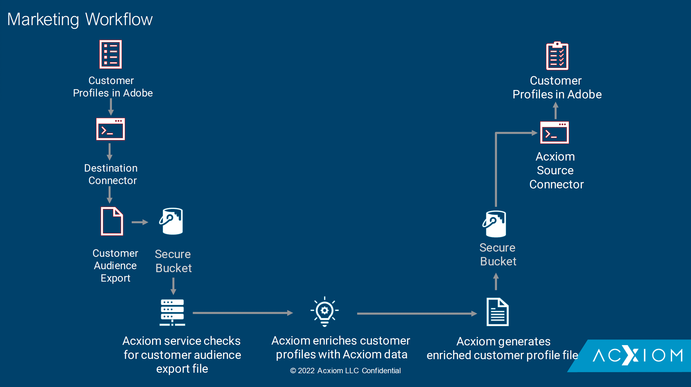

# [!DNL Acxiom Data Ingestion]

>[!NOTE]
>
>Källan [!DNL Acxiom Prospecting Data Import] är i betaversion. Läs [källöversikten](../../home.md#terms-and-conditions) om du vill ha mer information om hur du använder betatecknade källor.

Använd källan [!DNL Acxiom Data Ingestion] för att importera [!DNL Acxiom]-data till Real-time Customer Data Platform och berika förstapartsprofiler. Sedan kan du använda dina [!DNL Acxiom]-berikade förstahandsprofiler för att förbättra målgrupper och aktivera i alla marknadsföringskanaler.

Läs dokumentet nedan om du vill ha information om hur du kan konfigurera ditt [!DNL Acxiom Data Ingestion]-källkonto.

## Förhandskrav {#prerequisites}

Om du vill ansluta ditt [!DNL Acxiom Data Ingestion]-konto till Experience Platform måste du ange värden för följande autentiseringsuppgifter:

| Autentiseringsuppgifter | Beskrivning |
| --- | --- |
| [!DNL Acxiom] autentiseringsnyckel | Autentiseringsnyckeln. Du kan hämta värdet från [!DNL Acxiom]-teamet. |
| [!DNL Amazon S3] åtkomstnyckel | Åtkomstnyckel-ID för din bucket. Du kan hämta värdet från [!DNL Acxiom]-teamet. |
| [!DNL Amazon S3] hemlig nyckel | Det hemliga nyckel-ID:t för din bucket. Du kan hämta värdet från [!DNL Acxiom]-teamet. |
| Buckennamn | Det här är din bucket där filer delas. Du kan hämta värdet från [!DNL Acxiom]-teamet. |

## IP-adress tillåtelselista

En lista med IP-adresser måste läggas till tillåtelselista innan du kan arbeta med källanslutningar. Om du inte lägger till dina regionspecifika IP-adresser i tillåtelselista kan det leda till fel eller sämre prestanda när du använder källor. Mer information finns på sidan [IP-adress tillåtelselista](../../ip-address-allow-list.md).

### Konfigurera behörigheter i Experience Platform

Du måste ha både behörighet **[!UICONTROL View Sources]** och behörighet **[!UICONTROL Manage Sources]** aktiverat för ditt konto för att kunna ansluta ditt [!DNL Acxiom Data Ingestion]-konto till Experience Platform. Kontakta produktadministratören för att få den behörighet som krävs. Mer information finns i [användargränssnittsguiden för åtkomstkontroll](../../../access-control/ui/overview.md).

### Namnbegränsningar för filer och kataloger

De begränsningar som anges nedan måste beaktas när du namnger molnlagringsfilen eller -katalogen:

- Katalog- och filkomponentnamn får inte innehålla fler än 255 tecken.
- Katalog- och filnamn får inte sluta med ett snedstreck (`/`). Den tas bort automatiskt om den anges.
- Följande reserverade URL-tecken måste ha escape-konverterats: `! ' ( ) ; @ & = + $ , % # [ ]`
- Följande tecken tillåts inte: `" \ / : | < > * ?`.
- Ogiltiga URL-sökvägstecken tillåts inte. Kodpunkter som `\uE000` är inte giltiga Unicode-tecken, men de är giltiga i NTFS-filnamn. Dessutom tillåts inte vissa ASCII- eller Unicode-tecken, som kontrolltecken (0x00 till 0x1F, \u0081 osv.). Information om regler som styr Unicode-strängar i HTTP/1.1 finns i [RFC 2616, Section 2.2: Basic Rules](https://www.ietf.org/rfc/rfc2616.txt) och [RFC 3987](https://www.ietf.org/rfc/rfc3987.txt).
- Följande filnamn tillåts inte: LPT1, LPT2, LPT3, LPT4, LPT5, LPT6, LPT7, LPT8, LPT9, COM1, COM2, COM3, COM4, COM5, COM6, COM7, COM8, COM9, PRN, AUX, NUL, CON, CLOCK$, punkttecken (.) och två punkttecken (. .).

## Nästa steg

Genom att läsa det här dokumentet har du slutfört de nödvändiga inställningarna för att kunna överföra data från ditt [!DNL Acxiom]-konto till Experience Platform. Du kan nu fortsätta med guiden för [att ansluta [!DNL Acxiom Data Ingestion] till Experience Platform via användargränssnittet](../../tutorials/ui/create/data-partners/acxiom-data-ingestion.md).
