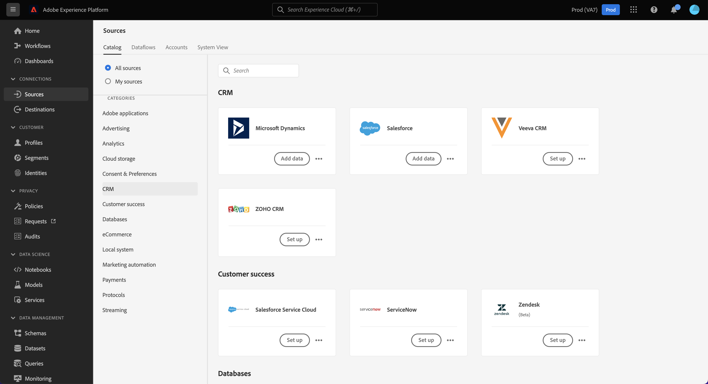

# Självbetjänade källor (Batch SDK) - översikt

Adobe Experience Platform Self-Serve Sources (Batch SDK) är ett ramverk som gör att du kan integrera en REST API-baserad källa till Experience Platform-källkatalogen med hjälp av [[!DNL Flow Service] API](https://www.adobe.io/experience-platform-apis/references/flow-service/). Självbetjäningskällor (Batch SDK) innehåller en uppsättning konfigurations-API:er för att skapa en egen källa och överföra batchdata till Experience Platform.

Med självbetjäningskällor (Batch SDK) kan du:

* Konfigurera och integrera en ny källa till Experience Platform-katalogen med API:t [!DNL Flow Service].
* Definiera specifikationer för källan, inklusive information om vilka autentiseringstyper som stöds och hur resursdata hämtas.
* Skapa användarinriktad dokumentation för den nya källan.

Dokumentationen för självbetjäningskällor innehåller anvisningar om hur du konfigurerar, testar och släpper en REST API-baserad källintegration med Experience Platform, och hur du gör källan till en del av den ständigt växande källkatalogen.

## Om källor

Experience Platform kan importera data från externa källor och samtidigt strukturera, etikettera och förbättra dessa data med hjälp av Experience Platform tjänster. Du kan importera data från en mängd olika källor, till exempel Adobe-program, molnbaserad lagring, tredjepartsprogram och ditt CRM-system.

Mer information om källor och en lista över olika källor som för närvarande stöds på Experience Platform finns i [källöversikten](../home.md).

## Skapa en källa

Genom självbetjäningskällor kan du integrera din egen REST API-baserade källa och överföra dina data till Experience Platform med [!DNL Flow Service]. Du kan integrera en källa i Experience Platform-källkatalogen genom att skapa, konfigurera och skicka en ny anslutningsspecifikation via API:t [!DNL Flow Service].

Mer information om hur du integrerar en ny källa till Experience Platform finns i guiden [Skapa en ny anslutningsspecifikation](./api/api-overview.md).

## Dokumentera källan

När du har skapat källan läser du [dokumentationsguiden](./documentation/doc-overview.md) för instruktioner om hur du dokumenterar källan via webbgränssnittet i [!DNL GitHub] eller via din egen textredigerare.

## Högnivåprocess

Hur du konfigurerar källan i Experience Platform steg för steg beskrivs nedan:

* Läs API-guiden för [självbetjäningskällor (Batch SDK)](./api/api-overview.md).
   * Läs guiden [Komma igång](./api/getting-started.md).
   * Följ självstudiekursen om att [skapa en ny anslutningsspecifikation](./api/create.md).
   * Följ självstudiekursen om att [uppdatera din anslutningsspecifikation](./api/update-connection-specs.md).
   * Följ självstudiekursen om att [lägga till ditt nya anslutningsspecifikations-ID i en flödesspecifikation](./api/update-flow-specs.md)
   * [Skicka in din nya källa](./api/submit.md).
* Om du vill få en bättre förståelse för strukturen och egenskaperna för en anslutningsspecifikation kan du läsa guiden om [konfigurationsalternativ för självbetjäningskällor (Batch SDK)](./config/config.md).
   * Läs guiden [Konfigurera dina autentiseringsspecifikationer](./config/authspec.md) för att få en bättre förståelse för de olika autentiseringstyper som du kan använda för källan.
   * Läs guiden [Konfigurera dina källspecifikationer](./config/sourcespec.md) om du vill ha information om olika sidnumreringstyper, schemaläggningsformat och anpassade scheman som kan konfigureras för källan.
   * Läs guiden [Konfigurera dina specifikationer](./config/explorespec.md) om du vill ha information om hur du definierar de parametrar som krävs för att utforska och inspektera objekt i källan.
* Läs [översikten om att skapa dokumentation för självbetjäningskällor](./documentation/doc-overview.md) om du vill börja dokumentera källan.
   * Du kan använda den här dokumentationsmallen för [käll-API:t](./documentation/template.md) för att strukturera din API-dokumentation.
   * Du kan använda den här dokumentationsmallen för användargränssnittet för [källor](./documentation/ui-template.md) för att strukturera gränssnittets dokumentation.
   * Mer information om hur du skapar dokumentation med GitHub finns i guiden för [att använda GitHub-webbgränssnittet](./documentation/github.md).
   * I guiden om [att använda en textredigerare](./documentation/text-editor.md) finns anvisningar om hur du skapar dokumentation med din lokala dator.
