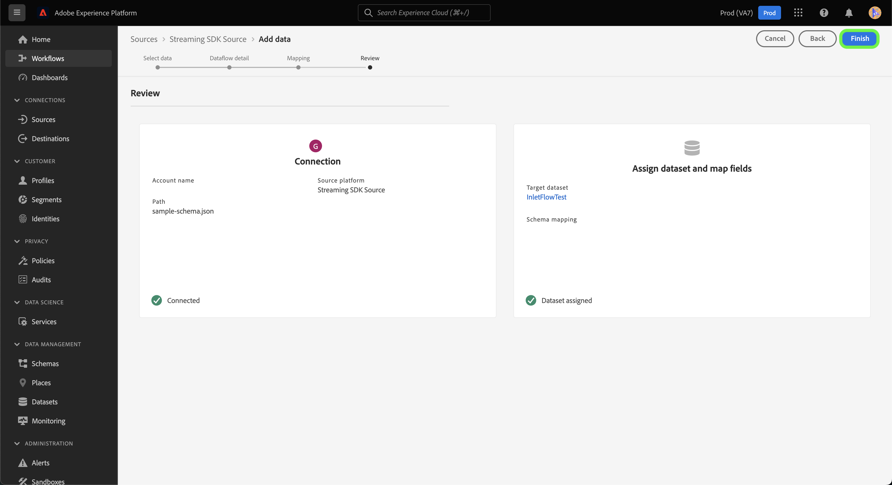

# Skapa en källanslutning och ett dataflöde för att strömma *YOURCE* -data med användargränssnittet

*När du går igenom den här mallen ersätter eller tar du bort alla stycken i kursiv stil (med början från den här).*

*Börja med att uppdatera metadata (rubrik och beskrivning) högst upp på sidan. Please ignore all instances of UICONTROL on this page. Det här är en tagg som hjälper våra maskinöversättningsprocesser att översätta sidan korrekt till flera språk som stöds. Vi lägger till taggar i dokumentationen när du har skickat den.*

I den här självstudiekursen beskrivs hur du skapar en *YOURCE*-källkoppling med hjälp av användargränssnittet för plattformen.

## Översikt

*Ge en kort översikt över ditt företag, inklusive det värde det ger kunderna. Inkludera en länk till din produktdokumentationsstartsida för ytterligare läsning.*

>[!IMPORTANT]
>
>Den här källkopplingen och dokumentationssidan skapas och underhålls av *YOURSOURCE* -teamet. Om du har frågor eller uppdateringsfrågor kontaktar du dem direkt på *Infoga länk eller e-postadress där du kan komma åt uppdateringar*.

## Förhandskrav

*Lägg till information i det här avsnittet om allt som kunderna behöver känna till innan de börjar konfigurera källan i Adobe Experience Platform användargränssnitt. Det här kan vara om:*

* *måste läggas till i en tillåtelselista*
* *krav för e-posthashning*
* *kontoinformation på din sida*
* *Så här hämtar du autentiseringsuppgifterna för att ansluta till din plattform*

### Samla in nödvändiga inloggningsuppgifter

För att kunna ansluta *YOURSOURCE* till plattformen måste du ange värden för följande anslutningsegenskaper:

| Autentiseringsuppgifter | Beskrivning | Exempel |
| --- | --- | --- |
| *autentiseringsuppgifter en* | *Lägg till en kort beskrivning till källans autentiseringsuppgifter här* | *Lägg till ett exempel på källans autentiseringsuppgifter här* |
| *autentiseringsuppgifter två* | *Lägg till en kort beskrivning till källans autentiseringsuppgifter här* | *Lägg till ett exempel på källans autentiseringsuppgifter här* |
| *autentiseringsuppgifter tre* | *Lägg till en kort beskrivning till källans autentiseringsuppgifter här* | *Lägg till ett exempel på källans autentiseringsuppgifter här* |

Mer information om de här autentiseringsuppgifterna finns i *YOURSOURCE* -autentiseringsdokumentationen. *Lägg till en länk till din plattforms autentiseringsdokumentation här*.

### Integrera *DIN KÄLLA* med din webkrok

*SDK för direktuppspelning kräver att din källa har stöd för webhooks för att kunna kommunicera med Experience Platform. I det här avsnittet måste du ange de steg som användarna måste följa för att kunna integrera YOURSOURCE med en webkrok.*

## Anslut ditt *DITT*-konto

I plattformsgränssnittet väljer du **[!UICONTROL Sources]** i det vänstra navigeringsfältet för att komma åt arbetsytan i [!UICONTROL Sources]. På skärmen [!UICONTROL Catalog] visas en mängd olika källor som du kan använda för att skapa ett konto.

Du kan välja lämplig kategori i katalogen till vänster på skärmen. Du kan också hitta den källa du vill arbeta med med med sökalternativet.

Under kategorin **Direktuppspelning** väljer du *DIN KÄLLA* och sedan **[!UICONTROL Add data]**.

>[!TIP]
>
>Skärmbilderna som används nedan är exempel. När du skapar din dokumentation ska du ersätta bilderna med skärmbilder av den faktiska källan. Du kan använda samma markeringsmönster och -färg, liksom samma filnamn. Kontrollera att skärmbilden fångar hela skärmen i användargränssnittet för plattformen. Mer information om hur du överför skärmbilder finns i guiden om att [skicka din dokumentation för granskning](../documentation/github.md).

## Markera data

**[!UICONTROL Select data]**-steget visas med ett gränssnitt där du kan välja vilka data du vill hämta till plattformen.

* Den vänstra delen av gränssnittet är en webbläsare som gör att du kan visa tillgängliga dataströmmar på ditt konto;
* Med den högra delen av gränssnittet kan du förhandsgranska upp till 100 rader data från en JSON-fil.

Välj **[!UICONTROL Upload files]** om du vill överföra en JSON-fil från det lokala systemet. Du kan också dra och släppa den JSON-fil som du vill överföra till panelen [!UICONTROL Drag and drop files].

När filen har överförts uppdateras förhandsvisningsgränssnittet för att visa en förhandsgranskning av schemat som du har överfört. I förhandsvisningsgränssnittet kan du inspektera innehållet och strukturen i en fil. Du kan också använda verktyget [!UICONTROL Search field] för att komma åt specifika objekt från schemat.

När du är klar väljer du **[!UICONTROL Next]**.

## Dataflödesdetaljer

**Dataflödesdetaljsteget** visas. Här finns alternativ för att använda en befintlig datauppsättning eller skapa en ny datauppsättning för dataflödet, samt en möjlighet att ange ett namn och en beskrivning för dataflödet. Under det här steget kan du även konfigurera inställningar för profilinmatning, feldiagnostik, partiell inmatning och aviseringar.

När du är klar väljer du **[!UICONTROL Next]**.

## Mappning

Steg [!UICONTROL Mapping] visas, och du får ett gränssnitt för att mappa källfälten från källschemat till rätt mål-XDM-fält i målschemat.

Plattformen ger intelligenta rekommendationer för automatiskt mappade fält baserat på det målschema eller den datamängd du valt. Du kan justera mappningsreglerna manuellt så att de passar dina användningsfall. Beroende på dina behov kan du välja att mappa fält direkt eller använda förinställningsfunktioner för data för att omvandla källdata för att härleda beräknade eller beräknade värden. Mer information om hur du använder mappningsgränssnittet och beräkningsfälten finns i [Användargränssnittshandboken för dataförinställningar](https://experienceleague.adobe.com/docs/experience-platform/data-prep/ui/mapping.html).

När källdata har mappats väljer du **[!UICONTROL Next]**.

## Granska

Steg **[!UICONTROL Review]** visas, så att du kan granska det nya dataflödet innan det skapas. Informationen är grupperad i följande kategorier:

* **[!UICONTROL Connection]**: Visar källtypen, den relevanta sökvägen för den valda källfilen och mängden kolumner i källfilen.
* **[!UICONTROL Assign dataset & map fields]**: Visar vilka data som källdata hämtas till, inklusive det schema som datauppsättningen följer.

När du har granskat dataflödet klickar du på **[!UICONTROL Finish]** och tillåt en tid innan dataflödet skapas.

## Hämta din URL för direktuppspelningsslutpunkt

När du har skapat ett dataflöde för direktuppspelning kan du nu hämta URL:en för din slutpunkt för direktuppspelning. Den här slutpunkten används för att prenumerera på din webkrok, vilket gör att strömningskällan kan kommunicera med Experience Platform.

Om du vill hämta strömningsslutpunkten går du till sidan [!UICONTROL Dataflow activity] i det dataflöde som du just skapade och kopierar slutpunkten längst ned på panelen [!UICONTROL Properties].

## Nästa steg

*Arbetsflöden för de återstående stegen för att skapa ett dataflöde är modulariserade. Om det finns några specifika utlysningar som du vill göra gällande din källa kan du läsa avsnittet med ytterligare resurser nedan.*

Genom att följa den här självstudiekursen har du upprättat en anslutning till ditt *YOURCE*-konto. Du kan nu fortsätta till nästa självstudiekurs och [konfigurera ett dataflöde för att hämta data till plattformen](https://experienceleague.adobe.com/docs/experience-platform/sources/ui-tutorials/dataflow/crm.html).

## Ytterligare resurser

*Det här är ett valfritt avsnitt där du kan tillhandahålla ytterligare länkar till din produktdokumentation eller andra steg, skärmbilder eller nyanser som du anser vara viktiga för att kunden ska lyckas. Du kan använda det här avsnittet för att lägga till information om eller tips för hela arbetsflödet i källan, särskilt om det finns särskilda gotchas som en slutanvändare kan stöta på.*
