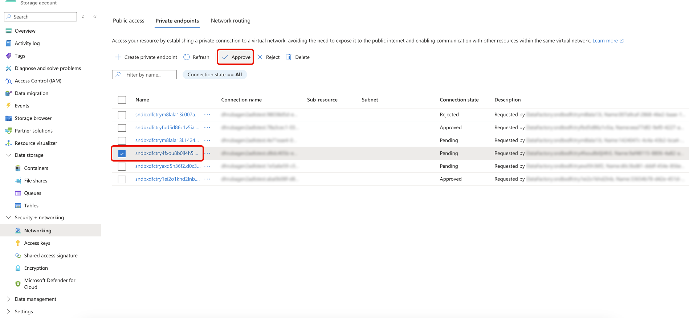

# Använd [!DNL Azure Private Link] som källa i API:t

>[!AVAILABILITY]
>
>Den här funktionen är begränsad och stöds för närvarande endast av följande källor:
>
>* [[!DNL Azure Blob]](../../connectors/cloud-storage/blob.md)
>* [[!DNL Azure Data Lake Gen2]](../../connectors/cloud-storage/adls-gen2.md)
>* [[!DNL Azure File Storage]](../../connectors/cloud-storage/azure-file-storage.md)
>* [[!DNL Snowflake]](../../connectors/databases/snowflake.md)

Du kan använda funktionen [!DNL Azure Private Link] för att skapa privata slutpunkter som dina Adobe Experience Platform-källor kan ansluta till. Anslut dina källor säkert till ett virtuellt nätverk med privata IP-adresser, vilket eliminerar behovet av offentliga IP-adresser och minskar din attackyta.Förenkla nätverksinstallationen genom att ta bort behovet av komplexa konfigurationer för brandvägg eller översättning av nätverksadresser, samtidigt som datatrafiken endast når godkända tjänster.

Läs den här guiden och lär dig hur du kan använda API:er för att skapa och använda en privat slutpunkt.

## Kom igång

Handboken kräver en fungerande förståelse av följande komponenter i Experience Platform:

* [Källor](../../home.md): Med Experience Platform kan data hämtas från olika källor samtidigt som du kan strukturera, etikettera och förbättra inkommande data med hjälp av [!DNL Platform]-tjänster.
* [Sandlådor](../../../sandboxes/home.md): Experience Platform tillhandahåller virtuella sandlådor som partitionerar en enskild [!DNL Platform]-instans till separata virtuella miljöer för att utveckla och utveckla program för digitala upplevelser.

### Använda plattforms-API:er

Mer information om hur du kan anropa plattforms-API:er finns i guiden [Komma igång med plattforms-API:er](../../../landing/api-guide.md).

## Skapa en privat slutpunkt {#create-private-endpoint}

Skapa en POST-begäran till `/privateEndpoints` om du vill skapa en privat slutpunkt.

**API-format**

```http
POST /privateEndpoints
```

**Begäran**

I följande begäran skapas en privat slutpunkt:

+++Välj för att visa begärandeexempel

```shell
curl -X POST \
  'https://platform.adobe.io/data/foundation/connectors/privateEndpoints/' \
  -H 'Authorization: Bearer {ACCESS_TOKEN}' \
  -H 'x-api-key: {API_KEY}' \
  -H 'x-gw-ims-org-id: {ORG_ID}' \
  -H 'x-sandbox-name: {SANDBOX_NAME}' \
  -H 'Content-Type: application/json' \
  -d '{
      "name": "ACME Private Endpoint",
      "subscriptionId": "4281a16a-696f-4993-a7d3-a3da32b846f3",
      "resourceGroupName": "acme-sources-experience-platform",
      "resourceName": "acmeexperienceplatform",
      "fqdns": [],
      "connectionSpec": {
          "id": "4c10e202-c428-4796-9208-5f1f5732b1cf",
          "version": "1.0"
    }
  }'
```

| Egenskap | Beskrivning |
| --- | --- |
| `name` | Namnet på din privata slutpunkt. |
| `subscriptionId` | Det ID som är kopplat till din [!DNL Azure]-prenumeration. Mer information finns i guiden [!DNL Azure] om hur du [hämtar dina prenumerations- och klient-ID:n från  [!DNL Azure Portal]](https://learn.microsoft.com/en-us/azure/azure-portal/get-subscription-tenant-id). |
| `resourceGroupName` | Namnet på resursgruppen på [!DNL Azure]. En resursgrupp innehåller relaterade resurser för en [!DNL Azure]-lösning. Mer information finns i guiden [!DNL Azure] om [hantering av resursgrupper](https://learn.microsoft.com/en-us/azure/azure-resource-manager/management/manage-resource-groups-portal). |
| `resourceName` | Namnet på resursen. I [!DNL Azure] refererar en resurs till instanser som virtuella datorer, webbprogram och databaser. Mer information finns i guiden [!DNL Azure] om [att förstå  [!DNL Azure] resurshanteraren](https://learn.microsoft.com/en-us/azure/azure-resource-manager/management/overview). |
| `fqdns` | De kvalificerade domännamnen för källan. Den här egenskapen krävs bara när källan [!DNL Snowflake] används. |
| `connectionSpec.id` | Anslutningens spec-ID för källan som du använder. |
| `connectionSpec.version` | Versionen av det anslutningsspec-ID som du använder. |

+++

**Svar**

Ett lyckat svar returnerar följande:

+++Välj för att visa svarsexempel

```json
{
  "id": "2c7f6574-299a-4832-aec5-886e875872e2",
  "name": "ACME Private Endpoint",
  "subscriptionId": "4281a16a-696f-4993-a7d3-a3da32b846f3",
  "resourceGroupName": "acme-sources-experience-platform",
  "resourceName": "acmeexperienceplatform",
  "fqdns": [],
  "connectionSpec": {
      "id": "4c10e202-c428-4796-9208-5f1f5732b1cf",
      "version": "1.0"
  },
  "state": "Pending"
}
```

| Egenskap | Beskrivning |
| --- | --- |
| `id` | ID:t för den nyligen skapade privata slutpunkten. |
| `name` | Namnet på din privata slutpunkt. |
| `subscriptionId` | Det ID som är kopplat till din [!DNL Azure]-prenumeration. Mer information finns i guiden [!DNL Azure] om hur du [hämtar dina prenumerations- och klient-ID:n från  [!DNL Azure Portal]](https://learn.microsoft.com/en-us/azure/azure-portal/get-subscription-tenant-id). |
| `resourceGroupName` | Namnet på resursgruppen på [!DNL Azure]. En resursgrupp innehåller relaterade resurser för en [!DNL Azure]-lösning. Mer information finns i guiden [!DNL Azure] om [hantering av resursgrupper](https://learn.microsoft.com/en-us/azure/azure-resource-manager/management/manage-resource-groups-portal). |
| `resourceName` | Namnet på resursen. I [!DNL Azure] refererar en resurs till instanser som virtuella datorer, webbprogram och databaser. Mer information finns i guiden [!DNL Azure] om [att förstå  [!DNL Azure] resurshanteraren](https://learn.microsoft.com/en-us/azure/azure-resource-manager/management/overview). |
| `fqdns` | De kvalificerade domännamnen för källan. Den här egenskapen krävs bara när källan [!DNL Snowflake] används. |
| `connectionSpec.id` | Anslutningens spec-ID för källan som du använder. |
| `connectionSpec.version` | Versionen av det anslutningsspec-ID som du använder. |
| `state` | Det aktuella läget för din privata slutpunkt. Giltiga lägen är: <ul><li>`Pending`</li><li>`Failed`</li><li>`Approved`</li><li>`Rejected`</li></ul> |

+++

## Hämta en lista med privata slutpunkter {#retrieve-private-endpoints}

Om du vill hämta en lista med privata slutpunkter från en viss sandlåda i din organisation, ska du göra en GET-begäran till `/privateEndpoints`.

**API-format**

```http
GET /privateEndpoints
```

**Begäran**

Följande begäran hämtar en lista över alla privata slutpunkter som finns i organisationen.

+++Välj för att visa begärandeexempel

```shell
curl -X GET \
  'https://platform.adobe.io/data/foundation/connectors/privateEndpoints' \
  -H 'Authorization: Bearer {ACCESS_TOKEN}' \
  -H 'x-api-key: {API_KEY}' \
  -H 'x-gw-ims-org-id: {ORG_ID}' \
  -H 'x-sandbox-name: {SANDBOX_NAME}' \
  -H 'Content-Type: application/json' \
```

+++

**Svar**

Ett lyckat svar returnerar en lista med privata slutpunkter i organisationen.

+++Välj för att visa svarsexempel

```json
{
  "items": [
       {
      "id": "ac9eb695-0d1a-42d4-bc45-0842aeaa1eff",
      "name": "TEST_E2E_29_Jan",
      "subscriptionId": "4281a16a-696f-4993-a7d3-a3da32b846f3",
      "resourceGroupName": "acme-noid-experience-platform",
      "resourceName": "acmeprivatelinking",
      "fqdns": [
         
      ],
      "state": "Approved",
      "connectionSpec": {
        "id": "4c10e202-c428-4796-9208-5f1f5732b1cf",
        "version": "1.0"
      }
    },
          {
      "id": "4c9eb695-0d1a-42d4-bc45-0842aeaa1efr",
      "name": "TEST_E2E_29_Jan",
      "subscriptionId": "5a0ff2f3-53d6-47e4-abb5-10a18bd3fff0",
      "resourceGroupName": "acme-sources-experience-platform",
      "resourceName": "acmeexperienceplatform",
      "fqdns": [
         
      ],
      "state": "Pending",
      "connectionSpec": {
        "id": "b3ba5556-48be-44b7-8b85-ff2b69b46dc4",
        "version": "1.0"
      }
    } 
  ]
}
```

+++

## Hämta en lista med privata slutpunkter för en angiven källa {#retrieve-private-endpoints-by-source}

Om du vill hämta en lista med privata slutpunkter som motsvarar en viss källa, gör du en GET-begäran till `/privateEndpoints`-slutpunkten och anger `connectionSpec.id` för källan.

**API-format**

```http
GET /privateEndpoints?property=connectionSpec.id=={CONNECTION_SPEC_ID}
```

| Frågeparameter | Beskrivning |
| --- | --- |
| `{CONNECTION_SPEC_ID}` | Anslutningens spec-ID för källan som du vill söka efter privata slutpunkter för. |

**Begäran**

Följande begäran hämtar en lista över alla privata slutpunkter som motsvarar källan med anslutningsspecifikation-ID: `4c10e202-c428-4796-9208-5f1f5732b1cf`.

+++Välj för att visa begärandeexempel

```shell
curl -X GET \
  'https://platform.adobe.io/data/foundation/connectors/privateEndpoints?property=connectionSpec.id==4c10e202-c428-4796-9208-5f1f5732b1cf' \
  -H 'Authorization: Bearer {ACCESS_TOKEN}' \
  -H 'x-api-key: {API_KEY}' \
  -H 'x-gw-ims-org-id: {ORG_ID}' \
  -H 'x-sandbox-name: {SANDBOX_NAME}' \
  -H 'Content-Type: application/json' \
```

+++

**Svar**

Ett lyckat svar returnerar en lista med alla privata slutpunkter som motsvarar källan med anslutningsspecifikation-ID: `4c10e202-c428-4796-9208-5f1f5732b1cf`.

+++Välj för att visa svarsexempel

```json
{
  "items": [
       {
      "id": "ac9eb695-0d1a-42d4-bc45-0842aeaa1eff",
      "name": "TEST_E2E_29_Jan",
      "subscriptionId": "4281a16a-696f-4993-a7d3-a3da32b846f3",
      "resourceGroupName": "acme-noid-experience-platform",
      "resourceName": "acmeprivatelinkhg",
      "fqdns": [
         
      ],
      "state": "Approved",
      "connectionSpec": {
        "id": "4c10e202-c428-4796-9208-5f1f5732b1cf",
        "version": "1.0"
      }
    },
    {
      "id": "4c9eb695-0d1a-42d4-bc45-0842aeaa1efr",
      "name": "TEST_E2E_29_Jan",
      "subscriptionId": "5a0ff2f3-53d6-47e4-abb5-10a18bd3fff0",
      "resourceGroupName": "acme-sources-experience-platform",
      "resourceName": "acmeexperienceplatform",
      "fqdns": [
         
      ],
      "state": "Pending",
      "connectionSpec": {
        "id": "4c10e202-c428-4796-9208-5f1f5732b1cf",
        "version": "1.0"
      }
    } 
  ]
}
```

+++

## Hämta en privat slutpunkt {#retrieve-specific-private-endpoint}

Om du vill hämta en specifik privat slutpunkt gör du en GET-begäran till `/privateEndpoints` och anger ID:t för den privata slutpunkt som du vill hämta.

**API-format**

```http
GET /privateEndpoints/{PRIVATE_ENDPOINT_ID}
```

| Frågeparameter | Beskrivning |
| --- | --- |
| `{PRIVATE_ENDPOINT_ID}` | ID för den privata slutpunkt som du vill hämta. |

**Begäran**

Följande begäran hämtar den privata slutpunkten med ID:`2c5699b0-b9b6-486f-8877-ee5e21fe9a9d`.

+++Välj för att visa begärandeexempel

```shell
curl -X GET \
  'https://platform.adobe.io/data/foundation/connectors/privateEndpoints/2c5699b0-b9b6-486f-8877-ee5e21fe9a9d' \
  -H 'Authorization: Bearer {ACCESS_TOKEN}' \
  -H 'x-api-key: {API_KEY}' \
  -H 'x-gw-ims-org-id: {ORG_ID}' \
  -H 'x-sandbox-name: {SANDBOX_NAME}' \
  -H 'Content-Type: application/json' \
```

+++

**Svar**

Ett svar returnerar den privata slutpunkten med ID: `2c5699b0-b9b6-486f-8877-ee5e21fe9a9d`

+++Välj för att visa svarsexempel

```json
{
  "items": [
       {
      "id": "2c5699b0-b9b6-486f-8877-ee5e21fe9a9d",
      "name": "TEST_E2E_29_Jan",
      "subscriptionId": "5a0ff2f3-53d6-47e4-abb5-10a18bd3fff0",
      "resourceGroupName": "acme-noid-experience-platform",
      "resourceName": "acmeprivatelinkhg",
      "fqdns": [
         
      ],
      "state": "Approved",
      "connectionSpec": {
        "id": "4c10e202-c428-4796-9208-5f1f5732b1cf",
        "version": "1.0"
      }
    }
  ]
}
```

+++

## Lösa en privat slutpunkt {#resolve-private-endpoint}

**API-format**

```http
GET /privateEndpoints?op=autoResolve
```

**Begäran**

+++Välj för att visa begärandeexempel

```shell
curl -X GET \
  'https://platform.adobe.io/data/foundation/connectors/privateEndpoints?op=autoResolve' \
  -H 'Authorization: Bearer {ACCESS_TOKEN}' \
  -H 'x-api-key: {API_KEY}' \
  -H 'x-gw-ims-org-id: {ORG_ID}' \
  -H 'x-sandbox-name: {SANDBOX_NAME}' \
  -H 'Content-Type: application/json' \
  -d '{
      "auth": {
          "specName": "ConnectionString",
          "params": {
              "usePrivateLink": true,
              "connectionString": "{CONNECTION_STRING}"
          }
      },
      "connectionSpec": {
          "id": "4c10e202-c428-4796-9208-5f1f5732b1cf",
          "version": "1.0"
      }
  }'
```

+++

**Svar**

+++Välj för att visa svarsexempel

```json
{
  "items": [
        {
      "id": "4c9eb695-0d1a-42d4-bc45-0842aeaa1efr",
      "name": "TEST_E2E_29_Jan",
      "subscriptionId": "5a0ff2f3-53d6-47e4-abb5-10a18bd3fff0",
      "resourceGroupName": "acme-sources-experience-platform",
      "resourceName": "acmeexperienceplatform",
      "fqdns": [
         
      ],
      "state": "Pending",
      "connectionSpec": {
        "id": "4c10e202-c428-4796-9208-5f1f5732b1cf",
        "version": "1.0"
      } 
    }
  ]
}
```

+++

## Aktivera [!DNL Interactive Authoring] {#enable-interactive-authoring}

>[!IMPORTANT]
>
>Du måste aktivera [!DNL Interactive Authoring] innan du skapar eller uppdaterar ett flöde och innan du skapar, uppdaterar eller utforskar en anslutning.

[!DNL Interactive Authoring] används för funktioner som att utforska en anslutning eller ett konto och förhandsgranska data. Aktivera [!DNL Interactive Authoring] genom att göra en POST-begäran till `/privateEndpoints/interactiveAuthoring` och ange `enable` som en operator i frågeparametrarna.

**API-format**

```http
POST /privateEndpoints/interactiveAuthoring?op=enable
```

| Frågeparameter | Beskrivning |
| --- | --- |
| `op` | Den åtgärd som du vill utföra. Aktivera [!DNL Interactive Authoring] genom att ange värdet `op` till `enable`. |

**Begäran**

Följande begäran aktiverar [!DNL Interactive Authoring] för din privata slutpunkt och ställer in TTL på 60 minuter.

+++Välj för att visa begärandeexempel

```shell
curl -X POST \
  'https://platform.adobe.io/data/foundation/connectors/privateEndpoints/interactiveAuthoring?op=enable' \
  -H 'Authorization: Bearer {ACCESS_TOKEN}' \
  -H 'x-api-key: {API_KEY}' \
  -H 'x-gw-ims-org-id: {ORG_ID}' \
  -H 'x-sandbox-name: {SANDBOX_NAME}' \
  -H 'Content-Type: application/json' \
  -d '{
      "autoTerminationMinutes": 60
  }'
```

| Egenskap | Beskrivning |
| --- | --- |
| `autoTerminationMinutes` | [!DNL Interactive Authoring] TTL (time-to-live) på några minuter. [!DNL Interactive Authoring] används för funktioner som att utforska en anslutning eller ett konto och förhandsgranska data. Du kan ange en maximal TTL på 120 minuter. Standardvärdet för TTL är 60 minuter. |

+++

**Svar**

Ett lyckat svar returnerar HTTP-status 202 (Accepterad).

## Hämta [!DNL Interactive Authoring]-status {#retrieve-interactive-authoring-status}

Om du vill visa aktuell status för [!DNL Interactive Authoring] för din privata slutpunkt gör du en GET-begäran till `/privateEndpoints/interactiveAuthoring`.

**API-format**

```http
GET /privateEndpoints/interactiveAuthoring
```

**Begäran**

Följande begäran hämtar statusen för [!DNL Interactive Authoring]:

+++Välj för att visa begärandeexempel

```shell
curl -X GET \
  'https://platform.adobe.io/data/foundation/connectors/privateEndpoints/interactiveAuthoring' \
  -H 'Authorization: Bearer {ACCESS_TOKEN}' \
  -H 'x-api-key: {API_KEY}' \
  -H 'x-gw-ims-org-id: {ORG_ID}' \
  -H 'x-sandbox-name: {SANDBOX_NAME}' \
  -H 'Content-Type: application/json' \
```

+++

**Svar**

+++Välj för att visa svarsexempel

```json
{
    "status": "Disabled"
}
```

| Egenskap | Beskrivning |
| --- | --- |
| `status` | Status för [!DNL Interactive Authoring]. Giltiga värden är: `disabled`, `enabling`, `enabled`. |

+++

## Ta bort privat slutpunkt {#delete-private-endpoint}

Om du vill ta bort din privata slutpunkt gör du en DELETE-förfrågan till `/privateEndpoints` och anger ID:t för den slutpunkt som du vill ta bort.

**API-format**

```http
DELETE /privateEndpoints/{PRIVATE_ENDPOINT_ID}
```

| Frågeparameter | Beskrivning |
| --- | --- |
| `{PRIVATE_ENDPOINT_ID}` | ID för den privata slutpunkt som du vill ta bort. |

**Begäran**

Följande begäran tar bort privat slutpunkt med ID: `02a74b31-a566-4a86-9cea-309b101a7f24`.

+++Välj för att visa begärandeexempel

```shell
curl -X DELETE \
  'https://platform.adobe.io/data/foundation/connectors/privateEndpoints/02a74b31-a566-4a86-9cea-309b101a7f24' \
  -H 'Authorization: Bearer {ACCESS_TOKEN}' \
  -H 'x-api-key: {API_KEY}' \
  -H 'x-gw-ims-org-id: {ORG_ID}' \
  -H 'x-sandbox-name: {SANDBOX_NAME}' \
  -H 'Content-Type: application/json' \
```

+++

**Svar**

Ett lyckat svar returnerar HTTP-status 200 (Slutfört). Du kan verifiera borttagningen genom att göra en GET-begäran och till `/privateEndpoints` och ange det borttagna ID:t som en frågeparameter.

## Flödestjänst {#flow-service}

I följande avsnitt finns information om hur du kan använda privata slutpunkter tillsammans med [[!DNL Flow Service] API](https://developer.adobe.com/experience-platform-apis/references/flow-service/).

### Skapa en anslutning med en privat slutpunkt {#create-base-connection}

Om du vill skapa en anslutning med en privat slutpunkt i Experience Platform skapar du en POST-begäran till `/connections`-slutpunkten i [!DNL Flow Service] API:t.

**API-format**

```http
POST /connections/
```

**Begäran**

Följande begäran skapar en autentiserad basanslutning för [!DNL Snowflake], samtidigt som en privat slutpunkt används.

+++Välj för att visa begärandeexempel

```shell
curl -X POST \
  'https://platform.adobe.io/data/foundation/flowservice/connections/' \
  -H 'Authorization: Bearer {ACCESS_TOKEN}' \
  -H 'x-api-key: {API_KEY}' \
  -H 'x-gw-ims-org-id: {ORG_ID}' \
  -H 'x-sandbox-name: {SANDBOX_NAME}' \
  -H 'Content-Type: application/json' \
  -d '{
      "name": "Snowflake base connection",
      "description": "A base connection for a Snowflake source that uses a private link.",
      "auth": {
          "specName": "ConnectionString",
          "params": {
              "connectionString": "{CONNECTION_STRING}",
              "usePrivateLink" : true
          }
      },
      "connectionSpec": {
          "id": "b2e08744-4f1a-40ce-af30-7abac3e23cf3",
          "version": "1.0"
      }
  }'
```

| Egenskap | Beskrivning |
| --- | --- |
| `name` | Namnet på din basanslutning. |
| `description` | (Valfritt) En beskrivning med ytterligare information om anslutningen. |
| `auth.specName` | Autentiseringen som används för att ansluta källan till Experience Platform. |
| `auth.params.connectionString` | Anslutningssträngen [!DNL Snowflake]. Mer information finns i [[!DNL Snowflake] API-autentiseringsguiden](../api/create/databases/snowflake.md). |
| `auth.params.usePrivateLink` | Ett booleskt värde som avgör om du använder en privat slutpunkt eller inte. Ange det här värdet till `true` om du använder en privat slutpunkt. |
| `connectionSpec.id` | Anslutningens spec-ID för [!DNL Snowflake]. |
| `connectionSpec.version` | Versionen av ditt [!DNL Snowflake]-anslutningsspec-ID. |

+++

**Svar**

Ett lyckat svar returnerar ditt nyligen genererade basanslutnings-ID och -tagg.

+++Välj för att visa svarsexempel

```json
{
  "id": "a59d368a-1152-4673-a46e-bd52e8cdb9a9",
  "etag": "\"f50185ed-0000-0200-0000-637e8fad0000\""
}
```

+++

### Hämta anslutningar som är kopplade till en angiven privat slutpunkt {#retrieve-connections-by-endpoint}

Om du vill hämta anslutningar som är kopplade till en viss privat slutpunkt gör du en GET-begäran till slutpunkten `/connections` och anger ID:t för den privata slutpunkten som en frågeparameter.

**API-format**

```http
GET /connections?property=auth.params.privateEndpointId=={PRIVATE_ENDPOINT_ID}
```

| Frågeparameter | Beskrivning |
| --- | --- |
| {PRIVATE_ENDPOINT_ID} | ID för den privata slutpunkten som är kopplad till de anslutningar som du vill hämta. |

**Begäran**

Följande begäran hämtar befintliga anslutningar som är kopplade till en privat slutpunkt med ID: `02a74b31-a566-4a86-9cea-309b101a7f24`.

+++Välj för att visa begärandeexempel

```shell
curl -X GET \
  'https://platform.adobe.io/data/foundation/flowservice/connections?property=auth.params.privateEndpointId==02a74b31-a566-4a86-9cea-309b101a7f24' \
  -H 'Authorization: Bearer {ACCESS_TOKEN}' \
  -H 'x-api-key: {API_KEY}' \
  -H 'x-gw-ims-org-id: {ORG_ID}' \
  -H 'x-sandbox-name: {SANDBOX_NAME}' \
  -H 'Content-Type: application/json' \
```

+++

**Svar**

Ett lyckat svar returnerar en lista över anslutningar som är kopplade till den efterfrågade privata slutpunkten.

+++Välj för att visa svarsexempel

```json
{
  "items": [
    {
      "id": "42a27b1f-8e3f-48ce-8c29-7e474b29a015",
      "createdAt": 1729154379292,
      "updatedAt": 1729154382031,
      "createdBy": "{CREATED_BY}",
      "updatedBy": "{UPDATED_BY}",
      "createdClient": "{CREATED_CLIENT}",
      "updatedClient": "{UPDATED_CLIENT}",
      "sandboxId": "{SANDBOX_ID}",
      "sandboxName": "{SANDBOX_NAME}",
      "imsOrgId": "{ORG_NAME}",
      "name": "acme-e2e",
      "connectionSpec": {
        "id": "4c10e202-c428-4796-9208-5f1f5732b1cf",
        "version": "1.0"
      },
      "state": "enabled",
      "auth": {
        "specName": "ConnectionString",
        "params": {
          "connectionString": "{CONNECTION_STRING}",
          "usePrivateLink": true,
          "privateEndpointId": "02a74b31-a566-4a86-9cea-309b101a7f24"
        }
      },
      "version": "\"2f01454b-0000-0200-0000-6766749a0000\"",
      "etag": "\"2f01454b-0000-0200-0000-6766749a0000\"",
      "lastOperation": {
        "started": 0,
        "updated": 0,
        "operation": "create"
      }
    },
    {
      "id": "6350311a-664c-4b08-aad4-4065781aac81",
      "createdAt": 1718199941102,
      "updatedAt": 1718199945147,
      "createdBy": "{CREATED_BY}",
      "updatedBy": "{UPDATED_BY}",
      "createdClient": "{CREATED_CLIENT}",
      "updatedClient": "{UPDATED_CLIENT}",
      "sandboxId": "{SANDBOX_ID}",
      "sandboxName": "{SANDBOX_NAME}",
      "imsOrgId": "{ORG_NAME}",
      "name": "acme demo",
      "connectionSpec": {
        "id": "4c10e202-c428-4796-9208-5f1f5732b1cf",
        "version": "1.0"
      },
      "state": "enabled",
      "auth": {
        "specName": "ConnectionString",
        "params": {
          "connectionString": "{CONNECTION_STRING}",
          "usePrivateLink": true,
          "privateEndpointId": "02a74b31-a566-4a86-9cea-309b101a7f24"
        }
      },
      "version": "\"3001307e-0000-0200-0000-6766cf710000\"",
      "etag": "\"3001307e-0000-0200-0000-6766cf710000\"",
      "lastOperation": {
        "started": 0,
        "updated": 0,
        "operation": "create"
      }
    }
  ],
  "_links": {
     
  }
}
```

+++

### Hämta anslutningar som är associerade med privata slutpunkter {#retrieve-connections}

Om du vill hämta anslutningar som är associerade med en privat slutpunkt, gör du en GET-begäran till slutpunkten `/connections` och anger `property=auth.params.usePrivateLink==true` som en frågeparameter.

**API-format**

```http
GET /connections?property=auth.params.usePrivateLink==true
```

**Begäran**

Följande begäran hämtar alla anslutningar i organisationen som använder privata slutpunkter.

+++Välj för att visa begärandeexempel

```shell
curl -X GET \
  'https://platform.adobe.io/data/foundation/flowservice/connections?property=auth.params.usePrivateLink==true' \
  -H 'Authorization: Bearer {ACCESS_TOKEN}' \
  -H 'x-api-key: {API_KEY}' \
  -H 'x-gw-ims-org-id: {ORG_ID}' \
  -H 'x-sandbox-name: {SANDBOX_NAME}' \
  -H 'Content-Type: application/json' \
```

+++

**Svar**

Ett lyckat svar returnerar alla anslutningar som är kopplade till privata slutpunkter.

+++Välj för att visa svarsexempel

```json
{
  "items": [
    {
      "id": "42a27b1f-8e3f-48ce-8c29-7e474b29a015",
      "createdAt": 1729154379292,
      "updatedAt": 1729154382031,
      "createdBy": "{CREATED_BY}",
      "updatedBy": "{UPDATED_BY}",
      "createdClient": "{CREATED_CLIENT}",
      "updatedClient": "{UPDATED_CLIENT}",
      "sandboxId": "{SANDBOX_ID}",
      "sandboxName": "{SANDBOX_NAME}",
      "imsOrgId": "{ORG_NAME}",
      "name": "acme-e2e",
      "connectionSpec": {
        "id": "4c10e202-c428-4796-9208-5f1f5732b1cf",
        "version": "1.0"
      },
      "state": "enabled",
      "auth": {
        "specName": "ConnectionString",
        "params": {
          "connectionString": "{CONNECTION_STRING}",
          "usePrivateLink": true,
          "privateEndpointId": "02a74b31-a566-4a86-9cea-309b101a7f24"
        }
      },
      "version": "\"2f01454b-0000-0200-0000-6766749a0000\"",
      "etag": "\"2f01454b-0000-0200-0000-6766749a0000\"",
      "lastOperation": {
        "started": 0,
        "updated": 0,
        "operation": "create"
      }
    },
    {
      "id": "6350311a-664c-4b08-aad4-4065781aac81",
      "createdAt": 1718199941102,
      "updatedAt": 1718199945147,
      "createdBy": "{CREATED_BY}",
      "updatedBy": "{UPDATED_BY}",
      "createdClient": "{CREATED_CLIENT}",
      "updatedClient": "{UPDATED_CLIENT}",
      "sandboxId": "{SANDBOX_ID}",
      "sandboxName": "{SANDBOX_NAME}",
      "imsOrgId": "{ORG_NAME}",
      "name": "acme demo",
      "connectionSpec": {
        "id": "b2e08744-4f1a-40ce-af30-7abac3e23cf3",
        "version": "1.0"
      },
      "state": "enabled",
      "auth": {
        "specName": "ConnectionString",
        "params": {
          "connectionString": "{CONNECTION_STRING}",
          "usePrivateLink": true
        }
      },
      "version": "\"3001307e-0000-0200-0000-6766cf710000\"",
      "etag": "\"3001307e-0000-0200-0000-6766cf710000\"",
      "lastOperation": {
        "started": 0,
        "updated": 0,
        "operation": "create"
      }
    }
  ],
  "_links": {
     
  }
}
```

+++

## Bilaga

Läs det här avsnittet om du vill ha mer information om hur du använder [!DNL Azure] privata länkar i API:t.

### Konfigurera ditt [!DNL Snowflake]-konto för att ansluta till privata länkar

Du måste slutföra följande nödvändiga steg för att kunna använda källan [!DNL Snowflake] med privata länkar.

Först måste du skaffa en supportbiljett i [!DNL Snowflake] och begära **slutpunktstjänstens resurs-ID** för [!DNL Azure]-regionen för ditt [!DNL Snowflake]-konto. Följ stegen nedan för att höja upp en [!DNL Snowflake]-biljett:

1. Navigera till [[!DNL Snowflake] användargränssnittet](https://app.snowflake.com) och logga in med ditt e-postkonto. Under det här steget måste du se till att din e-post verifieras i profilinställningarna.
2. Välj din **användarmeny** och välj sedan **support** för att få tillgång till [!DNL Snowflake]-support.
3. Välj **[!DNL + Support Case]** om du vill skapa ett supportärende. Fyll sedan i formuläret med relevant information och bifoga nödvändiga filer.
4. När du är klar skickar du ärendet.

Resurs-ID för slutpunkten har följande format:

```shell
subscriptions/{SUBSCRIPTION_ID}/resourceGroups/az{REGION}-privatelink/providers/microsoft.network/privatelinkservices/sf-pvlinksvc-az{REGION}
```

+++Markera för att visa exempel

```shell
/subscriptions/4575fb04-6859-4781-8948-7f3a92dc06a3/resourceGroups/azwestus2-privatelink/providers/microsoft.network/privatelinkservices/sf-pvlinksvc-azwestus2
```

+++

| Parameter | Beskrivning | Exempel |
| --- | --- | --- |
| `{SUBSCRIPTION_ID}` | Det unika ID som identifierar din [!DNL Azure]-prenumeration. | `a1b2c3d4-5678-90ab-cdef-1234567890ab` |
| `{REGION}` | Regionen [!DNL Azure] för ditt [!DNL Snowflake]-konto. | `azwestus2` |

### Hämta information om konfigurationen av din privata länk

Du måste köra följande kommando i [!DNL Snowflake] om du vill hämta information om konfigurationen av din privata länk:

```sql
USE ROLE accountadmin;
SELECT key, value::varchar
FROM TABLE(FLATTEN(input => PARSE_JSON(SYSTEM$GET_PRIVATELINK_CONFIG())));
```

Hämta sedan värden för följande egenskaper:

* `privatelink-account-url`
* `regionless-privatelink-account-url`
* `privatelink_ocsp-url`

När du har hämtat värdena kan du göra följande anrop för att skapa en privat länk för [!DNL Snowflake].

**Begäran**

I följande begäran skapas en privat slutpunkt för [!DNL Snowflake]:

>[!BEGINTABS]

>[!TAB Mall]

```shell
curl -X POST \
  'https://platform.adobe.io/data/foundation/connectors/privateEndpoints/' \
  -H 'Authorization: Bearer {ACCESS_TOKEN}' \
  -H 'x-api-key: {API_KEY}' \
  -H 'x-gw-ims-org-id: {ORG_ID}' \
  -H 'x-sandbox-name: {SANDBOX_NAME}' \
  -H 'Content-Type: application/json' \
  -d '{
    "name": "{ENDPOINT_NAME}",
    "subscriptionId": "{AZURE_SUBSCRIPTION_ID}",
    "resourceGroupName": "{RESOURCE_GROUP_NAME}",
    "resourceName": "{SNOWFLAKE_ENDPOINT_SERVICE_NAME}",
    "fqdns": [
      "{PRIVATELINK_ACCOUNT_URL}",
      "{REGIONLESS_PRIVATELINK_ACCOUNT_URL}",
      "{PRIVATELINK_OCSP_URL}"
    ],
    "connectionSpec": {
      "id": "b2e08744-4f1a-40ce-af30-7abac3e23cf3",
      "version": "1.0"
    }
  }'
```

>[!TAB Exempel]

```shell
curl -X POST \
  'https://platform.adobe.io/data/foundation/connectors/privateEndpoints/' \
  -H 'Authorization: Bearer {ACCESS_TOKEN}' \
  -H 'x-api-key: {API_KEY}' \
  -H 'x-gw-ims-org-id: {ORG_ID}' \
  -H 'x-sandbox-name: {SANDBOX_NAME}' \
  -H 'Content-Type: application/json' \
  -d '{
    "name": "TEST_Snowflake_PE",
    "subscriptionId": "4575fb04-6859-4781-8948-7f3a92dc06a3",
    "resourceGroupName": "azwestus2-privatelink",
    "resourceName": "sf-pvlinksvc-azwestus2",
    "fqdns": [
      "hf06619.west-us-2.privatelink.snowflakecomputing.com",
      "adobe-segmentationdbint.privatelink.snowflakecomputing.com",
      "ocsp.hf06619.west-us-2.privatelink.snowflakecomputing.com"
    ],
    "connectionSpec": {
      "id": "b2e08744-4f1a-40ce-af30-7abac3e23cf3",
      "version": "1.0"
    }
  }'
```


>[!ENDTABS]

### Godkänn en privat slutpunkt för [!DNL Azure Blob] och [!DNL Azure Data Lake Gen2]

Logga in på [!DNL Azure Blob] om du vill godkänna en privat slutpunktsbegäran för källorna [!DNL Azure Data Lake Gen2] och [!DNL Azure Portal]. Välj **[!DNL Data storage]** i den vänstra navigeringen, gå till fliken **[!DNL Security + networking]** och välj **[!DNL Networking]**. Välj sedan **[!DNL Private endpoints]** för att visa en lista över privata slutpunkter som är associerade med ditt konto och deras aktuella anslutningstillstånd. Om du vill godkänna en väntande begäran markerar du önskad slutpunkt och klickar på **[!DNL Approve]**.


