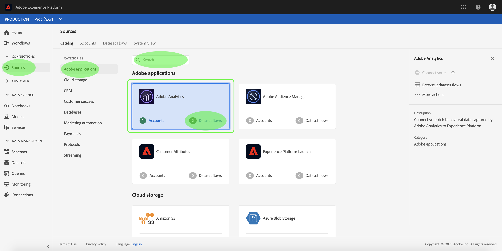

# Skapa en Adobe Analytics-källanslutning i användargränssnittet

I den här självstudiekursen beskrivs hur du skapar en Adobe Analytics-källanslutning i användargränssnittet för att överföra konsumentdata till Adobe Experience Platform.

## Komma igång

Den här självstudiekursen kräver en fungerande förståelse av följande komponenter i Adobe Experience Platform:

* [Experience Data Model (XDM) System](../../../../../xdm/home.md): Det standardiserade ramverk som Experience Platform använder för att ordna kundupplevelsedata.
* [Kundprofil](../../../../../profile/home.md)i realtid: Ger en enhetlig konsumentprofil i realtid baserad på aggregerade data från flera källor.
* [Sandlådor](../../../../../sandboxes/home.md): Experience Platform tillhandahåller virtuella sandlådor som partitionerar en enda Platform-instans till separata virtuella miljöer för att utveckla och utveckla program för digitala upplevelser.

## Skapa en källanslutning med Adobe Analytics

Logga in på <a href="https://platform.adobe.com" target="_blank">Adobe Experience Platform</a> och välj sedan **[!UICONTROL Sources]** från det vänstra navigeringsfältet för att komma åt källarbetsytan. På *katalogskärmen* visas tillgängliga källor för att skapa inkommande anslutningar, och varje källa visar antalet befintliga konton och datauppsättningsflöden som är kopplade till dem.

Du kan välja lämplig kategori i katalogen till vänster på skärmen. Du kan också hitta den källa du vill arbeta med med med sökalternativet.

Under kategorin *Adobe-program* väljer du **[!UICONTROL Adobe Analytics]** att visa ett informationsfält till höger på skärmen. Informationsfältet innehåller en kort beskrivning av den valda källan samt alternativ för att ansluta till källan eller visa dess dokumentation. Om du vill visa befintliga konton väljer du **[!UICONTROL Accounts]**.

### Markera data

Steget *Adobe Analytics* visas. Tidigare etablerade datauppsättningsflöden för Analytics visas på den här skärmen. Du kan skapa ett nytt datauppsättningsflöde genom att klicka **[!UICONTROL Select data]**.

>[!NOTE]
>
>Flera in-bound-anslutningar till en källa kan göras för att hämta olika data.

<!---Analytics report suites can be configured for one sandbox at a time. To import the same report suite into a different sandbox, the dataset flow will have to be deleted and instantiated again via configuration for a different sandbox.--->

I listan med tillgängliga rapportsviter väljer du den du vill hämta till Platform och klickar på **[!UICONTROL Next]**.

### Namnge datauppsättningsflödet

Flödesdetaljsteget för *datauppsättningen* visas, där du måste ange ett namn och en valfri beskrivning för datauppsättningsflödet. Välj **[UICONTROL. Nästa]** när du är klar.

### Granska datauppsättningsflödet

Steget *Granska* visas så att du kan granska ditt nya inbundna datauppsättningsflöde från Analytics innan det skapas. Detaljerna om anslutningen är grupperade efter kategorier, inklusive:

* *Anslutning*: Visar typen av källanslutning och den valda rapportsviten.
* *Tilldela datauppsättnings- och kartfält*: När du skapar andra källanslutningar visar den här behållaren vilka data som källdata hämtas till, inklusive det schema som datauppsättningen följer. Utdataschemat och datauppsättningen konfigureras automatiskt för Analytics datauppsättningsflöden.

### Övervaka datauppsättningsflödet

När datauppsättningsflödet har skapats kan du övervaka de data som hämtas genom den. På *katalogskärmen* väljer du *Datauppsättningsflöden* för att visa en lista över etablerade flöden som är kopplade till ditt Analytics-konto.

Skärmen *Datauppsättningsflöden* visas. På den här sidan finns ett par datauppsättningsflöden, inklusive information om namn, källdata, skapandetid och status.

Kopplingen instansierar två datauppsättningsflöden. Det ena flödet representerar data för bakåtfyllnad och det andra för livedata. Backfill-data är inte konfigurerade för profil, men skickas till datasjön för analytiska och datavetenskapliga användningsfall.

Mer information om backfill, livedata och deras respektive latenser finns i översikten [för](../../../../connectors/adobe-applications/analytics.md)Analytics Data Connector.

Välj det datauppsättningsflöde du vill visa i listan.

Sidan *Datauppsättningsaktivitet* visas. På den här sidan visas hur många meddelanden som används i form av ett diagram. Välj *Datastyrning* i det övre huvudet för att komma åt etikettfälten.

Du kan visa ett datauppsättningsflödes ärvda etiketter från skärmen *Datastyrning* . Om du vill visa specifika etiketter väljer du redigeringsknappen högst upp till höger.

Panelen *Redigera styrningsetiketter* visas. På den här skärmen kan du komma åt och redigera ett datauppsättningsflödes kontrakt, identitet och känsliga etiketter.

Mer information om hur du etiketterar data som kommer från Analytics finns i etikettguiden för [dataanvändning](../../../../../data-governance/labels/user-guide.md).

## Nästa steg och ytterligare resurser

När anslutningen har skapats skapas automatiskt ett målschema och ett datauppsättningsflöde som innehåller inkommande data. Dessutom sker datainfyllning och inmatning av historiska data i upp till 13 månader. När det första intaget är slutfört ska Analytics-data användas av Platform-tjänster längre fram i kedjan, t.ex. kundprofil i realtid och segmenteringstjänst. Mer information finns i följande dokument:

* [Översikt över kundprofiler i realtid](../../../../../profile/home.md)
* [Översikt över segmenteringstjänsten](../../../../../segmentation/home.md)
* [Översikt över arbetsytan Datavetenskap](../../../../../data-science-workspace/home.md)
* [Översikt över frågetjänsten](../../../../../query-service/home.md)

Följande video är tänkt att ge stöd för din förståelse av hur data importeras med Adobe Analytics Source Connector:

>[!WARNING]
>
> Gränssnittet [!DNL Platform] som visas i följande video är inaktuellt. Läs dokumentationen ovan för de senaste skärmbilderna och funktionerna i användargränssnittet.

>[!VIDEO](https://video.tv.adobe.com/v/29687?quality=12&learn=on)

