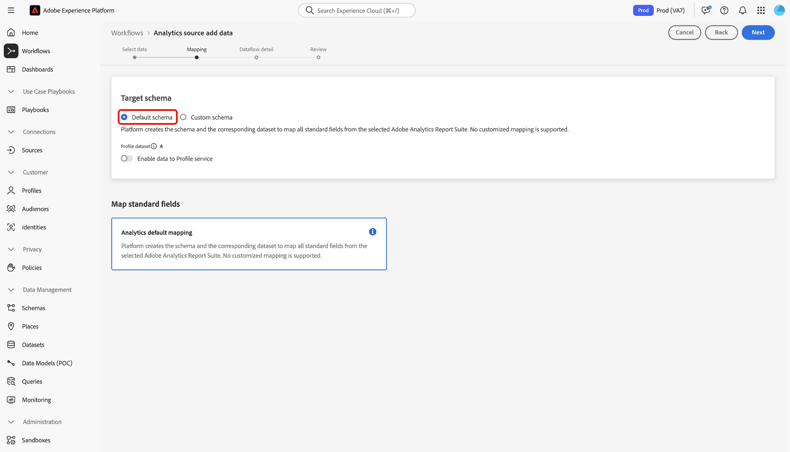
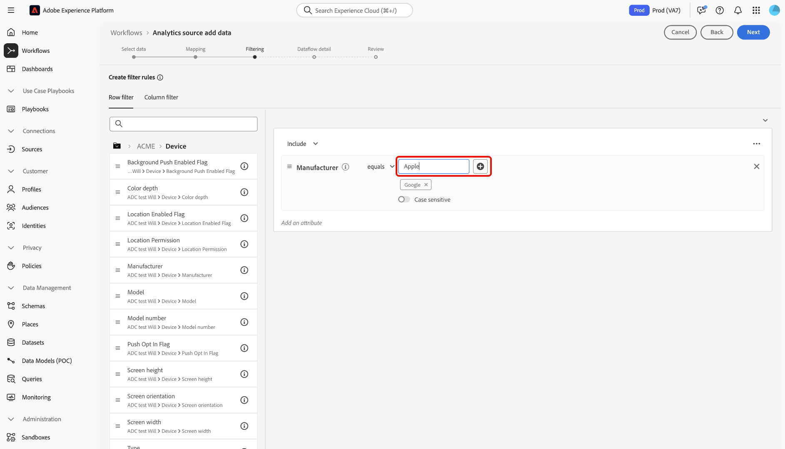
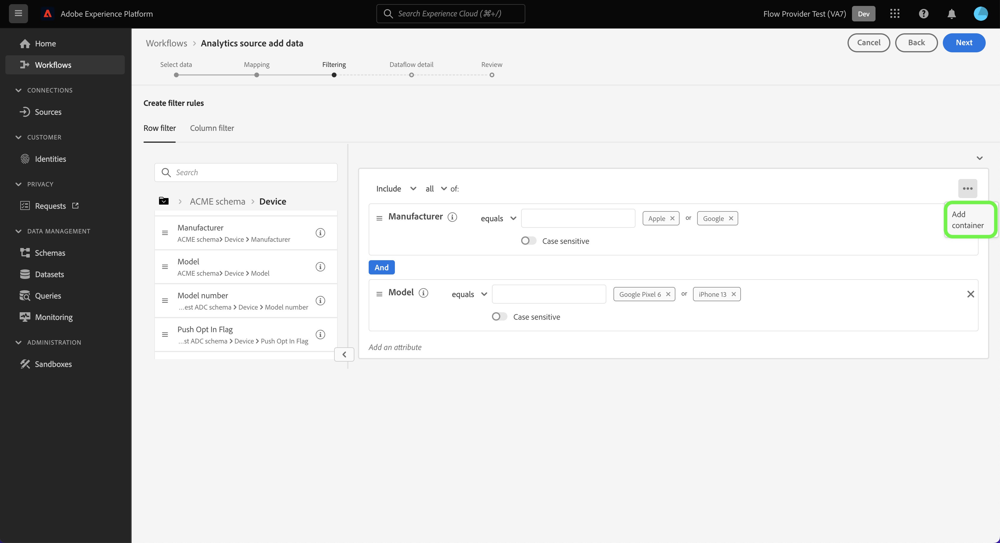

# Anslut Adobe Analytics till Experience Platform

Läs den här guiden och lär dig hur du använder Adobe Analytics-källan för att importera data från Analytics-rapporteringsprogramsviten till Adobe Experience Platform.

## Kom igång

Den här självstudiekursen kräver en fungerande förståelse av följande komponenter i Experience Platform:

* [Experience Data Model (XDM) System](../../../../../xdm/home.md): Det standardiserade ramverk som Experience Platform organiserar kundupplevelsedata med.
* [Kundprofil i realtid](../../../../../profile/home.md): Tillhandahåller en enhetlig konsumentprofil i realtid baserad på aggregerade data från flera källor.
* [Sandlådor](../../../../../sandboxes/home.md): Experience Platform tillhandahåller virtuella sandlådor som partitionerar en enda Experience Platform-instans till separata virtuella miljöer för att utveckla och utveckla program för digitala upplevelser.

### Nyckelterminologi

Det är viktigt att förstå följande nyckeltermer som används i hela det här dokumentet:

* **Standardattribut**: Standardattribut är alla attribut som är fördefinierade av Adobe. De har samma innebörd för alla kunder och är tillgängliga i källdata för analyser och i schemafältgrupper för analyser.
* **Anpassat attribut**: Anpassade attribut är alla attribut i den anpassade variabelhierarkin i Analytics. Anpassade attribut används i en Adobe Analytics-implementering för att samla in specifik information i en rapportserie, och de kan skilja sig åt när det gäller användningen från rapportsviten till rapportsviten. Anpassade attribut är eVars, props och lists. Mer information om eVars finns i följande [Analysdokumentation om konverteringsvariabler](https://experienceleague.adobe.com/docs/analytics/admin/admin-tools/conversion-variables/conversion-var-admin.html?lang=sv-SE).
* **Alla attribut i anpassade fältgrupper**: Attribut som härstammar från fältgrupper som skapats av kunder är användardefinierade och betraktas inte som standardattribut eller anpassade attribut.

## Navigera i källkatalogen

>[!NOTE]
>
>När du skapar ett datakällflöde för Analytics i en produktionssandlåda skapas två dataflöden:
>
>* Ett dataflöde som gör en 13-månaders efterfyllning av historiska rapportsvitdata till datasjön. Det här dataflödet avslutas när bakgrundsfyllningen är slutförd.
>* Ett dataflöde som skickar livedata till datavjön och till [!DNL Real-Time Customer Profile]. Det här dataflödet körs kontinuerligt.

I Experience Platform-gränssnittet väljer du **[!UICONTROL Sources]** i den vänstra navigeringen för att komma åt arbetsytan i [!UICONTROL Sources]. I kategorin *[!UICONTROL Adobe applications]* väljer du Adobe Analytics-kortet och sedan **[!UICONTROL Add data]**.

## Markera data

>[!IMPORTANT]
>
>* Rapportsviterna som visas på skärmen kan komma från olika regioner. Du ansvarar för att förstå begränsningar och skyldigheter för dina data och hur du använder dessa data i Adobe Experience Platform tvärregioner. Se till att ditt företag tillåter detta.
>* Data från flera rapportsviter kan bara aktiveras för kundprofilen i realtid om det inte finns några datakonflikter, till exempel två anpassade egenskaper (eVars, lists och props) som har olika innebörd.

En rapportsvit är en behållare med data som utgör grunden för analysrapporter. En organisation kan ha många rapportsviter, som alla innehåller olika datauppsättningar.

Du kan importera rapportsviter från valfri region (USA, Storbritannien eller Singapore) så länge de mappas till samma organisation som den Experience Platform-sandlådeinstans i vilken källanslutningen skapas. En rapportsvit kan bara importeras med ett enda aktivt dataflöde. Om en rapportsvit är grå och inte kan markeras har den redan importerats, antingen i sandlådan som du använder eller i en annan sandlåda.

Flera ingående anslutningar kan göras för att överföra flera rapportsviter till samma sandlåda. Om rapportsviterna har olika scheman för variabler (t.ex. eVars eller events), bör de mappas till specifika fält i de anpassade fältgrupperna och datakonflikter undviks med [Dataprep](../../../../../data-prep/ui/mapping.md). Rapportsviter kan bara läggas till i en enda sandlåda.

Välj **[!UICONTROL Report suite]** och använd sedan gränssnittet *[!UICONTROL Analytics source add data]* för att navigera i listan och identifiera den Analytics-rapportsvit som du vill importera till Experience Platform. Välj **[!UICONTROL Next]** om du vill fortsätta.

&lt;!—Rapportsviter för analyser kan konfigureras för en sandlåda i taget. Om du vill importera samma Report Suite till en annan sandlåda måste datauppsättningsflödet tas bort och instansieras igen via konfiguration för en annan sandlåda.—>

## Mappning {#mapping}

>[!IMPORTANT]
>
>Omformningar av dataförberedelser kan öka fördröjningen i det övergripande dataflödet. Den extra fördröjning som läggs till varierar beroende på komplexiteten i omvandlingslogiken.

Innan du kan mappa dina Analytics-data till ett XDM-målschema måste du först avgöra om du använder ett standardschema eller ett anpassat schema.

>[!BEGINTABS]

>[!TAB Standardschema]

Ett standardschema skapar ett nytt schema åt dig. Det nya schemat innehåller fältgruppen [!DNL Adobe Analytics ExperienceEvent Template]. Om du vill använda ett standardschema väljer du **[!UICONTROL Default schema]**.

>[!TAB Anpassat schema]

Med ett anpassat schema kan du välja vilket tillgängligt schema som helst för dina Analytics-data, så länge det schemat har fältgruppen [!DNL Adobe Analytics ExperienceEvent Template]. Om du vill använda ett anpassat schema väljer du **[!UICONTROL Custom schema]**.

>[!ENDTABS]

Använd gränssnittet *[!UICONTROL Mapping]* för att mappa källfält till lämpliga målschemafält. Du kan mappa anpassade variabler till nya schemafältgrupper och använda beräkningar som stöds av Data Prep. Välj ett målschema för att starta mappningsprocessen.

>[!TIP]
>
>Endast scheman som har fältgruppen [!DNL Adobe Analytics ExperienceEvent Template] visas på menyn för schemaval. Andra scheman utelämnas. Om det inte finns några lämpliga scheman tillgängliga för rapportsvitens data måste du skapa ett nytt schema. Mer information om hur du skapar scheman finns i guiden [skapa och redigera scheman i användargränssnittet](../../../../../xdm/ui/resources/schemas.md).

Du kan referera till [!UICONTROL Map standard fields]-panelen för mått på din [!UICONTROL Standard mappings applied]. [!UICONTROL Standard mappings with descriptor name conflicts] och [!DNL Custom mappings].

| Mappa standardfält | Beskrivning |
| --- | --- |
| [!UICONTROL Standard mappings applied] | På panelen [!UICONTROL Standard mappings applied] visas det totala antalet mappade attribut. Standardmappningar refererar till mappningar mellan alla attribut i Analytics-källdata och motsvarande attribut i Analytics-fältgruppen. Dessa är förmappade och kan inte redigeras. |
| [!UICONTROL Standard mappings with descriptor name conflicts] | Panelen [!UICONTROL Standard mappings with descriptor name conflicts] refererar till antalet mappade attribut som innehåller namnkonflikter. Dessa konflikter visas när du återanvänder ett schema som redan har en ifylld uppsättning fältbeskrivningar från en annan rapportserie. Du kan fortsätta med Analytics-dataflödet även med namnkonflikter. |
| [!UICONTROL Custom mappings] | På panelen [!UICONTROL Custom mappings] visas antalet mappade anpassade attribut, inklusive eVars, props och listor. Anpassade mappningar avser mappning mellan anpassade attribut i källanalysdata och attribut i anpassade fältgrupper som ingår i det valda schemat. |

### Standardmappningar {#standard-mappings}

Experience Platform identifierar automatiskt mappningen för eventuella namnkonflikter. Om det inte finns några konflikter med dina mappningar väljer du **[!UICONTROL Next]** för att fortsätta.

>[!TIP]
>
>Om det finns namnkonflikter mellan källrapportsviten och det valda schemat kan du fortfarande fortsätta med Analytics-dataflödet och bekräfta att fältbeskrivningarna inte kommer att ändras. Du kan också välja att skapa ett nytt schema med en tom uppsättning beskrivningar.

## Anpassade mappningar {#custom-mappings}

Du kan använda funktionen Dataförinställning för att lägga till nya anpassade mappningar eller beräkningsfält för anpassade attribut. Välj **[!UICONTROL Custom]** om du vill lägga till anpassade mappningar.

* **[!UICONTROL Filter fields]**: Använd textinmatningen [!UICONTROL Filter fields] för att filtrera efter specifika mappningsfält i mappningarna.
* **[!UICONTROL Add new mapping]**: Välj **[!UICONTROL Add new mapping]** om du vill lägga till ett nytt källfält och målfältsmappning.
* **[!UICONTROL Add calculated field]**: Om det behövs kan du välja **[!UICONTROL Add calculated field]** för att skapa ett nytt beräknat fält för dina mappningar.
* **[!UICONTROL Import mapping]**: Du kan minska den manuella konfigurationstiden för dataöverföringsprocessen och begränsa antalet misstag genom att använda importmappningsfunktionen i Data Prep. Välj **[!UICONTROL Import mapping]** om du vill importera mappningar från ett befintligt flöde eller från en exporterad fil. Mer information finns i [handboken om import och export av mappningar](../../../../../data-prep/ui/mapping.md#import-mapping).
* **[!UICONTROL Download template]**: Du kan även hämta en CSV-kopia av dina mappningar och konfigurera dina mappningar på den lokala enheten. Välj **[!UICONTROL Download template]** om du vill hämta en CSV-kopia av dina mappningar. Du måste se till att du bara använder de fält som finns i källfilen och målschemat.

Mer information om dataprep finns i följande dokumentation.

* [Översikt över datapreflight](../../../../../data-prep/home.md)
* [Funktioner för datapersonmappning](../../../../../data-prep/functions.md)
* [Lägg till beräknade fält](../../../../../data-prep/ui/mapping.md#calculated-fields)

<!-- 
To use Data Prep functions and add new mapping or calculated fields for custom attributes, select **[!UICONTROL View custom mappings]**.

Next, select **[!UICONTROL Add new mapping]**.

Depending on your needs, you can select either **[!UICONTROL Add new mapping]** or **[!UICONTROL Add calculated field]** from the options that appear. 

An empty mapping set appears. Select the mapping icon to add a source field.

You can use the interface to navigate through the source schema structure and identify the new source field that you want to use. Once you have selected the source field that you want to map, select **[!UICONTROL Select]**.

Next, select the mapping icon under [!UICONTROL Target Field] to map your selected source field to its appropriate target field.

Similar to the source schema, you can use the interface to navigate through the target schema structure and select the target field you want to map to. Once you have selected the appropriate target field, select **[!UICONTROL Select]**.

With your custom mapping set completed, select **[!UICONTROL Next]** to proceed.

 -->

## Filtrera efter kundprofil i realtid {#filtering-for-profile}

>[!CONTEXTUALHELP]
>id="platform_data_prep_analytics_filtering"
>title="Skapa filterregler"
>abstract="Definiera filtreringsregler på rad- och kolumnnivå när du skickar data till kundprofilen i realtid. Använd filtrering på radnivå för att tillämpa villkor och bestämma vilka data som ska inkluderas i **profilåtkomsten**. Använd filtrering på kolumnnivå för att markera de datakolumner som du vill **exkludera för profilinmatning**. Filtreringsreglerna gäller inte för data som skickas till datasjön."

När du har slutfört mappningar för data i Analytics-rapportsviten kan du tillämpa filtreringsregler och -villkor för att selektivt inkludera eller exkludera data från förtäring i kundprofilen i realtid. Stöd för filtrering är bara tillgängligt för Analytics-data och data filtreras bara innan [!DNL Profile.] anges Alla data hämtas till datasjön.

>[!BEGINSHADEBOX]

**Ytterligare information om Data Prep och filtrering av analysdata för kundprofil i realtid**

* Du kan använda filterfunktionen för data som ska gå till Profil, men inte för data som ska gå till datasjön.
* Du kan använda filtrering för livedata, men du kan inte filtrera data för bakåtfyllnad.
   * Analyskällan återfyller inte data i profilen.
* Om du använder dataförberedelsekonfigurationer under den första konfigurationen av ett Analytics-flöde, tillämpas även dessa ändringar på den automatiska 13-månaders bakåtfyllnaden.
   * Detta gäller dock inte för filtrering eftersom filtrering bara är reserverat för livedata.
* Data Prep används för både direktuppspelning och batchingång. Om du ändrar en befintlig Data Prep-konfiguration tillämpas dessa ändringar sedan på nya inkommande data på både direktuppspelnings- och batchinförselvägar.
   * Data Prep-konfigurationer gäller dock inte data som redan har importerats till Experience Platform, oavsett om det är direktuppspelnings- eller gruppdata.
* Standardattribut från Analytics mappas alltid automatiskt. Därför kan du inte använda omformningar på standardattribut.
   * Du kan dock filtrera bort standardattribut så länge de inte krävs i identitetstjänsten eller profilen.
* Du kan inte använda filtrering på kolumnnivå för att filtrera obligatoriska fält och identitetsfält.
* Du kan filtrera bort sekundära identiteter, särskilt AAID och AACustomID, men du kan inte filtrera bort ECID.
* När ett omformningsfel inträffar resulterar motsvarande kolumn i NULL.

>[!ENDSHADEBOX]

### Filtrering på radnivå

>[!IMPORTANT]
>
>Använd filtrering på radnivå för att tillämpa villkor och bestämma vilka data som ska inkluderas i **profilåtkomsten**. Använd filtrering på kolumnnivå för att markera de datakolumner som du vill **exkludera för profilinmatning**.

Du kan filtrera data för profilinmatning på rad- och kolumnnivå. Använd filtrering på radnivå för att definiera villkor som strängen innehåller, är lika med, börjar eller slutar med. Du kan också använda filtrering på radnivå för att koppla villkor med hjälp av `AND` och `OR` samt för att negera villkor med hjälp av `NOT`.

Om du vill filtrera dina Analytics-data på radnivå markerar du **[!UICONTROL Row filter]** och använder den vänstra listen för att navigera i schemahierarkin och identifiera det schemaattribut som du vill välja.

När du har identifierat attributet som du vill konfigurera markerar du och drar attributet från den vänstra listen till filtreringspanelen.

Om du vill konfigurera olika villkor väljer du **[!UICONTROL equals]** och väljer sedan ett villkor i listrutan som visas.

Listan över konfigurerbara villkor omfattar:

* [!UICONTROL equals]
* [!UICONTROL does not equal]
* [!UICONTROL starts with]
* [!UICONTROL ends with]
* [!UICONTROL does not end with]
* [!UICONTROL contains]
* [!UICONTROL does not contain]
* [!UICONTROL exists]
* [!UICONTROL does not exist]

Ange sedan de värden som du vill inkludera baserat på det attribut som du har valt. I exemplet nedan är [!DNL Apple] och [!DNL Google] markerade för förtäring som en del av attributet **[!UICONTROL Manufacturer]**.

Om du vill specificera filtervillkoren ytterligare lägger du till ett attribut från schemat och lägger sedan till värden baserade på det attributet. I exemplet nedan läggs attributet **[!UICONTROL Model]** till och modeller som [!DNL iPhone 16] och [!DNL Google Pixel 9] filtreras för förtäring.

Om du vill lägga till en ny behållare markerar du ellipserna (`...`) högst upp till höger i filtreringsgränssnittet och väljer sedan **[!UICONTROL Add container]**.

När en ny behållare har lagts till väljer du **[!UICONTROL Include]** och sedan **[!UICONTROL Exclude]** i listrutan. Lägg till de attribut och värden som du vill utesluta och välj sedan **[!UICONTROL Next]** när du är klar.

### Filtrering på kolumnnivå

Välj **[!UICONTROL Column filter]** i rubriken om du vill använda filtrering på kolumnnivå.

Sidan uppdateras till ett interaktivt schematräd och visar dina schemaattribut på kolumnnivå. Här kan du välja de datakolumner som du vill utesluta från profilåtkomsten. Du kan också expandera en kolumn och välja särskilda attribut för uteslutning.

Som standard går alla analyser till Profil och den här processen gör att grenar av XDM-data kan uteslutas från profilåtkomsten.

### Filtrera sekundära identiteter

Använd ett kolumnfilter för att exkludera sekundära identiteter från profilåtkomsten. Om du vill filtrera sekundära identiteter väljer du **[!UICONTROL Column filter]** och sedan **[!UICONTROL _identities]**.

Filtret används bara när en identitet markeras som sekundär. Om identiteter väljs, men en händelse kommer med en av identiteterna som markerats som primär, filtreras inte dessa bort.

### Ange information om dataflöde

Steget **[!UICONTROL Dataflow detail]** visas, där du måste ange ett namn och en valfri beskrivning av dataflödet. Välj **[!UICONTROL Next]** när du är klar.

### Granska

Steg [!UICONTROL Review] visas, så att du kan granska det nya Analytics-dataflödet innan det skapas. Detaljerna om anslutningen är grupperade efter kategorier, inklusive:

* [!UICONTROL Connection]: Visar anslutningens källplattform.
* [!UICONTROL Data type]: Visar den markerade rapportsviten och dess motsvarande rapportSuite-ID.

## Övervaka dataflödet {#monitor-your-dataflow}

När dataflödet är klart kan du använda gränssnittet *[!UICONTROL Dataflows]* för att övervaka statusen för Analytics-dataflödet.

Använd gränssnittet [!UICONTROL Dataset activity] om du vill ha information om förloppet för data som skickas från Analytics till Experience Platform. Gränssnittet visar mätvärden, t.ex. summan av poster under föregående månad, summan av importerade poster under de senaste sju dagarna och storleken på data under föregående månad.

Källan instansierar två datauppsättningsflöden. Det ena flödet representerar data för bakåtfyllnad och det andra för livedata. Bakgrundsfyllningsdata är inte konfigurerade för konsumtion i realtid men skickas till datasjön för analytiska och datavetenskapliga användningsfall.

Mer information om bakåtfyllnad, livedata och deras respektive latenser finns i [Översikt över analyskällan](../../../../connectors/adobe-applications/analytics.md).

>[!NOTE]
>
>Aktivitetssidan för datauppsättningen visar ingen information om batchar eftersom källkopplingen för Analytics hanteras helt av Adobe. Ni kan övervaka att data flödar genom att titta på mätvärdena runt inkapslade poster.

## Ta bort ditt dataflöde {#delete-dataflow}

Om du vill ta bort Analytics-dataflödet väljer du **[!UICONTROL Dataflows]** i det övre huvudet på källarbetsytan. Använd dataflödessidan för att hitta Analytics-dataflödet som du vill ta bort och markera sedan ellipserna (`...`) bredvid det. Använd sedan listrutan och välj **[!UICONTROL Delete]**.

* Om du tar bort liveanalysdataflödet tas även dess underliggande datauppsättning bort.
* Om du tar bort dataflödet för bakåtfyllnad i Analytics tas den underliggande datauppsättningen inte bort, men processen för bakåtfyllnad stoppas för motsvarande rapportserie. Om du tar bort dataflödet för bakåtfyllnad kan inkapslade data fortfarande visas via datauppsättningen.

## Nästa steg och ytterligare resurser

När anslutningen har skapats skapas dataflödet automatiskt för att innehålla inkommande data och fylla i en datauppsättning med det valda schemat. Dessutom sker datainfyllning och inmatning av historiska data i upp till 13 månader. När det inledande intaget är slutfört kan Analytics-data användas av Experience Platform-tjänster längre fram i kedjan, till exempel [!DNL Real-Time Customer Profile] och segmenteringstjänsten. Mer information finns i följande dokument:

* [[!DNL Real-Time Customer Profile] översikt](../../../../../profile/home.md)
* [[!DNL Segmentation Service] översikt](../../../../../segmentation/home.md)
* [[!DNL Data Science Workspace] översikt](../../../../../data-science-workspace/home.md)
* [[!DNL Query Service] översikt](../../../../../query-service/home.md)

Följande video är tänkt att ge stöd för din förståelse av datainhämtning med Adobe Analytics Source-kontakten:

>[!WARNING]
>
> Användargränssnittet [!DNL Experience Platform] som visas i följande video är inaktuellt. Läs dokumentationen ovan för de senaste skärmbilderna och funktionerna i användargränssnittet.

>[!VIDEO](https://video.tv.adobe.com/v/3430253?quality=12&learn=on&captions=swe)

