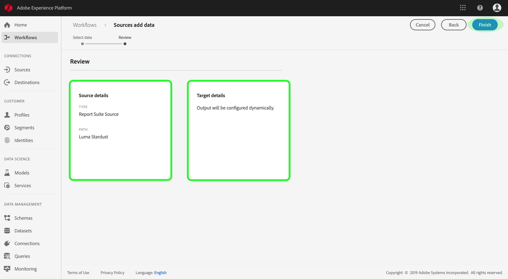

# Skapa en källanslutning för Adobe Analytics i användargränssnittet

I den här självstudiekursen beskrivs hur du skapar en Adobe Analytics-källanslutning i användargränssnittet för att överföra konsumentdata till Adobe Experience Platform.

## Skapa en källanslutning med Adobe Analytics

Logga in på <a href="https://platform.adobe.com" target="_blank">Adobe Experience Platform</a> och välj sedan **Källor** i det vänstra navigeringsfältet för att komma åt källarbetsytan. På *katalogskärmen* visas tillgängliga källor för att skapa bundna anslutningar med, och varje källa visar antalet befintliga anslutningar som är kopplade till dem. Välj alternativet för **Adobe Analytics** och klicka sedan på **Visa källa** för att se alla etablerade bundna anslutningar till den.

På aktivitetsskärmen *Källa* visas alla tidigare upprättade anslutningar till Adobe Analytics. Du kan skapa en ny anslutning genom att klicka på **Välj data**.

>[!NOTE] Flera in-bound-anslutningar till en källa kan göras för att hämta olika data.

I listan med tillgängliga rapportsviter väljer du den som du vill hämta till plattformen och klickar på **Nästa**.

>[!NOTE] Endast en rapportsvit kan väljas per Analytics-källanslutning. Dessutom kan bara en rapportserie finnas i en sandlåda.

Steget *Granska* visas, så att du kan granska din nya ingående Analytics-anslutning innan den skapas. Detaljerna om anslutningen är grupperade efter kategorier, inklusive:

* *Källinformation*: Visar typen av källanslutning och den valda rapportsviten.
* *Målinformation*: När du skapar andra källanslutningar visar den här behållaren vilka data som källdata hämtas till, inklusive det schema som datauppsättningen följer. Analysdata mappas automatiskt och hämtas in i kundprofiler i realtid.

## Nästa steg

När anslutningen har skapats skapas ett målschema och en datauppsättning automatiskt som innehåller inkommande data. Dessutom sker datainfyllning och inmatning av historiska data i upp till 13 månader. När det första intaget är klart, ska analysdata användas av plattformstjänster längre fram i kedjan, som kundprofil i realtid och segmenteringstjänst. Mer information finns i följande dokument:

* [Översikt över kundprofiler i realtid](../../../../../profile/home.md)
* [Översikt över segmenteringstjänsten](../../../../../segmentation/home.md)
* [Översikt över arbetsytan Datavetenskap](../../../../../data-science-workspace/home.md)
* [Översikt över frågetjänsten](../../../../../query-service/home.md)

