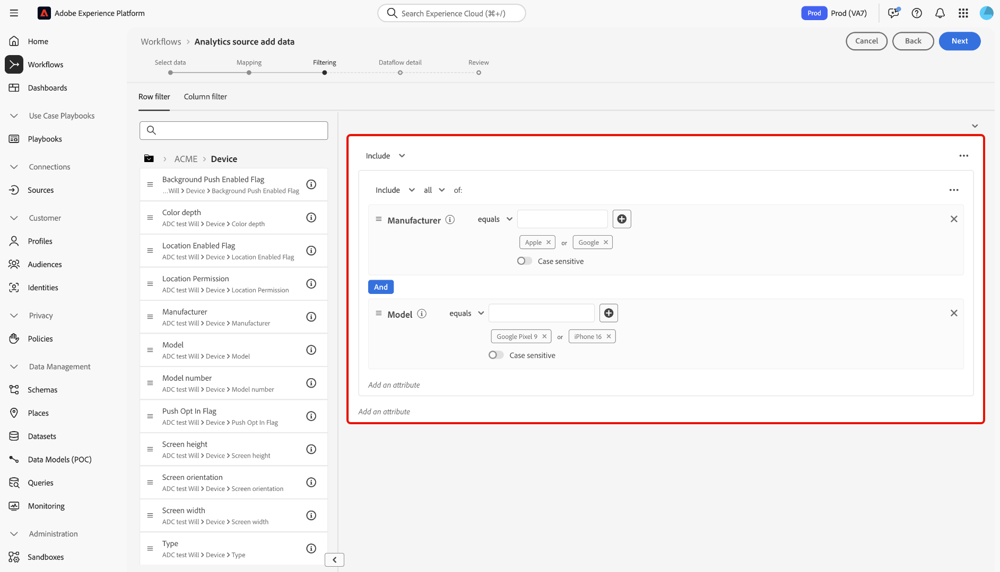

# Skapa en Adobe Analytics-källanslutning i användargränssnittet

I den här självstudiekursen beskrivs hur du skapar en Adobe Analytics-källanslutning i användargränssnittet för att överföra data från Adobe Analytics rapportsvit till Adobe Experience Platform.

## Komma igång

Den här självstudiekursen kräver en fungerande förståelse av följande komponenter i Experience Platform:

* [XDM-system (Experience Data Model)](../../../../../xdm/home.md): Det standardiserade ramverk som Experience Platform använder för att ordna kundupplevelsedata.
* [Kundprofil i realtid](../../../../../profile/home.md): Tillhandahåller en enhetlig konsumentprofil i realtid baserad på aggregerade data från flera källor.
* [Sandlådor](../../../../../sandboxes/home.md): Experience Platform tillhandahåller virtuella sandlådor som partitionerar en enda plattformsinstans till separata virtuella miljöer för att utveckla och utveckla program för digitala upplevelser.

### Nyckelterminologi

Det är viktigt att förstå följande nyckeltermer som används i hela det här dokumentet:

* **Standardattribut**: Standardattribut är alla attribut som är fördefinierade av Adobe. De innehåller samma innebörd för alla kunder och är tillgängliga i [!DNL Analytics]-källdata och [!DNL Analytics]-schemafältgrupper.
* **Anpassat attribut**: Anpassade attribut är alla attribut i den anpassade variabelhierarkin i [!DNL Analytics]. Anpassade attribut används i en Adobe Analytics-implementering för att samla in specifik information i en rapportserie, och de kan skilja sig åt när det gäller användningen från rapportsviten till rapportsviten. Anpassade attribut är eVars, props och lists. Mer information om eVars finns i följande [[!DNL Analytics] dokumentation om konverteringsvariabler](https://experienceleague.adobe.com/docs/analytics/admin/admin-tools/conversion-variables/conversion-var-admin.html).
* **Alla attribut i anpassade fältgrupper**: Attribut som härstammar från fältgrupper som skapats av kunder är användardefinierade och betraktas inte som standardattribut eller anpassade attribut.
* **Eget namn**: Eget namn är etiketter som tillhandahålls av människor för anpassade variabler i en [!DNL Analytics]-implementering. Mer information om egna namn finns i följande [[!DNL Analytics] dokumentation om konverteringsvariabler](https://experienceleague.adobe.com/docs/analytics/admin/admin-tools/conversion-variables/conversion-var-admin.html).

## Skapa en källanslutning med Adobe Analytics

>[!NOTE]
>
>När du skapar ett datakällflöde för Analytics i en produktionssandlåda skapas två dataflöden:
>
>* Ett dataflöde som gör en 13-månaders efterfyllning av historiska rapportsvitdata till datasjön. Det här dataflödet avslutas när bakgrundsfyllningen är slutförd.
>* Ett dataflöde som skickar livedata till datavjön och till [!DNL Real-Time Customer Profile]. Det här dataflödet körs kontinuerligt.

I plattformsgränssnittet väljer du **[!UICONTROL Sources]** i den vänstra navigeringen för att komma åt arbetsytan i [!UICONTROL Sources]. På skärmen [!UICONTROL Catalog] visas en mängd olika källor som du kan skapa ett konto med.

Du kan välja lämplig kategori i katalogen till vänster på skärmen. Du kan också använda sökfältet för att begränsa vilka källor som visas.

Under kategorin **[!UICONTROL Adobe applications]** väljer du **[!UICONTROL Adobe Analytics]** och sedan **[!UICONTROL Add data]**.

### Markera data

>[!IMPORTANT]
>
>Rapportsviterna som visas på skärmen kan komma från olika regioner. Du ansvarar för att förstå begränsningar och skyldigheter för dina data och hur du använder dessa data i Adobe Experience Platform tvärregioner. Se till att ditt företag tillåter detta.

Steget **[!UICONTROL Analytics source add data]** ger dig en lista över [!DNL Analytics] rapportsvitsdata som du kan skapa en källanslutning med.

En rapportsvit är en behållare med data som utgör grunden för [!DNL Analytics]-rapportering. En organisation kan ha många rapportsviter, som alla innehåller olika datauppsättningar.

Du kan importera rapportsviter från alla regioner (USA, Storbritannien och Singapore) så länge de mappas till samma organisation som den Experience Platform sandlådeinstans i vilken källanslutningen skapas. En rapportsvit kan bara importeras med ett enda aktivt dataflöde. En rapportsvit som inte kan markeras har redan importerats, antingen i sandlådan som du använder eller i en annan sandlåda.

Flera ingående anslutningar kan göras för att överföra flera rapportsviter till samma sandlåda. Om rapportsviterna har olika scheman för variabler (t.ex. eVars eller events), bör de mappas till specifika fält i de anpassade fältgrupperna och datakonflikter undviks med [Dataprep](../../../../../data-prep/ui/mapping.md). Rapportsviter kan bara läggas till i en enda sandlåda.

>[!NOTE]
>
>Data från flera rapportsviter kan bara aktiveras för kundprofilen i realtid om det inte finns några datakonflikter, till exempel två anpassade egenskaper (eVars, lists och props) som har olika innebörd.

Om du vill skapa en [!DNL Analytics]-källanslutning markerar du en rapportsvit och väljer sedan **[!UICONTROL Next]** för att fortsätta.

&lt;!—Rapportsviter för analyser kan konfigureras för en sandlåda i taget. Om du vill importera samma Report Suite till en annan sandlåda måste datauppsättningsflödet tas bort och instansieras igen via konfiguration för en annan sandlåda.—>

### Mappning

>[!IMPORTANT]
>
>Omformningar av dataförberedelser kan öka fördröjningen i det övergripande dataflödet. Den extra fördröjning som läggs till varierar beroende på komplexiteten i omvandlingslogiken.

Innan du kan mappa dina [!DNL Analytics]-data till ett XDM-målschema måste du först välja om du använder ett standardschema eller ett anpassat schema.

Ett standardschema skapar ett nytt schema åt dig, som innehåller fältgruppen [!DNL Adobe Analytics ExperienceEvent Template]. Om du vill använda ett standardschema väljer du **[!UICONTROL Default schema]**.

Med ett anpassat schema kan du välja valfritt tillgängligt schema för dina [!DNL Analytics]-data, så länge som schemat har fältgruppen [!DNL Adobe Analytics ExperienceEvent Template]. Om du vill använda ett anpassat schema väljer du **[!UICONTROL Custom schema]**.

Sidan [!UICONTROL Mapping] innehåller ett gränssnitt för att mappa källfält till lämpliga målschemafält. Härifrån kan du mappa anpassade variabler till nya schemafältgrupper och använda beräkningar som stöds av Data Prep. Välj ett målschema för att starta mappningsprocessen.

>[!TIP]
>
>Endast scheman som har fältgruppen [!DNL Adobe Analytics ExperienceEvent Template] visas på menyn för schemaval. Andra scheman utelämnas. Om det inte finns några lämpliga scheman tillgängliga för dina Report Suite-data måste du skapa ett nytt schema. Mer information om hur du skapar scheman finns i guiden [skapa och redigera scheman i användargränssnittet](../../../../../xdm/ui/resources/schemas.md).

I avsnittet [!UICONTROL Map standard fields] visas paneler för [!UICONTROL Standard mappings applied], [!UICONTROL Non matching standard mappings] och [!UICONTROL Custom mappings]. Se följande tabell för specifik information om varje kategori:

| Mappa standardfält | Beskrivning |
| --- | --- |
| [!UICONTROL Standard mappings applied] | På panelen [!UICONTROL Standard mappings applied] visas det totala antalet mappade attribut. Standardmappningar refererar till mappningsuppsättningar mellan alla attribut i [!DNL Analytics]-källdata och motsvarande attribut i [!DNL Analytics]-fältgruppen. Dessa är förmappade och kan inte redigeras. |
| [!UICONTROL Non matching standard mappings] | Panelen [!UICONTROL Non matching standard mappings] refererar till antalet mappade attribut som innehåller egna namnkonflikter. Dessa konflikter visas när du återanvänder ett schema som redan har en ifylld uppsättning fältbeskrivningar från en annan rapportserie. Du kan fortsätta med ditt [!DNL Analytics]-dataflöde även med egna namnkonflikter. |
| [!UICONTROL Custom mappings] | På panelen [!UICONTROL Custom mappings] visas antalet mappade anpassade attribut, inklusive eVars, props och listor. Anpassade mappningar refererar till mappningsuppsättningar mellan anpassade attribut i [!DNL Analytics]-källdata och attribut i anpassade fältgrupper som ingår i det valda schemat. |

Om du vill förhandsgranska schemafältgruppen [!DNL Analytics] för ExperienceEvent-mallen väljer du **[!UICONTROL View]** på panelen [!UICONTROL Standard mappings applied].

Sidan [!UICONTROL Adobe Analytics ExperienceEvent Template Schema Field Group] innehåller ett gränssnitt som du kan använda för att inspektera schemats struktur. När du är klar väljer du **[!UICONTROL Close]**.

Plattformen identifierar automatiskt dina mappningsuppsättningar för eventuella egna namnkonflikter. Om det inte finns några konflikter med dina mappningsuppsättningar väljer du **[!UICONTROL Next]** för att fortsätta.

>[!TIP]
>
>Om det finns egna namnkonflikter mellan din käll-Report Suite och ditt valda schema kan du fortfarande fortsätta med ditt [!DNL Analytics]-dataflöde och bekräfta att fältbeskrivningarna inte kommer att ändras. Du kan också välja att skapa ett nytt schema med en tom uppsättning beskrivningar.

#### Anpassade mappningar

Du kan använda funktionen Dataförinställning för att lägga till ny anpassad mappning eller beräknade fält för anpassade attribut. Välj **[!UICONTROL Custom]** om du vill lägga till anpassade mappningar.

Beroende på dina behov kan du välja **[!UICONTROL Add new mapping]** eller **[!UICONTROL Add calculated field]** och fortsätta att skapa anpassade mappningar för dina anpassade attribut. Mer information om hur du använder dataförberedelsefunktioner finns i [Användargränssnittshandboken för dataförberedelser](../../../../../data-prep/ui/mapping.md).

I följande dokumentation finns mer information om dataprep, beräkningsfält och mappningsfunktioner:

* [Översikt över datapreflight](../../../../../data-prep/home.md)
* [Funktioner för datapersonmappning](../../../../../data-prep/functions.md)
* [Lägg till beräknade fält](../../../../../data-prep/ui/mapping.md#calculated-fields)

<!-- 
To use Data Prep functions and add new mapping or calculated fields for custom attributes, select **[!UICONTROL View custom mappings]**.

Next, select **[!UICONTROL Add new mapping]**.

Depending on your needs, you can select either **[!UICONTROL Add new mapping]** or **[!UICONTROL Add calculated field]** from the options that appear. 

An empty mapping set appears. Select the mapping icon to add a source field.

You can use the interface to navigate through the source schema structure and identify the new source field that you want to use. Once you have selected the source field that you want to map, select **[!UICONTROL Select]**.

Next, select the mapping icon under [!UICONTROL Target Field] to map your selected source field to its appropriate target field.

Similar to the source schema, you can use the interface to navigate through the target schema structure and select the target field you want to map to. Once you have selected the appropriate target field, select **[!UICONTROL Select]**.

With your custom mapping set completed, select **[!UICONTROL Next]** to proceed.

 -->

## Filtrera efter kundprofil i realtid {#filtering-for-profile}

>[!CONTEXTUALHELP]
>id="platform_data_prep_analytics_filtering"
>title="Skapa filterregler"
>abstract="Definiera filtreringsregler på rad- och kolumnnivå när du skickar data till kundprofilen i realtid. Använd filtrering på radnivå för att tillämpa villkor och bestämma vilka data som ska inkluderas i **profilåtkomsten**. Använd filtrering på kolumnnivå för att markera de datakolumner som du vill **exkludera för profilinmatning**. Filtreringsreglerna gäller inte för data som skickas till datasjön."

När du har slutfört mappningar för dina [!DNL Analytics]-rapportsvitdata kan du tillämpa filtreringsregler och -villkor för att selektivt inkludera eller exkludera data från inmatning till kundprofilen i realtid. Stöd för filtrering är bara tillgängligt för [!DNL Analytics]-data och data filtreras bara innan [!DNL Profile.] alla data hämtas till datasjön.

>[!BEGINSHADEBOX]

**Ytterligare information om Data Prep och filtrering av analysdata för kundprofil i realtid**

* Du kan använda filterfunktionen för data som ska gå till Profil, men inte för data som ska gå till datasjön.
* Du kan använda filtrering för livedata, men du kan inte filtrera data för bakåtfyllnad.
   * [!DNL Analytics]-källan återfyller inte data i profilen.
* Om du använder dataförberedelsekonfigurationer under den första konfigurationen av ett [!DNL Analytics]-flöde, tillämpas även dessa ändringar på den automatiska 13-månaders bakåtfyllnaden.
   * Detta gäller dock inte för filtrering eftersom filtrering bara är reserverat för livedata.
* Data Prep används för både direktuppspelning och batchingång. Om du ändrar en befintlig Data Prep-konfiguration tillämpas dessa ändringar sedan på nya inkommande data på både direktuppspelnings- och batchinförselvägar.
   * Data Prep-konfigurationer gäller dock inte data som redan har importerats till Experience Platform, oavsett om det är direktuppspelnings- eller gruppdata.
* Standardattribut från Analytics mappas alltid automatiskt. Därför kan du inte använda omformningar på standardattribut.
   * Du kan dock filtrera bort standardattribut så länge de inte krävs i identitetstjänsten eller profilen.
* Du kan inte använda filtrering på kolumnnivå för att filtrera obligatoriska fält och identitetsfält.
* Du kan filtrera bort sekundära identiteter, särskilt AAID och AACustomID, men du kan inte filtrera bort ECID.
* När ett omformningsfel inträffar resulterar motsvarande kolumn i NULL.

>[!ENDSHADEBOX]

### Filtrering på radnivå

>[!IMPORTANT]
>
>Använd filtrering på radnivå för att tillämpa villkor och bestämma vilka data som ska inkluderas i **profilåtkomsten**. Använd filtrering på kolumnnivå för att markera de datakolumner som du vill **exkludera för profilinmatning**.

Du kan filtrera data för [!DNL Profile]-konsumtion på rad- och kolumnnivå. Med filtrering på radnivå kan du definiera villkor som strängen innehåller, är lika med, börjar eller slutar med. Du kan också använda filtrering på radnivå för att koppla villkor med hjälp av `AND` och `OR` samt för att negera villkor med hjälp av `NOT`.

Om du vill filtrera dina [!DNL Analytics]-data på radnivå väljer du **[!UICONTROL Row filter]**.

Använd den vänstra listen för att navigera i schemahierarkin och välj det schemaattribut du vill ha för att ytterligare detaljgranska ett visst schema.

När du har identifierat attributet som du vill konfigurera markerar du och drar attributet från den vänstra listen till filtreringspanelen.

Om du vill konfigurera olika villkor väljer du **[!UICONTROL equals]** och väljer sedan ett villkor i listrutan som visas.

Listan över konfigurerbara villkor omfattar:

* [!UICONTROL equals]
* [!UICONTROL does not equal]
* [!UICONTROL starts with]
* [!UICONTROL ends with]
* [!UICONTROL does not end with]
* [!UICONTROL contains]
* [!UICONTROL does not contain]
* [!UICONTROL exists]
* [!UICONTROL does not exist]

Ange sedan de värden som du vill inkludera baserat på det attribut som du har valt. I exemplet nedan är [!DNL Apple] och [!DNL Google] markerade för förtäring som en del av attributet **[!UICONTROL Manufacturer]**.

Om du vill specificera filtervillkoren ytterligare lägger du till ett attribut från schemat och lägger sedan till värden baserade på det attributet. I exemplet nedan läggs attributet **[!UICONTROL Model]** till och modeller som [!DNL iPhone 13] och [!DNL Google Pixel 6] filtreras för förtäring.

Om du vill lägga till en ny behållare markerar du ellipserna (`...`) högst upp till höger i filtreringsgränssnittet och väljer sedan **[!UICONTROL Add container]**.

När en ny behållare har lagts till väljer du **[!UICONTROL Include]** och sedan **[!UICONTROL Exclude]** i listrutan som visas.

Slutför sedan samma process genom att dra schemaattribut och lägga till deras motsvarande värden som du vill utesluta från filtreringen. I exemplet nedan filtreras [!DNL iPhone 12], [!DNL iPhone 12 mini] och [!DNL Google Pixel 5] från exkludering från attributet **[!UICONTROL Model]**, liggande utelämnas från **[!UICONTROL Screen orientation]** och modellnummer [!DNL A1633] exkluderas från **[!UICONTROL Model number]**.

När du är klar väljer du **[!UICONTROL Next]**.

### Filtrering på kolumnnivå

Välj **[!UICONTROL Column filter]** i rubriken om du vill använda filtrering på kolumnnivå.

Sidan uppdateras till ett interaktivt schematräd och visar dina schemaattribut på kolumnnivå. Härifrån kan du markera de datakolumner som du vill utesluta från [!DNL Profile]-importen. Du kan också expandera en kolumn och välja särskilda attribut för uteslutning.

Som standard går alla [!DNL Analytics] till [!DNL Profile] och den här processen tillåter att grenar av XDM-data utesluts från [!DNL Profile]-intaget.

När du är klar väljer du **[!UICONTROL Next]**.

### Filtrera sekundära identiteter

Använd ett kolumnfilter för att exkludera sekundära identiteter från profilåtkomsten. Om du vill filtrera sekundära identiteter väljer du **[!UICONTROL Column filter]** och sedan **[!UICONTROL _identities]**.

Filtret används bara när en identitet markeras som sekundär. Om identiteter väljs, men en händelse kommer med en av identiteterna som markerats som primär, filtreras inte dessa bort.

### Ange information om dataflöde

Steget **[!UICONTROL Dataflow detail]** visas, där du måste ange ett namn och en valfri beskrivning av dataflödet. Välj **[!UICONTROL Next]** när du är klar.

### Granska

Steg [!UICONTROL Review] visas, så att du kan granska det nya Analytics-dataflödet innan det skapas. Detaljerna om anslutningen är grupperade efter kategorier, inklusive:

* [!UICONTROL Connection]: Visar anslutningens källplattform.
* [!UICONTROL Data type]: Visar den markerade rapportsviten och dess motsvarande rapportSuite-ID.

## Övervaka dataflödet {#monitor-your-dataflow}

När dataflödet är klart väljer du **[!UICONTROL Dataflows]** i källkatalogen för att övervaka aktiviteten och statusen för dina data.

En lista över befintliga Analytics-dataflöden i organisationen visas. Här väljer du en måldatauppsättning för att visa dess respektive inmatningsaktivitet.

Sidan [!UICONTROL Dataset activity] innehåller information om förloppet för data som skickas från Analytics till Experience Platform. Gränssnittet visar mätvärden som antal importerade poster, antal inkapslade batchar och antal misslyckade batchar.

Källan instansierar två datauppsättningsflöden. Det ena flödet representerar data för bakåtfyllnad och det andra för livedata. Bakgrundsfyllningsdata är inte konfigurerade för konsumtion i realtid men skickas till datasjön för analytiska och datavetenskapliga användningsfall.

Mer information om bakåtfyllnad, livedata och deras respektive latenser finns i [Översikt över analyskällan](../../../../connectors/adobe-applications/analytics.md).

+++Visa enskilda batchar med det äldre övervakningsgränssnittet

Aktivitetssidan för datauppsättningen visar ingen lista över enskilda grupper. Om du vill visa en lista med enskilda grupper väljer du ett diagram i aktivitetsgränssnittet för datauppsättningen.

Du dirigeras till kontrollpanelen Övervakning. Välj sedan **[!UICONTROL ONLY INGEST FAILURES: YES]** för att rensa filtret och visa en lista över enskilda batchar.

Gränssnittet uppdateras till en lista över enskilda grupper, inklusive information om deras respektive mätvärden.

| Mätvärden | Beskrivning |
| --- | --- |
| Batch-ID | ID:t för en angiven batch. Det här värdet genereras internt. |
| Namn på datauppsättning | Namnet på en given datauppsättning som används för Analytics-data. |
| Source | Källan till inkapslade data. |
| Uppdaterat | Datumet för den senaste flödeskörningen. |
| Poster i datauppsättning | Det totala antalet poster i datauppsättningen. **Obs!**: Den här parametern visar ibland statusen `in-progress`. Den här statusen anger att processen för postinmatning inte har slutförts än. |
| Nya profilfragment | Det totala antalet nya profilfragment som har importerats. |
| Befintliga profilfragment | Det totala antalet befintliga profilfragment. |
| Sammanfogade identitetsposter | Det totala antalet identitetsposter som sammanfogats efter intag. |
| Poster i profil | Det totala antalet poster som har importerats till kundprofilen i realtid. |

{style="table-layout:auto"}

+++

## Nästa steg och ytterligare resurser

När anslutningen har skapats skapas dataflödet automatiskt för att innehålla inkommande data och fylla i en datauppsättning med det valda schemat. Dessutom sker datainfyllning och inmatning av historiska data i upp till 13 månader. När det inledande intaget är slutfört, [!DNL Analytics] data och ska användas av plattformstjänster längre fram i kedjan, till exempel [!DNL Real-Time Customer Profile] och segmenteringstjänsten. Mer information finns i följande dokument:

* [[!DNL Real-Time Customer Profile] översikt](../../../../../profile/home.md)
* [[!DNL Segmentation Service] översikt](../../../../../segmentation/home.md)
* [[!DNL Data Science Workspace] översikt](../../../../../data-science-workspace/home.md)
* [[!DNL Query Service] översikt](../../../../../query-service/home.md)

Följande video är tänkt att ge stöd för din förståelse av datainhämtning med Adobe Analytics Source-kontakten:

>[!WARNING]
>
> Användargränssnittet [!DNL Platform] som visas i följande video är inaktuellt. Läs dokumentationen ovan för de senaste skärmbilderna och funktionerna i användargränssnittet.

>[!VIDEO](https://video.tv.adobe.com/v/29687?quality=12&learn=on)
