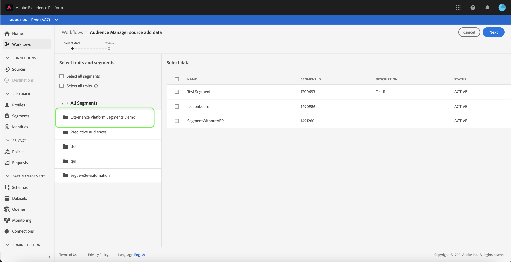

# Skapa en Adobe Audience Manager-källanslutning i användargränssnittet

I den här självstudiekursen får du hjälp med att skapa en källanslutning för Adobe Audience Manager för att hämta data om konsumentupplevelsehändelser till plattformen med hjälp av användargränssnittet.

## Skapa en källanslutning med Adobe Audience Manager

Logga in på [Adobe Experience Platform](https://platform.adobe.com) och välj **[!UICONTROL Sources]** i det vänstra navigeringsfältet för att komma åt arbetsytan [!UICONTROL Sources]. Skärmen [!UICONTROL Catalog] visar en mängd olika källor som du kan skapa ett konto för.

Under kategorin [!UICONTROL Adobe applications] väljer du **[!UICONTROL Adobe Audience Manager]** och sedan **[!UICONTROL Configure]**.

Steget [!UICONTROL Select traits and segments] visas och ger dig ett interaktivt gränssnitt där du kan utforska och välja egenskaper, segment och data.

* Den vänstra panelen i gränssnittet innehåller [!UICONTROL Select traits and segments]-alternativen samt en hierarkisk katalog över alla segment som är tillgängliga för dig.
* Den högra delen av gränssnittet gör att du kan interagera med valda segment och välja bland specifika data som du vill använda.

Om du vill navigera bland tillgängliga segment väljer du den mapp du vill komma åt på panelen [!UICONTROL All Segments]. Om du väljer en mapp kan du gå igenom mappens hierarki och visa en lista med segment som du kan filtrera igenom.

När du har identifierat och markerat de segment som du vill använda visas en ny panel till höger med listan över valda objekt. Du kan fortsätta använda olika mappar och välja olika segment för anslutningen. Om du markerar fler segment uppdateras panelen till höger.

Du kan också markera rutorna **[!UICONTROL Select all segments]** och **[!UICONTROL Select all traits]**. Om du markerar alla segment kommer Audience Manager segment att få plats på plattformen, och om du väljer alla egenskaper aktiveras alla egenskaper från Audience Manager.

När du är klar väljer du **[!UICONTROL Next]**

Steget [!UICONTROL Review] visas så att du kan granska dina valda egenskaper och segment innan de är anslutna till plattformen. Informationen är grupperad i följande kategorier:

* **[!UICONTROL Connection]**: Visar källplattformen och anslutningsstatus.
* **[!UICONTROL Selected data]**: Visar antalet markerade segment och aktiverade egenskaper.

När du har granskat dataflödet väljer du **[!UICONTROL Finish]** och anger en tid innan dataflödet skapas.

## Nästa steg

När ett dataflöde i Audience Manager är aktivt hämtas inkommande data automatiskt till kundprofiler i realtid. Du kan nu använda dessa inkommande data och skapa målgruppssegment med hjälp av plattformssegmenteringstjänsten. Mer information finns i följande dokument:

* [Översikt över kundprofiler i realtid](../../../../../profile/home.md)
* [Översikt över segmenteringstjänsten](../../../../../segmentation/home.md)