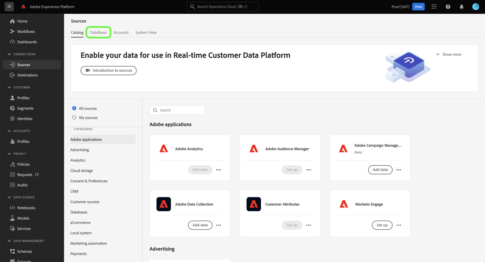

# Skapa en Adobe Campaign Managed Cloud Services-källanslutning med hjälp av plattformsgränssnittet

I den här självstudiekursen beskrivs hur du skapar en källanslutning för att överföra dina Adobe Campaign Managed Cloud Services-data till Adobe Experience Platform.

## Komma igång

Handboken kräver en fungerande förståelse av följande komponenter i Experience Platform:

* [Källor](../../../../home.md): Plattformen gör att data kan hämtas från olika källor samtidigt som du kan strukturera, märka och förbättra inkommande data med hjälp av plattformstjänster.
* [[!DNL Experience Data Model (XDM)] System](../../../../../xdm/home.md): Det standardiserade ramverk som Experience Platform använder för att ordna kundupplevelsedata.
   * [Grunderna för schemakomposition](../../../../../xdm/schema/composition.md): Lär dig mer om de grundläggande byggstenarna i XDM-scheman, inklusive viktiga principer och bästa praxis när det gäller schemakomposition.
   * [Schemaredigeraren, genomgång](../../../../../xdm/tutorials/create-schema-ui.md): Lär dig hur du skapar anpassade scheman med hjälp av gränssnittet för Schemaredigeraren.
* [Sandlådor](../../../../../sandboxes/home.md): Plattformen innehåller virtuella sandlådor som partitionerar en enda plattformsinstans i separata virtuella miljöer för att utveckla och utveckla program för digitala upplevelser.

## Anslut Adobe Campaign Managed Cloud Services till plattform

Välj **[!UICONTROL Sources]** från vänster navigering för att komma åt [!UICONTROL Sources] arbetsyta. The [!UICONTROL Catalog] I visas en mängd olika källor som du kan skapa ett konto med.

Du kan välja lämplig kategori i katalogen till vänster på skärmen. Du kan också använda sökfältet för att begränsa vilka källor som visas.

Under **[!UICONTROL Adobe applications]** kategori, välj **[!UICONTROL Adobe Campaign Managed Cloud Services]** och sedan markera **[!UICONTROL Add data]**.

### Markera data {#select-data}

>[!CONTEXTUALHELP]
>id="platform_sources_campaign_instance"
>title="Adobe Campaign-miljöinstans"
>abstract="Namnet på den Adobe Campaign-miljö som du vill använda."
>text="Learn more in documentation"

>[!CONTEXTUALHELP]
>id="platform_sources_campaign_mapping"
>title="Målmappning"
>abstract="Målmappningar är tekniska objekt som används av Campaign för att leverera meddelanden och innehåller alla tekniska inställningar som krävs för att skicka leveranser (adresser, telefonnummer, anmälningsindikatorer, ytterligare identifierare..)."
>text="Learn more in documentation"

>[!CONTEXTUALHELP]
>id="platform_sources_campaign_schema"
>title="Schemanamn"
>abstract="Namnet på entiteten som definieras i Adobe Campaign-databasen."
>text="Learn more in documentation"

The [!UICONTROL Select data] visas, där du får ett gränssnitt för att konfigurera [!UICONTROL Adobe Campaign instance], [!UICONTROL Target mapping]och [!UICONTROL Schema name].

| Egenskap | Beskrivning |
| --- | --- |
| Adobe Campaign, instans | Namnet på den Adobe Campaign-miljöinstans som du använder. |
| Målmappning | De tekniska objekt som används av Campaign för att leverera meddelanden och innehåller alla tekniska inställningar som krävs för att skicka leveranser. |
| Schemanamn | Namnet på schemaentiteten som du ska hämta till plattformen. Du kan välja mellan Leveranslogg och Spårningslogg. |

När du har angett värden för Campaign-instansen, målmappningen och schemanamnet uppdateras skärmen så att den visar en förhandsgranskning av ditt schema samt en exempeldatauppsättning. När du är klar väljer du **[!UICONTROL Next]**.

### Använd en befintlig datauppsättning

The [!UICONTROL Dataflow detail] På sidan kan du välja om du vill använda en befintlig datauppsättning eller konfigurera en ny datauppsättning för dataflödet.

Om du vill använda en befintlig datauppsättning väljer du **[!UICONTROL Existing dataset]**. Du kan antingen hämta en befintlig datauppsättning med [!UICONTROL Advanced search] eller genom att bläddra igenom listan med befintliga datauppsättningar i listrutan.

Ange ett namn för dataflödet och en valfri beskrivning när du har valt en datauppsättning.

### Använd en ny datauppsättning

Om du vill använda en ny datauppsättning väljer du **[!UICONTROL New dataset]** och ange sedan ett namn och en valfri beskrivning för utdatauppsättningen. Välj sedan ett schema att mappa till med [!UICONTROL Advanced search] eller genom att bläddra igenom listan med befintliga scheman i listrutan. När du är klar väljer du **[!UICONTROL Next]**.

### Aktivera aviseringar

Du kan aktivera varningar för att få meddelanden om status för ditt dataflöde. Välj en avisering i listan om du vill prenumerera och få meddelanden om status för ditt dataflöde. Mer information om varningar finns i guiden [prenumerera på källvarningar med hjälp av användargränssnittet](../../alerts.md).

När du är klar med informationen om dataflödet väljer du **[!UICONTROL Next]**.

### Mappa datafält till ett XDM-schema

The [!UICONTROL Mapping] visas med ett gränssnitt för att mappa källfälten från källschemat till rätt mål-XDM-fält i målschemat.

Plattformen ger intelligenta rekommendationer för automatiskt mappade fält baserat på det målschema eller den datamängd du valt. Du kan justera mappningsreglerna manuellt så att de passar dina användningsfall. Beroende på dina behov kan du välja att mappa fält direkt eller använda förinställningsfunktioner för data för att omvandla källdata för att härleda beräknade eller beräknade värden. Mer information om hur du använder mappningsgränssnittet och beräkningsfälten finns i [Användargränssnittsguide för dataprep](../../../../../data-prep/ui/mapping.md).

>[!IMPORTANT]
>
>När du mappar dina källfält till mål-XDM-fält måste du se till att du mappar det avsedda primära identitetsfältet till rätt mål-XDM-fält.

När källdata har mappats väljer du **[!UICONTROL Next]**.

### Granska ditt dataflöde

The **[!UICONTROL Review]** visas så att du kan granska det nya dataflödet innan det skapas. Informationen är grupperad i följande kategorier:

* **[!UICONTROL Connection]**: Visar källtypen, den relevanta sökvägen för den valda källfilen och mängden kolumner i källfilen.
* **[!UICONTROL Assign dataset & map fields]**: Visar vilken datauppsättning källdata hämtas till, inklusive det schema som datauppsättningen följer.

När du har granskat dataflödet väljer du **[!UICONTROL Finish]** så att dataflödet kan skapas.

### Övervaka datauppsättningsaktiviteten

När dataflödet har skapats kan du övervaka de data som importeras genom det för att se information om inkapslade frekvenser samt lyckade och misslyckade batchar.

Om du vill visa datauppsättningsaktiviteten väljer du **[!UICONTROL Dataflows]** i källkatalogen.

Välj sedan måldatauppsättningen i listan med dataflöden som visas.

Sidan för datauppsättningsaktivitet visas. Härifrån kan du se information om dataflödets prestanda, bland annat hur snabbt data har importerats, slutförda batchar och misslyckade batchar.

På den här sidan finns också ett gränssnitt där du kan uppdatera metadatabeskrivningen för dataflödet, aktivera partiell import- och feldiagnostik samt lägga till nya data i datauppsättningen.

## Nästa steg

I den här självstudiekursen har du skapat ett dataflöde för att överföra leveransloggar för Campaign v8 och spårningsloggdata till Platform. Inkommande data kan nu användas av plattformstjänster längre fram i kedjan som [!DNL Real-time Customer Profile] och [!DNL Data Science Workspace]. Mer information finns i följande dokument:

* [[!DNL Real-time Customer Profile] översikt](../../../../../profile/home.md)
* [[!DNL Data Science Workspace] översikt](../../../../../data-science-workspace/home.md)
