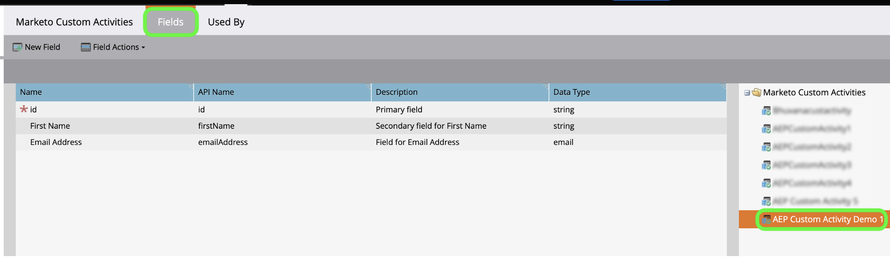

# Skapa en [!DNL Marketo Engage]-källanslutning och ett dataflöde för anpassade aktivitetsdata i användargränssnittet

>[!NOTE]
>
>I den här självstudiekursen beskrivs hur du konfigurerar och hämtar **anpassade aktivitetsdata** från [!DNL Marketo] till Experience Platform. Anvisningar om hur du hämtar **standardaktivitetsdata** finns i [[!DNL Marketo] gränssnittsguiden](./marketo.md).

Utöver [standardaktiviteter](../../../../connectors/adobe-applications/mapping/marketo.md#activities) kan du även använda källan [!DNL Marketo] för att hämta anpassade aktivitetsdata till Adobe Experience Platform. Det här dokumentet innehåller steg om hur du skapar en källanslutning och ett dataflöde för anpassade aktivitetsdata med hjälp av källan [!DNL Marketo] i användargränssnittet.

## Komma igång

Den här självstudiekursen kräver en fungerande förståelse av följande komponenter i Adobe Experience Platform:

* [Verktyget för automatisk generering av B2B-namnutrymmen och scheman](../../../../connectors/adobe-applications/marketo/marketo-namespaces.md): Med verktyget för automatisk generering av B2B-namnutrymmen och scheman kan du använda [!DNL Postman] för att automatiskt generera värden för B2B-namnutrymmen och scheman. Du måste slutföra B2B-namnutrymmen och scheman först innan du skapar en [!DNL Marketo]-källanslutning och ett dataflöde.
* [Källor](../../../../home.md): Experience Platform tillåter data att hämtas från olika källor samtidigt som du kan strukturera, etikettera och förbättra inkommande data med hjälp av plattformstjänster.
* [Experience Data Model (XDM)](../../../../../xdm/home.md): Det standardiserade ramverk som Experience Platform använder för att ordna kundupplevelsedata.
   * [Skapa och redigera scheman i användargränssnittet](../../../../../xdm/ui/resources/schemas.md): Lär dig hur du skapar och redigerar scheman i användargränssnittet.
* [Identitetsnamnutrymmen](../../../../../identity-service/features/namespaces.md): Identitetsnamnutrymmen är en komponent i [!DNL Identity Service] som fungerar som indikatorer för det sammanhang som en identitet relateras till. En fullständigt kvalificerad identitet innehåller ett ID-värde och ett namnutrymme.
* [[!DNL Real-Time Customer Profile]](/help/profile/home.md): Tillhandahåller en enhetlig konsumentprofil i realtid baserad på aggregerade data från flera källor.
* [Sandlådor](../../../../../sandboxes/home.md): Experience Platform tillhandahåller virtuella sandlådor som partitionerar en enda plattformsinstans till separata virtuella miljöer för att utveckla och utveckla program för digitala upplevelser.

## Hämta din anpassade aktivitetsinformation

Det första steget för att hämta anpassade aktivitetsdata från [!DNL Marketo] till Experience Platform är att hämta API-namnet och visningsnamnet för den anpassade aktiviteten.

Logga in på ditt konto med gränssnittet [[!DNL Marketo]](https://app-sjint.marketo.com/#MM0A1). I den vänstra navigeringen, under [!DNL Database Management], väljer du **Anpassade aktiviteter för Marketo**.

Gränssnittet uppdateras och visar dina anpassade aktiviteter, inklusive information om deras respektive visningsnamn och API-namn. Du kan också använda högerspåret för att välja och visa andra anpassade aktiviteter från ditt konto.


Välj **Fält** i den översta rubriken om du vill visa fälten som är kopplade till din anpassade aktivitet. På den här sidan kan du visa namn, API-namn, beskrivningar och datatyper för fälten i din anpassade aktivitet. Information om enskilda fält kommer att användas i ett senare steg när du skapar ett schema.



## Ställ in fältgrupper för anpassade aktiviteter i B2B-aktivitetsschemat

Markera **[!UICONTROL Browse]** på kontrollpanelen *[!UICONTROL Schemas]* i användargränssnittet för Experience Platform och välj sedan **[!UICONTROL B2B Activity]** i listan med scheman.

>[!TIP]
>
>Använd sökfältet för att underlätta navigeringen i schemalistan.


### Skapa en ny fältgrupp för anpassad aktivitet

Lägg sedan till en ny fältgrupp i schemat [!DNL B2B Activity]. Den här fältgruppen ska motsvara den anpassade aktivitet som du vill importera och ska använda den anpassade aktivitetens visningsnamn som du hämtade tidigare.

Om du vill lägga till en ny fältgrupp väljer du **[!UICONTROL + Add]** bredvid panelen *[!UICONTROL Field groups]* under *[!UICONTROL Composition]*.


Fönstret *[!UICONTROL Add field groups]* visas. Välj **[!UICONTROL Create new field group]** och ange sedan samma visningsnamn för den anpassade aktiviteten som du hämtade i ett tidigare steg och ange en valfri beskrivning för den nya fältgruppen. När du är klar väljer du **[!UICONTROL Add field groups]**.


När du har skapat din nya fältgrupp för anpassad aktivitet visas den i katalogen [!UICONTROL Field groups].


### Lägg till ett nytt fält i schemastrukturen

Lägg sedan till ett nytt fält i schemat. Det nya fältet måste anges till `type: object` och kommer att innehålla de enskilda fälten för den anpassade aktiviteten.

Om du vill lägga till ett nytt fält väljer du plustecknet (`+`) bredvid schemanamnet. En post för *[!UICONTROL Untitled Field | Type]* visas. Konfigurera sedan egenskaperna för fältet med panelen *[!UICONTROL Field properties]*. Ange att fältnamnet ska vara den anpassade aktivitetens API-namn och ange visningsnamnet som den anpassade aktivitetens visningsnamn. Ange sedan typen `object` och tilldela fältgruppen till den anpassade aktivitetsfältgruppen som du skapade i föregående steg. När du är klar väljer du **[!UICONTROL Apply]**.


Det nya fältet visas i ditt schema.


### Lägg till delfält i objektfältet {#add-sub-fields-to-the-object-field}

Det sista steget i att förbereda schemat är att lägga till enskilda fält i fältet som du skapade i föregående steg.


## Skapa ett dataflöde

När schemainställningarna är klara kan du nu skapa ett dataflöde för dina anpassade aktivitetsdata.

I plattformsgränssnittet väljer du **[!UICONTROL Sources]** i det vänstra navigeringsfältet för att komma åt arbetsytan i [!UICONTROL Sources]. På skärmen [!UICONTROL Catalog] visas en mängd olika källor som du kan använda för att skapa ett konto.

Du kan välja lämplig kategori i katalogen till vänster på skärmen. Du kan också använda sökfältet till att hitta den källa du vill arbeta med.

Välj **[!UICONTROL Marketo Engage]** under kategorin [!UICONTROL Adobe applications]. Välj sedan **[!UICONTROL Add data]** för att skapa ett nytt [!DNL Marketo]-dataflöde.


### Markera data

Välj **[!UICONTROL Activities]** i listan med [!DNL Marketo] datauppsättningar och välj sedan **[!UICONTROL Next]**.


### Dataflödesdetaljer

Därefter [anger du information för dataflödet](./marketo.md#provide-dataflow-details), inklusive namn och beskrivningar för datauppsättningen och dataflödet, det schema som du kommer att använda och konfigurationer för [!DNL Profile]-inmatning, feldiagnostik och partiellt intag.


### Mappning

Mappningar för standardaktivitetsfält fylls i automatiskt, men anpassade aktivitetsfält måste mappas till motsvarande målfält manuellt.

Om du vill börja mappa dina anpassade aktivitetsfält väljer du **[!UICONTROL New field type]** och sedan **[!UICONTROL Add new field]**.


Navigera genom källdatastrukturen och hitta det anpassade aktivitetsfältet som du vill importera. När du är klar väljer du **[!UICONTROL Select]**.

>[!TIP]
>
>För att undvika förvirring och hantera dubblettfältnamn läggs anpassade aktivitetsfält till som prefix med API-namnet.


Om du vill lägga till ett målfält väljer du schemaikonen  och väljer sedan anpassade aktivitetsfält från målschemat.


Upprepa stegen för att lägga till resten av dina anpassade aktivitetsmappningsfält. När du är klar väljer du **[!UICONTROL Next]**.


### Granska

Steg *[!UICONTROL Review]* visas, så att du kan granska det nya dataflödet innan det skapas. Informationen är grupperad i följande kategorier:

* **[!UICONTROL Connection]**: Visar källtypen, den relevanta sökvägen för den valda källentiteten och mängden kolumner i källentiteten.
* **[!UICONTROL Assign dataset & map fields]**: Visar vilka data som källdata hämtas till, inklusive det schema som datauppsättningen följer.

När du har granskat dataflödet väljer du **[!UICONTROL Save & ingest]** och tillåt en tid innan dataflödet skapas.


### Lägg till anpassade aktiviteter i ett befintligt aktivitetsdataflöde {#add-to-existing-dataflows}

Om du vill lägga till anpassade aktivitetsdata i ett befintligt dataflöde ändrar du mappningarna för ett befintligt aktivitetsdataflöde med anpassade aktivitetsdata som du vill importera. Detta gör att du kan importera anpassad aktivitet till samma befintliga aktivitetsdatauppsättning. Mer information om hur du uppdaterar mappningarna för ett befintligt dataflöde finns i guiden [Uppdatera dataflöden i användargränssnittet](../../update-dataflows.md).

### Använd [!DNL Query Service] för att filtrera aktiviteter för anpassade aktiviteter {#query-service-filter}

När dataflödet är klart kan du använda [frågetjänsten](../../../../../query-service/home.md) för att filtrera aktiviteter efter anpassade aktivitetsdata.

När anpassade aktiviteter hämtas till Platform blir API-namnet för den anpassade aktiviteten automatiskt `eventType`. Använd `eventType={API_NAME}` för att filtrera efter anpassade aktivitetsdata.

```sql
SELECT * FROM with_custom_activities_ds_today WHERE eventType='aepCustomActivityDemo1' 
```

Använd `IN`-satsen för att filtrera flera anpassade aktiviteter:

```sql
SELECT * FROM $datasetName WHERE eventType='{API_NAME}'
SELECT * FROM $datasetName WHERE eventType IN ('aepCustomActivityDemo1', 'aepCustomActivityDemo2')
```

Bilden nedan visar ett exempel på en SQL-sats i [frågeredigeraren](../../../../../query-service/ui/user-guide.md) som filtrerar efter anpassade aktivitetsdata.


## Nästa steg

Genom att följa den här självstudiekursen har du konfigurerat ett plattformsschema för [!DNL Marketo] anpassade aktivitetsdata och skapat ett dataflöde för att överföra dessa data till plattformen. Allmän information om källan [!DNL Marketo] finns i [[!DNL Marketo] källöversikten](../../../../connectors/adobe-applications/marketo/marketo.md).
